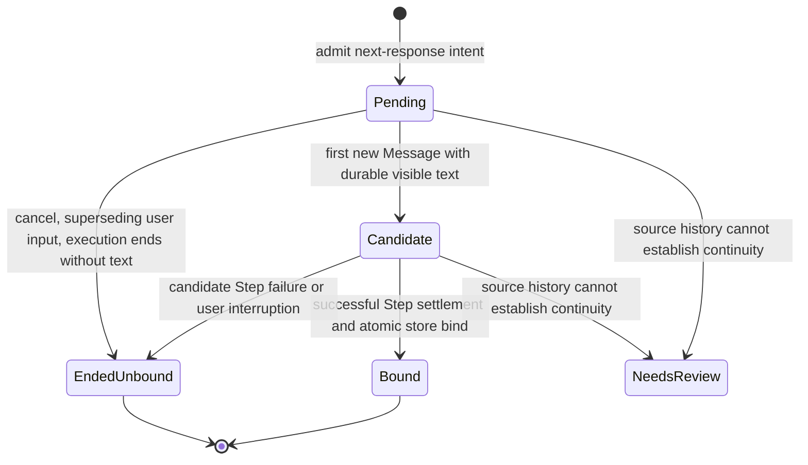

# Explicit Summary Marks And Selectable Bookmark Storage

## Status, Prompt, And Ownership

**Proposal, not accepted design or shipped behavior.** This is a new extension
and storage-revision proposal against [draft5](/.design/bookmarks/draft5.gpt56.md),
not a replacement for its whole argument. No bookmark runtime implementation or
OpenCode database writes were performed. Source claims were checked by this
author; the contract still needs parent/human review, not a `verified` acceptance
stamp.

The user wants to see the last bookmarked summary and last user question /
assistant response across several active Sessions. Rekon owns an agent marking
tool and the practice of producing useful summaries. Cotail owns durable
bookmarks, their source-qualified targets, and retrieval. The tool should default
to marking the next response, allow an arbitrary historical Message, and allow a
child Session as its target.

The cross-project work anchor is **`rekon-session-mementos`**, with
[`brief0.gpt6a.md`](file:///home/rektide/src/rekon/design/session-mementos/brief0.gpt6a.md)
committed as `bfabb06c`. Its clarified first consumer is the OpenCode terminal
**exit epilogue**, primarily for **this window/client**. Ordered composable
selection rules choose Sessions; ordered Session lookers gather content.
Recent-everywhere is explicit opt-in, not the default, and shared tabs alone do
not prove exclusive client ownership. Cotail consumes the selected Targets; it
does not own client inventory, the selection pipeline, terminal layout, or
freeze-before-teardown. Display work can proceed before bookmarks exist.

**New user direction:** bookmark storage is an explicitly selectable database;
its default is `rektide_*` records/tables in the selected OpenCode channel's
database. This reopens draft5's XDG-sidecar-only and never-write-the-source-file
choices. It does **not** reopen the read-only query contract or authorize writes
to OpenCode's own Session, Message, Event, or migration records.

Focused follow-up prompt:

> Keep Cotail's canonical Target/Observation model and trusted read-only source
> acquisition. Specify an explicit bookmark writer into the selected database,
> and a replay-honest pending intent that Rekon can bind to the next settled
> visible assistant Message without confusing tool output, retries, partial
> output, child Sessions, or generated-summary caches with explicit marks.

## What Survives From Draft5

| Keep | Proposed delta |
|---|---|
| `Address` → source-qualified `Target` → read-provenanced `Observation` | Message targets become an initial requirement, not only Session targets. |
| Bookmark ID and intent are different from target identity | Explicit `purpose: "summary"` identifies a summary mark; a tag or text heuristic is not equivalent. |
| Optional versioned captures; no durable `ReadScopeID` | Add an explicit visible-text capture option using canonical document evidence/revisions; keep content capture opt-in. |
| Source catalog separates durable identity and current locators | Implement against current profiles; neither `profile_id` nor an executable/channel label is a durable source ID. |
| Exact resolution; found/current/changed/missing/source-unavailable | Pending next-response intent is a separate lifecycle, not a bookmark with a pretend Message target. |
| One SQLite implementation with indexed domain tables | Allow the same implementation to use the selected source file or an explicit other file. No second backend/store registry is needed. |
| Closures/handoffs remain separate artifacts | A marked assistant summary is an ordinary Message bookmark, not a universal closure artifact. |

The [implemented Session capture](/packages/query-kysely/src/operations/capture.ts)
already supplies draft5's storage-neutral SessionReportCapture prerequisite;
`cotail-session-report-capture` is closed. Do not rebuild it. Draft4's physical
V1 audit and its Pointer/Composite vocabulary remain historical, as draft5
already explains.

## Verified Source And Channel Facts

Inspection baseline: Cotail parent commit
`5286d380ecc17e75f0f768bef4508de462e49601`; first-party OpenCode checkout
`/home/rektide/src/opencode-term-v2`, initial jj working-copy snapshot
`ee294775040d68d5acc441b59fa5865721548f50`. Parent review corrected the original
Git `HEAD` receipt (`a0b3feaf…`): this workspace has a separate `.git` whose
Beads-initialization commit does not identify the inspected jj source tree.
The database-selection, Message-schema and plugin-host files were unchanged
through jj commit `d78bdbf39eee53f2a92247e18efe6ac4d14b1f57`. Links below identify
local source, not a claim that the installed binary or remote branch contains
identical code. The archive checkout
`~/archive/anomalyco/opencode` was located before consulting the published V2
plugin documentation; it had no root `llms.txt`.

### Selection: five different concepts

1. **Executable** supplies version diagnostics during explicit profile generation.
   [generateSourceProfile](/src/profile/generate.ts#L41) invokes the executable
   and inspects the independently supplied database path. It does not establish
   that the executable owns that database.
2. **OpenCode channel** is a build/runtime application value, not a Cotail
   profile label. In
   [OpenCode `version.ts`](file:///home/rektide/src/opencode-term-v2/packages/cli/src/version.ts#L1),
   undeclared build constants fall back to `local`; the CLI build injects them.
3. **Cotail profile** is a strictly decoded capability contract plus a locator.
   [SourceProfile](/packages/query-kysely/src/profile/types.ts#L100) has
   `profile_id`, `source.path`, executable/version facts, and query facts. It has
   no authenticated channel binding or durable source-catalog identity.
4. **Effective source locator** is `--db` when supplied, otherwise the selected
   profile's `source.path`. [resolveRuntimeSource](/src/profile/runtime.ts#L43)
   does not compare the override to profile facts and still returns
   `sourceID: decoded.profile_id`. `OPENCODE_DB` in its missing-profile diagnostic
   is only a generation hint, not ordinary-query source selection. PID lookup
   has its own documented explicit process-path handling.
5. **Durable source ID** must be assigned/adopted through the source catalog.
   Today tail/watch use the profile ID, while search/history/get-session still
   pass `sourceID: "cli"` at some acquisition sites. Neither is safe to persist
   as a global identity merely because [sourceKey](/packages/query-kysely/src/domain/address.ts#L172)
   accepts any nonblank string.

The default profile filename is XDG config `cotail/profiles/opencode-local.json`.
The actual local profile inspected on 2026-09-06 records:

```text
profile_id: opencode-local
source.path: /home/rektide/.local/share/opencode/opencode-local.db
opencode.executable: opencode
opencode.generated_with: 0.0.0-local-202609011923
generated_at: 2026-09-02T07:06:14.039Z
```

Those are **recorded profile facts**, not a fresh validation of a live database
or installed server. Both `/usr/local/bin/opencode` and
`/usr/local/bin/opencode2` currently resolve to
`/home/rektide/src/opencode-working/packages/cli/dist/cli-linux-x64/bin/opencode2`.
This independently demonstrates why executable spelling must not choose a
channel. Neither executable was run and no live DB was opened for this design.

### Exact local OpenCode database rule

[ServerProcess, lines 96–103](file:///home/rektide/src/opencode-term-v2/packages/cli/src/server-process.ts#L96)
chooses:

| Condition, in precedence order | Path passed to Database |
|---|---|
| `OPENCODE_DB` is defined | That exact string, including `:memory:` if supplied |
| Channel is `latest`, `dev`, `beta`, `next`, or `prod` | `opencode.db` |
| `OPENCODE_DISABLE_CHANNEL_DB` is exactly `1` or `true` | `opencode.db` |
| Otherwise | `opencode-${channel.replace(/[^a-zA-Z0-9._-]/g, "-")}.db` |

Thus `local` ordinarily selects `opencode-local.db`, while several named
channels share a file. Sanitization can also make different custom channel
strings choose the same filename. Channel name is not source identity.
[Database.layer](file:///home/rektide/src/opencode-term-v2/packages/core/src/database/database.ts#L65)
preserves absolute paths and `:memory:`, and resolves relative paths under
`Global.data`, **not the CLI cwd**.
[Global roots](file:///home/rektide/src/opencode-term-v2/packages/util/src/global-roots.ts#L4)
make that `$XDG_DATA_HOME/opencode` or `~/.local/share/opencode` by default.

**Design consequence:** use the already selected effective source locator for
the default bookmark store. Do not synthesize a path from the word `opencode`,
the profile's filename, a channel-looking label, or the TUI storage channel.
For a Rekon plugin, configuration must identify the actual server source/store;
the public Tool context supplies Session, Message, agent, and tool-call IDs,
not a database path or durable source ID. Remote/custom SDK servers cannot be
assigned a local database by pretending their app channel is enough.

## Selectable Storage Without Widening Query Authority

Proposed option spelling is `--bookmark-db <path>`; it is **not implemented**.

| Operation | Source selection | Bookmark storage / permission |
|---|---|---|
| Existing search/history/tail/watch/get-session | Existing `--profile` / `--db` behavior unchanged | No store initialization, migrations, writes, or new source inspection |
| Bookmark read/list/overview | Catalog-bound source(s), same trusted query facts | Open selected bookmark store read-only; absent store is `not-initialized`, not permission to create it |
| Explicit bookmark create/mark/remove/import | Effective source locator plus explicit durable catalog binding | Separate bookmark write capability; default store is that selected source file |
| Same write with `--bookmark-db other.sqlite` | Source still selected by `--profile` / `--db` | Write only `other.sqlite`; reading an OpenCode source never grants permission to modify it |

Selecting a path is not itself a write operation. A bookmark mutation or explicit
bookmark-store initialization acquires the write capability. Surface the resolved
store path and source ID in its result/diagnostics. Never fall back to another
store after a permissions, locator, schema, or busy error. Creating a new
standalone store is explicit; a missing default OpenCode file must not be
silently created and misrepresented as the selected source.

### Recommended physical choice

Use **Cotail-owned tables**, all in the `rektide_cotail_*` namespace:

- `rektide_cotail_bookmark_meta`: owner/format, store ID, bookmark migration version;
- `rektide_cotail_source` and `rektide_cotail_source_locator`: durable source
  bindings and explicit relocation history;
- `rektide_cotail_bookmark` and `rektide_cotail_bookmark_tag`: draft5's durable
  references, purpose, captures, and bounded indexed Session/source/time filters;
- `rektide_cotail_mark_intent`: pending selection and terminal binding outcome.

This is a domain sketch, not final SQL. Keep bookmark-store identity separate
from target-source identity: an external store can contain marks for several
sources. No foreign key should cascade from OpenCode's Session/Message tables
into bookmarks; deletion should leave resolvable `missing` references/captures.

The other plausible choice is `rektide_*` JSON records in upstream `kv`.
OpenCode really does offer
[plugin-scoped storage](https://opencode.ai/v2/docs/build/plugins#storage), but
[its implementation](file:///home/rektide/src/opencode-term-v2/packages/core/src/plugin/host.ts#L561)
prefixes keys with `plugin:<hex-encoded-plugin-id>:` and
[KV](file:///home/rektide/src/opencode-term-v2/packages/core/src/kv.ts#L34)
uses the server's current database. Its public get/set/remove/scan surface does
not select another database or expose a multi-record conditional transaction.
It is therefore not automatically the requested selectable Cotail store or an
atomic intent-binding mechanism. Prefer owned tables; keep the record choice
open for review rather than shipping both authorities.

Necessary, bounded writer rules:

- Validate ownership/version of **our** objects at explicit writer acquisition;
  a same-name incompatible table is a namespace conflict, never a reason to
  overwrite it or trust `CREATE TABLE IF NOT EXISTS` blindly.
- Use our migration table, not upstream migration rows or SQLite-wide
  `user_version` / `application_id`. No changes to OpenCode tables, indexes,
  triggers, or durable Event history. Do not acquire Core's Database layer just
  to write bookmarks: it runs OpenCode pragmas and migrations.
- Keep query acquisition [read-only and query_only](/packages/query-kysely/src/runtime/node-sqlite.ts#L130).
  The writer is a separate operation-oriented module, not `write: true` on
  `LogicalQuery`, and does not expose arbitrary SQL. This is an application
  capability boundary, not an OS-level sandbox within a writable SQLite file.
- Use short transactions and a bounded busy timeout for shared-file contention;
  never keep a write transaction open while a model/tool runs. A failed write
  cannot return a successful mark receipt. No global journal-mode changes,
  maintenance/VACUUM, or automatic cleanup of another domain's data.

Profile generation extracts an explicit table set
([extract.ts](/packages/query-kysely/src/profile/extract.ts#L51)); new owned
tables need not invalidate ordinary query facts. Do not add bookmark schema
validation to normal profile/query startup.

### Minimal source-catalog discipline

The source catalog remains required, but no profile-system redesign is proposed:

1. An explicit registration assigns or adopts an opaque Cotail source ID and
   binds it to a concrete locator and trusted profile. Store those facts in the
   selected bookmark store; colocated registration writes only owned metadata.
   Import/adoption reuses an existing source ID explicitly rather than minting a
   new identity from the same profile label.
2. New bookmark operations pass that catalog `SourceKey` into existing query
   acquisition. Profile facts still describe query compatibility. They neither
   authenticate identity nor authorize writing.
3. `--db` remains a query locator override. In a durable bookmark operation it
   cannot silently retarget an existing source ID: resolve it as a registered
   locator, explicitly register a new source, or explicitly relocate/rebind the
   old source. Same profile plus two independent DBs must not collide.
4. Realpath aliases to a known locator can share its binding. Moving a file is
   explicit relocation; copying it is not proof of relocation. When conflicting
   bindings/copies are encountered, return ambiguity and require a declared
   move, replica policy, or independent-source import. Do not implement automatic
   mirror merging or fuzzy content matching.

There is no claim of a verified upstream globally unique DB identifier. A
co-located catalog copied with the DB also copies its IDs. Identical copies,
unregistered replacements at the same pathname, and aliases not encountered by
the catalog are **not magically detectable**. Preserve the catalog's explicit
operator declaration and relocation history; broader copy/fingerprint detection
needs its own evidence, not a safety promise based on `profile_id`, schema hash,
mtime, or version. An explicit import-as-new-source remaps affected Targets; it
does not quietly rewrite the meaning of existing source IDs.

## Shared Mark Contract

The shared wire vocabulary should live with Cotail's bookmark domain, reusing
the existing [Target](/packages/query-kysely/src/domain/address.ts#L102) shape.
Rekon can offer a small `mark_summary` tool whose omitted selector means
`next-response` in the calling Session. A tool name is not a decision here.

```ts
// Proposed wire contract, not code to import today.
type MarkSelector =
  | { kind: "message"; target: Target<MessageAddress> }
  | { kind: "next-response"; session: Target<SessionAddress> };

interface MarkRequest {
  schema: "cotail.mark-request/v1";
  requestID: string;
  purpose: "summary" | "reference";
  selector: MarkSelector;
  origin?: { message: Target<MessageAddress>; toolCallID: string };
  note?: string;
  tags?: readonly string[];
  capture: "none" | "visible-text";
}
```

The trusted integration supplies origin from
[Tool.Context](file:///home/rektide/src/opencode-term-v2/packages/schema/src/tool.ts#L14),
not model-authored source/path claims. A source-qualified Message contains its
Session, so a child target needs no new child-pointer type. Validate that the
Message belongs to the supplied Session and source. Do not interpret a child's
Message ID in the parent Session or substitute the parent's subagent tool result
for the child's actual response. Rekon owns any authorization/lineage selection
policy; Cotail accepts an explicit authorized target, not an invented
current-directory or process-recency association.

Historical `message` selection resolves the exact Message and binds immediately.
It can select any supported historical Message for `reference`; `summary`
requires visible assistant text. An explicitly selected partial/failed assistant
can be marked, but its outcome is preserved and displayed as partial/failed,
not laundered into a completed response. No fuzzy fallback on a missing ID.

`next-response` creates a **MarkIntent**, returning `pending` and `intentID`,
not a bookmark ID and not “summary saved.” Cotail persists request, source,
target Session, origin, selection fence, policy version, and lifecycle state.
Only a successful binding creates the Bookmark and returns its canonical
Message Target. A bound bookmark records purpose, explicit marking actor/origin,
`markedAt`, and optional typed capture, in addition to draft5's ID/note/tags.

One request ID is one intent/result: identical retries return the same receipt;
a changed payload with the same ID is a conflict. Rekon derives a stable request
ID from source + calling Message + tool-call ID; if Code Mode invokes multiple
marks inside one outer tool call, it must supply distinct stable request IDs.
Do not assume every nested invocation has a distinct upstream tool-call ID.
Distinct requests may intentionally mark the same Message.

## What “Next Visible Response” Means In This Proposal

**Recommended policy ID: `next-settled-assistant-text/v1`.** It means the first
new assistant Message after registration that contains nonblank visible text,
bound only after that Message's successful Step settlement. It is not “next
token,” “next tool result,” “last reply in an assistant turn,” or “next answer
classified as final.” No final/commentary field exists in the inspected
[AssistantText schema](file:///home/rektide/src/opencode-term-v2/packages/schema/src/session-message.ts#L175).

### Registration fence and candidate

At registration, capture a target-Session-local ordered source cut: the last
Message sequence/ID and a replayable Event boundary, plus the originating
Message exclusion and execution boundary when observable. These are selection
evidence, **not new Target identity** and not `ReadScopeID` revisions. The cut
precedes the durable pending receipt; that cut defines registration semantics.
Reading the source cut and committing an intent in another DB is not claimed to
be one cross-database atomic transaction.

Exclude every Message already started at that cut, including the assistant
Message carrying the mark tool. This makes same-stream text emitted after a tool
call unambiguously **not** the next Message. For a child Session, take the cut in
the child: parent and child sequence numbers are not comparable. An already
streaming child response is similarly excluded; select its ID explicitly if it
is the intended response. If the target is idle, the first later execution can
provide the candidate; merely observing idle at registration does not cancel it.
An idle registration has no established input context: the first subsequent
delivered user Message establishes that context rather than superseding the
intent. A later delivered user Message supersedes it. An in-execution
registration already has its context and is superseded by the next delivered
user Message. This deliberately narrow proposed rule is per delivered Message,
not an invented atomic prompt-batch identifier; the producer review must accept
or revise it explicitly, including the case of several steers delivered together.

Choose candidates in target Session order, not callback arrival order or wall
clock order. Durable nonblank text makes the first eligible Message a candidate;
it remains pending until settlement. Its visible text is all assistant `text`
content in Message content order, not reasoning, tool output, or compaction.
Mixed text-and-tool Messages **do count** after their Step settles. The agent
practice should call the marking tool just before writing the intended summary,
not assume the selector can infer “the final answer after more commentary.”

### Why text end or completed timestamp alone is insufficient

- [Text.Ended](file:///home/rektide/src/opencode-term-v2/packages/schema/src/session-event.ts#L369)
  is durable full-value text, while deltas are ephemeral.
- [The publisher flush](file:///home/rektide/src/opencode-term-v2/packages/core/src/session/runner/publish-llm-event.ts#L177)
  emits text-ended events for buffered fragments. [Step execution](file:///home/rektide/src/opencode-term-v2/packages/core/src/session/runner/step.ts#L130)
  flushes even on failure/interruption, then settles tools and publishes
  Step.Ended or Step.Failed. Therefore Text.Ended can be **partial** output.
- [Message projection](file:///home/rektide/src/opencode-term-v2/packages/core/src/session/message-updater.ts#L195)
  can set a preceding assistant's `time.completed` when a new Step starts.
  Step.Failed also sets completed time. Require a positive successful settlement
  with finish/outcome evidence, not simply a non-null timestamp.
- [The runner](file:///home/rektide/src/opencode-term-v2/packages/core/src/session/runner/llm.ts#L257)
  preserves the assistant ID for generic pre-output retries/full-context retry,
  but incomplete-stream continuation creates a new assistant ID after recording
  a synthetic continuation. Step and physical attempt are not interchangeable.

### Lifecycle and interruption



| Source behavior | Proposed result |
|---|---|
| Tool-only / reasoning-only / whitespace-only Message | Skip; no candidate and no bookmark. |
| Pre-output retry, repeated started event, continuation rejection before output | Keep one pending intent; do not create duplicate marks. |
| Nonblank text, then successful Step.Ended | Bind exactly that Message, even if it also has tools. Preserve finish reason; a length-limited result is not labeled a complete final answer. |
| Candidate has text, then provider failure of that Step or user interruption | `ended-unbound`, with candidate Target and partial/failure reason, even when the runner can automatically continue in a new Message. Do not silently bind that continuation or a later prompt's answer. Explicit historical marking can retain the partial Message. An aborted Step alone does not distinguish user interruption from shutdown; establish the execution reason first. |
| Successful execution ends without an eligible text Message | `ended-unbound: no-response`. |
| New user input is delivered before binding | Proposed `ended-unbound: superseded` after input context is established; the first delivery following an idle registration establishes it instead. Queued admission alone does not cancel. Synthetic tool/child notices do not count as a new user question. |
| Explicit cancel or terminal user interruption before candidate | `ended-unbound`, never automatic retargeting on a later resume. |
| Shutdown/process death or disconnected observer | Suspend automatic decision and reconcile from the saved source cut. Keep intent durable; do not interpret disconnection as user cancellation or silently resume across an unproven gap. |
| Duplicate/out-of-order observer delivery | Reconcile source order; conditional single-store transition creates at most one Bookmark per intent. |

The proposed ownership split is: Rekon owns lifecycle observation, source-fence
acquisition, and scheduling the next-response resolver; Cotail owns durable
intent/binding operations and exact
target/capture validation. Cotail binds pending→bound plus bookmark insertion
in one transaction in the selected bookmark store. Repeated bind to the same
target returns the original result; a different candidate after binding is a
conflict. No distributed exactly-once claim follows from that local invariant.

**Implementation gate:** the published plugin event subscription is a live
stream, not a documented replay cursor API. Cotail's current tail/watch samples
are capped, metadata-only, and suppress updates to already-seen Message IDs.
Neither is by itself a reliable next-response binder. Rekon must prove an
ordered/reconcilable per-Session source adapter (durable Events or sufficiently
complete authoritative history with lifecycle evidence). Unknown retention,
revert/deletion, shutdown continuity, or a missing fence must produce
`needs-review`/unsupported, not “the first response I happened to observe.”
Historical explicit marks can ship without this automatic-binding capability.
The separate `rekon-session-mementos-mark` inquiry is investigating the
`opencode-subagent-recovery` producer/tool host. This document specifies the
required cross-owner semantics, not an approved hook, transport, or observer
implementation. Reconcile that inquiry before accepting pending-intent ownership
and the concrete registration-fence wire schema.

## Retrieval For Several Active Sessions

Propose a finite `latestSummaryBookmarks` operation over **an explicit bounded
list of `Target<SessionAddress>` values**, with caller-supplied source/store
selection. Return results keyed by those Targets without replacing caller order
with global recency. This is the bookmark looker's input, not a new universal
SessionReport bag or mandatory overview command.

The display owner's ordered rules decide which Sessions belong to this
window/client and which activity restrictions apply. Cotail history recency is
not proof of client membership or busy/idle/attention state. Children can be
included as independent rows; aggregation into the parent is explicit selection
and presentation policy. Do not default to querying recently updated Sessions
everywhere because that happens to be easy with `history`.

The ordered lookers should retain these distinct products for each selected
Session. Cotail's new bookmark lookup owns the summary/intent rows; existing
OpenCode data or separately composed Cotail Message operations can supply the
question/response looker. This proposal does not require a second implementation
of epilogue Message gathering in Cotail:

| Field | Meaning |
|---|---|
| `latestMarkedSummary` | Last **bound**, explicitly `purpose: summary` bookmark in `(markedAt DESC, bookmarkID DESC)` order. Historical re-marking can intentionally become the newest mark. |
| `latestUserMessage` | Highest Session Message sequence of type `user`, including identity and visible text/attachment indication. “Question” is UI shorthand, not a question detector. Pending inbox items and synthetic messages are not this value. |
| `latestAssistantResponse` | Highest-sequence assistant Message with nonblank visible text, with streaming/settled/failed/unknown outcome. A newer partial response must not be silently hidden behind an older successful one. |
| `pendingSummaryMarks` | Pending/needs-review intent metadata, separate from the previous bound summary. Arming a new mark does not erase the last summary. |

The latest user and latest assistant fields are independently latest. If the
assistant precedes the user, explicitly show that no newer response is present;
do not render the older assistant as the answer to the newer question. Preserve
IDs and sequence ordering rather than inventing a one-question/one-answer
relationship across steers, tool-driven steps, or child results.

Summary readback returns the stored bookmark and honest resolution:
`found` when uncaptured, `current`/`changed` only with a comparable capture,
`missing` for a missing target, and `source-unavailable` separately. If the
newest mark cannot resolve, show that state and its optional capture; do not
silently substitute an older mark. A per-Session selection does not filter marks
by the Session's current directory, so Session relocation preserves identity.

**Explicit mark is provenance, not a quality guarantee.** An assistant-authored
summary deliberately marked by an agent is explicit. A freshly generated or
cached summarizer output is generated; an unmarked paragraph guessed to be a
summary is inferred. Neither becomes `latestMarkedSummary` without an explicit
mark of a supported target/artifact. The [summary-cache epic](/.beads/issues.jsonl)
(`cotail-summary-cache`) keeps generation parameters and cache reuse semantics;
bookmarks do not invoke a model to fill a missing summary.

Default marks persist identity/intent, not transcript text. `capture:
"visible-text"` explicitly copies only selected visible text under a versioned
capture schema, with canonical document Targets/revisions and outcome. Reuse
query evidence instead of copying tool/reasoning/attachment bodies. Existing
[ProjectionRevision](/packages/query-kysely/src/domain/observation.ts#L15)
guards are payload revisions, not assertions that every field of a Session is
unchanged. A frozen excerpt is labeled captured and survives source loss only
when its bookmark store remains available. Co-location does not preserve it
against loss of that entire file; explicit other-DB storage/export is the
available separation, not implicit backup.

Keep retrieval demand-bounded: source/store/Session/purpose/time bookmark
indexes; source Message `(session_id, type, seq)` access paths; exact selected
payload hydration, not a global JSON scan. Tool-only/empty response skipping
needs a declared per-Session scan budget and a typed `budget-exhausted`/unknown
result, not a false `none`. Return source observations with their own read
provenance. Separate databases/sources do not share one global snapshot; expose
observation times rather than inventing one.

## Acceptance Decisions Still Needed

| Decision | Recommendation / meaningful alternative |
|---|---|
| Response granularity | Accept next **new settled text-bearing Message**, excluding the invoking/current Message. Alternative: next text segment, including later text within that Message; this changes the target grain and requires a different explicit policy ID. |
| Interrupted / superseded intent | Keep partial candidate unbound; distinguish user interruption from shutdown. End on delivered new user input after context is established, with the idle-first-delivery exception above. Review multiple-steer delivery explicitly. Alternative: carry intent into later prompts/continuations, but only with an explicit carry policy, never silently. |
| Physical storage | Owned `rektide_cotail_*` tables in the selected DB, separate writer. Alternative: namespaced KV records, only after transaction, indexing, and alternate-DB selection constraints are resolved. User's selected-DB default is the requirement, not the question. |
| “Last summary” order | Latest explicit mark time; expose target chronology separately. Alternative: newest target Message sequence, which makes marking older material less visible. |
| Capture default | No content capture, preserving draft5's privacy boundary. Opt-in visible-text capture for offline readback; a different default must be explicit. |

Do not block all bookmark work on a full new profile UX, global event watcher,
ranking screen, remote storage, or automatic copy detection. Source registration
and an exact historical Message mark are the first useful slice. Automatic
next-response binding must wait for its specific lifecycle/recovery evidence.

## Test And Review Criteria

This design pass checked 48 local/file link targets in this document and the
bookmark index, read the cited source and existing tickets, and inspected only
profile metadata/executable symlink paths. No live OpenCode DB was opened, no
OpenCode service was invoked, and no runtime test suite was run for docs-only
changes. `bd dep cycles` reported no cycles. An explicit ticket export was needed
to capture the complete update immediately despite `export.auto=true`; comparison
showed changes to exactly the five existing bookmark issues and two new children,
with no unrelated issue changes or removals.

All runtime acceptance tests belong to later implementation on temporary
fixtures, **not** the user's live OpenCode database.

1. **Selection matrix:** profile default/explicit, `--db`, and explicit bookmark
   DB are independent. Same profile plus two source files cannot persist one
   identity implicitly. Executable aliases and all channel rules above are
   covered; relative OpenCode paths use its data root, not cwd.
2. **Authority:** existing query read-only/query_only tests still pass; query
   startup neither inspects bookmark schema nor creates tables. Writer fixtures
   prove only owned objects change; OpenCode rows/schema/migration metadata stay
   unchanged. Default missing file, conflicting namespace, permissions, and busy
   failures do not create another store or return success.
3. **Identity:** catalog registration/adoption, realpath aliases, explicit move,
   encountered copied-ID ambiguity, independent-source import, unavailable
   locator, and missing target are distinct. Document undetectable cases rather
   than claiming universal replacement detection.
4. **Historical targets:** parent and child Messages, same-looking IDs in two
   sources, incorrect Session membership, missing Message, partial assistant,
   non-assistant reference, and summary-without-text behavior are exact.
5. **Intent traces:** same-Message later text exclusion, tool-only steps,
   mixed text/tools, whitespace, pre-output retry, incomplete-stream continuation,
   failure after flushed text, user versus shutdown interruption, new delivered
   steer, idle-first-delivery and multiple-steer behavior,
   queued-but-undelivered input, child-local fence, and zero-response
   completion follow the table above.
6. **Durability:** process loss before/after admission, candidate, and binding;
   duplicate/out-of-order notifications; same-ID retries/payload conflict;
   competing bind attempts; missing retained history. At most one bound Bookmark
   per intent; a pending receipt never claims to be a saved summary.
7. **Readback:** explicit bounded caller-selected Sessions and preserved caller
   order, no implicit recent-everywhere expansion, newest mark of older history,
   unresolved newest mark, no marks,
   pending mark alongside prior summary, newer user/no newer assistant, streaming
   assistant, child rows, source loss, content mutation, opt-in captures, and
   absence of generated/inferred fallback.
8. **Cost/format:** indexed bounded per-Session retrieval, lazy payload decoding,
   explicit budget exhaustion, stable ordering, per-source snapshot provenance,
   and versioned JSONL preserving intent/mark/source IDs and capture provenance.

## Ticket Alignment

Reuse `cotail-bookmarks`, `cotail-bookmarks-source-catalog`,
`cotail-bookmarks-store`, `cotail-bookmarks-resolve`, and `cotail-bookmarks-cli`.
Append history describing the proposed storage revision instead of erasing the
prior XDG/no-source-write choices. Their runtime work remains open.

Two missing bookmark-domain slices now have open, design-gated children:

- `cotail-bookmarks-mark-intent`: durable request/intent/conditional binding
  contract, tested using supplied ordered evidence; Rekon owns the agent tool
  and source observer implementation.
- `cotail-bookmarks-summary-lookup`: latest explicit summary bookmark retrieval
  for an already selected bounded set of Session Targets; no new selection
  framework, active-state inference, duplicate question/response looker, or screen.

Relate the latter to `cotail-watch-rank` as another potential consumer, not the
primary UI requirement. `rekon-session-mementos-display` owns the client-scoped
epilogue and `rekon-session-mementos-composition` owns broader composition design.
Relate automatic binding's source-fidelity need to `cotail-watch-exact-events`,
without claiming the existing watcher fulfills it or requiring a global watch
product before a small per-Session adapter. Rekon ticket ownership stays with
the parent session; all new Cotail implementation work remains acceptance-gated.

## Cross-References

- [Rekon session-mementos brief](file:///home/rektide/src/rekon/design/session-mementos/brief0.gpt6a.md)
  is the cross-project work anchor: this-window/client selection and ordered
  lookers belong to the epilogue; durable summary lookup belongs to Cotail.
- [Bookmark draft5](/.design/bookmarks/draft5.gpt56.md) is the predecessor:
  preserve Target/capture/resolution distinctions; this proposal explicitly
  reopens its persistence restriction and adds Message marks/pending intent.
- [Query entry point](/.design/query/README.md) and
  [relational world](/.design/query/design3.gpt56.md) supply the shared identity,
  evidence, and operation vocabulary; no second Pointer or Composite model.
- [Trusted profile design](/.design/pushdown/draft4.gpt56s.md) constrains the
  integration: explicit inspection and trusted query facts must remain separate
  from durable identity and bookmark write permission.
- [Scoped execution](/.design/query2/design2.gpt56.md) supplies pinned reads and
  provenance, not cross-store atomicity or durable source revisions.
- [Canonical Session reporting](/.design/session-report/full-query-pass0.gpt56.md)
  owns Session report/capture products; latest Message/summary retrieval is an
  operation-specific product, not more optional SessionReport slots.
- [Watch entry point](/.design/watch/README.md) and
  [known-versus-supposed report](/.design/watchman/tail-watch.gpt56s.md) are a
  critical tension: capped metadata observations cannot bind exact future
  response intent or establish which Sessions are busy.
- [Development ideas](/.design/ideas/ideas.gpt56s.md#2-source-catalog-and-multi-profile-ux)
  preserve the broader source-catalog ambition. This proposal is narrower and
  reopens the colocated owned-data restriction, not every multi-profile feature.
- [Bookmark applications](/.design/bookmarks/applications.glm52.md) is prior
  product exploration: milestone/summary marks remain references, while closure,
  handoff, and generated-summary artifacts keep their own contracts.
