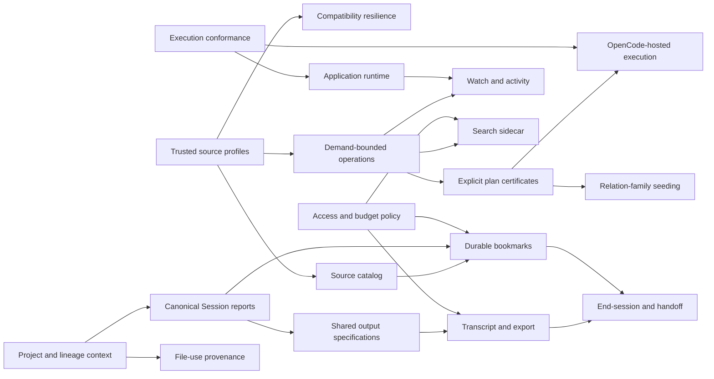

# Cotail Development Ideas

## Situation

Cotail now has explicit generated source profiles, trusted runtime profile
loading, realistic indexed fixtures, and no implicit source validation in normal
commands. First-class `location-switched` support lets the current live OpenCode
database generate a valid profile. Demand-bounded history and direct-search
repairs are the active implementation frontier.

This document is deliberately an open book rather than a committed roadmap. An
idea can be valuable without being next. “Precedence” below means evidence,
interfaces, or safety work that should exist first; it is not a claim that all
dependencies must be delivered in one program.

The ideas cluster around four virtues:

| Virtue | Question |
|---|---|
| Resilience | Does Cotail keep working and explain itself as OpenCode evolves? |
| Navigability | Can a person find, understand, and revisit the right work quickly? |
| Durable continuity | Can identity, intent, and useful state survive process and path changes? |
| Scale and embedding | Can richer operations remain bounded and work in more than one host? |

## Dependency Sketch

The arrows identify leverage, not exclusive routes. For example, a basic
transcript can precede bookmarks, while a durable captured transcript should
wait for source identity and access policy.

## 1. Compatibility Resilience And Honest Errors

### Idea

Generalize the lesson from `location-switched`: an unknown top-level Message
variant should not silently brick every normal command. Profiles can record the
observed vocabulary, known operations can continue over understood rows, and an
explicit strict audit can report unsupported variants. At the same time, every
expected CLI failure should render a useful tag, structured facts, and an
actionable sentence.

### Value And Virtues

- Converts upstream schema evolution from an outage into visible degradation.
- Makes trusted profiles more credible: staleness is explicit without becoming
  implicit validation.
- Improves every later feature because failures stop looking like hangs or blank
  output.
- Establishes a repeatable pre-release compatibility audit against OpenCode’s
  authoritative `SessionMessage.Info` union.

### Precedence And Unlocks

The profile distinction between supported and observed variants already exists,
and `location-switched` supplies the first concrete compatibility case. This is
a dependency root rather than a downstream product feature. It should precede
broad transcript/export use and unattended watch processes, where one unknown
row must not terminate long-running work.

It directly advances `cotail-compat-unknown-variant` and
`cotail-error-rendering`.

### Agentic Shape

Run one background agent over unknown-variant semantics in generation, history,
content projection, and strict audits. Run a second over typed command-boundary
error rendering. Keep a synchronous live-copy probe with injected future rows,
then use a review agent to challenge whether degradation accidentally changes
counts, roots, or evidence.

## 2. Source Catalog And Multi-Profile UX

### Idea

Move from one conventional `opencode-local.json` to a Cotail-owned catalog of
stable source identities, current locators, profile paths, and explicit
relocation history. Support personal/work databases and moved databases without
writing identity into OpenCode-owned storage.

### Value And Virtues

- Turns `sourceID: "cli"` into an identity suitable for durable references.
- Makes multiple OpenCode channels and machines understandable instead of a set
  of ambiguous paths.
- Separates “where the database is now” from “which source this is.”
- Provides a natural home for profile selection without bringing validation
  back into startup.

### Precedence And Unlocks

Trusted explicit/XDG profile loading is the tracer this idea needed. The next
hard questions are copied databases, duplicate locators, symlinks, unavailable
sources, and auditable rebinding. Those decisions should precede durable
bookmark persistence and cross-source captures.

This is the dependency root of `cotail-bookmarks-source-catalog`, and it unlocks
bookmark resolution, multi-source history, and safer XDG ergonomics.

### Agentic Shape

Commission two independent designs: one identity/relocation model and one CLI
resolution/configuration model. A synthesis agent should reconcile copied-source
ambiguity and explicit rebinding before an implementation agent builds one
catalog entry plus one relocation tracer. A synchronous operator pass should
exercise actual path moves and unavailable sources.

## 3. Canonical Reports And Shared Output Specifications

### Idea

Finish the migration to one canonical Session report and define each command’s
JSONL, TSV, and Arrow output from one serializer-neutral field specification.
Migrate direct search away from its private Session summary and remove command-
local machine mappings.

### Value And Virtues

- Makes the same Session mean the same thing in lookup, history, search,
  bookmarks, and exports.
- Prevents JSONL, TSV, and Arrow from drifting in names, nullability, or time
  semantics.
- Lets human presentation evolve independently of stable machine contracts.
- Reduces the amount of compatibility code every new command must copy.

### Precedence And Unlocks

Canonical lookup/history reports and durable captures already exist. Direct
search migration and output specifications are the remaining roots. This work
should precede a polished transcript CLI, bookmark CLI, and richer child/fork
reports, all of which otherwise invent their own output vocabulary.

The active path is `cotail-session-report-search`, then
`cotail-session-report-output`, then `cotail-session-report-conformance`.

### Agentic Shape

Run a query-domain agent on canonical search observations and an output-domain
agent on field specifications in parallel. Keep a synchronous corpus of exact
JSONL/TSV/Arrow examples. After both land, use a deletion-focused review agent
to remove compatibility DTOs and duplicate serializers rather than adding a new
layer beside the old ones.

## 4. Transcript, Export, And Context Packages

### Idea

Add `cotail cat` or `read-session` to emit a Session transcript to stdout in
Markdown and structured JSON. Match OpenCode’s canonical rendered transcript
where useful, while deliberately deciding whether system, synthetic, skill,
compaction, and `location-switched` context belongs in a Cotail-complete view.
Support bounded ordinal/date ranges and explicit sanitization.

### Value And Virtues

- Fills a concrete OpenCode gap: transcript export exists in the TUI but not as
  a composable CLI stdout command.
- Creates useful packages for handoff, debugging, archival, and agent context.
- Exercises Message ordering and every structured content relation in a
  user-visible product.
- Provides the foundation for summarization without making summarization the
  only way to retrieve source material.

### Precedence And Unlocks

The V2 Message model and stable `session_message.seq` are established. A basic
read-only transcript needs trusted source loading and payload policy; a durable
or shared export should also have shared output semantics and redaction/access
policy. It unlocks `cotail-read-session`, `cotail-cat-summarize`, and stronger
end-session handoffs.

### Agentic Shape

Give one agent the upstream OpenCode transcript compatibility tracer and another
the complete Cotail transcript model. Compare their outputs on the same fixture
before selecting defaults. A synchronous pass should inspect real transcripts
for sensitive reasoning, shell output, paths, and tool payloads. A later agent
can add ranges and sanitization after the full-read contract is stable.

## 5. Watch: Activity And Maintained Rank

### Idea

Build `cotail watch` over one long-lived read-only source with two projections:
append-only observed activity and a maintained ranked screen. Gate snapshots
through database/WAL observation and `PRAGMA data_version`; add exact event
sources only when available.

### Value And Virtues

- Answers “what changed?” and “what should remain visible?” without repeated
  manual history calls.
- Creates a practical terminal dashboard for parallel agent work.
- Keeps restart truth (inventory) distinct from occurrence truth (activity).
- Offers a future integration point for exact OpenCode and workflow events
  without making volatile live streams the initial authority.

### Precedence And Unlocks

Demand-bounded history and canonical Session reports should precede watch so the
finite and continuous views agree. Trusted profiles provide stable source facts;
source catalog work becomes important when watching more than one database.
Exact event handling can follow a truthful snapshot watcher.

The existing [watch research](/.design/watch/README.md) already supplies the
wake strategy, activity/rank split, and terminal contract.

### Agentic Shape

Split source observation, transition reduction, and terminal rendering among
three agents with strict file ownership. Keep the state reducer and frame
renderer pure. A synchronous integration harness should mutate a temporary WAL
database, resize/interrupt a pseudo-terminal, and verify no duplicated reads or
lost cleanup.

## 6. Durable Bookmarks And Live Resolution

### Idea

Persist source-qualified Targets plus intent and optional typed captures in a
Cotail-owned SQLite store. Resolve them later as found/current/changed/missing/
source-unavailable without fuzzy retargeting.

### Value And Virtues

- Converts transient search results into durable working memory.
- Gives end-session, compaction, handoff, and review workflows a common reference
  primitive.
- Preserves the distinction between live entities and captured evidence.
- Creates durable continuity without mutating OpenCode’s database.

### Precedence And Unlocks

Canonical Session report captures already exist. Stable source identity is the
essential missing predecessor; output specifications make import/export and CLI
presentation safer. Access policy should precede default transcript/evidence
capture.

The natural order is source catalog, store, live resolution, then CLI. This
unlocks completion bookmarks, handoff references, and future summary caches.

### Agentic Shape

Keep catalog, store, resolution, and CLI as separate agent lanes with explicit
dependency edges. Use one synchronous corruption/migration/import exercise over
the local bookmark database. A final adversarial agent should test copied source
identity, unavailable locators, stale captures, and accidental content capture.

## 7. Explicit Plan Certificates And A Performance Lab

### Idea

Promote operation conformance evidence into explicit `profile validate --plans`
checks and a repeatable performance laboratory. Record only certificates for
operations whose exact SQL, fixture indexes, SQLite runtime, and plan classifier
are understood.

### Value And Virtues

- Prevents semantically correct rewrites from quietly returning to global scans.
- Connects profile capabilities to actual operation access paths without adding
  hot-path validation.
- Makes SQLite/Node upgrades reviewable rather than mysterious.
- Preserves honest residual costs instead of labeling an entire command
  “bounded.”

### Precedence And Unlocks

History and direct-search conformance are direct prerequisites. The indexed
fixture and `LogicalRead.explain` seam already exist. Certificates should follow
the operation rewrites, not lead them. Fixed-demand benchmarks can then compare
selected-root fanout, unrelated history growth, and statement preparation.

This unlocks truthful `--plans`, supported runtime matrices, and safer future
query refactors.

### Agentic Shape

Assign one classifier agent per operation and one independent SQLite-version
review agent. Keep a synchronous live-source comparison that records plans and
timings but does not turn wall-clock ratios into correctness gates. A synthesis
agent should reject certificates that rely on incidental temp B-trees or exact
full-plan snapshots.

## 8. Access Policy, Redaction, And Query Budgets

### Idea

Make exposure classes and budgets executable policy: ordinary text, sensitive
metadata, reasoning, tool input/output, shell content, system context, pending
input, and raw provider metadata should have explicit defaults. Add bounded
output, scan, and hydration budgets where products need them.

### Value And Virtues

- Prevents convenient export/search features from becoming accidental secret
  exfiltration tools.
- Makes “no snippet,” sanitization, reasoning inclusion, and raw metadata one
  coherent policy rather than unrelated flags.
- Gives hosted and automated consumers a reviewable security contract.
- Provides a principled answer to selected-root fanout that profiles alone
  cannot bound.

### Precedence And Unlocks

Document exposure classes already exist in the logical world. Product decisions
should be informed by transcript and search examples, but policy should precede
default durable content capture, remote/hosted use, and broad exports. It unlocks
safer transcript, bookmarks, FTS, and summarization.

### Agentic Shape

Use one agent to inventory data classes and current leaks, one to propose CLI and
library policy surfaces, and one adversarial reviewer. The synchronous role is
to inspect representative real payloads and decide defaults; this cannot be
outsourced entirely to schema analysis.

## 9. Relation-Family Seeding And SQL Construction Cost

### Idea

Generate only the logical relation families required by an operation instead of
including the complete Session/Message/content/document world in every SQL
statement. Preserve one public logical schema while making statement
construction demand-aware.

### Value And Virtues

- Reduces SQL preparation and parsing cost for simple lookup/history commands.
- Makes operation dependencies visible and may simplify plan classification.
- Avoids evaluating or even compiling JSON-heavy relation families when they
  cannot affect a product.
- Complements data pushdown without inventing a replacement query language.

### Precedence And Unlocks

Measure first. Demand-bounded history/search and plan certificates should settle
before relation seeding changes statement shape again. The trigger is evidence
that preparation or irrelevant CTE expansion remains material after operation
repairs. This idea should not become speculative typed-stage machinery.

### Agentic Shape

Have one agent measure compile/prepare costs by operation and another propose two
minimal seeding interfaces. Prototype both in disposable variants, then use a
review agent to test Kysely inference and plan stability. Integrate only if the
measurements justify the added seam.

## 10. Cotail-Owned Search Sidecar

### Idea

Build an optional Cotail-owned FTS index for document text while leaving
OpenCode’s database read-only. Define rebuild, incremental update, source
revision, privacy, and deletion policy explicitly.

### Value And Virtues

- Makes broad content search interactive on very large histories.
- Supports ranking and reverse lookup beyond regex scans.
- Separates product-specific search structures from upstream schema ownership.
- Can index only policy-approved projections rather than opaque raw JSON.

### Precedence And Unlocks

Direct-search root/evidence semantics must be stable first so indexed and direct
results agree. Stable source identity, access policy, and transcript/document
revision semantics should precede persistent indexing. Measurements after the
direct-search rewrite determine whether the sidecar’s operational complexity is
earned.

This is intentionally later than the existing `cotail-index` priority suggests:
the semantic and lifecycle predecessors matter more than creating an FTS table.

### Agentic Shape

Run independent index-schema and incremental-maintenance designs, then an
adjudication agent. Prototype on a copied fixture and compare exact direct-search
roots/evidence. A synchronous privacy/rebuild exercise should delete and move
sources, interrupt indexing, and verify deterministic recovery without automatic
pruning of undeclared artifacts.

## 11. Cross-Project File Use And Misplaced Work

### Idea

Extract file-use observations from tool calls and, later, shell commands. Answer
which Sessions touched a path, which external projects a Session depended on,
and whether a Session appears filed under the wrong project.

### Value And Virtues

- Solves a concrete navigation problem in long-running, cross-repository work.
- Turns existing tool evidence into a higher-level product rather than another
  text search mode.
- Helps relocate or annotate sessions before building write-side session
  management.
- Creates useful reverse indexes for incident and provenance analysis.

### Precedence And Unlocks

Tool-call relations already expose structured inputs, but path interpretation,
working-directory transitions, and project identity need sharper semantics.
`location-switched` is relevant historical context. Source catalog and access
policy improve durability and privacy; transcript work supplies examples.

This advances `cotail-fileuse-tool`, `cotail-fileuse-reverse`, and
`cotail-misplaced`. Shell inference should follow tool-call support because shell
commands are less structurally reliable.

### Agentic Shape

Start one agent on tool-specific path extractors and another on project/path
normalization. Keep a synchronous corpus of real tool inputs and false-positive
cases. Add shell parsing only through a separate exploratory agent after the
structured tracer demonstrates value.

## 12. End-Session, Handoff, And Summarization

### Idea

Make session closure an explicit product: capture current report/transcript
targets, unresolved questions, verification state, and continuation pointers.
Optionally generate summaries, with complete parameter/model/source capture and
cache reuse.

### Value And Virtues

- Turns “where did this work stop?” into durable, inspectable state.
- Helps humans and agents resume without rereading an entire long session.
- Connects bookmarks, transcripts, child work, and status reporting into a
  workflow-level outcome.
- Treats generated summaries as derived artifacts with provenance rather than
  authority.

### Precedence And Unlocks

A useful first handoff can use canonical Session captures and transcript ranges.
Durable completion needs bookmarks/source identity; safe summary input needs
access policy; cache reuse needs exact parameter and source-revision semantics.
Do not begin with the cache database before the uncached product is useful.

### Agentic Shape

Have one agent design the closure envelope from real handoff examples and
another build the transcript/report gatherer. Keep summary generation as a later
adapter. A synchronous review should resume work from generated handoffs and
record what information was missing before stabilizing the schema.

## 13. OpenCode-Hosted Execution

### Idea

Host the same query world inside OpenCode using host-owned database, semaphore,
transaction, tracing, and lifecycle services rather than opening a second
standalone SQLite connection.

### Value And Virtues

- Gives plugins and embedded features the same domain operations as the CLI.
- Avoids duplicated source acquisition and can participate in host consistency
  boundaries.
- Tests whether the query package is genuinely host-neutral without weakening
  standalone behavior.
- Opens a path to exact live events and richer integrated workflows.

### Precedence And Unlocks

Standalone scoped execution, trusted profiles, and operation conformance should
be stable first. A real OpenCode host API and product consumer must exist before
adding adapters; hypothetical host abstraction is speculative generality.
Access policy and safe tracing matter more in an ambient writable host.

### Agentic Shape

Begin with a source-backed host-interface research agent and a separate minimal
consumer proposal. Only then assign an adapter agent. Run the standalone and
hosted implementations through one conformance suite, with a synchronous audit
that the hosted adapter never closes or mutates host-owned resources.

## 14. One Application Runtime And Never-Silent Errors

### Idea

Consolidate profile/source acquisition, Effect scope, policy, tracing, expected
error rendering, and exit status at one application composition edge. Replace
command-local `catch` blocks that print only `.message` with one structured
renderer for tagged operational failures while preserving clean binary stdout
and full defects.

### Value And Virtues

- Makes every failure actionable instead of allowing blank stderr from tagged
  errors without an ordinary `message`.
- Shrinks commands into argument lowering, operation invocation, and rendering.
- Gives long-running watch and future hosted modes one lifecycle/error model.
- Creates a natural integration point for source catalog and access policy
  without routing domain operations through command modules.

### Precedence And Unlocks

This can proceed independently after trusted runtime acquisition. It should not
force adoption of the query registry while there is only one production
provider. Error contracts should precede unattended watch, broad transcript
processing, and multi-source catalog UX because those features multiply failure
modes.

It directly advances `cotail-error-rendering` and supports the application-
runtime responsibility already identified by the scoped execution design.

### Agentic Shape

Run one agent over the operational error/exit-code inventory and another over a
minimal composition root. Migrate one command as a tracer, exercise text and
binary output failures synchronously, then use a deletion-focused agent to
remove repeated acquisition/catch logic. Keep programmer defects visible rather
than flattening them into generic user errors.

## 15. Project, Workspace, And Lineage Context Relations

### Idea

Complete the broadly reusable context relation family: Project,
ProjectDirectory, Workspace, typed parent/continuation/fork lineage edges, and
fork boundaries. Build checked Targets and explicit dangling/cycle semantics
rather than adding command-specific joins.

### Value And Virtues

- Enables accurate child trees, child usage, fork explanations, and project-
  aware lookup.
- Supplies the context needed to decide whether file use is local, cross-project,
  or misplaced.
- Gives reporting and bookmarks stable context grains rather than path strings.
- Completes a major portion of the intended V2 logical relation map.

### Precedence And Unlocks

Compatibility-aware relation seeding should establish how optional layouts and
profile capabilities affect relation availability. Canonical Session reports
already provide the root values. This relation family unlocks child usage,
children listing, fork point/time, cwd project-root resolution, document
extensions, and trustworthy misplaced-session analysis.

### Agentic Shape

Split physical compatibility/fixtures, relation row contracts, and lineage
semantics among background agents. Keep one synchronous corpus of cycles,
dangling parents, fork boundaries, continuation children, workspace nullability,
and path moves. Build child/fork products as separate tracers only after the
relations themselves pass arbitrary-query and checked-mapping tests.

## 16. Standalone Execution And Snapshot Conformance

### Idea

Reconcile the implemented `LogicalRead` lifecycle with its accepted snapshot and
provenance contract. Establish a WAL snapshot before publishing provenance, run
the lifecycle suite across supported Node versions, add redacted operation
spans, and retain exact cleanup/read-only behavior.

### Value And Virtues

- Makes one-read provenance truthful for multi-statement consumers and durable
  captures.
- Prevents performance cleanup from weakening snapshot guarantees silently.
- Gives standalone and future hosted providers a real common conformance suite.
- Improves diagnosis without leaking query terms, parameters, or source content.

### Precedence And Unlocks

The runtime cutover removed the previous `sqlite_schema` pin because it resembled
startup inspection, but a snapshot pin and source validation are distinct. The
contract now needs either a neutral pin or a deliberate provenance redesign.
Resolve this before bookmarks rely more heavily on capture observation semantics
or watch/hosted execution grows multi-statement behavior. The Node 24/26 cleanup
matrix can proceed in parallel.

### Agentic Shape

Have one agent build a concurrent WAL-writer proof, one audit provenance timing
and snapshot vocabulary, and one run the Node version matrix. Keep the final
contract decision synchronous because it touches the explicit no-validation
policy. Only after the standalone contract is settled should a hosted adapter
extract the genuinely shared execution seam.

## Candidate Development Programs

These are coherent ways to thread synchronous and asynchronous work. They are
not mutually exclusive forever, but selecting one reduces concurrent conceptual
load.

### Program A: Harden The Foundation

1. Finish demand-bounded history and direct search.
2. Run compatibility-resilience and error-rendering agents in parallel.
3. Exercise future variants and malformed/stale profiles synchronously.
4. Add explicit plan certificates and a runtime matrix.
5. Reassess whether relation-family seeding is measurably warranted.

**Virtue:** reliability and performance claims become durable before the command
surface grows.

### Program B: Navigate And Preserve Work

1. Design source identity and profile/catalog UX independently, then synthesize.
2. Implement catalog relocation and one durable bookmark store tracer.
3. Complete canonical outputs and bookmark resolution.
4. Add bookmark CLI and end-session captures.
5. Explore cross-project file-use observations over durable source identities.

**Virtue:** Cotail becomes a memory/navigation system, not only a search command.

### Program C: Understand Work In Motion

1. Complete canonical search reports and shared outputs.
2. Build transcript/export with explicit access policy.
3. Build snapshot-based watch activity and rank over the same history semantics.
4. Add end-session/handoff packages.
5. Consider exact events and summarization only after the finite/live products
   are useful without them.

**Virtue:** high immediate user visibility, with one coherent vocabulary across
finite reports, transcripts, and live activity.

## Selection Questions

When choosing a program, ask:

1. Is the most painful current failure an outage, inability to find work,
   inability to understand work, or inability to preserve work?
2. Which idea supplies reusable truth rather than only a new renderer?
3. What can be exercised against real local history without requiring a remote
   service or write access to OpenCode?
4. Which policy decision needs human judgement before agents can implement it?
5. What should remain deliberately explicit rather than becoming startup or
   background behavior?

## Cross-References

- [Generated source profiles and demand-bounded queries](/.design/pushdown/draft4.gpt56s.md)
  supplies the trusted-cache boundary and operation sequence this map starts
  from.
- [Demand-bounded operation planning](/.design/pushdown/draft3.gpt56s.md)
  supplies qualification/window/hydration frontiers and physical conformance
  requirements inherited by every cardinality-bearing idea.
- [Canonical Session reporting](/.design/session-report/full-query-pass0.gpt56.md)
  is the shared vocabulary for outputs, bookmarks, watch, and handoffs.
- [Durable bookmark design](/.design/bookmarks/draft5.gpt56.md) provides the
  source identity, Target/capture, storage, and resolution distinctions behind
  the durability ideas.
- [Watch research](/.design/watch/README.md) already separates inventory,
  activity, ranking, wake strategy, and terminal contracts.
- [OpenCode V2 impact](/.design/v2.md) records the transcript gap, canonical
  Message source, stable sequence semantics, and upstream export precedent.
- [Query design index](/.design/query/index.md) provides the architecture lineage
  and should remain the entry point for implemented query decisions.
