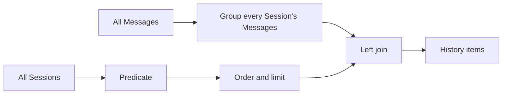
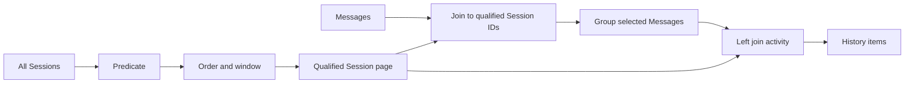

# Qualification Pushdown Across Cotail Operations

## Handoff Status

Stop treating this as a local history optimization. It is a core query-product
design problem.

The current canonical history migration is committed and passes its behavioral
tests, but its Message aggregate groups the entire logical Message relation on
every invocation before the outer query discards groups for Sessions that do not
qualify. An independent review identified the broad scan. A follow-up request to
implement an obvious qualified-Session CTE fix did not run because the requested
subagent reached its usage limit. **No pushdown fix has been committed.**

The next session should design the general rule before editing history.

Current relevant commits, in order:

- `41b9c017` — rebuild Session history around canonical reports;
- `87b8be39` — remove the orphaned `HistoryEntry` compatibility type.

The tracker issue `cotail-session-report-history` remains in progress. Its
current behavior is correct, but its plan can do work proportional to all
Messages ever persisted rather than work proportional to the qualified Session
page.

## Why This Is Critical

Cotail's query world exists to make cross-Session retrieval and reporting
powerful. That makes accidental broad work especially dangerous:

- local databases can contain thousands of Sessions and hundreds of thousands
  of Messages;
- logical relations can expand JSON and nested content into many rows;
- reports commonly ask for a small, recent, project-scoped Session page;
- output limits do not help if related relations are fully aggregated or
  expanded before the limit; and
- a query can be semantically correct, type-safe, and covered by tests while
  still having catastrophically wrong work placement.

The failure is not "we forgot an index." It is that the operation's relational
shape places qualification and limiting outside an aggregation barrier.

## Current History Shape

[`sessionHistoryQuery`](/packages/query-kysely/src/operations/history.ts) starts
from the canonical Session report query, applies a Session predicate, and then
left-joins this derived relation:

```sql
select
  sessionID,
  count(*) as messagesTotal,
  sum(case when createdAt >= ? then 1 else 0 end) as messagesSince
from cotail_message
group by sessionID
```

The outer query then orders Sessions, applies an optional Session limit, and
discards activity groups that do not join to a selected Session.

Conceptually:



SQLite generally cannot push an outer Session predicate through a grouped
derived table on the nullable side of a left join. The current plan test
actually records materialization and a temporary B-tree for grouping. It proves
"one aggregate, no scalar subqueries," but does not prove that the aggregate is
bounded by the selected roots.

For a command such as:

```sh
cotail history --since 24h --limit 20
```

the expected work shape is close to "qualify at most the recent Session page,
then count Messages belonging to those Sessions." The current shape is "count
Messages for every Session, then keep 20 groups."

## What The Recent Query Work Did

The recent operation pass made several important improvements:

1. A canonical `SessionReport` now has one checked report-only projection and
   decoder.
2. `getSession`, `findLatestSession`, and `listSessions` return source-qualified
   Session observations with explicit cardinality and keyset semantics.
3. `SessionReportCapture` adds a versioned storage-neutral capture without
   misusing read provenance as revision.
4. History now returns a canonical Session observation plus an activity facet.
5. History replaced two correlated count subqueries with one grouped aggregate.

The fifth change fixed duplicated correlated aggregation but exposed the deeper
question: **where must qualification and windowing occur relative to related-row
work?** "One aggregate" is not enough if it is one unbounded aggregate.

## The Obvious Local Rewrite

For current history semantics, the obvious candidate is:

1. Build `qualified_sessions` from the canonical Session report projection.
2. Apply the Session predicate.
3. Apply deterministic Session order.
4. Apply the Session limit or keyset page.
5. Build one `session_activity` aggregate by inner-joining `cotail_message` to
   `qualified_sessions`, then grouping by Message `sessionID`.
6. Left-join `session_activity` back to `qualified_sessions` so Sessions with no
   Messages receive zero counts.
7. Reapply final deterministic output ordering.



This is likely the correct history rewrite because Message counts do not
participate in Session qualification or ordering. Counting after the Session
page is chosen preserves the current result.

It is **not yet accepted as the general design**. Before implementation, verify:

- SQLite materializes or co-routines the CTE in a way that actually restricts
  Message access;
- the relevant physical Message table has an index beginning with `session_id`;
- Kysely does not inline/restructure the CTE into the old broad shape;
- applying `LIMIT` inside qualification does not alter any operation whose
  related values affect qualification, score, rank, or order;
- canonical report decoding remains reusable without selecting duplicate or
  ambiguous fields;
- keyset cursors and final ordering stay stable; and
- the query remains one snapshot under one `LogicalRead`.

## Semantic Rule: Pushdown Is Conditional

There is no universal "always limit roots first" rewrite. Whether it is correct
depends on the operation's semantics.

### Safe root-first enrichment

Choose roots first when related data is only an attached facet and does not
affect root membership or root order.

Examples:

- history Message counts when Sessions are selected by Session metadata;
- child preview metadata after a parent Session page is fixed;
- expensive report hydration not used by qualification;
- evidence disabled for a search whose qualifying witnesses were already
  evaluated separately.

### Unsafe root-first reduction

Do not limit roots before related work when related rows determine whether or
where a root appears.

Examples:

- direct search where matching documents qualify Sessions;
- FTS rank or score used to order Sessions;
- `HAVING messagesSince > N`;
- ordering Sessions by cost derived from related rows rather than projected
  Session usage;
- selecting parents by descendant properties; and
- any operation where truncation changes witness truth.

For these operations, push restrictive predicates into related work first,
derive qualified root identity/order, window roots, and only then hydrate
non-qualifying facets.

## Existing Good Precedent: Direct Search

[`searchDirectSessions`](/packages/query-kysely/src/operations/direct-search.ts)
already implements a staged operation:

1. `qualified_sessions` applies Session predicates and witness existence.
2. It orders and limits the Session page.
3. `matching_documents` joins documents only for qualified Sessions.
4. Window functions rank children per Session.
5. Final joins assemble grouped products.

This is not automatically the template for every operation, but it proves the
query world can express staged qualification. History should be compared against
that operation, and shared vocabulary should be extracted only if doing so makes
the semantic rule clearer rather than hiding it.

## Why The Query Model Did Not Automatically Prevent This

The public logical Kysely world intentionally permits arbitrary relational
programs. Kysely can type a query; it cannot know which relation is the result
root, which predicates define qualification, whether an aggregate is an
enrichment, or whether a limit is semantically movable.

The domain-operation layer is supposed to own those guarantees. The query-world
design explicitly separates arbitrary inferred-row queries from stable
operation-owned products. What is missing is a strong, reviewed operation
discipline for **qualification before hydration** and plan evidence that work is
bounded where semantics permit.

Do not respond by inventing a second general query AST or by promising automatic
SQL optimizer pushdown. The likely seam is operation construction and
conformance, not a replacement relational language.

## Design Scope For The Next Session

Design a systematic qualification-pushdown contract for Cotail domain
operations. It should answer:

1. How does an operation declare or structure its result root?
2. Which stages establish qualification, order, keyset cursor, and root window?
3. Which related computations are qualifying versus enriching?
4. How are enriching joins restricted to the selected root page?
5. How do multi-stage products preserve one `LogicalRead` and provenance?
6. What reusable helpers deepen the module without hiding Kysely or creating a
   custom query algebra?
7. What plan assertions and behavioral tests prove bounded work?
8. Which current operations violate the intended discipline?
9. How do logical CTE seeding and SQLite materialization interact with the
   operation stages?
10. What should be enforced by interface shape, test conventions, code review,
    and benchmarks respectively?

## Required Audit

The next design should audit at least:

| Operation / relation | Qualification source | Related work | Pushdown risk to investigate |
|---|---|---|---|
| Session exact/latest/list | Session row | report projection | Low; baseline root operations. |
| History | Session predicate/order/window | Message aggregate | Current known broad aggregation. |
| Direct search | witnesses over documents | evidence ranking/hydration | Staged today; verify global and per-Session limits. |
| Future FTS search | index matches/rank | live recheck and evidence | Rank and freshness can block naïve root-first limiting. |
| Child usage | lineage recursion | report and usage aggregation | Depth/root qualification must restrict recursion and totals. |
| Fork point/time | lineage edge | boundary Message lookup | Avoid boundary lookup over unrelated edges. |
| Documents | owner relations and JSON expansion | searchable text projection | Ensure owner restrictions reach expansion where possible. |
| Events/pending | capability-gated source facts | decoding/documents | Avoid evaluating unsupported or unrelated families. |
| Bookmark resolution | exact Target | grain-specific hydration | Exact identity should bound source work immediately. |
| Watch/history consumers | recent Session set | repeated activity refresh | Avoid repeating whole-history aggregation on each refresh. |

Also inspect [`logicalWorld`](/packages/query-kysely/src/relations/world.ts). Its
large CTE world relies on SQLite laziness and operation references to avoid
evaluating unrelated relation families. Determine where CTE barriers, JSON table
functions, unions, or validation functions can defeat predicate propagation.

## Verification Strategy To Design

Behavioral equality is necessary but insufficient. The design needs evidence of
work placement.

Candidate layers:

### Compiled SQL shape

- qualifying Session CTE appears before enrichment;
- related aggregate joins qualified root IDs internally;
- no correlated scalar aggregates unless deliberately accepted;
- cursor/order/limit occur at the intended stage; and
- physical relation names remain hidden behind logical relations.

SQL regex assertions are useful but brittle. Prefer structural helper tests when
possible.

### `EXPLAIN QUERY PLAN`

- related tables are searched by owner/session key rather than fully scanned;
- materialized aggregates are fed by qualified IDs;
- unexpected `SCALAR SUBQUERY`, broad temp B-trees, or full scans fail focused
  conformance tests where stable across supported Node/SQLite versions.

Plan text is SQLite-version-sensitive. Define a small set of stable invariants,
not complete golden plans.

### Work-count instrumentation

Plan shape does not prove row counts. Consider test-only SQLite functions or
instrumented logical expressions that count evaluation, with fixtures containing
large amounts of unrelated data. The assertion should show that adding unrelated
Sessions/Messages does not proportionally increase expensive enrichment work for
a fixed qualified page.

Do not instrument by parsing or validating sensitive payloads in ordinary
metadata operations.

### Benchmarks

Benchmark fixed output against increasing unrelated-source size:

- 20 recent Sessions out of 100, 1,000, and 10,000;
- fixed selected Messages with growing unrelated Message history;
- title-only and content search separately;
- child depth and sibling fanout independently; and
- repeated watch refreshes.

Track rows evaluated if instrumentation permits, not only wall-clock time.

## Potential Interface Directions To Compare

These are candidates, not decisions.

### 1. Operation-private staged CTEs

Each operation explicitly builds `qualified_*`, `windowed_*`, `enriched_*`, and
final products. Maximum semantic clarity, some duplication.

### 2. Reusable qualified-root builder

A private helper owns canonical Session projection, predicate, order, cursor,
and window, returning a CTE-compatible builder. Operations attach qualifying or
enriching relations. This may deepen the module if its interface remains small
and does not assume every operation's order.

### 3. Typed operation stage vocabulary

Small types distinguish qualification from enrichment and make moving limits
across the seam explicit. Risk: becoming a custom query algebra or exposing a
large generic interface.

### 4. Conformance-only discipline

Keep ordinary Kysely operation code and enforce a checklist plus plan/work-count
tests. Lowest machinery, but relies on review to catch broad plans.

The next design should compare these by interface depth, semantic honesty,
Kysely inference, plan quality, and migration cost.

## Immediate History Decision After Design

Once the general discipline is chosen, return to
`cotail-session-report-history` and decide whether to:

- replace the current aggregate with qualified/windowed Session CTEs;
- add keyset pagination rather than only a top-N limit;
- retain one grouped aggregate;
- reject or preserve CLI `--limit 0` translation until output migration; and
- add plan plus work-count tests that fail if unrelated Message history is
  scanned.

Do not close the history ticket before this decision. Do not treat current green
tests as sufficient.

## Prompt For The Next Session

> Design Cotail's qualification-pushdown discipline across domain operations.
> Start from `.design/pushdown/draft0.gpt56.md`, the V2 query-world design, and
> current history/direct-search implementations. Determine when root
> qualification/order/window may safely precede related aggregation or
> hydration, and how operation interfaces plus conformance tests can guarantee
> bounded work without replacing Kysely with a custom query algebra. Audit
> current and planned operations, compare several interface directions, specify
> stable SQL-plan and work-count evidence, and only then recommend the history
> rewrite.

## Handoff Checklist

- Read this brief before changing `history.ts`.
- Inspect the current history compiled SQL and fixture plan, not the live user
  database.
- Read direct search's staged CTE implementation as prior art.
- Confirm physical indexes from authoritative OpenCode schema/source fixtures,
  using archive source before web retrieval.
- Produce at least two materially different design options.
- State which rewrites preserve semantics and which require API changes.
- Define conformance tests that measure bounded work, not only returned rows.
- Update the history ticket with the accepted design before implementation.
- Keep `cotail-session-report-history` open until the pushdown issue is resolved.

## Cross-References

- [V2 relational query world](/.design/query/design3.gpt56.md) establishes
  arbitrary Kysely composition plus operation-owned stable products.
- [Scoped execution design](/.design/query2/design2.gpt56.md) guarantees one
  pinned read and truthful provenance; it does not choose relational work
  placement.
- [Canonical Session operation pass](/.design/session-report/full-query-pass0.gpt56.md)
  requires a grouped history aggregate but did not specify qualification
  pushdown strongly enough.
- [Current history implementation](/packages/query-kysely/src/operations/history.ts)
  contains the known broad aggregate.
- [Direct search implementation](/packages/query-kysely/src/operations/direct-search.ts)
  is existing qualify/window/hydrate prior art.
- [Logical relation world](/packages/query-kysely/src/relations/world.ts) must be
  audited for CTE and JSON-expansion pushdown behavior.
