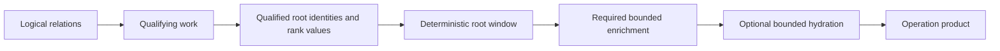

# Qualification Staging And Bounded Enrichment

## Decision Summary

Cotail domain operations should use **operation-private relational stages** and a
small shared review vocabulary:

1. **qualifying work** establishes root membership and any values used to rank
   roots;
2. **root windowing** applies deterministic order, cursor, and page size only
   after qualification is complete;
3. **required enrichment** computes result facets that cannot change membership
   or order, restricted to the selected root page; and
4. **optional hydration** loads payloads or evidence only when the product asks
   for them, also restricted to selected roots and children.

Keep these stages visible as ordinary Kysely CTEs or subqueries inside each
operation. Do not add a generic qualified-root builder, phantom stage types, or
a second query algebra yet. Add a helper only after at least two implemented
operations exhibit the same stage with the same semantics and SQL needs.

Stage order is a semantic property. Bounded execution is a separate physical
property. A query is accepted only when both hold:

- moving the root window cannot change the returned product; and
- representative SQLite plans and scaling tests show that post-window work does
  not grow with unrelated related rows.

The current history query satisfies the first property but fails the second.
Its qualified-Session CTE is useful structure, not an accepted optimization.

## Assessment Of Draft0

### What draft0 established correctly

The initial brief identified the right class of failure and the right ownership
boundary:

- type-correct and behaviorally correct SQL can still put work on the wrong side
  of an aggregation or expansion barrier;
- root-first windowing is valid only when related rows do not determine root
  membership or order;
- qualifying related work must precede the root window, while non-qualifying
  enrichment should follow it;
- `LogicalRead` owns snapshot and provenance, but does not choose relational work
  placement;
- Kysely and SQLite cannot infer Cotail's product semantics; domain operations
  must own them; and
- compiled SQL, query plans, and work-sensitive tests are all needed because
  returned-row equality is insufficient.

The warning against inventing another general query AST is also correct. The
existing operations differ enough that abstraction would currently hide the
reason a limit is safe or unsafe to move.

### What changed or remained unresolved

Draft0 was a handoff written while the history candidate was arriving. The
candidate is now the current implementation, so several instructions are stale:

- history already has `qualified_sessions` and `session_activity` CTEs;
- SQL-shape and fixture-plan assertions already exist; and
- the remaining history question is no longer whether to stage the query, but
  whether SQLite executes the related aggregate from the bounded side.

The answer to that last question is currently no. On a fixture carrying the
authoritative OpenCode Message indexes, `EXPLAIN QUERY PLAN` reports the relevant
activity loop as:

```text
MATERIALIZE session_activity
SCAN session_message USING INDEX session_message_session_seq_idx
SEARCH qualified_sessions USING AUTOMATIC COVERING INDEX (sessionID=?)
```

SQLite scans the Message index and probes the small qualified set. The join
predicate prevents unrelated Messages from contributing groups, but it does not
prevent them from being visited. The comments in
[`history.ts`](/packages/query-kysely/src/operations/history.ts) and its test say
more than the plan evidence proves.

The existing test only requires the aggregate subtree to mention
`qualified_sessions`. It would pass both desired and reversed loop orders. This
is the principal correction draft1 makes to draft0's provisional assessment.

Draft0 also audits several planned relations as if they were current. The
implemented `CotailRelations` currently has Session, Message, decoded Message
families, and Document relations. Lineage, Project, Workspace, pending input,
Events, and bookmarks should inherit this discipline when they land, but they
cannot yet provide implementation evidence for a shared abstraction.

Finally, direct search is useful precedent for semantic staging but not yet a
conformance exemplar. It still returns the older `SessionSummary`, evaluates
document witnesses once for qualification and again for evidence, has no plan or
work-growth tests, and joins Message payloads even when evidence is disabled.

## Contract

### Result root

Every domain operation names its result root in prose and code review. A result
root is the identity whose membership, ordering, and page size the operation
promises. History and direct search currently have Session roots. A future
Message search would have Message roots even if its output groups them under
Sessions.

Do not infer the root from the first `selectFrom` call. CTEs may begin from
witnesses or recursive edges while producing a different root.

### Four stages



An operation may omit stages or combine adjacent stages when the distinction is
still obvious. The contract does not require four CTEs by name. It requires that
the semantic barrier and the physical restriction remain reviewable.

### Qualifying work

Work is qualifying if changing its result can change any of these:

- whether a root appears;
- the value used to order or score a root;
- the root cursor position; or
- which roots fall inside the requested page.

Examples include document witness existence, FTS rank, `HAVING` conditions,
descendant predicates, and aggregate-derived order. Qualifying work must be
complete before root windowing. It may still be expensive or global; the
operation must not call it enrichment merely to move the limit earlier.

### Required enrichment

Work is required enrichment when it contributes fields to an already selected
root but cannot alter membership or order. History activity counts are the
current example because `SessionHistoryRequest.predicate` explicitly never
constrains Message counting.

Required enrichment should consume selected root IDs from its own inner query,
not rely on an outer join to discard unrelated groups later. Its physical plan
must start from or perform indexed probes for those IDs where the source schema
provides an owner index.

### Optional hydration

Optional hydration loads values that are absent from a valid result mode, such
as evidence payload JSON when evidence is disabled. Suppressing a value in the
decoder is not enough. The SQL branch should omit the source join and columns
when they are not needed, unless measurements show that doing so would multiply
operation complexity without reducing work.

### Semantic movement rule

A root predicate, cursor, order, or limit may cross related work only if the
operation can state and test that the related work has no effect on root
membership or order. This is an operation-product rule, not a syntactic rule
about joins, CTEs, or aggregate functions.

### Physical boundedness rule

For a fixed selected root page, adding unrelated related rows must not cause
post-window enrichment or hydration work to grow proportionally. A join to a
small CTE does not by itself satisfy this rule. Loop order, usable indexes, CTE
materialization, JSON expansion, and validation functions all matter.

## Architecture Choice

| Direction | Semantic honesty | Kysely inference | Plan control | Cost now | Decision |
|---|---|---|---|---|---|
| Operation-private staged CTEs | High: operation-specific reasons remain visible | Native | High enough to test exact SQL shapes | Some duplication | **Adopt** |
| Reusable qualified-root builder | Medium: risks assuming one order and cursor model | Feasible but generic-heavy | Unclear across operations | Premature interface work | Defer until repeated shape exists |
| Typed stage vocabulary | Superficially high, but types cannot prove limit movement or SQLite plans | Adds generic pressure | Low without the same tests | Risks a custom algebra | Reject for now |
| Conformance only, no visible stages | Depends on reviewer reconstruction | Native | Tests can detect some failures | Lowest code machinery | Insufficient by itself |

The chosen approach combines visible operation-private staging with conformance.
The shared artifact is initially a vocabulary and checklist, not a builder.

This keeps the module deep in the useful sense: operation entry points hide SQL
and guarantee products, while their implementations remain direct enough to
audit against SQLite behavior.

## Current Operation Audit

| Operation | Result root | Qualification and order | Post-window work | Assessment |
|---|---|---|---|---|
| `getSession` | Session | Exact Session ID | Canonical report projection | Safe baseline; no related-row work |
| `findLatestSession` | Session | Session predicate, updated order, one root | Canonical report projection | Safe baseline; Session scan/sort may remain an upstream index constraint |
| `listSessions` | Session | Session predicate, keyset, deterministic order | Canonical report projection | Safe baseline |
| history | Session | Session predicate and updated order | Message activity aggregate | Semantically safe; physically unbounded today |
| direct search | Session | Every witness over Documents plus Session predicate and updated order | Matching evidence, ranking, payload hydration | Correct stage category; physical behavior unproven and optional hydration is not omitted |
| arbitrary logical query | Caller-defined | Caller-defined | Caller-defined | No domain-operation boundedness promise |

### History

History may choose and window Sessions before counting Messages because Message
counts are not a predicate, score, or ordering input. It must preserve
zero-Message Sessions with a left join after aggregation.

The current logical shape is therefore accepted. The current physical shape is
not. The desired Message-side plan is an indexed search per qualified Session,
similar to:

```text
SCAN qualified_sessions
SEARCH session_message USING INDEX ... (session_id=?)
```

OpenCode currently provides indexes beginning with `session_id`, including
`(session_id, seq)` and `(session_id, time_created, id)`. Cotail's fixture omits
them, which prevents realistic plan conformance. Runtime source validation also
checks tables and columns but not indexes. Index expectations belong to source
adapter compatibility and plan fixtures, not the public logical relation API.

Session qualification itself currently scans and sorts `session_v2` because the
authoritative schema has no `(time_updated, id)` index. This is a distinct cost:
history can still bound Message enrichment while accepting an upstream Session
metadata scan. Claims and benchmarks must report these two costs separately.

### Direct search

Direct search cannot window Sessions before document witnesses establish
membership. Its broad qualifying work is semantically necessary in the direct
backend. After the Session page is fixed, matching-document enumeration,
per-Session ranking, and evidence hydration should be restricted to that page.

The current operation needs three focused reviews:

1. Determine whether owner restrictions propagate through the unioned
   `cotail_document`, validated Message, and JSON-expansion CTEs.
2. Separate witness truth from evidence enumeration enough to explain and
   measure duplicated document evaluation.
3. When `evidence` is false, retain only work needed to compute truthful
   truncation and omit `evidence_message.sourceJSON`, payload hashing inputs, and
   other hydration-only columns.

Do not force history and search through one root builder. Their qualification
frontiers are materially different.

### Planned operations

Use this classification when the corresponding relations exist:

| Planned operation | Likely qualifying work | Likely post-window work | Required caution |
|---|---|---|---|
| FTS Session search | Index matches, score, freshness policy, live recheck | Evidence and authoritative report hydration | Never window before rank and freshness semantics are settled |
| Child usage | Traversal when descendants affect membership; otherwise root Session selection | Bounded descendant traversal and usage totals | Depth limits bound traversal, not merely output |
| Fork point/time | Exact lineage edge and ancestor boundary | Nearby Message/content hydration | Probe by ancestor owner and boundary, not all edges or Messages |
| Bookmark resolution | Exact Target and source capability | Grain-specific current observation | Exact identity should restrict source work immediately |
| Events/pending | Capability and requested family | Typed decoding and documents | Do not seed or evaluate unsupported families |
| Watch history | Membership/ranking sample | Viewport activity enrichment | Polling must not repeat whole-history Message work |

These are design constraints, not evidence that unimplemented relations already
conform.

## Conformance Strategy

### Behavioral invariants

Every staged rewrite keeps product semantics explicit:

- selected roots and deterministic order are unchanged;
- cursor boundaries and ties are unchanged;
- zero-child roots survive where the product requires them;
- related qualification remains before the root window;
- enrichment cannot change membership;
- optional hydration cannot change qualification or truncation; and
- all observations from one operation share one `LogicalRead` provenance.

### Compiled SQL invariants

Use focused shape assertions for semantic barriers:

- root qualification and root window appear before enrichment;
- enrichment contains an owner restriction to selected root IDs;
- final ordering is reapplied after joins;
- no physical table names escape the logical relation world; and
- disabled hydration omits payload joins and columns.

Do not treat textual join order as proof of physical loop order.

### Plan invariants

Fixtures must reproduce the supported upstream indexes before plan assertions are
meaningful. For history's activity subtree:

- require a `SEARCH session_message ... (session_id=?)` or an equivalently
  specific indexed owner probe;
- reject `SCAN session_message` and `SCAN session_message USING INDEX ...`;
- reject correlated scans that repeat over unwindowed roots;
- continue rejecting unintended scalar subqueries and duplicate aggregates; and
- keep assertions local to stable detail fragments rather than snapshotting a
  complete SQLite-version-specific plan.

Plan tests should run on every supported Node/SQLite lane. If detail wording
differs, normalize only the wording needed to express the same loop and access
invariant.

### Work-growth invariants

Create paired fixtures with the same selected roots and selected related rows,
then add increasing numbers of unrelated Sessions and Messages. Separate source
acquisition from operation execution because acquisition currently performs
`select distinct type from session_message`.

For history, measure the operation after the source is acquired and assert that
fixed-page execution does not scale with unrelated Messages. A test-only probe
function may count rows entering the activity expression, but its query must
also retain the accepted plan so instrumentation does not accidentally change
optimization.

Wall-clock benchmarks support but do not replace deterministic plan and probe
evidence. Record Session qualification cost separately from Message enrichment
cost.

## History Repair Experiments

Test these as small SQL/Kysely variants against an indexed fixture before
changing the operation:

1. Seed the aggregate with selected IDs using `IN (select sessionID from
   qualified_sessions)` and inspect whether SQLite performs repeated indexed
   owner searches.
2. Put `qualified_sessions` first and use a deliberate `CROSS JOIN` plus owner
   equality if necessary to prevent SQLite from reversing loop order.
3. Compare indexed per-root correlated aggregation as a control. It may perform
   more than one probe per root, but it establishes the bounded-cost baseline
   and guards against preserving "one aggregate" at the expense of scanning all
   Messages.

Prefer the smallest Kysely-native shape that produces one grouped aggregate and
the required owner searches. If SQLite cannot produce that plan reliably, relax
the one-aggregate implementation preference before relaxing bounded work. The
public requirement is correct counts over the selected page, not a particular
aggregate count in the SQL text.

Do not use undocumented optimizer behavior as the only barrier. If `CROSS JOIN`
is selected to fix loop order, document that this is an intentional SQLite plan
constraint and cover it on supported runtimes.

## Forward Plan

### 1. Establish realistic plan fixtures

- Add the authoritative OpenCode Session Message indexes to the shared V2
  fixture.
- Record the supported upstream schema revision or range behind those indexes.
- Add a failing history assertion that rejects a Message scan and requires an
  indexed `session_id` search.
- Keep the known Session scan/sort visible rather than conflating it with the
  Message regression.

Exit condition: the current history implementation fails for the intended
physical reason on every supported runtime.

### 2. Select and implement the history access shape

- Compile and explain the `IN`, constrained root-first join, and correlated
  control variants.
- Verify identical counts, zero-Message behavior, order, limit, and cutoff
  semantics.
- Implement the smallest variant with stable indexed owner probes.
- Correct comments so they distinguish rows excluded from aggregation from rows
  never visited.

Exit condition: behavior remains equal and the activity subtree contains no
full Message scan.

### 3. Add work-growth evidence

- Hold a one- or twenty-Session page constant.
- Grow unrelated Message history by orders of magnitude.
- Measure after source acquisition and count activity-row evaluation where
  instrumentation is plan-neutral.
- Retain a benchmark for trend detection, but gate correctness on stable plan
  and work-count invariants.

Exit condition: unrelated Messages do not proportionally increase history
enrichment work.

### 4. Audit direct search as a separate operation

- Add title-only and Message-content plan fixtures.
- Identify unavoidable qualifying scans versus post-window evidence work.
- Branch the SQL product when evidence is disabled so payload hydration is
  absent.
- Preserve witness truth, group totals, truncation, keysets, and one-read
  provenance.
- Coordinate with the canonical Session report migration without coupling that
  product change to the pushdown abstraction.

Exit condition: direct search has documented qualification cost and bounded,
mode-appropriate post-window work.

### 5. Codify the operation checklist

Add a short contributor-facing checklist near domain operations:

- name the result root;
- list every membership and order input;
- mark each related computation qualifying, enriching, or hydrating;
- justify every limit movement;
- show owner restriction inside post-window work;
- provide behavioral, SQL-shape, and plan evidence; and
- add a work-growth case when related relations can dominate cost.

Do not extract a shared builder in this step.

### 6. Reassess abstraction after another operation conforms

After history and direct search both pass conformance, compare their actual
repeated code. Extract only a narrow helper with identical semantics, such as a
deterministic Session keyset predicate or plan-test utility. Keep qualification
and enrichment assembly operation-private unless repetition demonstrates a
deeper common seam.

## Acceptance Gates

The pushdown design can move from draft to accepted when:

- history behavior is unchanged but its selected-page Message work is physically
  bounded by owner-index searches;
- fixtures carry authoritative indexes and plan tests fail on reversed loop
  order;
- a fixed-page work-growth test is insensitive to unrelated Message volume;
- direct search distinguishes qualifying document work from evidence hydration
  and omits hydration-only work when disabled;
- the operation checklist is documented; and
- no generic builder or stage type is introduced without repeated implemented
  evidence.

Future lineage, Events, pending input, FTS, bookmarks, and watch work should cite
this contract, but their absence does not block accepting the discipline proven
by history and direct search.

## Cross-References

- [Initial pushdown brief](/.design/pushdown/draft0.gpt56.md) supplies the
  triggering broad-aggregate analysis and conditional root-first rule. This
  draft supersedes its handoff status and provisional acceptance criteria.
- [V2 relational query world](/.design/query/design3.gpt56.md) assigns stable
  product semantics to domain operations while leaving arbitrary Kysely queries
  caller-defined.
- [Scoped execution design](/.design/query2/design2.gpt56.md) provides the one-read
  snapshot and provenance contract preserved across all stages.
- [Canonical Session operation pass](/.design/session-report/full-query-pass0.gpt56.md)
  defines the history and search products whose work placement is assessed here.
- [Current history implementation](/packages/query-kysely/src/operations/history.ts)
  contains the semantically staged but physically unbounded candidate.
- [History conformance test](/packages/query-kysely/test/history.test.ts) is the
  immediate enforcement point; its aggregate-subtree assertion must become a
  loop/access-method assertion.
- [Direct search implementation](/packages/query-kysely/src/operations/direct-search.ts)
  demonstrates the different case where related documents establish
  qualification before the root page.
- [Logical relation world](/packages/query-kysely/src/relations/world.ts) contains
  the union, validation, and JSON-expansion barriers that direct-search plan
  tests must exercise.
- [Watch database observability](/.design/watch/database-observability0.gpt56t.md)
  records earlier evidence that per-Session owner-index probes can bound Message
  counts even when Session metadata still scans and sorts.
