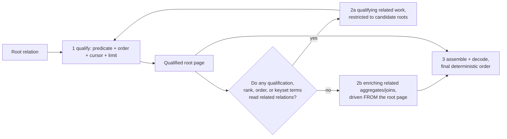

# Qualification Pushdown Discipline — Assessment and Forward Plan

## Situation

`cotail-session-report-history` is blocked on
[`cotail-query-pushdown-design`](/.design/pushdown/draft0.gpt56.md): no edit or
closure of canonical history is allowed until Cotail has an *accepted,
general* qualification/order/window/hydration discipline with bounded-work
evidence. Commit `c3e02b37` put a qualified-Session CTE into
[`history.ts`](/packages/query-kysely/src/operations/history.ts) as a
candidate, explicitly not accepted as architecture.

Draft0 framed the problem correctly and left four questions open: whether the
CTE actually restricts Message access physically, which interface direction to
adopt, what stable evidence looks like, and how the rule generalizes. This
draft answers those from code reading plus an independent executable probe
([`.test-agent/pushdown-oxa2/plan-probe.ts`](/.test-agent/pushdown-oxa2/README.md)),
then commits to a design and a forward plan.

Vectors taken from the operator: assess draft0 specifically; write a forward
plan; do this as this model's own independent draft1 (other models' draft1
files were deliberately not read).

## Assessment of Draft0

### What holds up

- **The reframing is right.** History is a query-product design problem;
  "one aggregate" was never the goal, bounded work placement is.
- **The conditional-pushdown taxonomy is sound** and should survive into the
  accepted design verbatim in spirit: root-first limiting is safe when related
  data is enrichment only, unsafe when related rows determine membership,
  rank, or order (`HAVING`, FTS rank, witness truth).
- **Direct search as prior art** is the correct read:
  [`direct-search.ts`](/packages/query-kysely/src/operations/direct-search.ts)
  already implements qualify → window → hydrate staging with per-Session
  windows, and its `matching_documents` CTE inner-joins `qualified_sessions`.
- **The verification-layer menu** (compiled SQL shape, EXPLAIN QUERY PLAN,
  work-count instrumentation, scaling benchmarks) is the right set of layers.

### What the probe settled — against draft0's hope

Draft0's checklist asked: "verify SQLite materializes or co-routines the CTE
in a way that actually restricts Message access." My probe answers **no**, on
Node v26.6.0 / SQLite 3.53.3, on a fixture carrying the authoritative upstream
indexes:

| Variant | Aggregate loop (EQP) | 300k unrelated Messages | 1.2M |
|---|---|---|---|
| A — current `c3e02b37` shape | `SCAN session_message USING INDEX session_message_session_seq_idx`, then probe `qualified_sessions` per row | 43–86 ms | 181 ms |
| B — pinned: aggregate scans qualified page, probes Messages | `SCAN q` + `SEARCH session_message … (session_id=?)` | 4 ms | 3 ms |
| C — IN-seeded aggregate | `SEARCH session_message … (session_id=?)` driven by `LIST SUBQUERY` | 4 ms | 4 ms |

All three return byte-identical counts. The current candidate is therefore
semantically correct and still **unbounded**: SQLite treats the grouped
derived table's nullable/probing join as non-order-forcing and reads every
Message row, filtering through an automatic covering index on the CTE. The
cost grows linearly with total Message history forever. This confirms the
ticket's reproduction notes and kills the idea that the CTE inner-join alone
is acceptable evidence of boundedness.

### What draft0 underweighted

1. **Plan text is not a stable contract.** My IN-seeded variant (C) came out
   bounded on this exact engine version, while the investigation recorded in
   the `cotail-query-pushdown-design` ticket observed the same shape *not*
   flipping the loop. Both observations can be true across fixtures and minor
   versions. Consequence for design: EQP assertions may guard loop order where
   we force it syntactically, but the load-bearing conformance must be
   **bounded-growth fixtures** (scale unrelated data ×k, assert sublinear
   cost), not golden plans.
2. **The Session side is also unbounded.** Every variant materializes
   `qualified_sessions` via `SCAN session_v2` + temp B-tree ORDER BY. The
   authoritative OpenCode schema has no `time_updated` index on Sessions (and
   Cotail opens sources read-only, so it cannot create one). Qualification
   therefore stays O(all Sessions) even after Message work is pinned. That is
   probably fine for local DBs (thousands, not millions, of Sessions), but the
   accepted design must name this residual cost instead of implying full
   boundedness.
3. **No operational decision procedure.** Draft0 gives examples of safe vs
   unsafe but no test an operation author applies while writing code. See the
   rule below.

## Design Position

### The staging contract

Every domain operation that reads related relations must build its product in
explicitly named stages inside one `read.all` scope:



The decision rule an author applies (the missing piece):

> **A related computation is qualifying iff removing it can change which roots
> appear, their order, their rank/score, or the keyset continuation. Otherwise
> it is enriching and MUST sit downstream of the root window, driven from the
> window outward (root page as the outer loop).**

Corollaries:

- Enriching aggregates are written `FROM qualified_root JOIN related`, never
  `FROM related JOIN/CROSS/…` with the root on the probing side — because
  SQLite will not flip the loop for you (variant A).
- IN-seeding an aggregate from the window is *observed* bounded here but is
  planner-dependent; prefer the pinned form, keep IN-seed as documented
  fallback if Kysely expressiveness forces it.
- Limits/cursors move freely only across the qualifying/enriching seam, never
  into a stage whose output feeds qualification.

### Interface direction: operation-private stages now, shared builder deferred

Comparing draft0's four candidates:

| Direction | Semantic honesty | Inference risk | Migration cost | Verdict |
|---|---|---|---|---|
| 1. Operation-private staged CTEs | High — each operation shows its own stages | None — plain Kysely | Trivial (history + direct search already comply) | **Adopt** |
| 2. Reusable qualified-root builder | Medium — hides ordering assumptions behind helper | Low-medium | Medium | Defer until ≥3 operations duplicate qualification boilerplate |
| 3. Typed stage vocabulary | High in theory | High — risks becoming a custom algebra, exactly what the query-world design forbids | High | Reject for now |
| 4. Conformance-only | Low — review catches what tests miss | None | Lowest | Adopt as the enforcement layer around 1 |

Option 1 wins because the two hardest operations (history, direct search)
already demonstrate it; the marginal cost of writing stages explicitly per
operation is small, and visibility of the SQL shape is itself the safety
feature. Option 2 becomes attractive only when a third operation repeats the
Session-qualification preamble; revisit then, extracting only if the helper's
interface stays smaller than the duplication it removes.

### Conformance: three tiers, growth evidence is load-bearing

1. **Structural compiled-SQL assertions** (stable): stage order
   (`qualified_*` before enrichment), single grouped aggregate, aggregate
   joins the window internally, no correlated scalar aggregates. Keep these —
   cheap and meaningful.
2. **Bounded-growth fixtures (new, primary):** a shared fixture factory with a
   scaling knob (unrelated Sessions × k, unrelated Messages × k). Each guarded
   operation runs at k=1 and k=8 with identical page output and asserts the
   expensive-stage cost ratio stays flat within tolerance. Wall-clock min-of-N
   worked in the probe; if flaky in CI, swap to visited-row counting via a
   test-only SQLite function. These tests fail today for variant A (181 ms →
   linear) and pass for variant B — that is exactly the property we want CI to
   hold.
3. **EQP loop-order assertions (tolerant):** assert the aggregate subtree
   contains `SEARCH <related> … (<owner>=?)` and no unconstrained
   `SCAN <related>`; mark skip-if-plan-drift so a SQLite upgrade degrades to a
   warning rather than a false red.

### History rewrite recommendation

Rewrite `session_activity` to the pinned form (probe variant B), keeping the
current request semantics unchanged:

```sql
session_activity as (
  select q.sessionID,
         count(*) as messagesTotal,
         sum(case when m.createdAt >= ? then 1 else 0 end) as messagesSince
  from qualified_sessions q
  inner join cotail_message m on m.sessionID = q.sessionID
  group by q.sessionID
)
```

Left-join back to the qualified page for zero-message Sessions (verified
identical counts, including the zero-message case). Add a keyset `after`
cursor mirroring
[`listSessions`](/packages/query-kysely/src/operations/resolve.ts)'s
over-fetch-by-one pattern. Then, and only then, update
`cotail-session-report-history` and close the pushdown dependency.

Residual, named honestly: qualification remains O(all Sessions); Message
work becomes O(page Sessions' Messages). Document this in the operation docs
rather than pretending total boundedness.

## Forward Plan

Sequenced; no calendar estimates.

1. **Synthesis round.** Reconcile this draft with the other draft1s
   (`draft1-syn.*`) — expected convergence: staged private CTEs + growth-based
   conformance + pinned history rewrite; expected tension: builder extraction
   appetite and how much EQP text to assert.
2. **Accept design into the tracker.** Update
   `cotail-query-pushdown-design` notes with the accepted contract, decision
   rule, and conformance tiers; record the IN-seed plan-flip divergence as the
   reason growth evidence outranks plan text.
3. **Land the history rewrite** in
   [`history.ts`](/packages/query-kysely/src/operations/history.ts):
   pinned `session_activity`, tolerant EQP assertion replacing/augmenting the
   current subtree check, bounded-growth fixture using the shared factory, and
   keyset `after` support. Update the history ticket; human review closes the
   P0 dependency.
4. **Harden the harness.** Promote the probe into
   `packages/query-kysely/test/support/`: fixture factory (authoritative
   upstream indexes included), timing/row-growth helpers, EQP subtree walker.
   Delete or shrink `.test-agent/pushdown-oxa2` once promoted.
5. **Audit remaining operations with the new harness:** direct search (expect
   pass; confirm global hit limit placement), lookup/list (baseline, root-only),
   capture. File follow-ups for anything that trips tier 2.
6. **Open items carried forward:** audit
   [`world.ts`](/packages/query-kysely/src/relations/world.ts) for CTE/JSON
   barriers defeating predicate propagation (not yet independently verified);
   re-verify upstream Session index status against current OpenCode main (the
   archive checkout predates V2 renames); decide `--limit 0` CLI translation
   fate alongside `cotail-session-report-output`; reconsider the shared
   builder when a third operation duplicates qualification.

## Cross-References

- [Pushdown brief draft0](/.design/pushdown/draft0.gpt56.md) — the assessed
  brief; its conditional-taxonomy section survives into this design.
- [V2 relational query world](/.design/query/design3.gpt56.md) — establishes
  why the fix lives in operation construction, not a second query language.
- [Scoped execution design](/.design/query2/design2.gpt56.md) — the one-read
  scope this contract assumes per operation.
- [History operation](/packages/query-kysely/src/operations/history.ts) and
  [its tests](/packages/query-kysely/test/history.test.ts) — the candidate
  under review; tests already carry structural assertions to extend.
- [Direct search](/packages/query-kysely/src/operations/direct-search.ts) —
  prior art for the adopted staging discipline.
- [Lookup/listing](/packages/query-kysely/src/operations/resolve.ts) —
  root-only baseline and keyset precedent.
- [Probe README](/.test-agent/pushdown-oxa2/README.md) — runnable evidence
  behind every quantitative claim above.
