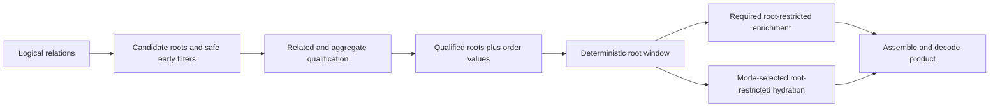

# Demand-Bounded Operation Planning

## Decision

Cotail domain operations will be written as **operation-private relational
stages** with two reviewable frontiers:

1. the **qualification frontier**, after every fact that can affect root
   membership or root order has been computed; and
2. the **window frontier**, after deterministic order, cursor, and page size
   have selected the result roots.

Work after the window frontier may add fields, counts, evidence, or payloads,
but may not alter which roots appear or their order. That work must use a
physical access path whose cost is driven by the selected roots or selected
children, not by unrelated rows in the source.

This is the pushdown discipline:

> Preserve semantic dependencies first. Then drive each downstream relation
> from the smallest already-established identity set, and prove the resulting
> SQLite access path.

The discipline belongs to operation construction and conformance. Cotail will
not add a second query AST, a generic stage-typed builder, or a promise that
SQLite will infer domain semantics. Arbitrary callers of the public logical
Kysely world remain responsible for their own plans; operation-owned products
carry the stronger contract.

For history specifically, retain the current qualified-Session and grouped
activity stages, but make `qualified_sessions` the physically pinned outer loop
of Message enrichment using Kysely's `crossJoin` plus an owner-key equality.
This is a local SQLite access-path directive, not the universal spelling of
pushdown.

## Why This Design Exists

Cotail's useful operations often return a small root page while reading
relations that can be much larger:

- Sessions are the roots of current history and direct search;
- Messages are numerous children of Sessions;
- `cotail_document` expands Messages, nested JSON, and metadata into still more
  rows; and
- future lineage, event, pending-input, FTS, bookmark, and watch operations add
  other fan-outs.

A SQL query can return exactly the right rows while doing work proportional to
the entire related relation. Types and behavioral tests cannot expose that
failure. A textual owner join does not expose it either: SQLite may scan every
child and probe a small root set rather than scan the root set and probe indexed
children.

Current history demonstrates the distinction. Its source says, correctly, that
unrelated Messages are not grouped into returned activity totals. It does not
follow that unrelated Messages are not visited. On an indexed fixture, SQLite
materializes `session_activity` by scanning the full Message owner index and
probing `qualified_sessions` for each Message:

```text
MATERIALIZE session_activity
SCAN session_message USING INDEX session_message_session_seq_idx
SEARCH qualified_sessions USING AUTOMATIC COVERING INDEX (sessionID=?)
```

The query is **semantically staged** and **physically unbounded in Message
volume**. Pushdown must name and test both properties independently.

## Current Code Assessment

### The query architecture is the right foundation

The implemented split between a public logical query world and domain
operations should remain intact:

- [`logicalWorld`](/packages/query-kysely/src/relations/world.ts) maps validated
  OpenCode projections into stable `cotail_*` relations;
- callers can compose arbitrary inferred-row Kysely programs without an
  operation-level performance promise;
- domain operations own result products, cardinality, order, windows, evidence,
  and decoding; and
- [`LogicalRead`](/.design/query2/design2.gpt56.md) keeps one statement's stages
  in one pinned snapshot with one provenance value.

For this design, a `LogicalRead` is one exclusive connection lease and one
read-only transaction whose SQLite snapshot is pinned before operation work
starts. It supplies one logical query world, source identity, and read-provenance
value. An operation keeps qualification, windowing, enrichment, and hydration in
one statement on that read, so every returned observation describes the same
source snapshot. The link above provides lifecycle details, but this snapshot
rule is the complete pushdown dependency.

The missing layer is not another query language. It is an operation planning
contract plus evidence that SQLite executes the intended access path.

### History has the right semantic boundaries and the wrong loop

[`sessionHistoryQuery`](/packages/query-kysely/src/operations/history.ts)
currently:

1. applies the Session predicate;
2. orders by `(updatedAt DESC, sessionID DESC)`;
3. applies the optional Session limit;
4. aggregates Messages joined to those qualified Sessions;
5. left-joins counts back so zero-Message Sessions survive; and
6. reapplies final deterministic order.

This stage order is semantically valid because
`SessionHistoryRequest.predicate` explicitly does not constrain Message counts,
and Message counts do not affect history order. The defect is only physical:
the aggregate begins from `cotail_message`, and an ordinary inner join permits
SQLite to choose Messages as the outer loop.

The existing plan test is too weak. It proves that the aggregate subtree
mentions `qualified_sessions`, has one group-by, and avoids scalar subqueries.
It does not reject `SCAN session_message`, so it passes the known bad plan. The
test fixture also omits the upstream Message indexes, making its access-path
evidence unlike a supported OpenCode source.

### Direct search has a different qualification frontier

[`searchDirectSessions`](/packages/query-kysely/src/operations/direct-search.ts)
cannot select a Session page before document witnesses run. Each witness can
change Session membership, so witness existence belongs before the
qualification frontier. The operation correctly places Session windowing after
those witness predicates.

After the Session page is selected, it computes matching documents, per-Session
rank and totals, per-Session child windows, and an optional global hit limit.
Those are downstream of root selection, but not all are optional:

- matching totals and the number returned are needed for truthful `truncated`;
- document ranking is needed to choose the returned children;
- evidence objects and excerpts are optional; and
- Message `sourceJSON`, `messageType`, payload hashing, and revision construction
  are hydration needed only when evidence is requested.

The current SQL always left-joins `evidence_message` and selects payload fields,
even when `evidence` is false. It also evaluates document predicates once in
correlated witness qualification and again in `matching_documents`. That may be
an acceptable direct-backend cost, but there is no current plan or scale evidence
to establish where owner restrictions survive the union and JSON-expansion
barriers in `cotail_document`.

Direct search therefore supports the semantic model but is not yet a physical
conformance exemplar.

### Logical relations are lazy in plan, not free in construction

The logical world seeds all relation CTEs into every statement. SQLite omits
unreferenced families from the execution plan, so history does not validate or
expand Message payload JSON. The current history test confirms this laziness.

Referenced families can still introduce optimization barriers:

- `cotail_document` is a large `UNION ALL` over Session metadata, validated
  Message JSON, `json_each`, and multiple joins;
- `cotail_validated_message` invokes a registered validation function; and
- owner predicates written outside a union branch may not become indexed owner
  probes inside every branch.

Those are operation-plan questions, not reasons to expose physical tables or
abandon the logical world. Relation-family seeding and SQL parse size are a
separate concern from row-work pushdown.

### Source compatibility and performance compatibility differ

Current source validation checks required tables, columns, migration state, and
Message variants. It does not check indexes. Current OpenCode defines Message
indexes beginning with `session_id`, including `(session_id, seq)` and
`(session_id, time_created, id)`, but defines no Session index beginning with
`time_updated`.

Consequences:

- indexed owner probes are a valid expectation for a supported current OpenCode
  schema profile;
- absent another selective predicate/index, recent-Session qualification scans
  and sorts the qualifying Session population;
- fixing Message enrichment does not make the whole operation constant in total
  source size; and
- missing performance indexes should not silently invalidate correctness, but
  neither should Cotail claim the indexed cost envelope on such a source.

The test suite needs an indexed source-profile fixture. The small schema-only
fixture may remain for correctness tests that should not accidentally depend on
indexes. Source acquisition must also inspect named/index-column layouts and
record a small performance profile, initially whether Message owner lookup is
backed by a universally usable ordinary index whose first key column is the
plain `session_id` column with compatible collation. Inspect `PRAGMA index_list`
and `PRAGMA index_xinfo`; a partial index, expression key, or incompatible
collation must not certify the profile merely because its SQL text mentions
`session_id`. Expose that profile with source capabilities and diagnostics.
Operations remain correct in a degraded profile, but the profile makes loss of
the indexed envelope observable rather than a silent false guarantee.

## Operation Contract

### 1. Declare the result root

Every domain operation names the identity whose membership, ordering, cursor,
and page size it promises. This is the **result root**.

The root is semantic, not syntactic. It is not necessarily the first table in a
query. Current history and direct search have Session roots. A future Message
search has Message roots even if its output is grouped beneath Sessions.

### 2. Inventory every membership and ordering dependency

Before choosing a limit location, list every fact that can change:

- whether a root is present;
- its sort or score value;
- its keyset position;
- which roots enter the page; or
- whether the request is valid for that root.

These facts are **qualifying work**. They include ordinary root predicates,
document witness existence, FTS rank and freshness, `HAVING` predicates,
descendant existence, aggregate-derived order, and capability gates that remove
otherwise eligible roots.

Qualifying work must complete before the window frontier. It can be expensive or
global. If product semantics require all documents to determine matching
Sessions, a document scan is not made erroneous by calling it broad. It is the
honest cost of that backend.

### 3. Restrict candidates before expensive qualification when valid

The qualification frontier does not prohibit early filters. Root-local
predicates that are independent of related facts may form a **candidate root
set** and be pushed into expensive qualifying work.

For direct search, a directory predicate and an `(updatedAt, sessionID)` cursor
can eliminate Session candidates before document witnesses are evaluated,
because neither depends on witness truth. The Session page limit cannot move
there: non-matching candidates could consume the limit and hide later matches.

This must be represented physically when it matters, not inferred from predicate
order in one `WHERE` clause. Direct search should build an unwindowed
`candidate_sessions` stage containing root-local predicates and the cursor, then
qualify those candidate IDs through witnesses before ordering and limiting
`qualified_sessions`. Plans must show owner restriction entering the relevant
document branches; a CTE name alone is not evidence that SQLite evaluates the
root-local predicates first.

This distinction avoids a false choice between "all qualification first" and
"roots first": safe candidate restriction comes first, complete qualification
still precedes the page window.

### 4. Establish the qualification frontier

At this point the operation has complete root identities and every value needed
for deterministic ordering. No later computation may change membership or
order.

If a supposedly downstream count later becomes a filter, score, or order key,
it crosses back over this frontier and becomes qualifying work. This is an API
semantics change, not an optimizer refactor.

### 5. Establish the window frontier

Apply the operation's deterministic order, keyset semantics, and page size.
Order ties must have a stable identity tie-breaker. A final query that joins
one-to-many relations must reapply product order; CTE order is not inherited as
a general SQL guarantee.

### 6. Classify downstream demand

Post-window work has two classes:

- **enrichment** computes fields required by every result in the product, such
  as history counts or direct-search truncation totals;
- **hydration** loads payloads, excerpts, revisions, or other values requested
  only in some modes.

Both classes are downstream semantically and must be root-restricted physically.
Hydration branches should be absent when their mode is disabled. Merely dropping
the value in TypeScript after selecting and decoding it is not omission.
Hydration must also occur after the narrowest identity selection available. For
direct search, Message payload hydration follows `session_hits`, not the full
matching-document relation, so documents discarded by child or global windows
do not load payload JSON.

### 7. State a cost envelope

"Bounded" must always say **by what**. Each operation records the expected
dominant work dimensions rather than claiming that the complete query is
bounded by output rows.

Examples:

| Operation | Honest cost envelope on the current source profile |
|---|---|
| history | Without a usable predicate/order index, Session qualification scans and sorts the qualifying Session population; Message enrichment visits Messages owned by the selected Session page through owner-key probes. |
| direct search | Direct witness qualification may inspect the searchable document universe after candidate restriction; post-window ranking/totals inspect matching documents for selected Sessions; extra revision-payload hydration follows selected hits and is evidence-mode only. |
| exact Session lookup | One primary-key Session probe plus report decoding. |
| Session listing | Session predicate/order cost follows available Session indexes; no related-row fan-out. |
| future child usage | Traversal is bounded by selected roots and explicit depth, but may still grow with descendant fan-out; usage aggregation visits only reached Sessions. |
| future FTS search | Index candidate/rank work follows the FTS match set; authoritative recheck and evidence hydration follow the selected or explicitly over-fetched candidate set. |

For fixed selected roots and fixed related rows owned by them, adding unrelated
related rows must not make post-window work grow proportionally on the supported
source profile.

## Relational Shape

The general operation shape is:



An operation may omit or combine stages. Exact lookup needs no named frontier
CTEs. A complex search may need several qualifying CTEs. The requirement is that
the semantic dependencies, window movement, and physical restriction can be
reviewed and tested; CTE names alone do not confer correctness.

Keep stages in one statement under one `LogicalRead` unless a product has a
separately designed multi-statement reason. One statement naturally preserves
the current snapshot and provenance contract and prevents qualification and
hydration from observing different source states.

## Architecture Choice

| Direction | Semantic visibility | Kysely/type impact | Physical control | Decision |
|---|---|---|---|---|
| Operation-private stages | Keeps each operation's true dependencies visible | Ordinary Kysely inference | Exact SQL and plans remain inspectable | **Adopt** |
| Generic qualified-root builder | Tends to assume one root, order, cursor, and frontier | Generic table/output types grow quickly | Does not prove SQLite access paths | Defer until repeated implemented semantics justify a narrow helper |
| Typed stage states | Labels movement but cannot prove commutation or loop order | Starts a second query algebra | Still requires all conformance tests | Reject now |
| Conformance without visible stages | Reconstructs semantics from dense SQL | No type cost | Can catch known plans after the fact | Use only as enforcement around visible stages |
| Optimizer trust | Hides domain intent and varies with schema, statistics, and runtime | No code cost | Already failed in history | Reject |

The shared design artifact is initially vocabulary, an operation checklist, an
indexed fixture profile, and plan-test utilities. Helpers should be extracted
only for repeated mechanics with identical semantics, such as a keyset predicate
or plan-subtree matcher. Qualification assembly remains operation-private.

## History Design

### Semantics

History's result root is Session. Membership and order depend only on the
Session predicate and `(updatedAt DESC, sessionID DESC)`. `messagesTotal` and
`messagesSince` are required enrichment. Therefore the current root window may
remain before Message aggregation.

Do not add keyset pagination, change `limit` semantics, or alter the result API
as part of this repair. Those may be valuable product changes, but they are not
needed to establish pushdown and would obscure behavioral comparison.

### Physical access path

Build activity from selected roots and prevent SQLite from reversing that
choice:

```ts
.with("session_activity", (qb) => qb
  .selectFrom("qualified_sessions")
  .crossJoin("cotail_message")
  .where((eb) => eb(
    "cotail_message.sessionID",
    "=",
    eb.ref("qualified_sessions.sessionID"),
  ))
  .select((eb) => [
    "cotail_message.sessionID",
    eb.fn.countAll<number>().as("messagesTotal"),
    sql<number>`sum(case when ${eb.ref("cotail_message.createdAt")} >= ${request.since} then 1 else 0 end)`
      .as("messagesSince"),
  ])
  .groupBy("cotail_message.sessionID"))
```

In SQLite, `CROSS JOIN` is a documented loop-order constraint. Kysely has no
`ON` clause for it, so the equality belongs in `where`; relationally this remains
an inner equijoin. Through the current `cotail_message` CTE, experiments produce
the required shape:

```text
MATERIALIZE session_activity
SCAN qualified_sessions
SEARCH session_message USING ... (session_id=?)
```

Left-join `session_activity` back to the Session page and coalesce counts to zero
exactly as today. Preserve the final Session order.

An `IN (SELECT sessionID FROM qualified_sessions)` aggregate is not the selected
mechanism. The bare owner-column experiment produced indexed probes. The
apparently negative experiment wrapped `session_id` in `tap()`, making that
predicate non-sargable, so it is not contrary evidence about the bare `IN`
shape. The pinned loop is still preferred because it encodes the required outer
loop directly instead of depending on an `IN` lowering choice. Indexed
correlated aggregates are a correctness-preserving fallback if a future logical
relation prevents the pinned grouped shape, but "one aggregate" is not worth a
full child scan.

### Resulting envelope

On the supported indexed source profile:

- absent another selective predicate/index, Session work scans and sorts the
  qualifying Session population because OpenCode has no recency index;
- Message work is proportional to Messages owned by the selected Session page;
  and
- zero-Message Sessions remain in the result.

The operation comment must say this, rather than equating "not grouped" with
"not visited."

## Conformance

### Behavioral invariants

Behavior tests remain authoritative for product semantics:

- identical roots and deterministic order;
- predicate and cutoff boundaries unchanged;
- `limit` chooses the same roots;
- zero-Message roots survive with zero counts;
- count values are unchanged;
- keyset ties remain unchanged where an operation has a cursor;
- evidence mode cannot alter root qualification; and
- one operation result shares one read provenance.

Use metamorphic fixtures where useful: add unrelated Sessions, Messages, or
documents and assert that fixed root products remain identical.

### Compiled SQL invariants

Compiled SQL tests prove semantic placement and accidental branch inclusion:

- qualifying work precedes the root window;
- the root order and limit occur in the intended stage;
- downstream work references selected root identities internally;
- final deterministic order is present;
- disabled hydration omits its joins and payload columns; and
- physical table names remain encapsulated by logical relations in operation
  construction.

Compiled SQL does not prove loop order or indexed access. Do not preserve brittle
assertions such as "exactly one aggregate" when they conflict with the cost
contract.

### Plan invariants

Plan tests are the deterministic physical gate. Run them against a fixture
profile carrying the indexes from the supported OpenCode schema. The repository
must declare its Node/SQLite conformance matrix before making a cross-runtime
guarantee. Current probe evidence covers Node 26.6.0 with SQLite 3.53.3; add each
supported runtime lane to CI and require the same access facts there.

For history's activity subtree:

- require `qualified_sessions` as the outer input;
- require an indexed `SEARCH session_message ... (session_id=?)` or equivalent
  owner-key probe;
- reject `SCAN session_message`, including a scan "USING INDEX";
- reject an automatic-index build as satisfying the indexed production
  envelope; and
- retain rejection of accidental unwindowed correlated scans.

Match local access-method facts, not a complete golden plan. A runtime upgrade
that changes those facts should fail conformance and prompt review; it should not
be silently skipped as harmless wording drift.

Plan tests should separately record the accepted `session_v2` scan and temporary
order B-tree. That is an upstream root-qualification cost, not a Message
pushdown regression.

### Work measurements

The scratch probes are valuable corroborating evidence, but their current
`tap()` counts are not a symmetric count of Message rows visited. The broad
variant calls `tap(message.session_id)` per scanned Message, while the pinned
variant calls `tap(qualified.sessionID)` per outer Session probe. The former also
wraps an indexed column and can disable the access path it is trying to measure.
Comparing those numbers demonstrates the behavior of those instrumented shapes,
not one common row-work unit and not the uninstrumented `IN` plan.

Do not make wall-clock ratios or these tap counts correctness gates. Timings are
host-, cache-, and runtime-sensitive. Keep scale benchmarks for regression
investigation. Add a deterministic work-count gate only if the execution layer
can observe a common metric such as SQLite VM steps or statement-status counters
without changing the plan. Until then, the indexed access-path invariant is the
load-bearing physical proof.

### Fixture profiles

Maintain two explicit fixture purposes:

1. a minimal schema fixture for correctness, migration, malformed-source, and
   missing-index behavior; and
2. a supported indexed profile for operation plan conformance.

Record the upstream schema source or revision beside the indexed profile.
Refresh it deliberately when OpenCode migrations change indexes. Do not require
every test fixture to duplicate all production indexes, and do not infer
performance compatibility from table/column validation alone. Test source
performance-profile detection against both fixtures so runtime diagnostics and
plan expectations use the same definition.

## Operation Audit

| Operation or family | Root | Qualification frontier | Post-window demand | Decision or required evidence |
|---|---|---|---|---|
| `getSession` | Session | Exact Session ID | Canonical report projection from same row | Conforming baseline; primary-key lookup plan is enough. |
| `findLatestSession` | Session | Session predicate | Report projection | Semantically sound; disclose Session scan/sort until upstream adds a matching index. |
| `listSessions` | Session | Session predicate and keyset boundary | Report projection | Semantically sound; no related fan-out. |
| history | Session | Session predicate and recency order | Message counts | Semantic stages accepted; replace child-driven aggregate with pinned root-driven owner probes. |
| direct search | Session | Candidate Session predicates/cursor, then every document witness | Match totals, child ranking, optional evidence payload | Materialize candidate identities when needed for access control; preserve broad qualifying truth; prove selected-owner restriction through document branches; hydrate revision payload only for selected hits and only when evidence is on. |
| arbitrary logical query | Caller-defined | Caller-defined | Caller-defined | No domain-operation cost guarantee. |
| report capture | Session | Exact selected Session | Encoding outside relational fan-out | Conforming baseline. |
| future FTS search | Declared by product | FTS match/rank, freshness policy, authoritative recheck | Report and evidence hydration | Never page before rank/recheck; explicitly bound over-fetch and stale-candidate handling. |
| future child usage | Session or lineage node | Any descendant predicate/order input | Traversal and usage for reached nodes | Depth alone is not a row bound; state fan-out envelope and restrict usage by reached IDs. |
| future fork point/time | Lineage edge or Session, product-dependent | Exact edge and boundary semantics | Ancestor Message lookup | Probe by ancestor owner and boundary; do not scan unrelated Message history. |
| future bookmark resolution | Bookmark target | Exact source and Target identity, capability | Grain-specific current observation | Push exact identity into the source relation immediately. |
| future events/pending | Product-dependent | Requested family, capability, owner, and any event order | Typed decode/hydration | Seed only supported/requested families; owner-restrict JSON decoding. |
| future watch history | Session | Current sample/rank universe | Activity for visible or changed roots | Do not repeat whole-history Message aggregation per refresh. |

This table classifies planned work without pretending unimplemented relations
already conform.

## Implementation Sequence

1. **Create the indexed fixture and runtime profiles.** Copy the current authoritative
   `session_message` and relevant Session indexes into a plan-specific fixture
   helper and record the upstream source. Keep the minimal fixture available.
   Inspect owner-index availability during source acquisition and expose the
   indexed/degraded result in source capabilities and diagnostics.
2. **Make the history plan test fail correctly.** Locate the activity subtree,
   reject a Message scan, and require an owner-keyed search driven by qualified
   roots. Remove claims that merely mentioning the CTE proves bounded work.
3. **Pin the history loop.** Change only `session_activity` from the ordinary
   child-first inner join to `qualified_sessions.crossJoin(cotail_message)` plus
   owner equality. Preserve request, result, aggregate, zero-count, and ordering
   behavior.
4. **Correct documentation and retain scale evidence.** State the Session-side
   scan separately from Message-side probes. Keep a non-gating benchmark with
   fixed selected roots and growing unrelated Message volume.
5. **Publish the operation checklist.** For each domain operation: name root;
   list membership/order dependencies; identify candidate restrictions;
   identify qualification and window frontiers; classify enrichment/hydration;
   state cost envelope; attach behavior, SQL, and plan evidence.
6. **Audit direct search separately.** Add title-only and Message-content plans,
   introduce `candidate_sessions` where it gives document qualification an
   owner-restricted input, inspect each `cotail_document` branch, preserve
   truncation semantics, and move the extra Message payload join after
   `session_hits`. Omit that hydration join when evidence is disabled; content
   witnesses still necessarily validate and parse source payloads. Do not force
   search through history's pinned-aggregate idiom.
7. **Reassess helpers after evidence.** Extract only repeated mechanics from
   conforming operations. Do not introduce generic roots or typed stages merely
   to encode the vocabulary.

The history repair and its tests may close the history implementation hold once
this design is accepted. Direct-search optimization is follow-up enforcement of
the same contract, not a reason to hold the semantically unrelated history fix.

## Acceptance

The pushdown design is ready to accept when reviewers agree to these decisions:

- result roots and complete qualification dependencies are operation-owned;
- the root window occurs only after complete qualification;
- safe candidate predicates may restrict expensive qualifying work without
  moving the root limit;
- post-window enrichment and hydration have explicit owner-driven cost
  envelopes;
- operation-private Kysely stages plus conformance are the chosen architecture;
- physical access is proven by indexed fixture plans, not join text, wall-clock
  ratios, or optimizer hope;
- runtime source capabilities distinguish the indexed profile from correct but
  degraded sources;
- history uses the pinned root-driven aggregate and keeps its current product
  semantics; and
- direct search receives a separate plan/hydration audit rather than a shared
  generic builder.

Implementation is complete when history behavior is unchanged, its activity
subtree performs indexed owner probes from the selected page on supported
runtimes, indexed fixture provenance is recorded, runtime index-profile
detection exposes degraded sources in capabilities and diagnostics, and the
contributor checklist is available beside operation guidance.

## Cross-References

- [Initial pushdown brief](/.design/pushdown/draft0.gpt56.md) identified the
  broad-aggregate failure and correctly moved ownership from a local history
  optimization to domain-operation planning.
- [Qualification staging and bounded enrichment](/.design/pushdown/draft1.gpt56.md)
  established the crucial split between semantic stage order and physical
  boundedness. This design retains that split but narrows the load-bearing test
  contract to honest access-path evidence.
- [Pinned-loop pushdown draft](/.design/pushdown/draft1.glm53.md) supplies the
  Kysely `crossJoin` experiment and indexed schema evidence. This design adopts
  the pinned history mechanism while correcting its tap-wrapped `IN` experiment:
  wrapping the indexed column made that variant non-sargable.
- [Independent pushdown assessment](/.design/pushdown/draft1.oxa2.md) supplies a
  second reproduction and a bounded bare-column `IN` plan. That plan is valid
  evidence, not a runtime disagreement with the instrumented variant; this
  design still chooses an explicit loop constraint and does not elevate timing
  ratios to semantic conformance.
- [V2 relational query world](/.design/query/design3.gpt56.md) defines the two
  authority levels preserved here: arbitrary logical Kysely queries and
  operation-owned products.
- [Scoped query execution](/.design/query2/design2.gpt56.md) supplies the pinned
  read and provenance contract that staged operations keep within one statement.
- [Canonical Session operation pass](/.design/session-report/full-query-pass0.gpt56.md)
  defines history's product. Its preference for one grouped aggregate is retained
  only because the bounded pinned form supports it; product correctness outranks
  SQL aggregate count.
- [Current history operation](/packages/query-kysely/src/operations/history.ts)
  and [history tests](/packages/query-kysely/test/history.test.ts) are the first
  implementation and conformance targets.
- [Current direct search](/packages/query-kysely/src/operations/direct-search.ts)
  is the counterexample where related rows qualify roots before windowing and
  where optional payload hydration remains to be separated.
- [Logical relation world](/packages/query-kysely/src/relations/world.ts) contains
  the validation, union, and JSON expansion boundaries that direct-search plan
  tests must inspect.
- [Watch database observability](/.design/watch/database-observability0.gpt56t.md)
  applies the same demand-bounded principle to repeated samples: enrich visible
  or changed Sessions rather than recounting unrelated history.
