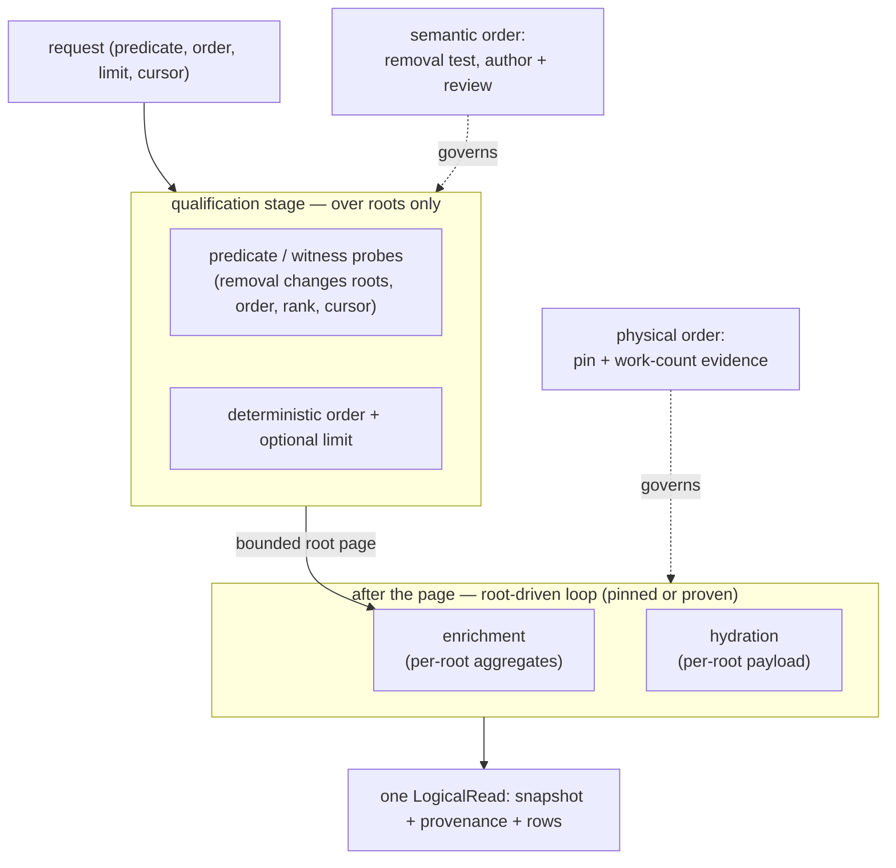

# Pushdown Discipline For Staged Query Operations

## What Is Up

This is the draft2 round of the pushdown wave. [`prompt0.glm53.md`](/.design/pushdown/prompt0.glm53.md)
distilled the wave's implicit question — *when may root qualification,
ordering, and windowing safely precede related aggregation or hydration, and
what evidence makes that placement provable rather than asserted?* — and left
two facts unresolved: the draft1 probes disagreed on whether the IN-seeded
aggregate is bounded (tension 2), and no draft had verified whether predicates
survive the logical-world CTE barriers (key question 7).

This draft answers the prompt from the code and from fresh, independent
measurement rather than from the draft1s. New evidence contributed this round
(all fixtures in [`.test-agent/pushdown2-glm53/`](/.test-agent/pushdown2-glm53/README.md),
Node 26.6.0 / SQLite 3.53.3, authoritative upstream indexes verified against
the upstream schema source):

1. **The tension-2 conflict is reconciled, and it is a compilation detail,
   not engine nondeterminism.** The plain inner join (today's
   `session_activity`) flips between bounded and unbounded on one switch:
   whether the qualified CTE's `LIMIT` is a SQL literal or a `?` parameter.
   Kysely always compiles `.limit(n)` to `limit ?`, so the real history query
   is unbounded. The IN-seeded shape is bounded in *every* indexed fixture I
   could construct — literal or parameterized limit, with or without
   `sqlite_stat1` — and unbounded exactly when the fixture lacks a
   `session_id`-leading index. Both draft1 observations reproduce; they were
   observing different fixture fidelity, not different planners.
2. **The full logical-world CTE wrapper does not change the loop.** The real
   compiled history query, plan-checked through `acquireNodeOpenCodeSource`,
   shows `SCAN session_message` + probe of materialized `qualified_sessions`
   (unbounded) today; the IN-seeded variant is bounded but **re-executes the
   whole qualification** (a second `SCAN session_v2` + temp-B-tree sort inside
   the `LIST SUBQUERY`); the cross-join pin is bounded with a single
   qualification pass and is the fastest of the three.
3. **Predicate propagation through [`world.ts`](/packages/query-kysely/src/relations/world.ts)
   survives.** A `sessionID IN (qualified page)` predicate over
   `cotail_document` validated 168 message payloads against a 30,000-row
   fixture — the page (3 sessions × 6 messages) reached each union branch's
   physical scan. Key question 7's standing fear is retired for index-backed
   root-equality predicates; what does *not* propagate usefully is predicates
   on JSON-extracted columns, which is a cost shape of the logical relations,
   not a pushdown failure.
4. **Session-side qualification cost is confirmed as the named residual**:
   `SCAN session_v2` + `USE TEMP B-TREE FOR ORDER BY` — upstream ships no
   `time_updated` index (verified in the upstream schema source), and Cotail
   opens sources read-only, so nothing can add one.
5. **The recommended pin is expressible and type-clean in the existing
   Kysely world**: `crossJoin` + `whereRef` compiles to SQLite's documented
   never-reordered join form and typechecks under `tsgo --strict`.

The rest of this document converts those facts into the discipline the wave
was opened to produce.

## The Discipline

One rule, one pin, one evidence ladder.

### The two-ordering rule

Every staged operation decides two orderings that are independent (tension 1):

- **Semantic order** — what must be computed *before* the root page is fixed,
  because it determines membership, order, rank, or cursor continuation; and
  what may run *after*, because it only fills in values for roots already
  chosen.
- **Physical order** — which relation drives the loop when related rows are
  touched. A semantically-correct placement can still scan every related row
  ever persisted if the planner picks the wrong driver. Semantic order is
  decided by the author; physical order is decided by construction plus
  evidence.

Green behavioral tests prove neither ordering. That is the founding bug class
and the reason the layers below exist.



### Classification: the removal test

The unit of classification is **the computation**, not the operation or the
stage. An operation author classifies each related-row computation by one
question:

> If this computation were removed, could the set of returned roots, their
> order, their rank, or the cursor continuation change?

- **Yes → qualifying.** It belongs to the qualification stage: predicate,
  order, limit, window-over-roots, and any existence/matching probe into
  related relations that filters roots (direct search's session witnesses are
  the worked example — a frontier that legitimately precedes the page).
- **No, and it produces per-root scalars shared by the page → enrichment.**
  Counts, totals, aggregates. Runs after the page is fixed, joined to the
  bounded root set.
- **No, and it produces per-root payload → hydration.** Per-row detail,
  documents, revisions. Runs last, never affects membership or order.

The classification is recorded per operation as a short table in the
operation file (see below). It is author-applied, review-checked, and encoded
in tests — a decision procedure, not just judgment, because the test suite
pins its conclusions.

### Placement rule

1. Qualifying computations compose one stage over the root relation
   (predicate → deterministic order → optional limit → optional cursor).
   Qualification may probe related relations per candidate root; those probes
   are part of qualification and their cost is page-position-dependent by
   nature.
2. Enrichment and hydration join the **bounded root set only**. No enrichment
   may reference, scan, or group rows belonging to roots the page excludes.
3. Unlimited listing (no limit, no predicate) is legal and means work
   proportional to *all* related rows of *all* returned roots. That is
   semantics, not regression, and the contract says so explicitly.

### Physical pin: the root drives the loop

Semantically-placed enrichment is still not accepted until its loop is
constrained. SQLite's optimizer overview documents that `CROSS JOIN` terms
are never reordered; an inner join's order is a cost-model decision that
moves with cardinality estimates. The measurements behind this:

| construction | bounded? | why | qualification executions |
| --- | --- | --- | --- |
| inner join (current `session_activity`) | **no** (Kysely `limit ?`) | planner picks message-outer scan, probes qualified via automatic index | 1 |
| inner join, literal `limit 3` | yes | planner sees small qualified cardinality — flips with compilation, not semantics | 1 |
| `IN (select … from qualified)` | yes (all indexed fixtures; with/without `sqlite_stat1`) | planner chooses `LIST SUBQUERY` driving index searches — a cost decision that held everywhere measured but is not syntactically constrained | **2** (the IN list re-derives qualification: second `SCAN session_v2` + sort) |
| `qualified CROSS JOIN related ON …` | yes, always (indexed) | documented planner constraint: cross-join order is never reordered | 1 |
| correlated subqueries | yes (2 passes) | per-root probes — banned by the session-report pass for shape, not physics | 1 |

Therefore:

> **Enrichment joins are constructed root-driven**: `FROM qualified_root
> CROSS JOIN related ON related.root_key = qualified_root.root_key` (Kysely:
> `.crossJoin(...).whereRef(...)`), or an IN-seed where a pin is not
> expressible — accepting the extra qualification pass and recording it.
> Relying on the planner to flip an inner join is not an accepted
> construction: its boundedness is an estimate, and estimates move with
> compilation details the project does not control (the literal-vs-parameter
> LIMIT flip is the measured proof).

The pin requires a `session_id`-leading index on the related physical table
to be more than a full scan; upstream ships them (`session_message
(session_id)`, `(session_id, type)`; the 9306ac69-era schema had
`(session_id, seq)`), so the pin's prerequisite is an upstream fact, watched
by the conformance suite, not assumed.

### Evidence ladder: what carries the guarantee

| layer | carries | failure mode | version behavior |
| --- | --- | --- | --- |
| behavioral tests | correctness of values, order, zero-row cases | wrong results | stable |
| compiled-SQL seam assertions | construction present: pin, one grouped aggregate, no correlated counts | construction drift | stable |
| EQP structural assertions | loop direction: `SCAN qualified_sessions` + `SEARCH session_message … (session_id=?)`, no `SCAN session_message` in the aggregate subtree | plan drift, fail-loud | wording-sensitive; semantic-token matching, version-stamped |
| work-count scaling fixture | **the guarantee**: visits grow with page × per-root rows, not with total data | silent unboundedness | portable — measures the property, not the plan text |
| benchmarks | advisory, manual | slow drift | n/a |

The load-bearing layer is the **work-count scaling fixture**: authoritative
schema (indexes included), two scales (N and 4N unrelated rows), a test-only
counting SQL function whose injection is verified not to change the plan
(EQP-diff with and without the probe term — the answer to tension 6:
instrumentation is admitted only after proving it did not move the
measurement). Wall-clock ratios are advisory; EQP assertions are the
fail-loud tripwire that tells you *which* construction drifted; the work
count is the property itself.

Mechanically this needs one small runtime seam: a test-only hook on
`NodeOpenCodeSourceConfig` to register additional SQL functions on the
read-only adapter (the pattern already exists for `regexp` and
`cotail_validate_message`, and `acquireNodeOpenCodeSourceForTest` already
exposes test hooks). That plus an indexed-fixture builder and one assertion
helper is the entire machinery this discipline adds — all test-side, nothing
in production code paths.

### Where enforcement lives

- **Construction** (operation code): visible and duplicated. Each operation
  shows its stages inline; no shared builder, no typed stage vocabulary yet.
  Duplication keeps the reason a limit may move readable at each site — the
  history regression was caused by an inherited shape preference outranking
  physical outcomes, and any codified shape (including "staged CTEs") can
  become tomorrow's false virtue (tension 4). The rule and its evidence stay
  about *work*, not SQL text.
- **Conformance** (package tests): every staged operation ships all four
  layers above. This is the per-operation acceptance gate; it is also how
  planned operations (FTS, lineage, watch, bookmarks, events) inherit the
  contract — they cannot land without their own evidence, so no
  forward-promise is needed.
- **Review** (checklist): root? classification table? pin-or-proof for each
  enrichment? evidence present? residual costs named?

The institutional answer to "the operations own it" is therefore: placement
is owned in construction, guarantee is owned in conformance, classification
is owned at review, and none of the three is trusted alone.

### The classification table (the review artifact)

Each staged operation carries a comment block of exactly this shape:

```text
pushdown classification:
  root: cotail_session
  qualifying: predicate (sessionUpdatedRange), order (updatedAt desc, sessionID desc), limit
  enrichment: session_activity counts (removal changes no membership/order)
  hydration: decodeSessionReport
  residual: qualification scans and sorts all session_v2 rows (no upstream time_updated index)
```

For direct search the same table reads: qualifying = session predicate,
witness `forSession` existence probes, cursor, order, `sessions.first`;
enrichment = `matching_documents`, `ranked_documents` window,
`session_hits` truncation; hydration = evidence message join and decode;
residual = witness probes are position-dependent during qualification, and
the document world expands JSON per visited message.

## The Accepted History Rewrite

Change `session_activity` in [`history.ts`](/packages/query-kysely/src/operations/history.ts)
to the root-driven pin — the only diff in the CTE:

```ts
.with("session_activity", (qb) => qb.selectFrom("qualified_sessions")
  .crossJoin("cotail_message")
  .whereRef("cotail_message.sessionID", "=", "qualified_sessions.sessionID")
  .select((eb) => [
    "qualified_sessions.sessionID",
    eb.fn.countAll<number>().as("messagesTotal"),
    sql<number>`sum(case when ${eb.ref("cotail_message.createdAt")} >= ${request.since} then 1 else 0 end)`
      .as("messagesSince"),
  ])
  .groupBy("qualified_sessions.sessionID"))
```

Measured on the indexed fixture (full world wrapper, 5,000 sessions × 6
messages, page 3): 8.7ms → 3.1ms, counts byte-identical
(`[["ses_4999",6,6],["ses_4998",6,6],["ses_4997",6,6]]`), zero-message
Sessions unaffected (the outer left join is untouched), one grouped
aggregate preserved, `MATERIALIZE qualified_sessions` once.

Decisions on the inherited questions:

- **"One grouped aggregate rather than correlated counts" survives intact.**
  The pinned shape is still exactly one grouped aggregate. What the criterion
  never licensed was reading it as a ban on join *syntax* or as outranking
  work placement. For honesty: the correlated form was also physically
  bounded (60 visits vs 30) — the criterion's value was decode simplicity,
  not physics, and it should be cited that way from now on.
- **`--limit 0` stays as-is**: API rejects non-positive limits (zero never
  means unlimited); the CLI already maps `0` to "omit". Unlimited listing is
  the legal all-roots case named in the placement rule.
- **Keyset cursor: recommended as a small follow-up, not in this rewrite.**
  The order key (`updatedAt` desc, `sessionID` desc) is already
  cursor-compatible and identical to direct search's. An `after
  {updatedAt, sessionID}` request field is ~10 lines plus tests, but the
  blocked ticket's acceptance is canonical form plus bounded work; bundling
  cursor semantics into it re-opens settled request-shape questions. File it
  separately on `cotail-session-report-history` once the rewrite lands.
- The existing compiled-SQL and plan tests are *extended*, not replaced:
  assert `cross join` present, one `group by`, zero correlated count
  subqueries (existing), plus the EQP loop assertions and the scaling
  fixture (new).

## Honesty About Boundedness

The contract promises **per-stage boundedness with named residuals**, never
total boundedness:

- **Qualification**: O(all sessions) scan + sort. Unavoidable today —
  upstream has no `time_updated` index and Cotail opens sources read-only
  (it cannot create even a temporary index). Revisit if upstream ever ships
  one; the conformance fixture would catch the improvement opportunity the
  same way it catches regressions.
- **Enrichment/hydration**: O(returned roots × their related rows), via
  `session_id`-leading upstream indexes. The pin's prerequisite.
- **Unlimited/predicate-free requests**: work ∝ all related rows of all
  returned roots — by semantics.
- **Direct search**: same stage rule, plus its two named residuals above.
  Its conformance backfill (EQP + work-count with document-world validation
  counting) is a required follow-up but does not block history: the world
  propagation measurement in this draft already covers the shared risk.

## The Logical World Barrier

Verified this round where previous drafts only asserted: root-equality
predicates (`sessionID IN (page)`) propagate through the `cotail_document`
union and the validation CTE down to per-branch physical scans (168 of
30,000 message payloads validated for a 3-session page). No separate audit
wave is needed; fold one such propagation assertion (via
`onPayloadValidation` counting) into the conformance suite. What remains
inherently unbounded-by-construction is predicate/filter work on
JSON-extracted columns and computed keys (`documentKey`) — the cost shape of
JSON-expansion relations, to be handled per-operation when an operation
actually needs such a filter (planned FTS is the likely first customer).

## Acceptance Line And Revisit Triggers

Accept the discipline **now**, gated on landing three things:

1. indexed authoritative-schema fixture as the test default — today's
   [`opencode-v2.ts`](/packages/query-kysely/test/fixtures/opencode-v2.ts)
   fixture ships *no* `session_message` indexes at all, so the suite has been
   reasoning about a physical layout upstream cannot produce;
2. the pinned history rewrite with all four evidence layers green;
3. the runtime test-hook for work-count functions (mechanical, test-only).

Direct-search backfill follows; per-operation gating then runs itself. The
discipline is revisited — the specific part named — when:

- a **third staged operation** conforms, or two operations share identical
  stage semantics → extract the shared qualified-root builder (the recorded
  abstraction trigger; until then duplication is the safety feature);
- **upstream schema changes** (index added/removed) → rerun the fixture
  matrix (scripted, minutes);
- a **Node/SQLite bump** lands → rerun the matrix on the new engine; EQP
  assertions are expected to need wording updates and that is acceptable —
  the work-count layer is the portable guarantee;
- any **CI tripwire fires** (EQP mismatch, work-count growth) → the
  construction changed under us; re-probe before patching the assertion.

## Deliverable Checklist

Mapped against [`prompt0`](/.design/pushdown/prompt0.glm53.md)'s "What We Are Looking For":

1. *Place and justify per operation* — removal test + classification table
   (author artifact, review-checkable).
2. *Provable boundedness with a stated load-bearing layer* — work-count
   scaling fixture load-bearing; EQP fail-loud; seam advisory; version
   behavior named.
3. *Authorities intact* — one `LogicalRead` snapshot/provenance, Kysely as
   the query language, no second algebra, physical behind logical: the
   rewrite changes one CTE and adds only test-side machinery.
4. *Unblock history with an accepted rewrite* — pinned `session_activity`,
   equal results, inherited criterion re-read not discarded.
5. *Named residual costs* — qualification scan, world JSON cost shape,
   unlimited semantics.
6. *Revisit triggers* — enumerated above, each pointing at the part it
   reopens.

## Cross-References

- [The implicit question of the pushdown wave](/.design/pushdown/prompt0.glm53.md) — the
  prompt this draft answers; source of the tensions and key questions
  addressed here.
- [draft0](/.design/pushdown/draft0.gpt56.md), [draft1.gpt56](/.design/pushdown/draft1.gpt56.md),
  [draft1.glm53](/.design/pushdown/draft1.glm53.md), [draft1.oxa2](/.design/pushdown/draft1.oxa2.md) — wave
  siblings, cited via the prompt's neutral catalog; not read for
  independence (their probe conflicts are reconciled by fresh measurement
  above).
- [Canonical Session operation pass](/.design/session-report/full-query-pass0.gpt56.md)
  — origin of the "one grouped aggregate" criterion whose correct reading
  this draft fixes (intent: no correlated counts; not a join-syntax rule).
- [V2 relational query world](/.design/query/design3.gpt56.md) and [scoped
  execution](/.design/query2/design2.gpt56.md) — the authority split and
  one-read guarantees every stage placement must preserve.
- [history.ts](/packages/query-kysely/src/operations/history.ts),
  [direct-search.ts](/packages/query-kysely/src/operations/direct-search.ts),
  [world.ts](/packages/query-kysely/src/relations/world.ts),
  [node-sqlite.ts](/packages/query-kysely/src/runtime/node-sqlite.ts) — the
  governed surfaces.
- [Upstream schema and indexes](https://github.com/anomalyco/opencode/blob/storage-v2-service/packages/opencode/src/session/session.sql.ts)
  — authoritative index facts the pin's prerequisite and the qualification
  residual depend on.
- [Probe fixtures and captured results](/.test-agent/pushdown2-glm53/README.md)
  — every measurement quoted in this document.
