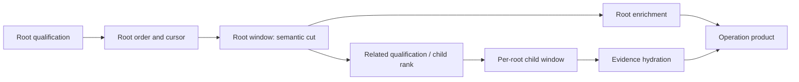

# Semantic Cuts And Physical Certificates For Query Pushdown

## Decision

Cotail should govern pushdown at the **domain-operation boundary** with two
artifacts owned by each cardinality-bearing operation:

1. a **semantic cut** that states which work must happen before the root window
   and why; and
2. a **physical certificate** that proves the implemented query reaches
   post-window relations from the selected roots rather than scanning those
   relations globally.

The semantic cut is a property of the product. The physical certificate is a
property of one SQL construction, source-index contract, and supported SQLite
version range. Neither substitutes for the other.

This is a discipline for operation construction and conformance, not a new
query algebra. Operations continue to build Kysely statements over logical
relations and execute one statement in one `LogicalRead`. Cotail should not add
a shared qualified-root builder or typed stage framework in this pass.

For Session history, accept a qualified-root-first `CROSS JOIN` aggregate:

```sql
WITH qualified_sessions AS (
  SELECT sessionID
  FROM cotail_session
  WHERE <Session predicate>
  ORDER BY updatedAt DESC, sessionID DESC
  LIMIT :page_size
),
session_activity AS (
  SELECT m.sessionID,
         count(*) AS messagesTotal,
         sum(CASE WHEN m.createdAt >= :since THEN 1 ELSE 0 END) AS messagesSince
  FROM qualified_sessions AS q
  CROSS JOIN cotail_message AS m
  WHERE m.sessionID = q.sessionID
  GROUP BY m.sessionID
)
SELECT <Session report>,
       coalesce(a.messagesTotal, 0),
       coalesce(a.messagesSince, 0)
FROM qualified_sessions AS q
JOIN cotail_session AS s ON s.sessionID = q.sessionID
LEFT JOIN session_activity AS a ON a.sessionID = q.sessionID
ORDER BY s.updatedAt DESC, s.sessionID DESC;
```

In Kysely, the load-bearing construction is that `session_activity` starts from
`qualified_sessions`, then uses `crossJoin("cotail_message")` and an explicit
equality predicate. SQLite documents `CROSS JOIN` as a loop-order constraint:
the qualified page is the outer input. The certificate must additionally prove
that the inner Message access is an indexed `session_id` search. `CROSS JOIN`
alone would permit a full Message scan once per selected Session if the index
precondition disappeared.

The inherited requirement for one grouped aggregate survives because this
shape still has one. It survives as an observed implementation property, not as
the governing virtue. If a future supported engine cannot execute this grouped
shape with page-driven indexed probes, bounded work outranks aggregate count.

## The Semantic Cut

### Classification test

Classify each related computation in the context of one operation by asking:

> If this computation were removed or replaced by a neutral value, could the
> selected root identities, their order, rank, or cursor continuation change?

If yes, it is **qualifying work** and belongs before the root window. If no, it
is **root enrichment** or **hydration** and belongs after the root window.

This test is applied to computations, not whole relations and not whole
operations. The same relation can participate on both sides. For example, an
`EXISTS` over Messages may qualify Sessions before the page while Message
counts and excerpts enrich those selected Sessions afterward.

There can also be a child-local cut after the root page. Work that determines
child membership, child rank, or a per-root child limit must precede that child
window even though it follows the root window. The useful model is therefore a
partial order, not a universal list of named stages:



Edges are operation-specific. A count used only in output follows `ROOTW`; the
same count used in root ordering precedes `ROOTO`. A witness that decides
whether a Session exists in direct-search results precedes `ROOTW`; loading the
matching evidence rows follows it.

### Review statement

Each operation with a root or child window should keep a short statement beside
its query or conformance test naming:

- the result root and deterministic order;
- the qualifying computations before each window;
- the post-window enrichment or hydration;
- any requested global limit and what it is allowed to truncate; and
- residual work intentionally not bounded by the window.

This is not an annotation schema. Ordinary prose remains preferable while only
history and direct search provide concrete staged examples. The statement makes
the reason for placement reviewable without hiding it behind reusable builder
names.

## The Physical Certificate

### What carries the guarantee

Acceptance is conjunctive. An operation is conforming only when all applicable
load-bearing checks pass:

| Check | Property proved | Role |
|---|---|---|
| Behavioral fixtures | Moving the cut did not alter roots, order, cursors, zero-related roots, counts, or evidence | Load-bearing semantic evidence |
| Compiled-SQL shape | The intended cut and loop-order constraint were emitted; no alternate unbounded aggregate remains | Load-bearing construction evidence |
| Source-index validation | The physical relation has a usable index with the join key as its leading column | Load-bearing precondition |
| Structural `EXPLAIN QUERY PLAN` check | The supported engine actually drives related-row access from qualified roots using keyed searches | Load-bearing physical evidence |
| Bounded-growth fixture | Increasing unrelated related rows does not materially increase measured work | Corroborating evidence; required in the dedicated performance suite when a stable work counter exists |
| Wall-clock benchmark | Detects large practical regressions and compares alternatives | Advisory; never a correctness gate by itself |

The physical certificate is intentionally fail-closed. If a supported SQLite
upgrade changes plan vocabulary enough that the structural matcher cannot
classify the plan, conformance fails until the matcher and bounded-growth result
are reviewed. A noisy engine-upgrade failure is preferable to a silent global
scan.

### Structural plan checks

Tests should classify plan rows into concepts rather than snapshot every detail
string. For history, the accepted plan must establish all of the following:

1. `qualified_sessions` is materialized once.
2. The activity subtree visits the qualified relation before Message access.
3. Message access is `SEARCH`, not `SCAN`.
4. The search constrains the leading `session_id` key.
5. There is no second Message scan or correlated Message subquery elsewhere.

SQLite plan text is not a cross-version standard, but it is direct evidence
from the engine Cotail supports. Keep version-specific classifiers small and
run them against every supported Node/SQLite pair. Do not weaken an unknown
plan to a warning.

### Index contract

Current OpenCode declares these Message indexes:

- unique `(session_id, seq)`;
- `(session_id, type, seq)`;
- `(session_id, time_created, id)`; and
- `(time_created)`.

History needs only the semantic precondition “a usable index begins with
`session_id`.” Source validation should inspect `PRAGMA index_list` and
`PRAGMA index_info` and validate that precondition, rather than couple the query
to one generated index name with `INDEXED BY`.

This matters because the repository's current test fixture creates only table
primary keys. A plan fixture that omits authoritative indexes cannot certify
production behavior. Add query-critical indexes to a plan-specific fixture;
do not silently make every behavioral fixture a full copy of upstream schema.

### Why work-count functions are secondary

A function evaluated in an aggregate expression counts rows that reached the
aggregate. It does not count Message rows scanned and then rejected by a lookup
against `qualified_sessions`. Such a probe can report five selected Sessions'
Messages while the engine still traverses every Message row.

Moving the function into a join predicate may expose visits but can also make
the predicate non-sargable or change join order. Therefore SQL-function probes
are useful diagnostics only when their relationship to the uninstrumented plan
is demonstrated. If Cotail later gains a stable VM-step or full-scan counter
from the native statement interface, bounded-growth checks can become an
additional load-bearing gate. Timing ratios should remain benchmarks because
host noise is unrelated to the semantic property.

## Reconciling The `IN` Result

An independent Node 26.6.0 / SQLite 3.53.3 probe tested ordinary join,
qualified-root-first `CROSS JOIN`, `IN (SELECT ...)`, and correlated forms with
all authoritative Message indexes.
It varied Message density and ran before and after `ANALYZE`.

Observed in every tested case:

- the ordinary join scanned the complete covering Message index and probed the
  five-row qualified relation;
- `CROSS JOIN` scanned the qualified page and searched Messages by
  `session_id`;
- `IN` used a list subquery and searched Messages by `session_id`; and
- the correlated form searched Messages by `session_id` once per qualified
  root.

This resolves neither prior observation as universally wrong. It establishes
that the `IN` form *can* produce the desired loop and that a result claiming it
cannot is fixture- or compilation-sensitive. That sensitivity is precisely why
`IN` should not be the accepted contract: it states membership but does not
constrain loop order. `CROSS JOIN` expresses the physical dependency directly,
while the index check and plan classifier verify the remaining assumptions.

The probe and output live under
[`.test-agent/pushdown-draft2-sol`](/.test-agent/pushdown-draft2-sol/README.md).
It is evidence for this decision, not a substitute for a conformance test over
the exact Kysely-compiled logical query.

## Accepted History Contract

### Semantics

For `readSessionHistory`:

- `SessionPredicate` affects root membership only.
- Root order is `updatedAt DESC, sessionID DESC`.
- The optional positive `limit` cuts that ordered root set.
- `messagesTotal` and `messagesSince` are output enrichment and cannot affect
  root membership or order.
- Sessions with no Messages remain present with zero counts.
- `since` is inclusive.
- `limit: 0` remains invalid; omission means unlimited.

No cursor exists in the current request. If history gains keyset pagination,
the cursor predicate belongs before root order/window and its boundary behavior
must be tested with tied timestamps.

### Cost claim

The accepted claim is deliberately stage-specific:

```text
Session qualification:
  O(all Sessions + ordering cost), because upstream has no useful updatedAt index.

Message enrichment:
  O(page size + Messages owned by selected Sessions), using indexed session_id probes.

Final assembly:
  O(page size).
```

Cotail must not call the entire operation bounded by page size. The design fixes
the accidental all-Message scan; it does not fix Session ordering on a read-only
source. Unlimited history intentionally has no bounded-enrichment claim because
the selected root set is the full qualified set.

### Required history tests

The history rewrite is accepted when tests cover:

1. behavioral equality for predicates, tie order, limits, inclusive `since`,
   variant counts, and zero-Message Sessions;
2. compiled SQL with qualified roots first, `CROSS JOIN`, one grouped aggregate,
   and counts left-joined to the root page;
3. a production-faithful plan fixture containing a leading-`session_id`
   Message index;
4. a plan certificate showing qualified-root outer access and indexed Message
   searches; and
5. a skewed fixture where many unrelated Messages exist, so accidental global
   scans are visible in the plan and benchmark.

The current test assertion that the aggregate merely mentions
`qualified_sessions` is insufficient. A full Message scan followed by a lookup
into that relation satisfies it.

## Enforcement Boundary

### Now

Keep SQL construction operation-private. Add only small test-side utilities for
classifying plan rows if history and direct search can share them without
erasing operation-specific expectations.

The division of responsibility is:

| Authority | Responsibility |
|---|---|
| Domain operation | Defines roots, order, cursors, windows, and semantic cuts |
| Kysely statement | Expresses those cuts and any deliberate SQLite loop constraint |
| Source adapter | Validates query-critical physical index preconditions |
| Conformance suite | Certifies behavior, emitted construction, and supported-engine plan |
| Benchmark suite | Reports scaling and catches practical regressions without defining correctness |
| `LogicalRead` | Preserves one snapshot, provenance, and execution lifecycle across the statement |

Kysely cannot infer product semantics. SQLite cannot infer which cost growth is
acceptable. `LogicalRead` should not gain either responsibility.

### Later abstraction trigger

Reconsider a shared construction only after a third implemented operation has
passed this discipline and at least two operations duplicate the same semantic
cut *and* physical certificate. Mere repetition of CTE syntax is not enough.

At that point, extract the smallest repeated seam, likely a conformance helper
or root-page table contract. Do not begin with a typed stage vocabulary. A
builder is legitimate only if reviewers can still see why each computation is
on its side of the cut and each operation can state stronger plan requirements.

Reopen the physical choice sooner if:

- a supported SQLite version fails the certificate;
- OpenCode removes or changes the leading-`session_id` index contract;
- a native work counter becomes available;
- an upstream Session ordering index removes the named residual cost; or
- measurements show repeated root probes have a material disadvantage to a
  different equally certifiable shape.

## Direct Search And The Logical World

The discipline applies through logical relations, but this wave should not try
to prove global predicate propagation through every CTE in `world.ts`. Such a
proof would be both larger than history and misleading: unions, JSON expansion,
validation functions, and windows have different barriers, and unused CTEs may
be pruned.

Instead, certify the exact relation path used by each operation:

- Direct search correctly treats witness existence as qualifying work before
  its Session window and evidence ranking/hydration as later work semantically.
- It still needs its own physical certificate over `cotail_document`, including
  each relevant union branch and JSON-expansion barrier.
- That audit should be a separate follow-up and should gate any claim that
  direct search is physically bounded; it need not block the history repair.
- Future FTS, lineage, watch, bookmark, and Event operations inherit the
  discipline only when implemented. They cannot claim conformance from a design
  table without executable evidence.

Logical relations remain the public query world. An arbitrary caller using that
world receives relational correctness, not operation-level cardinality or cost
guarantees. Physical certificates belong only to named domain operations whose
products define roots and windows.

## Acceptance Summary

This resolution draws a narrow but enforceable line:

- place work by the semantic neutralization test;
- express the root window as an operation-owned cut;
- constrain history's loop with qualified-root-first `CROSS JOIN`;
- validate a leading-`session_id` Message index;
- fail closed unless the supported engine plan shows indexed Message searches;
- use behavioral tests for semantics and benchmarks as corroboration;
- report Session qualification as a residual global cost; and
- defer shared builders, stage types, and a whole-world barrier audit until
  concrete operations justify them.

The guarantee is not that SQLite always pushes predicates down. It is that each
accepted operation states what must be bounded, constructs a query that makes
the intended dependency explicit, and carries executable evidence for the
engine and source schema Cotail actually supports.

## Cross-References

- [The pushdown prompt](/.design/pushdown/prompt0.glm53.md) defines the semantic,
  physical, and institutional questions answered here.
- [Cotail V2 relational query world](/.design/query/design3.gpt56.md) establishes
  Kysely logical relations and the distinction between arbitrary queries and
  operation-owned products preserved by this design.
- [Scoped query execution](/.design/query2/design2.gpt56.md) owns the single
  snapshot and provenance contract; the pushdown discipline deliberately stays
  outside it.
- [Canonical Session operation pass](/.design/session-report/full-query-pass0.gpt56.md)
  defines history semantics and the grouped-aggregate criterion retained here
  only while it remains physically sound.
- [History implementation](/packages/query-kysely/src/operations/history.ts)
  contains the join whose SQL text is staged but whose current plan scans all
  Messages.
- [History tests](/packages/query-kysely/test/history.test.ts) contain the
  behavioral coverage and the plan assertion that must be strengthened from
  relation presence to loop direction and indexed access.
- [Direct search](/packages/query-kysely/src/operations/direct-search.ts) is the
  first qualifying-frontier operation and the next candidate for its own
  certificate.
- [Logical relation world](/packages/query-kysely/src/relations/world.ts) is not
  globally certified; each operation must prove the exact union, JSON, and
  validation path it uses.
- [Independent plan probe](/.test-agent/pushdown-draft2-sol/README.md) records the
  candidate comparison used to adjudicate the `IN` disagreement without making
  `IN` part of the contract.
