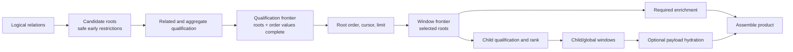

# Demand-Bounded Operation Planning With Certified Access Paths

## Decision

Cotail domain operations should preserve semantic dependencies first, then
drive every downstream relation from the smallest identity set already fixed by
the product, and certify the resulting SQLite access path against a declared
source performance profile.

Each operation with nontrivial cardinality owns five things:

1. a **result root** whose membership, order, cursor, and page size the product
   promises;
2. a **qualification frontier** after every fact that can alter root membership
   or order is known;
3. a **window frontier** after deterministic order, cursor, and page size choose
   the returned roots;
4. a **demand graph** that places required enrichment and optional hydration
   after the narrowest root or child identities that can drive them; and
5. a **physical certificate** proving the expected access path on each supported
   source and runtime profile.

The compact rule is:

> Restrict candidates whenever semantics permit. Complete qualification before
> windowing. After each window, drive downstream work from the smallest selected
> identity set, and state exactly which dimensions bound its cost.

This is broader than conventional predicate pushdown. It governs the placement
of qualification, ordering, root and child windows, aggregation, JSON expansion,
evidence enumeration, and payload hydration across relational barriers.

The discipline belongs to operation-private Kysely construction, review, and
conformance. It does not add a second query AST, generic stage types, or an
optimizer promise to the public logical query world. Arbitrary logical Kysely
queries retain relational correctness without an operation-level cost envelope.

For history, accept the qualified-root-first `CROSS JOIN` aggregate. For direct
search, preserve witness qualification before the Session window, but introduce
safe candidate restriction and defer evidence payload hydration until selected
hits are known.

## Semantic Planning

### Result root

The result root is the identity whose membership and order the operation
promises. It is semantic, not the first relation named in SQL.

- History and direct Session search have Session roots.
- A future Message search may have Message roots even if the product groups them
  beneath Sessions.
- Child usage may have Session or lineage-node roots depending on whether the
  product pages starting Sessions or traversal results.

Every operation with a window must name its root explicitly. Without a root,
“push the limit down” has no defined subject.

### Classification test

Classify each computation, not each relation or operation, by asking:

> If this computation were removed or replaced by a neutral value, could root
> membership, root order, rank, cursor continuation, or request validity change?

If yes, the computation is **qualifying**. It must complete before the
qualification frontier. Examples include:

- root predicates and capability gates;
- document witness existence;
- FTS match, rank, freshness, and authoritative recheck;
- `HAVING` predicates and aggregate-derived order;
- descendant existence when it selects roots; and
- any value encoded into a keyset cursor.

If no, the computation is downstream demand:

- **required enrichment** produces fields necessary for every result, such as
  history counts or truthful direct-search truncation totals;
- **optional hydration** loads mode-dependent payloads, excerpts, revisions, or
  evidence objects.

The same physical relation may appear on both sides. A Message existence probe
can qualify Sessions while Message counts enrich the selected page afterward.

### Candidate restriction

Complete qualification need not begin from every possible root. Root-local facts
that do not depend on related qualification may safely form an unwindowed
candidate set before expensive work.

For direct search, a directory predicate and an `(updatedAt, sessionID)` keyset
boundary can restrict candidate Sessions before document witnesses run. The
Session page limit cannot move there: nonmatching candidates could consume the
limit and hide later matching Sessions.

This yields three distinct questions:

1. What can safely reduce the candidate universe?
2. What remaining work must establish complete root membership and order?
3. Where may the root page finally be cut?

Predicate order inside one `WHERE` clause does not prove candidate restriction.
When its cost matters, the operation needs a visible candidate-identity stage
and plan evidence showing those identities reach the expensive relation path.

### Two frontiers

The **qualification frontier** is reached when complete root identities and all
ordering/cursor values are known. No downstream computation may change them.

The **window frontier** applies deterministic order, keyset semantics, and page
size. Every order requires a stable identity tie-breaker. Final product assembly
must reapply order because CTE order is not inherited through later joins.



An operation may omit or combine stages. The frontiers describe semantic facts,
not mandatory CTE names.

### Narrowest-identity demand rule

Post-window work must begin after the narrowest identity selection that can
drive it correctly:

- Session counts follow selected Session IDs.
- Per-Session document ranking follows selected Session IDs.
- Evidence payload hydration follows selected document or Message hits, not all
  matching documents.
- Revision hashing follows only evidence rows actually returned.
- Usage aggregation follows only reached lineage-node IDs.

Dropping a hydrated value in TypeScript does not omit its SQL work. When a mode
does not request evidence, its payload joins, source JSON columns, hashing
inputs, and decoding should be absent unless measurements show that branching
would cost more than it saves.

Child and global windows create additional semantic cuts. Work needed to rank or
count children precedes the relevant child window; payload hydration follows it.

## Cost Envelopes

“Bounded” must always say **by what**. Every operation records its dominant work
dimensions and named residuals rather than claiming that total cost is bounded
by returned rows.

| Operation | Honest cost envelope on the indexed source profile |
|---|---|
| History | Session qualification scans and sorts the qualifying Session population without a matching recency index. Message enrichment visits Messages owned by the selected Session page through owner-key probes. |
| Direct search | Root-local predicates may restrict candidate Sessions. Witness qualification follows the remaining searchable document universe. Post-window ranking and totals inspect matching documents for selected Sessions. Payload hydration follows selected hits and only runs in evidence mode. |
| Exact Session lookup | One primary-key Session probe plus report decoding. |
| Session listing | Session predicate and order cost follows available Session indexes; no related-row fan-out. |
| Child usage | Traversal is constrained by starting roots and explicit depth but still grows with descendant fan-out; usage aggregation visits reached Sessions only. |
| Future FTS | Index work follows the match/rank candidate set; live recheck follows explicit over-fetch; payload hydration follows selected evidence. |

For fixed selected identities and fixed related rows owned by them, unrelated
related rows must not make downstream enrichment or hydration grow
proportionally on a certified source profile.

Unlimited requests are honest exceptions. If every qualified root is returned,
related work over every returned root is required by semantics rather than a
pushdown regression.

## Physical Certificates

Semantic placement does not determine SQLite loop order. A CTE and owner-key
join can exclude unrelated rows from returned aggregates while still visiting
every unrelated row. Each cost-bearing operation therefore needs a physical
certificate for the exact compiled logical query.

### Evidence hierarchy

| Evidence | What it proves | Status |
|---|---|---|
| Behavioral and metamorphic fixtures | Roots, order, cursors, zero-related roots, values, and mode semantics are unchanged | Load-bearing semantic evidence |
| Compiled-SQL assertions | Candidate/frontier placement, deliberate loop constraint, omitted hydration branches, and no alternate broad aggregate | Load-bearing construction evidence |
| Source performance profile | Required indexes and compatible key layout exist | Load-bearing precondition for the indexed envelope |
| Structural `EXPLAIN QUERY PLAN` | The supported engine drives each expensive relation from the intended identity set using the required access method | Load-bearing physical evidence |
| Stable native work counter | Fixed-demand work does not grow with unrelated data | Load-bearing when a common, plan-neutral metric becomes available |
| SQL-function probes | Instrumented-shape diagnostics | Corroborating only |
| Wall-clock scaling | Practical regression comparison | Advisory only |

The certificate fails closed on supported runtimes. If plan output cannot be
classified after a Node/SQLite upgrade, conformance fails until the access facts
and matcher are reviewed. Unknown plan vocabulary is not silently downgraded to
a warning.

### Why current SQL probes are not the guarantee

Existing `tap()` experiments illuminate the bug but do not count one symmetric
unit across every variant. A function in an aggregate expression sees rows that
reach aggregation, not rows scanned and rejected earlier. A function wrapped
around an indexed column can make a predicate non-sargable and alter the plan.

Proving that instrumented and uninstrumented queries have similar `EXPLAIN`
output reduces this risk but does not produce a common row-visit metric. Until
the execution layer exposes SQLite VM steps, full-scan steps, or statement-status
counters without changing the statement, structural indexed-access evidence is
the deterministic physical gate. Keep fixed-demand scale benchmarks for
investigation and trend detection.

### Plan classifiers

Tests should classify local access facts, not snapshot complete plan text. A
classifier may be version-specific but should express semantic tokens such as:

- materialize or co-routine the selected identity set once;
- selected roots precede related access in the relevant subtree;
- related access is `SEARCH`, not `SCAN`;
- the search constrains the owner key as the leading key;
- no duplicate broad scan appears elsewhere; and
- no automatic index is mistaken for the certified persisted-index profile.

Run these checks on every supported Node/SQLite lane. Record accepted residuals,
such as Session scan plus temporary order B-tree, separately so they are not
confused with regressions.

## Source Profiles

Source correctness and performance compatibility are different contracts.

### Minimal compatible profile

A minimal profile has the required tables, columns, migration state, and Message
variants. It is sufficient for relational correctness, malformed-source tests,
and arbitrary logical queries. It may lack indexes needed for a certified domain
operation cost envelope.

### Indexed operation profile

The initial indexed profile requires an ordinary, universally usable index on
`session_message` whose first key is plain `session_id` with compatible
collation. Current OpenCode supplies several such indexes, including:

- unique `(session_id, seq)`;
- `(session_id, type, seq)`; and
- `(session_id, time_created, id)`.

Source acquisition should inspect `PRAGMA index_list` and `PRAGMA index_xinfo`.
A partial index, expression key, or incompatible collation does not certify the
profile merely because its SQL mentions `session_id`.

Expose the result in source capabilities and diagnostics as an indexed or
degraded Message-owner lookup profile. Missing performance indexes should not
masquerade as an indexed guarantee or necessarily make otherwise valid history
unreadable. Domain-operation cost claims are conditional on the indexed profile;
CLI execution on a degraded profile should make that degradation visible.

This separates three outcomes:

1. incompatible source: refuse acquisition;
2. compatible and indexed source: execute with the certified envelope;
3. compatible but degraded source: execute correctly under a named degraded
   envelope and surface the loss of certification.

The exact user-facing degraded diagnostic belongs to source-runtime design, but
silence is not an acceptable outcome.

### Fixture profiles

Maintain two explicit fixture families:

1. a minimal schema fixture for correctness, migration, malformed-source, and
   degraded-profile behavior; and
2. a supported indexed fixture for operation plan conformance.

Record the canonical upstream schema revision beside the indexed fixture and
refresh it deliberately when OpenCode changes migrations. Do not make every
small behavioral fixture duplicate the complete production index set.

## Accepted History Design

### Semantic placement

History's root is Session. Membership and order depend on the Session predicate
and `(updatedAt DESC, sessionID DESC)`. `messagesTotal` and `messagesSince` are
required enrichment: replacing them with neutral values cannot alter selected
Sessions or their order.

The root window may therefore precede Message aggregation. Preserve:

- deterministic Session order;
- inclusive `since` semantics;
- zero-Message Sessions with zero counts;
- one read scope and provenance value;
- positive safe-integer API limits; and
- omission as the API representation of unlimited history.

The CLI currently treats `--limit 0` as omission/unlimited before calling the
operation. Preserve that translation in this repair. Changing it is a separate
CLI contract decision.

Do not add keyset pagination to the history repair. A future cursor belongs in
qualification before the root window and should be designed separately.

### Physical construction

Build the grouped aggregate from the selected roots and prevent SQLite from
reversing that dependency:

```ts
.with("session_activity", (qb) => qb
  .selectFrom("qualified_sessions")
  .crossJoin("cotail_message")
  .whereRef(
    "cotail_message.sessionID",
    "=",
    "qualified_sessions.sessionID",
  )
  .select((eb) => [
    "cotail_message.sessionID",
    eb.fn.countAll<number>().as("messagesTotal"),
    sql<number>`sum(case when ${eb.ref("cotail_message.createdAt")} >= ${request.since} then 1 else 0 end)`
      .as("messagesSince"),
  ])
  .groupBy("cotail_message.sessionID"))
```

SQLite documents `CROSS JOIN` as a loop-order constraint. Kysely expresses the
equality separately because `crossJoin` has no `ON` clause. Relationally this is
still an inner equijoin; physically the selected Session page is the outer loop.

The accepted indexed plan is:

```text
MATERIALIZE qualified_sessions
SCAN qualified_sessions
SEARCH session_message ... (session_id=?)
```

Left-join counts back to selected Sessions and coalesce absent groups to zero.
Reapply final Session order.

The inherited one-grouped-aggregate criterion survives only because this shape
is certifiable. Indexed correlated counts remain a correctness-preserving
fallback if a future logical relation blocks the grouped pin. Bounded work
outranks aggregate-count aesthetics.

### Planner findings

The combined probes explain why textual staging was insufficient:

- Current parameterized Kysely `LIMIT ?` plus ordinary inner join scans the full
  Message owner index and probes the qualified set.
- An otherwise similar literal limit can flip the planner to selected-root
  probes, demonstrating dependence on estimates and compilation details rather
  than product semantics.
- A bare `IN (SELECT ...)` can use indexed owner probes, but it does not constrain
  loop order and, under the full logical-world wrapper, can repeat Session scan
  and sort to rebuild the list.
- `CROSS JOIN` keeps one qualification pass and directly constrains the required
  outer loop.

The `IN` findings are no longer a design tension. They show that `IN` is a live
fallback, not the preferred contract.

### History certificate

History is accepted when:

1. behavior and metamorphic tests preserve roots, ties, predicates, limits,
   cutoff boundaries, counts, zero-Message Sessions, and provenance;
2. compiled SQL contains the root-driven `CROSS JOIN`, one grouped aggregate,
   and the final left join, with no correlated count alternative;
3. the indexed fixture certifies a usable leading-`session_id` index;
4. the activity subtree scans selected Sessions then searches Messages by
   `session_id`, with no Message scan elsewhere; and
5. scale benchmarks keep selected roots and their Messages fixed while growing
   unrelated Message history.

The resulting envelope is:

```text
Session qualification:
  O(qualifying Sessions + ordering cost), currently a scan and temporary sort.

Message enrichment on indexed profile:
  O(selected Sessions + Messages owned by selected Sessions).

Final assembly:
  O(selected Sessions).
```

Unlimited history selects every qualified Session, so Message work over all
returned Sessions is expected.

## Direct Search Design Consequences

Direct search proves why this is not an “always window roots first” rule.
Document witnesses alter Session membership and therefore precede the
qualification frontier. Its broad qualifying work can be semantically required.

The next direct-search pass should:

1. build `candidate_sessions` from independent Session predicates and cursor
   boundaries without applying the page limit;
2. qualify candidates through every required document witness;
3. establish deterministic Session order and apply the Session page;
4. enumerate and rank matching documents for selected Sessions;
5. apply per-Session and global child windows while preserving truthful totals
   and `truncated` state;
6. join Message payloads only for selected hits when evidence is enabled; and
7. omit source JSON, Message type, payload-hash inputs, excerpts, and revision
   decoding when evidence is disabled.

Root-identity predicate propagation through the current `cotail_document` union
has been demonstrated for one measured page-restriction shape: only page-owned
Messages reached payload validation, though multiple union branches repeated
validation. This retires the claim that the logical wrapper necessarily blocks
root equality. It does not globally certify direct search:

- witness qualification occurs before the root page and needs candidate-path
  evidence;
- JSON-extracted predicates and computed document keys have different cost
  shapes;
- duplicated witness evaluation remains to be measured; and
- child/global windows and optional hydration need their own certificate.

Audit the exact operation path rather than attempting one proof for all of
`world.ts`.

## Institutional Enforcement

### Operation review artifact

Each cardinality-bearing operation should keep a compact classification beside
its query or conformance test:

```text
pushdown classification:
  root: Session
  candidate restriction: directory predicate, keyset boundary
  qualifying: witness existence, root rank and order
  root window: updatedAt desc, sessionID desc, first
  required enrichment: matching totals and child rank
  child windows: childrenPerSession, globalHitLimit
  optional hydration: evidence payload, excerpt, revision hash
  indexed envelope: selected-owner probes after root and child windows
  residuals: witness/document qualification and repeated JSON branch evaluation
```

The artifact is prose, not an annotation system. Review checks classification;
tests certify its consequences.

### Responsibility split

| Authority | Responsibility |
|---|---|
| Domain operation | Result root, candidate restrictions, qualification dependencies, windows, demand graph, cost envelope |
| Kysely statement | Visible relational stages and deliberate SQLite access constraints |
| Source adapter | Correctness compatibility plus indexed/degraded performance profile |
| Behavioral tests | Product semantics and metamorphic invariance |
| Plan conformance | Supported-runtime access facts |
| Benchmarks | Scaling trends and alternative comparisons |
| `LogicalRead` | One snapshot, provenance value, and execution lifecycle |

No layer is trusted to infer another layer's responsibility.

### Abstraction trigger

Keep construction operation-private now. Extract only repeated mechanics after
a third staged operation conforms and at least two operations share both the
same semantic frontier and physical certificate.

Likely early helpers are:

- deterministic keyset predicates;
- plan-subtree classifiers;
- indexed fixture/profile inspection; and
- common assertions over selected-owner access.

Do not begin with a generic qualified-root builder or typed stage vocabulary.
CTE duplication is currently a safety feature because it keeps the reason for
each limit and access path visible.

## Implementation Sequence

1. Add minimal and indexed source-profile fixtures with canonical upstream
   provenance.
2. Add index-profile inspection using `index_list` and `index_xinfo`; expose
   indexed versus degraded owner lookup in source capabilities and diagnostics.
3. Strengthen history's plan test so the current implementation fails on the
   full Message scan for the intended reason.
4. Replace history's ordinary child-first join with the qualified-root-first
   `CROSS JOIN`; change no request or result semantics.
5. Correct comments to distinguish rows excluded from counts from rows never
   visited, and retain fixed-demand scale benchmarks.
6. Publish the operation classification and cost-envelope checklist.
7. Audit direct search with candidate restriction, selected-hit hydration,
   evidence-off SQL omission, and branch-specific plan fixtures.
8. Reassess helpers only after another operation conforms.

History may leave its design hold after steps 1 through 5 pass. Direct-search
conformance is follow-up enforcement of the same discipline, not a reason to
delay the independent history repair.

## Revisit Triggers

Reopen the relevant part of this design when:

- OpenCode adds, removes, or changes a required index;
- a supported Node/SQLite version changes a certified plan;
- a native plan-neutral work counter becomes available;
- an upstream Session recency index changes history's residual cost;
- a third staged operation exposes a repeated semantic and physical seam;
- direct-search measurements contradict the candidate or hydration placements;
  or
- a degraded-profile user experience requires explicit refusal rather than
  diagnostic execution.

Future FTS, lineage, watch, bookmark, Event, and pending-input operations inherit
the decision procedure, not an advance claim of conformance. Each must provide
its own cost envelope and physical certificate when implemented.

## Acceptance Summary

Accept this discipline when reviewers agree that:

- candidate restriction, qualification, and windowing are distinct semantic
  decisions;
- limits occur only after complete qualification;
- downstream work follows the narrowest selected identities;
- every cost claim names its bounding dimensions and residuals;
- indexed performance compatibility is observable separately from source
  correctness;
- operation-private Kysely stages plus fail-closed plan conformance are the
  chosen enforcement mechanism;
- history uses a selected-root-driven `CROSS JOIN` aggregate without changing
  product semantics; and
- direct search receives a separate candidate, child-window, and hydration
  audit rather than being forced through history's shape.

The project does not guarantee that SQLite automatically pushes restrictions
through arbitrary logical queries. It guarantees that accepted domain
operations expose their semantic frontiers, drive demand from established
identities, and carry executable evidence for the source and runtime profile on
which their cost envelope is claimed.

## Cross-References

- [The pushdown prompt](/.design/pushdown/prompt0.glm53.md) defines the semantic,
  physical, and institutional questions resolved here.
- [Semantic cuts and physical certificates](/.design/pushdown/draft2.gpt56s.md)
  supplies this revision's core split between product semantics and engine
  access evidence.
- [Measured draft2](/.design/pushdown/draft2.glm53.md) contributes the
  parameterized-limit result, repeated qualification in the `IN` shape, and
  measured root-equality propagation through the logical document world.
- [Demand-bounded synthesis](/.design/pushdown/draft2-syn.gpt56t.md) contributes
  candidate restriction, two frontiers, narrowest-identity hydration, explicit
  cost envelopes, and separate correctness/performance profiles.
- [Cotail V2 relational query world](/.design/query/design3.gpt56.md) establishes
  the separation between arbitrary Kysely queries and operation-owned products.
- [Scoped query execution](/.design/query2/design2.gpt56.md) owns the one-read
  snapshot and provenance guarantees preserved by all stages.
- [History implementation](/packages/query-kysely/src/operations/history.ts)
  and [history tests](/packages/query-kysely/test/history.test.ts) are the first
  implementation and physical-certificate targets.
- [Direct search](/packages/query-kysely/src/operations/direct-search.ts) is the
  qualifying-frontier counterexample and the next demand-graph audit.
- [Logical relation world](/packages/query-kysely/src/relations/world.ts) holds
  the union, validation, and JSON expansion paths that need operation-specific
  certificates rather than one global pushdown claim.
- [Source capabilities](/packages/query-kysely/src/source/capabilities.ts) are
  the natural home for the indexed/degraded performance profile.
- [History command](/src/commands/history.ts) currently translates CLI
  `--limit 0` into an omitted API limit, a behavior this repair preserves.
