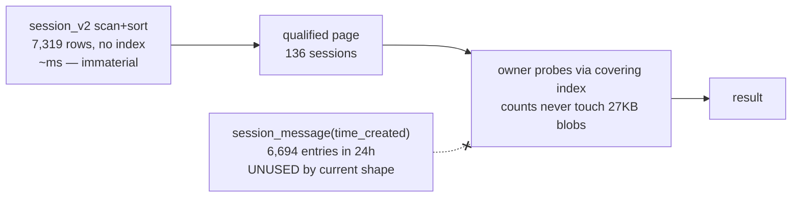

# Draft4 Review — Trusted Profiles, The `--since` Floor, And The Index Inventory

## What Is Up

Draft4 proposed trusted generated source profiles on top of draft3's
demand-bounded discipline. Since then a large fraction of the design landed:
the profile module, `cotail profile generate/refresh/show/validate`, hot-path
profile resolution without database discovery, semantic index-capability
derivation, and the history `CROSS JOIN` aggregate. This review evaluates the
design against the implementation, answers whether the foundation helps tune
`--since`-style queries, and enumerates optimizations the base enables but has
not yet delivered.

The triggering question for the next round: **the capability registry cannot
express the most useful access path the source actually contains.** Upstream
OpenCode ships `session_message(time_created)` — a time-leading index — and the
requirement DSL models only equality predicates and ordering. The registry
undersells the source.

## Verdict On Draft4

The design is a genuine synthesis rather than a restatement. Its strongest
properties:

- it preserves draft3's discipline intact and keeps profiles from claiming
  credit for query placement;
- the five residual costs are re-listed honestly rather than absorbed;
- "What Cotail Does Not Build" (no sidecar indexes, no generic planner, no
  background refresh) is real scope discipline;
- the version allowlist is more reviewable than migration lists and more
  honest than unverified semver ranges.

Weaknesses:

1. **The requirement DSL only models `equality` + order.** No range predicate,
   no covering claim. The registry therefore cannot express window-bounded
   access on `time_created`, which is the one genuinely new physical
   capability upstream added relative to draft3's inventory.
2. **Certificates are designed but inert.** The `certificates` field exists in
   the format; `profile validate --plans` is a stub that reports "recorded
   certificates are unsupported." A certificate nothing produces or checks
   rots into false confidence.
3. **Draft3's degraded-visibility thread was dropped.** `unavailable`
   capabilities exist in the type but nothing surfaces them to users; the
   three-outcome model (refuse / certified / degraded-visible) lost its third
   branch.
4. **Doc and code disagree on the trust policy.** Draft4 specifies an
   `opencode --version` spawn before every normal command with a
   `--trust-profile` override. `resolveRuntimeSource` trusts the file
   unconditionally.

## Implementation Drift

| draft4 promise | state |
|---|---|
| Profile format v1; generate/refresh/show/validate commands | Landed — [`packages/query-kysely/src/profile/`](/packages/query-kysely/src/profile/index.ts), [`src/commands/profile/`](/src/commands/profile/index.ts) |
| Hot path trusts profile; no schema inspection; no `SELECT DISTINCT type` | Landed — [`resolveRuntimeSource`](/src/profile/runtime.ts) |
| Semantic capability derivation (prefix order, partial-index rejection, collation) | Landed — [`capabilities.ts`](/packages/query-kysely/src/profile/capabilities.ts) |
| History demand-bounded `CROSS JOIN` aggregate | Landed — [`history.ts`](/packages/query-kysely/src/operations/history.ts) |
| Behavior vs indexed fixture split | Landed — [`fixtures/opencode-v2/source.ts`](/packages/query-kysely/test/fixtures/opencode-v2/source.ts) |
| Normal-command `opencode --version` check + `--trust-profile` | **Not implemented** |
| Plan certificates generated and validated | **Stub** |
| Operations consume capabilities | Capabilities are plumbed into the source object; nothing reads them yet |

## Real Database Facts

Read-only probes against the author's live source (2026-09-01):

| Fact | Value |
|---|---|
| Active database | `~/.local/share/opencode/opencode-local.db` — 20.9 GB |
| Sessions | 7,319 |
| Messages | 361,561 |
| Average `data` blob | ~27 KB |
| Largest session | 11,204 messages |
| Messages in last 24h | 6,694 |
| Sessions with `time_updated` in last 24h | 136 |
| Upstream `session_v2(time_updated)` index | **Does not exist** (only project, workspace, parent, partial time_suspended) |
| Upstream `session_message(time_created)` index | **Exists** (added in a later migration; absent from draft3's inventory, present in the fixture) |
| History aggregate plan shape | `SEARCH session_message USING COVERING INDEX session_message_session_time_created_id_idx (session_id=?)` |
| `~/.config/cotail/profiles/` | Does not exist yet — no profile generated on this machine |

Operational wrinkle: the default database hint resolves to `opencode.db`
(5 MB, one session) while the real data lives in `opencode-local.db`. Profile
generation with an explicit `--db` pins the correct path — a small point in
favor of the profile design, since "which physical file" is exactly the kind
of source fact a profile should own.

## Anatomy Of `--since`

`cotail history --since 24h` currently means two different recency concepts:

- **Membership**: `session.time_updated >= cutoff` (session-row recency).
- **Annotation**: `messagesSince` counts messages with `time_created >= cutoff`.

The help text ("sessions active within a time window") promises
message-activity semantics and delivers session-row semantics. They diverge
when a session row is stale but its messages are recent, or vice versa.

Cost on the real database:

Conclusions:

1. **The session-side residual is real but immaterial at this scale.** 7,319
   rows scanned and sorted to find 136. No upstream index exists to improve it
   and Cotail opens read-only. Correctly left as a named residual; no
   machinery should be built for it.
2. **The message side is already at the physical floor for current
   semantics.** The demand-bounded aggregate plus the covering index means
   counting never touches payload blobs. What remains is to *certify* that
   fact so engine upgrades cannot silently regress it.
3. **The available tuning is semantic, not physical.** Message-activity
   membership and window-bounded work are index-supported today and
   unexposed. The foundation's contribution to `--since` is legibility, not
   speed — the speed was already delivered by the draft3 repair.

So: does the foundation adequately help tune `--since`? Yes, in the sense that
it proves the current shape is already near-optimal and makes that proof
durable. No, in the sense that the one new lever upstream handed us
(`time_created`) is inexpressible in the capability vocabulary.

## Sharpening The Foundation

1. **Extend the capability DSL**: add a `range` operator (and optionally a
   covering notion) to `IndexRequirement`; register
   `message.time_range` (`time_created`), `session.parent_lookup`
   (`session_v2(parent_id)`), and `session.recency_order` — the last expected
   to derive `unavailable`, which makes the residual machine-readable.
2. **Land or drop certificates**: either implement `validate --plans`
   (compile, explain, classify, fail closed) or remove the field from v1.
3. **Decide the version-check policy**: implement the spawn + `--trust-profile`
   as drafted, or amend draft4 to say the file is trusted outright. Measure
   the spawn (plausibly 10–30 ms — acceptable for a CLI, but it should be a
   decision, not an accident).

## Optimization Menu (Ranked By Real-DB Impact)

1. **Window-bounded direct search.** Search today expands
   [`cotail_document`](/packages/query-kysely/src/relations/world.ts) with
   `json_each` over every message blob — on 20.9 GB, parsing the whole
   database per search. Propagating `time_created >= ?` through the union into
   `cotail_validated_message` bounds it to the window via the `time_created`
   index (6,694 vs 361,561 messages). Also the live test of the pushdown
   prompt's key question 7: does predicate propagation survive the logical
   world? Already scoped as draft4 implementation step 8.
2. **Global recent-activity operation** (a `cotail tail`-shaped product):
   recent messages or distinct active sessions via the `time_created` index —
   cost bounded by window, independent of database size. Cheapest new surface
   the registry enables, and it forces the `range` capability into existence.
3. **Message-activity membership for history**: "sessions with messages since
   T" via `distinct session_id` on the time index, PK lookups, small sort —
   also resolves the `--since` naming conflation.
4. **Certify the covering-index property** as a real `--plans` check: counts
   never touch `data` blobs. Worth a lot when blobs average 27 KB.
5. **Feed the queued tickets**: `cotail-read-session` wants `message.timeline`
   (already registered); `cotail-children` / `cotail-child-usage` want
   `session_v2(parent_id)`; `cotail-fileuse-reverse` wants window bounding.
   The beads queue is already full of capability-registry consumers.
6. **Relation-family statement seeding** (draft4 residual 4): keep deferred.
   SQL text parsing is noise next to JSON expansion on this database;
   measure before building.

The general method this review suggests: **read the profile's index inventory
as the product backlog.** Every upstream index is a query the source answers
cheaply; `time_created`, `parent_id`, and `event(aggregate_id, seq)` are
currently unproductized.

## Open Questions

- Refuse-or-run-visible policy when a required capability derives `unavailable`
  (the dropped draft3 thread).
- Whether `history --since` should migrate to message-activity membership,
  or keep session-row semantics under a clearer flag name.
- Whether the version check belongs on every command, only on profile-using
  commands, or only in `profile validate`.

## Cross-References

- [Draft4](/.design/pushdown/draft4.gpt56s.md) — the design under review;
  its Remaining Cost Assessment section is confirmed accurate by this review.
- [Draft3](/.design/pushdown/draft3.gpt56s.md) — supplies the demand-bounded
  discipline and the degraded-visibility thread this review recommends
  restoring.
- [Pushdown prompt](/.design/pushdown/prompt0.glm53.md) — key question 7
  (does the discipline reach the logical world) is answered concretely by
  optimization 1 above.
- [Capability derivation](/packages/query-kysely/src/profile/capabilities.ts)
  — where the `range` operator and new requirements belong.
- [Logical world](/packages/query-kysely/src/relations/world.ts) — the
  `cotail_document` union and `cotail_validated_message` through which a time
  window must propagate.
- [History operation](/packages/query-kysely/src/operations/history.ts) —
  current `--since` semantics and the certified-aggregate candidate.
- [Upstream schema](https://github.com/anomalyco/opencode/blob/a46095d21c170f41cf08aa27e16b128aa473377d/packages/core/src/database/schema.gen.ts)
  — authoritative index inventory, including the `time_created` index missing
  from draft3's list.
