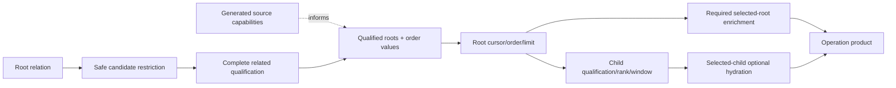

# Generated Source Profiles And Demand-Bounded Queries

## Decision

Cotail should generate, persist, and trust compact **OpenCode source profiles**.
Normal commands load a profile instead of rediscovering database schema, indexes,
Message variants, and query capabilities. Database inspection becomes an
explicit generation or validation operation.

A profile is not a data index. It contains small metadata about an OpenCode
source and the access paths Cotail may rely on. It does not copy Sessions,
Messages, JSON payloads, searchable text, or SQLite B-trees.

Normal execution is:

```text
resolve source and profile
    ↓
load and decode profile JSON
    ↓
compare `opencode --version` with the profile's version contract
    ↓
open SQLite read-only
    ↓
run only the requested Cotail operation
```

Normal execution does **not** query SQLite for:

- tables or columns;
- index definitions;
- migration history;
- distinct Message types;
- schema fingerprints; or
- query-plan validation.

The profile is a trusted cache. If the database changes independently, the
profile may become stale. Cotail reports version mismatch before use where it
can, but otherwise allows ordinary SQLite or decoding failures to expose stale
assumptions. Users regenerate or explicitly validate profiles when they need
fresh proof.

The query architecture remains operation-owned and demand-bounded:

> Restrict candidates when semantics permit, complete qualification before
> windowing, and drive downstream work from the smallest selected identity set.

Generated profiles supply static source facts and access capabilities. They do
not plan operations, combine unrelated products, or bound selected-root fanout.

## Terminology

| Term | Meaning |
|---|---|
| **source profile** | Generated JSON containing OpenCode version compatibility, relevant schema facts, observed content variants, derived access capabilities, and optional query certificates. |
| **profile generation** | Explicit inspection of one source or canonical OpenCode fixture to create a profile. May scan schema metadata and Message types. |
| **profile validation** | Explicit comparison of an existing profile with an executable, database, or current Cotail query plans. |
| **version contract** | The OpenCode versions against which a profile was generated and accepted. |
| **index fact** | A compact description of an existing SQLite index. Cotail does not create or maintain it. |
| **access capability** | A Cotail-oriented conclusion derived from index facts, such as indexed Message lookup by Session owner. |
| **physical certificate** | Evidence recorded during development, profile generation, or validation that an operation receives the intended SQLite access path. |
| **demand-bounded operation** | An operation whose downstream work is driven by selected root or child identities, with explicit remaining fanout dimensions. |

## Profile Lifecycle

### Commands

Cotail should expose:

```sh
cotail profile generate
cotail profile refresh
cotail profile show
cotail profile validate
```

Examples:

```sh
cotail profile generate \
  --db ~/.local/share/opencode/opencode.db \
  --opencode opencode \
  --output ~/.config/cotail/profiles/opencode-local.json

cotail profile validate \
  --profile ~/.config/cotail/profiles/opencode-local.json \
  --all
```

`generate` creates a new profile from the executable and database. `refresh`
regenerates an existing profile while preserving its configured source name and
path. `show` reads profile JSON only. `validate` performs explicitly selected
checks and never runs implicitly as part of an ordinary query.

### Storage and resolution

Use XDG configuration paths:

```text
~/.config/cotail/
├── sources.json
└── profiles/
    ├── opencode-local.json
    └── opencode-work.json
```

`sources.json` associates source paths with profiles:

```json
{
  "sources": [
    {
      "name": "local",
      "path": "/home/rektide/.local/share/opencode/opencode.db",
      "profile": "profiles/opencode-local.json"
    }
  ]
}
```

Resolution order is:

1. explicit `--profile`;
2. profile configured for the selected source;
3. generated per-source profile at the conventional XDG path;
4. a bundled profile explicitly selected by configuration; and
5. an actionable missing-profile error.

Cotail should not silently perform expensive discovery when a profile is absent.
The error prints the exact `cotail profile generate` command.

### Trust policy

When a profile is present and version-compatible, normal operations trust it.
There is no database schema verification on the hot path.

When a profile is stale despite a matching version, possible outcomes include:

- SQLite reports a missing table or column;
- a query receives a slower plan because an expected index was removed;
- an unsupported Message variant fails when an operation attempts to decode it;
- search omits semantics introduced after generation; or
- an operation's recorded plan certificate no longer describes the source.

Those are accepted consequences of the trusted-cache model. `profile validate`
and `profile refresh` are the repair mechanisms.

## OpenCode Version Contract

### Why version replaces migration lists

Profiles should not store the complete OpenCode migration journal. It is noisy,
implementation-specific, and difficult to review. Cotail cares which OpenCode
release contract produced the schema and content model, not every historical
step used to reach it.

Each profile records:

```json
{
  "opencode": {
    "executable": "opencode",
    "generated_with": "1.18.4",
    "compatible_versions": ["1.18.4"]
  }
}
```

The initial policy is an explicit version allowlist. Do not infer that a semver
minor or patch range is schema-compatible without generating or validating it.
After evidence exists, a profile may contain:

```json
{
  "compatible_versions": ["1.18.4", "1.18.5", "1.19.0"]
}
```

An allowlist is more reviewable than a migration list and more honest than an
unverified semver range.

### Normal version check

Before opening SQLite, Cotail runs the configured executable asynchronously:

```sh
opencode --version
```

It parses the version and compares it with `compatible_versions`.

- Match: load the profile and continue without database validation.
- Mismatch: refuse profile use and print `cotail profile refresh`.
- Missing executable: refuse by default and explain `--trust-profile`.
- Explicit `--trust-profile`: skip or override the version comparison and use
  the profile unchanged.

This check validates profile-to-installation compatibility, not the database's
provenance. A database may have been written by another installation or manually
modified. The design deliberately accepts that limitation instead of querying
the database on every command.

The version process is started once per Cotail invocation. A future long-running
process caches the result for its lifetime.

### Explicit version validation

`cotail profile validate --version` reports:

```text
profile generated with: 1.18.4
profile accepts:         1.18.4
installed executable:   1.18.4
result:                  compatible
```

`profile refresh` always records the current `opencode --version` result.

## Profile Format

### Example

```json
{
  "format": "cotail.source-profile/v1",
  "profile_id": "opencode-local",
  "generated_at": "2026-08-30T00:00:00Z",
  "generator": {
    "name": "cotail",
    "version": "0.2.0",
    "contracts": {
      "history": 1,
      "direct_search": 1
    }
  },
  "opencode": {
    "executable": "opencode",
    "generated_with": "1.18.4",
    "compatible_versions": ["1.18.4"]
  },
  "source": {
    "kind": "opencode-v2",
    "path": "/home/rektide/.local/share/opencode/opencode.db"
  },
  "schema": {
    "normalized_hash": "sha256:...",
    "tables": {
      "session_message": {
        "columns": [
          "id",
          "session_id",
          "type",
          "seq",
          "time_created",
          "time_updated",
          "data"
        ],
        "indexes": [
          {
            "name": "session_message_session_seq_idx",
            "unique": true,
            "partial": false,
            "keys": [
              { "column": "session_id", "collation": "BINARY", "direction": "asc" },
              { "column": "seq", "collation": "BINARY", "direction": "asc" }
            ]
          }
        ]
      }
    }
  },
  "content": {
    "supported_message_variants": [
      "agent-switched",
      "model-switched",
      "location-switched",
      "user",
      "synthetic",
      "system",
      "skill",
      "shell",
      "assistant",
      "compaction"
    ],
    "observed_message_variants": [
      "user",
      "assistant",
      "system"
    ]
  },
  "capabilities": {
    "history.message_owner_lookup": {
      "status": "indexed",
      "index": "session_message_session_seq_idx",
      "equality_prefix": ["session_id"]
    }
  },
  "certificates": {
    "history.activity": {
      "contract": 1,
      "runtime": {
        "node": "26.6.0",
        "sqlite": "3.53.3"
      },
      "outer": "qualified_sessions",
      "related": "session_message",
      "access": "search",
      "keys": ["session_id"]
    }
  }
}
```

### Compactness

Profiles contain only relevant tables and indexes by default. A separate
diagnostic snapshot may contain the complete extracted schema, but the runtime
profile should remain small and reviewable.

The profile stores one normalized schema hash for comparison during explicit
validation, not a migration list. Normal commands do not recompute the hash.

### Generator and contract versions

Cotail checks profile format and operation contract versions while decoding the
JSON. This is a file compatibility check, not database validation.

If the binary's history contract is newer than the profile certificate, Cotail
may still run history using source facts, but it must not claim the old physical
certificate. The first implementation may instead require refresh for
simplicity.

## Profile Generation

### Inputs

Generation receives:

- OpenCode executable path;
- OpenCode database path;
- output profile path;
- optional profile name;
- optional table and operation filters; and
- the current Cotail operation-contract versions.

### Extraction

Generation may perform expensive work because it is explicit:

```sql
SELECT type, name, tbl_name, sql
FROM sqlite_schema
ORDER BY type, name;

PRAGMA table_xinfo('session_message');
PRAGMA index_list('session_message');
PRAGMA index_xinfo('session_message_session_seq_idx');

SELECT DISTINCT type
FROM session_message
ORDER BY type;
```

It also runs:

```sh
opencode --version
```

and may compile and explain representative Cotail operations.

### Raw snapshot and curated profile

Internally generation has two products:

1. a complete deterministic extraction snapshot; and
2. the compact runtime profile filtered to Cotail's requirements.

The raw snapshot may be retained with `--keep-snapshot` for review. Runtime
commands load only the curated profile.

### Index capability derivation

Operations declare small static requirements to the generator:

```json
{
  "history.message_owner_lookup": {
    "table": "session_message",
    "predicates": [
      { "column": "session_id", "operator": "equality" }
    ]
  },
  "message.timeline": {
    "table": "session_message",
    "predicates": [
      { "column": "session_id", "operator": "equality" }
    ],
    "order": [
      { "column": "seq", "direction": "asc" }
    ]
  }
}
```

The generator applies SQLite rules:

- key order and leftmost prefixes matter;
- partial indexes count only when the operation implies their predicate;
- expression keys are not ordinary column keys;
- collation must match the operation;
- uniqueness is recorded but not required for owner lookup;
- covering columns are an optimization, not a correctness requirement; and
- automatic transient indexes are never source capabilities.

An index on `(session_id, seq)` satisfies equality on `session_id` and equality
plus ordering by `seq`. An index on `(seq, session_id)` does not satisfy direct
lookup by `session_id`.

### Message variant canonicalization

The generator records two sets:

- variants supported by this Cotail build; and
- variants observed in this database during generation.

Generation fails by default when an observed variant is unsupported:

```text
observed but unsupported:
  location-switched
```

The user may explicitly generate an incomplete profile if an operation-specific
policy permits it. The profile records that incompleteness; normal commands do
not rescan Message types.

Top-level Message variants come from OpenCode's `SessionMessage.Info` union.
Nested assistant content tags (`text`, `reasoning`, `tool`) and tool states are
not Message variants.

## Explicit Validation

Validation is selectable:

```sh
cotail profile validate --version
cotail profile validate --schema
cotail profile validate --indexes
cotail profile validate --content
cotail profile validate --plans
cotail profile validate --all
```

| Selection | Work |
|---|---|
| `--version` | Runs `opencode --version` and compares the version contract |
| `--schema` | Re-extracts relevant tables and columns, compares normalized hash and details |
| `--indexes` | Re-extracts index definitions and re-derives capabilities |
| `--content` | Scans distinct Message types and compares observed/supported sets |
| `--plans` | Compiles and explains certified operation queries on the current runtime/source |
| `--all` | Runs every check |

Validation returns a report and does not rewrite the profile. `refresh` performs
generation after validation or directly replaces the profile atomically.

## JavaScript Module Architecture

Cotail remains JavaScript/TypeScript. Add one domain-grouped profile module:

```text
src/
├── profile/
│   ├── schema.ts
│   ├── resolve.ts
│   ├── generate.ts
│   ├── validate.ts
│   ├── extract/
│   │   ├── sqlite-schema.ts
│   │   ├── indexes.ts
│   │   ├── message-variants.ts
│   │   └── query-plans.ts
│   └── derive/
│       └── index-capabilities.ts
├── commands/
│   └── profile/
│       ├── generate.ts
│       ├── refresh.ts
│       ├── show.ts
│       └── validate.ts
└── ...
```

The module interface is small:

```ts
export interface SourceProfileModule {
  readonly load: (sourcePath: string, profilePath?: string) => Promise<SourceProfile>;
  readonly checkOpenCodeVersion: (profile: SourceProfile) => Promise<void>;
  readonly generate: (request: GenerateProfileRequest) => Promise<SourceProfile>;
  readonly validate: (request: ValidateProfileRequest) => Promise<ProfileValidation>;
}
```

Operation code consumes only decoded profile capabilities through the existing
query context. It does not read profile files, invoke OpenCode, inspect PRAGMAs,
or know index names.

The runtime source acquisition becomes:

```ts
const profile = await sourceProfiles.load(databasePath, profilePath);
await sourceProfiles.checkOpenCodeVersion(profile);
const source = await acquireNodeOpenCodeSource({
  path: databasePath,
  sourceID,
  capabilities: profile.capabilities,
});
```

The current `inspectOpenCodeV2Source` hot-path inspection and
`SELECT DISTINCT type` scan are removed from ordinary acquisition. Their logic
moves into profile generation and validation.

## Demand-Bounded Operation Architecture

Profiles remove repeated source discovery. They do not determine where query
work belongs. Each domain operation still owns its result semantics and physical
construction.

### Planning rule

Each cardinality-bearing operation names:

1. result root;
2. candidate restrictions independent of related qualification;
3. computations affecting membership, order, rank, cursor, or validity;
4. qualification frontier;
5. root window;
6. required enrichment;
7. child/global windows;
8. optional hydration;
9. profile capabilities used; and
10. remaining cost dimensions.



There is no production pushdown framework. Stages remain ordinary Kysely CTEs
inside operation modules. Shared code is limited to repeated keyset mechanics,
profile capability types, fixtures, and test-only plan classifiers.

### History

History qualifies and windows Sessions before Message counts because counts do
not affect Session membership or order. Its activity aggregate starts from the
selected Session page:

```ts
.with("session_activity", (qb) => qb
  .selectFrom("qualified_sessions")
  .crossJoin("cotail_message")
  .whereRef(
    "cotail_message.sessionID",
    "=",
    "qualified_sessions.sessionID",
  )
  .select((eb) => [
    "cotail_message.sessionID",
    eb.fn.countAll<number>().as("messagesTotal"),
    sql<number>`sum(case when ${eb.ref("cotail_message.createdAt")} >= ${request.since} then 1 else 0 end)`
      .as("messagesSince"),
  ])
  .groupBy("cotail_message.sessionID"))
```

The profile requirement is:

```text
history.message_owner_lookup:
  session_message equality prefix (session_id)
```

The expected certified plan is selected Sessions followed by indexed Message
searches. Normal history trusts the generated capability and does not inspect
indexes or plans. `profile validate --plans` and package conformance tests prove
the access path explicitly.

History retains:

- inclusive `since`;
- deterministic `(updatedAt DESC, sessionID DESC)` ordering;
- zero-Message Sessions;
- positive API limits;
- CLI `--limit 0` as omission/unlimited; and
- Session-side scan/sort as a named residual without an upstream recency index.

### Direct search

Direct search has a different frontier because witnesses determine Session
membership. Its target shape is:

```text
candidate_sessions
    ↓
qualified_sessions through witness existence
    ↓
Session page
    ↓
matching and ranked Documents for selected Sessions
    ↓
per-Session/global child windows
    ↓
Message payload hydration for selected hits when evidence is enabled
```

The profile may supply document-owner and Message-owner capabilities, but it
cannot remove semantically necessary witness work. Direct search still needs an
operation-specific rewrite and conformance pass.

## Remaining Cost Assessment

### 1. Source acquisition scans Message types

**Resolved for normal operation.**

`SELECT DISTINCT type FROM session_message` moves to `profile generate` and
`profile validate --content`. Ordinary commands use the profile's supported and
observed variant sets.

Remaining risk: new variants written after generation are invisible until
refresh or until an operation encounters data it cannot decode. This is the
accepted profile-staleness contract.

### 2. Direct search repeats qualification/enumeration and hydrates early

**Partially addressed, not solved by profiles.**

Demand-bounded construction moves Message payload hydration after selected hits
and omits it when evidence is disabled. Candidate Session restrictions reduce
witness work where semantically valid.

Witness truth and evidence enumeration may still evaluate related documents
twice because they answer different questions. Plans and measurements determine
whether a shared matching stage can serve both without changing root semantics.

### 3. Separate operations do not share qualification

**Unchanged.**

Profiles share source facts, not query results. Two operation calls still execute
two statements. If one consumer needs search, activity, and evidence over one
root page, add one product-specific combined operation that establishes that
page once. Do not automatically compose arbitrary operations.

### 4. Logical-world statement parsing overhead

**Unchanged, with a future generation opportunity.**

Profiles do not reduce the current full logical CTE text included with each
statement. A later relation-family seeding design may generate Session, Message,
Document, and Event worlds independently while preserving one public logical
schema. This is statement-construction work, not indexing.

### 5. Selected-root fanout remains potentially unbounded

**Unchanged by profiles and only narrowed by demand pushdown.**

History stops visiting unrelated Sessions' Messages but still counts every
Message owned by selected Sessions. Direct search may still expand many
Documents for one selected Session. Lineage depth does not bound sibling fanout.

Further reduction requires product or storage decisions such as projected
counts, explicit child limits, approximate totals, query budgets, or a separate
Cotail-owned aggregate/index. None is introduced by this design.

### Additional residual: OpenCode version process

Normal operation adds one `opencode --version` process. This replaces database
discovery rather than adding to it. Measure its startup cost. If it becomes
material, a long-running Cotail process caches it, or users explicitly configure
`--trust-profile`. Do not reintroduce database scans as an optimization.

## What Cotail Does Not Build

This design does not create or maintain indexes in the OpenCode database. Cotail
continues to open it read-only.

It also does not create:

- a Cotail sidecar full-text index;
- a copy of Session or Message rows;
- a generic pushdown planner;
- typed query-stage states;
- automatic composition of operation queries;
- runtime schema discovery when a profile is present; or
- background profile refresh.

A future Cotail-owned search or aggregate index would be a separate design with
disk use, incremental maintenance, privacy, rebuild, and source-revision policy.

## Conformance Architecture

### Package tests

Maintain two source fixtures:

- minimal schema fixture for correctness and malformed-source behavior; and
- indexed fixture matching a generated OpenCode profile for physical plans.

Operation plan tests classify local access facts rather than snapshot complete
plans. History requires selected Session outer access and `SEARCH
session_message ... (session_id=?)`, rejecting Message scans.

### Profile tests

For each bundled or checked-in profile:

1. initialize or acquire a canonical database for its OpenCode version;
2. generate a fresh extraction;
3. compare normalized schema/index facts;
4. compare supported and observed Message variants;
5. compile and explain certified operation queries; and
6. confirm `opencode --version` belongs to the allowlist.

### Development evidence

Wall-clock scaling and SQL-function probes remain diagnostic. Structural plan
facts are the deterministic gate available today. A future plan-neutral native
work counter may strengthen certificates without changing profile trust policy.

## Implementation Sequence

1. Define and test `cotail.source-profile/v1` with OpenCode version allowlist,
   relevant schema/index facts, variant sets, capabilities, and certificates.
2. Implement profile resolution and asynchronous `opencode --version` checking,
   including explicit `--trust-profile` override.
3. Implement `profile generate`, extracting schema, indexes, Message variants,
   and current operation plans into deterministic JSON.
4. Implement selective `profile validate` and atomic `profile refresh`.
5. Move source acquisition from runtime inspection to supplied profile
   capabilities; remove the ordinary `SELECT DISTINCT type` scan.
6. Generate the initial bundled/reference profile and indexed test fixture from
   the same canonical OpenCode version.
7. Strengthen history conformance and land the selected-root `CROSS JOIN`
   aggregate.
8. Audit direct search for candidate restriction, selected-hit hydration, and
   evidence-off SQL omission.
9. Measure remaining acquisition, SQL preparation, selected-root fanout, and
   repeated witness costs before proposing further machinery.

Each step should land as a separately useful change. Profile work and history
repair can proceed independently until source capabilities are wired into the
operation tests.

## Acceptance

Accept this design when:

- normal commands perform no database schema, index, migration, type-discovery,
  or plan-validation queries;
- profiles use compact OpenCode version contracts rather than migration lists;
- `opencode --version` is checked before profile use, with an explicit trust
  override;
- generation and validation are explicit user actions;
- generated profiles distinguish supported from observed Message variants;
- index requirements are derived by SQLite key semantics rather than names;
- Cotail creates no persistent user-data indexes;
- history is root-driven and indexed according to its profile capability;
- direct search retains qualifying witness semantics while deferring optional
  hydration; and
- the five residual costs are tracked honestly rather than attributed to profile
  generation or pushdown.

The architecture deliberately trades continuous proof for explicit, reusable
proof. Cotail inspects a source when asked, records what it learned, validates
the installed OpenCode version cheaply, and otherwise trusts the generated file
while executing operations whose relational work remains visible and
conformance-tested.

## Cross-References

- [Demand-bounded operation planning with certified access paths](/.design/pushdown/draft3.gpt56s.md)
  supplies the operation semantics and access-path discipline retained here;
  its hot-path source inspection is replaced by trusted generated profiles.
- [The pushdown prompt](/.design/pushdown/prompt0.glm53.md) frames the original
  semantic and physical placement problem.
- [Cotail V2 relational query world](/.design/query/design3.gpt56.md) defines the
  logical relations and operation-owned products that generated capabilities
  inform without replacing Kysely.
- [Scoped query execution](/.design/query2/design2.gpt56.md) owns read-only
  database lifecycle, one-read snapshots, and provenance after profile loading.
- [OpenCode CLI package](https://github.com/anomalyco/opencode/blob/a46095d21c170f41cf08aa27e16b128aa473377d/packages/cli/package.json)
  records the release version exposed through the CLI version mechanism.
- [OpenCode database schema](https://github.com/anomalyco/opencode/blob/a46095d21c170f41cf08aa27e16b128aa473377d/packages/core/src/database/schema.gen.ts)
  is the upstream source whose realized SQLite metadata profile generation
  captures.
- [OpenCode Session Message schema](https://github.com/anomalyco/opencode/blob/a46095d21c170f41cf08aa27e16b128aa473377d/packages/schema/src/session-message.ts)
  defines top-level variants distinct from nested content and tool-state tags.
- [Current source validation](/packages/query-kysely/src/source/validation.ts)
  contains the runtime inspection and distinct-type scan moved into explicit
  profile generation and validation.
- [Current source capabilities](/packages/query-kysely/src/source/capabilities.ts)
  are replaced as discovered runtime facts by decoded generated-profile facts.
- [History implementation](/packages/query-kysely/src/operations/history.ts),
  [direct search](/packages/query-kysely/src/operations/direct-search.ts), and
  [logical world](/packages/query-kysely/src/relations/world.ts) are the first
  operation and statement-construction targets.
