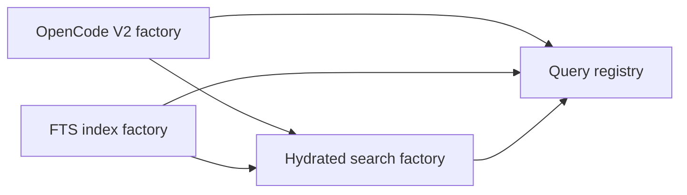

# Query Registry Uses And Alternatives

## Short Answer

The query registry is **implemented but not used by cotail production code**.

`@opencoattails/query-runtime` is an isolated workspace package. Its tests build
synthetic factories and registries, but the root CLI does not depend on it, the
current OpenCode live store is not wrapped in a factory, and no command looks up
a query instance from `QueryRegistry`.

What exists today is an executable architectural experiment:

- factory and registry types;
- Effect Layer construction;
- typed keys and capabilities;
- dependency and cycle validation;
- explicit replacement;
- deterministic acquisition;
- immutable lookup after construction; and
- correct scoped cleanup, including partial acquisition failure.

It proves that the idea works. It does not yet prove that cotail needs the idea.

The first honest production use would be wrapping one real V2 Kysely query world
in a factory and composing the CLI through the resulting registry. Doing that
with only one provider would mostly test integration; the registry begins earning
its complexity when a second world, host replacement, or derived provider exists.

## The Idea In Plain Language

Suppose cotail can query several things:

- the live OpenCode V2 database;
- a cotail-owned FTS index;
- an optional persisted-event source;
- a remote or embedded OpenCode service; or
- an in-memory test world.

Each one needs configuration, acquisition, capabilities, and cleanup. Some may
depend on others. An indexed-search world may depend on both an FTS candidate
world and a live OpenCode hydration world.

A **factory** is the recipe for creating one of those worlds:

```ts
const openCodeFactory = queryFactory({
  key: OpenCodeV2,
  capabilities: [directRegex, messageResults],
  acquire: Effect.gen(function* () {
    const config = yield* OpenCodeConfig
    return yield* openCodeQueryWorld(config)
  }),
})
```

The **registry Layer** receives all recipes up front:

```ts
const QueryRuntimeLive = queryRegistryLayer([
  openCodeFactory,
  indexFactory,
  hydratedSearchFactory,
])
```

It validates the recipe graph, acquires each world once, and publishes one
read-only registry only after everything succeeds:

```ts
const program = Effect.gen(function* () {
  const registry = yield* QueryRegistry
  const live = yield* registry.get(OpenCodeV2)
  return yield* live.world.all(
    live.world.db.selectFrom("message").selectAll(),
  )
})
```

When the Layer scope closes, Effect closes acquired worlds in reverse dependency
order. The registry does not manually call `close` and factories do not mutate a
global map.

## What “Factories Emit Into A Registry” Became

The original phrase suggests that each factory Layer might start independently
and register its instance into a mutable registry. The experiment deliberately
chose a different interpretation:

> The composition root gives all factory descriptors to one higher-order Layer;
> that Layer acquires the instances and emits one complete Registry service.

This matters because readers never observe a half-built registry. Duplicate IDs,
missing dependencies, and cycles fail before resources open. Acquisition failure
closes everything already opened. Registry membership cannot race with queries.

It is less dynamic than factories registering themselves. That is a feature for
a CLI whose providers are known at startup.

## Concrete Uses

### 1. Standalone OpenCode V2 query world

The smallest integration wraps the V2-only Kysely world from
[`design3-self.md`](/query/design3-self.md):

```ts
export const OpenCodeV2 = queryKey<OpenCodeQueryWorld>(
  QueryInstanceId.make("opencode-v2"),
)

export const openCodeV2Factory = queryFactory({
  key: OpenCodeV2,
  capabilities: [directLiteral, directRegex, messageResults, contentResults],
  acquire: makeOpenCodeV2World,
})
```

This gives the CLI an Effect-scoped source instead of manually opening and
closing the live store. By itself this does not require discovery, capabilities,
or a registry; direct provision of one `OpenCodeQuery` service would be simpler.
Its value is establishing the same contract later providers can join.

### 2. Direct source plus FTS index

This is the clearest registry use.



The live world supplies canonical identity and metadata. The FTS world supplies
ranked candidates and highlights. A dependent hydrated-search factory receives
both worlds by typed key and produces a third world that reconciles candidates
against live state.

The registry owns all three lifetimes and prevents the derived world from being
created before its dependencies.

### 3. Standalone versus embedded implementation

The same `OpenCodeV2` key can name one logical contract with different host
implementations:

- standalone factory: separate read-only `node:sqlite` connection;
- OpenCode factory: approved Effect SQL executor or host-managed read connection;
- test factory: in-memory synthetic logical world.

The composition root selects a replacement explicitly:

```ts
queryRegistryLayer([standaloneOpenCode], {
  replacements: [embeddedOpenCode],
})
```

Commands continue using the canonical key. Replacement means “same provider
contract, different implementation,” not “another arbitrary source won a map
collision.”

This may be the strongest near-term reason to retain the abstraction even before
FTS: cotail wants one library used by two hosts with different database
lifecycle rules.

### 4. Multiple OpenCode databases

A user might query:

- the default local database;
- an archived database;
- a work database and personal database; or
- several remote OpenCode installations.

Each configured source could become a separately keyed instance. Discovery by a
capability such as `message-results` would list all eligible worlds. A command
could query one explicit source or fan out over several.

This use pressures the current identity model. A key such as `opencode-v2` is no
longer sufficient; IDs need a stable source identity, and query Addresses need a
source component to prevent Session ID collisions across databases. The registry
can host this, but it does not solve source identity by itself.

### 5. Test and simulation replacement

The implemented replacement mechanism is immediately useful in tests:

- replace a disk-backed world with an in-memory fixture;
- replace FTS with deterministic candidates;
- simulate missing capabilities;
- inject acquisition failures; or
- verify command behavior against stale versus current worlds.

Effect requirements from each factory remain visible in the Layer type, so a
fixture can require a test clock, temporary directory, or generated corpus
without introducing process globals.

### 6. Optional event history

Persisted OpenCode events are optional. A retained-event factory could exist only
when configuration says event history is available. It might expose event replay,
audit, or transition queries distinct from projected Session/Message queries.

The current registry has static startup membership, so capability detection must
happen while constructing descriptors or acquiring a factory. Two reasonable
policies are:

- omit the event factory when the host says persistence is unavailable; or
- register it and let operations fail with a precise unavailable-capability
  error.

Omission makes discovery honest. Registration preserves a stable key. The right
choice depends on whether absence is configuration or a transient source state.

### 7. Derived query products

A factory need not correspond directly to a database. It can produce a query
world assembled from other worlds:

- hydrated indexed search;
- cross-source federation;
- bookmark resolution against live data;
- lineage traversal over Session and fork relations;
- a cached or rate-limited remote query client; or
- an analytics world combining query and aggregate helpers.

This is why factories have explicit query-instance dependencies rather than only
ordinary Effect service requirements. The dependency graph describes ownership
between worlds while Effect requirements provide infrastructure such as config
and HTTP clients.

## Speculative Uses

### Query provider ecosystem

If cotail eventually supports third-party query providers, a package could export
a descriptor factory:

```ts
export const makeRemoteProvider = (config: RemoteConfig) =>
  queryFactory({ ... })
```

The application still gathers descriptors before building its Layer. This is a
static extension ecosystem, not hot loading. It works for config files, package
imports, and OpenCode application composition.

### Capability-aware command planning

Commands could ask the registry for providers supporting facts such as:

- `direct-regex`;
- `fts-rank`;
- `message-results`;
- `content-results`;
- `persisted-events`; or
- `live-hydration`.

The registry should only discover candidates. A separate policy chooses among
them. Otherwise `byCapability` can turn into an implicit and surprising backend
selector.

A future structured capability could include parameters:

```ts
type QueryCapability =
  | { kind: "result-grain"; grain: "session" | "message" | "content" }
  | { kind: "match-language"; language: "literal" | "regex" | "fts" }
  | { kind: "freshness"; mode: "live" | "indexed" }
```

The current branded strings are sufficient for the tracer but weak for planning.

### Cross-source federation

A federation factory could depend on several source worlds and expose one
Kysely-like or operation-shaped surface. It would need to define:

- source-qualified Addresses;
- merge order and pagination;
- partial failure;
- duplicate identity;
- capability intersection versus union; and
- whether query expressions can be pushed to every source.

The registry supplies lifecycle and dependency wiring but none of those query
semantics. Federation is therefore a possible registry application, not a free
feature.

### Long-lived OpenCode server runtime

Inside OpenCode, the Registry Layer could live at application/database scope.
Commands and endpoints would share acquired worlds. OpenCode's application graph
could replace the standalone source factory with an embedded one.

This is still static for one server runtime. Configuration changes would rebuild
the runtime or a child scope. If query providers truly need hot reload, the
current registry is the wrong implementation.

### Other registries

The same pattern could inspire registries for source adapters, indexes, or
analysis engines. It should not become a generic “registry framework” yet.
Query-world lifecycle and typed query keys are concrete enough to justify this
package; renderers, Arrow schemas, and CLI formats have different ownership and
selection concerns.

## What The Registry Is Not

- It is not the Kysely query model.
- It does not register individual queries or expressions.
- It is not a database connection pool.
- It is not a renderer/output registry.
- It does not choose the best backend.
- It does not normalize direct regex and FTS semantics.
- It is not a mutable plugin manager.
- It does not make escaped world references safe after their Effect Scope closes.
- It does not solve source-qualified identity or cross-source pagination.

It answers one narrower runtime question: **which configured query worlds exist
in this program, how are they acquired, and who owns their lifetime?**

## When It Is Overkill

If cotail has exactly one OpenCode V2 query world, the simpler architecture is:

```ts
const program = Effect.gen(function* () {
  const query = yield* OpenCodeQuery
  // use query directly
})
```

Provide one `OpenCodeQuery` Layer and stop. Effect already provides dependency
injection, replacement, memoization, and scoped cleanup. A registry adds no value
unless callers need heterogeneous discovery, several keyed instances, or
dependencies among query worlds.

That means the current implementation is ahead of present production need. It is
reasonable to keep it as an isolated, tested package without routing the CLI
through it yet.

## Alternative Implementations

### A. One Effect service per provider

```text
OpenCodeQuery
FtsQuery
HydratedSearch
```

Each is a normal Context service and Layer. Dependencies are ordinary Effect
requirements.

**Advantages:** strongest static typing, least custom machinery, natural for two
or three known providers.

**Costs:** no heterogeneous discovery; multiple instances of one provider type
need generated tags or wrapper services; config-driven provider sets are awkward.

**Use when:** provider membership is fixed in source code.

### B. Plain configured array, no registry service

The composition root acquires worlds and passes a frozen array directly to the
one command that needs fan-out.

**Advantages:** simple, local, no service locator.

**Costs:** lifecycle/dependency/replacement logic moves into composition code;
typed lookup by canonical key is absent.

**Use when:** only one feature needs a temporary collection.

### C. Current higher-order immutable Registry Layer

The complete factory set is known before Layer construction.

**Advantages:** atomic publication, deterministic graph validation, typed keyed
lookup, config-driven membership, scoped cleanup, explicit replacement.

**Costs:** custom graph code; typed-key honesty depends on shared canonical key
objects; startup-static membership; heterogeneous discovery is `unknown`.

**Use when:** multiple worlds and provider discovery are real product concepts.

### D. Registry contributions as Effect Layers

Every provider emits a `QueryContribution` Layer and a collector combines them.

Effect Context normally stores one service per tag; merging repeated tags does
not accumulate values. Implementing accumulation requires unique generated tags
or a mutable collector, which either destroys discoverability or becomes the
dynamic registry below.

**Use when:** Effect gains or the application already owns a principled
multi-service contribution mechanism. Otherwise avoid it.

### E. Mutable scoped registry

Factories register and unregister while the program runs. Correctness requires:

- synchronized updates;
- duplicate/replacement transactions;
- registration tokens;
- child Scopes per instance;
- leases for in-flight users;
- defined removal behavior; and
- registry change streams.

**Advantages:** hot reload and runtime plugins.

**Costs:** substantially harder lifetime and concurrency semantics; readers can
observe membership changes; removal can invalidate active queries.

**Use when:** a long-running host genuinely hot-plugs providers.

### F. OpenCode LayerNode/AppNode directly

When cotail runs only inside OpenCode, each query world could become an AppNode.
OpenCode already supplies dependency graphs, replacement, cycle detection, and
Layer compilation.

**Advantages:** no parallel graph implementation inside that host.

**Costs:** couples the reusable cotail library to private OpenCode utilities;
heterogeneous query discovery still needs a service; standalone CLI loses an
independent composition mechanism.

**Use when:** upstream integration becomes the dominant deployment and OpenCode
exports a stable graph API.

### G. Factory returns its own Layer

```ts
makeOpenCodeFactory(config): Layer<QueryWorld>
```

This is the most literal “factory Layer” formulation. It works well when each
world has a statically distinct service tag. It does not naturally create a
collection under one registry key.

**Use when:** callers already know every provider statically and discovery is
unnecessary. This often collapses back to alternative A.

## Possible Adaptations To The Current API

### Structured capabilities

Replace branded strings with a discriminated Effect Schema once capability
selection becomes real. Keep free-form vendor capabilities in an extension case
if needed.

### Canonical key modules

Export each `QueryKey<World>` beside the World contract. Do not let unrelated
callers reconstruct the same string with a dishonest type. Runtime ID equality
cannot enforce the phantom `World` type.

### Separate discovery from policy

Add a `QueryProviderPolicy` service only when commands need automatic choice. It
can rank provider candidates based on requested match language, freshness,
latency, and explicit user preference. Keep Registry deterministic and dumb.

### Parameterized source keys

For multiple databases, introduce a source identity value and key constructor
whose result includes that identity. Address and result provenance must use the
same source identity.

### Parallel graph acquisition

Independent factories could acquire by graph level instead of sequentially.
Only add this after startup measurements. It changes failure ordering and can
open several SQLite databases concurrently.

### Dynamic child registry

A long-running host could keep the immutable global registry and create a
separate dynamic child registry for ephemeral sources. That confines leases and
hot-plug complexity rather than weakening every provider's guarantees.

### Generic factory graph extraction

The dependency-order and replacement machinery might eventually become a small
shared graph utility. Extract it only if another registry needs identical
semantics. Premature generalization would hide the query-world concepts that
currently make the code understandable.

## Suggested Adoption Path

1. **Keep it isolated now.** Continue using direct services until the V2 Kysely
   query world exists.
2. **Wrap one real world.** Add `OpenCodeV2` key and factory; compose a single
   experimental command through the Registry Layer.
3. **Add the second provider that justifies discovery.** Most likely FTS or an
   embedded OpenCode replacement.
4. **Introduce structured capabilities only when a command needs provider
   selection.** Known-key lookup should remain the default.
5. **Evaluate whether the registry earned itself.** If production still has one
   provider, delete the registry integration and retain ordinary Effect Layers.
6. **Consider dynamic registration only after specifying a real hot-plug user
   story, leases, and removal semantics.**

## Recommendation

The idea is neat because it cleanly solves a real class of problems: acquiring a
configured graph of heterogeneous query worlds and publishing them atomically
under one Effect scope. The implementation is credible and well tested.

It is also speculative. Cotail currently has one production query provider and
does not use the package. Wiring it everywhere now would add indirection without
user value.

Keep the registry as an architectural option and use ordinary Effect service
injection for the first V2 Kysely world. Adopt the registry when one of these
becomes concrete:

- direct plus FTS worlds;
- standalone plus embedded replacements;
- multiple configured OpenCode sources;
- a derived world with query-world dependencies; or
- provider discovery by capability.

At that point the current higher-order immutable Layer is a strong default. If
the actual requirement is runtime hot-plugging, do not stretch it; design the
lease-aware mutable registry as a different system.

## Cross-References

- [Scoped query factory registry](/.design/query-runtime/factory-registry0.gpt56.md)
  is the normative implementation design. This document explains when and why to
  use it rather than restating its mechanics.
- [Registry implementation](/packages/query-runtime/src/registry.ts) is currently
  referenced only by its own package tests, which establishes the abstract,
  unused production status described here.
- [Addressed Kysely query world](/.design/query/design3-self.md) defines the first
  real World contract a production factory could acquire.
- [OpenCode V2 integration research](/.design/query/opencode-v2-model0.general.md)
  explains why standalone and embedded hosts need different database acquisition
  implementations under one logical contract.
- [Apache Arrow output](/.design/output/arrow0.gpt56.md) is deliberately separate:
  output schemas consume query products and should not be registered as query
  providers.
