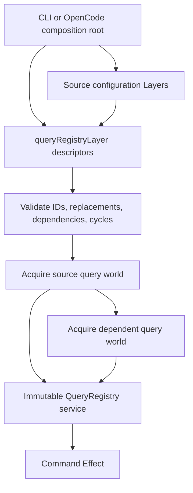
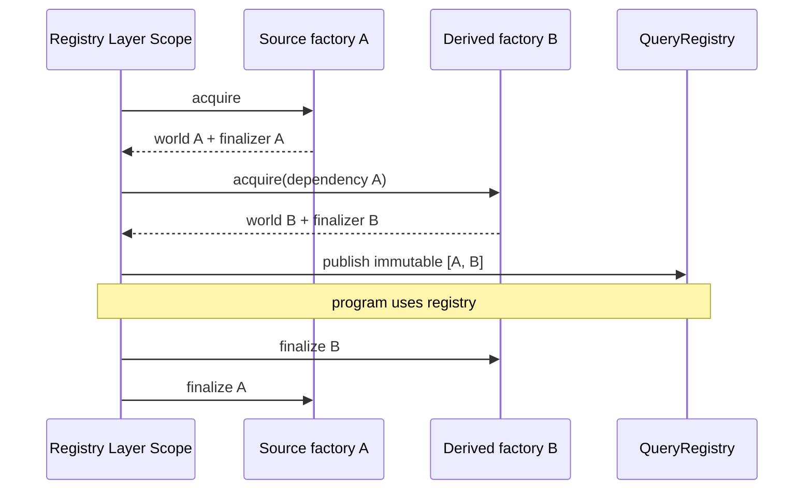

# Scoped Query Factory Registry

## Decision

A **query factory** is a pure descriptor that names one query instance, declares
its capabilities and query-instance dependencies, and contains an Effectful
acquisition function. `queryRegistryLayer(factories, { replacements })` validates
the complete declaration graph, acquires the selected factories in stable
dependency order inside the Layer scope, then publishes one immutable
`QueryRegistry` service.

This is architecture 3 from the investigated set: a higher-order registry Layer
constructs scoped instances and publishes one immutable registry. It incorporates
OpenCode `LayerNode`'s strongest ideas, composition-time dependency validation,
same-identity replacement, cycle rejection, and stable memoized construction,
without importing OpenCode's internal application graph.

“A factory query Layer emits parameterized instances into a registry Layer” is
therefore sharpened to:

> The composition root passes factory descriptors to a higher-order Layer. The
> Layer acquires their parameterized worlds under one Scope and emits one registry
> service. Individual factories do not mutate or merge into a registry service.

## Vocabulary

| Term | Meaning |
|---|---|
| **query world** | One configured logical read surface, normally a scoped Kysely `ReadonlyQueryCreator` plus cotail helpers and execution functions. |
| **query key** | A branded runtime ID carrying the TypeScript type of its query world. |
| **factory descriptor** | Immutable declaration of key, capabilities, dependencies, and scoped acquisition. It is not an acquired resource. |
| **query instance** | Acquired key, capability metadata, and query world owned by the Registry Layer scope. |
| **registry** | Immutable discovery and lookup service published only after every selected instance acquires successfully. |
| **replacement** | Composition-root override with the same key ID as a declared factory. It replaces acquisition and metadata while retaining discovery position. |
| **capability** | Discoverable metadata such as `opencode-v2`, `direct-regex`, `events`, or a result-family capability. It is not an output format. |

“World” remains the query design's term for a coherent logical Kysely surface.
“Instance” means that world after configuration and resource acquisition. This
avoids calling a database connection, a Kysely creator, and a declarative factory
the same thing.

## Use Cases

- A standalone CLI opens an OpenCode V2 read world and, optionally, a cotail FTS
  world from command configuration.
- Tests replace one source factory with an in-memory or synthetic world while
  retaining the same typed key.
- A later OpenCode host supplies a separate-connection or approved Effect SQL
  implementation under the same key.
- Commands discover optional capabilities and choose an appropriate query world,
  while callers that know a world use its typed key.
- One derived query world can depend on another acquired world without opening or
  closing it manually.

## Non-Goals

- Runtime plugin registration, hot reload, or a mutable service locator.
- Treating factories as query expressions; ordinary relational construction
  remains Kysely's job.
- Hiding backend-specific capabilities behind a false universal query API.
- Registering renderers, Arrow schemas, or output formats as query providers.
- Sharing an unmanaged OpenCode native database handle.
- Preventing trusted JavaScript code from retaining a world value after its Scope
  closes. Effect controls finalization, but TypeScript cannot make escaped object
  references unusable.

## Candidate Architectures

### 1. Mutable registry consumes descriptors

A Registry service owns a mutable `Map`; factory Layers call `register` during
construction and remove themselves in finalizers.

This resembles OpenCode's scoped tool transforms and is appropriate when tools
appear and disappear while the application is running. It is rejected here:
query source membership is startup configuration, registration order would become
construction-order sensitive, readers could observe partial state, duplicate
handling would require synchronization, and resource lifetime could outlive a
removed map entry or vice versa.

### 2. Merge contribution Layers

Each factory returns `Layer<QueryContribution>`, and callers merge contributions
into a registry.

Effect Layer merge combines service contexts; repeated provision of one service
key does not form a collection. Making every contribution a fresh service tag
would require runtime-generated tags and erase static discovery. Introducing a
mutable collector merely collapses this option back into architecture 1.

### 3. Higher-order immutable registry Layer

`queryRegistryLayer(factories)` sees the complete declaration set, validates it,
acquires in dependency order, and publishes after success. This is selected. It
provides deterministic validation, atomic publication, one ownership scope, and a
small standalone composition API.

### 4. OpenCode-style application graph

OpenCode's `LayerNode` gives every service implementation explicit dependencies,
supports graph-wide replacements, rejects cycles, and compiles nodes into Layers.
Those semantics directly inform this design. Copying or depending on `LayerNode`
is rejected for the tracer because query factories are entries within one service
collection, not the complete application graph. If cotail moves into OpenCode,
the resulting `QueryRegistry` Layer can itself become one global AppNode.

### 5. Dynamic runtime registration

A synchronized mutable map with scoped registration tokens is viable only if
query providers truly hot-plug after startup. Correct behavior would require an
Effect `Scope` per registration, atomic replacement under a lock, in-flight lease
semantics, and an explicit answer for whether removal waits for active queries.
No current CLI or proposed OpenCode integration needs this. It is deferred rather
than approximated with a global map.

## Chosen API

The production API is in
[`registry.ts`](/packages/query-runtime/src/registry.ts):

```ts
const OpenCode = queryKey<OpenCodeQueryWorld>(
  QueryInstanceId.make("opencode-v2"),
)

const openCodeFactory = queryFactory({
  key: OpenCode,
  capabilities: [QueryCapability.make("direct-regex")],
  acquire: Effect.fn("OpenCodeQuery.acquire")(function* () {
    const config = yield* OpenCodeSourceConfig
    return yield* Effect.acquireRelease(
      openReadonlyQueryWorld(config.database),
      (world) => world.close,
    )
  }),
})

const QueryRuntimeLive = queryRegistryLayer([openCodeFactory])

const program = Effect.gen(function* () {
  const registry = yield* QueryRegistry
  const instance = yield* registry.get(OpenCode)
  return yield* instance.world.all(
    instance.world.db.selectFrom("session").selectAll(),
  )
})
```

`QueryKey<World>` couples a runtime ID to a compile-time world shape. `get(key)`
therefore returns `QueryInstance<World>` without caller assertions. Discovery is
necessarily heterogeneous and returns `QueryInstance<unknown>`; a caller must use
a known key before operating on a world.

Factories can require ordinary Effect services. Those requirements propagate to
the Registry Layer type and are supplied at the composition root. Query-instance
dependencies are separate: they are declared as keys and read from the already
acquired dependency set.

## Layer Graph



The registry is not visible between `SOURCE` and `DERIVED`. Layer construction
either succeeds with all instances or fails with no published service.

## Identity And Configuration

`QueryInstanceId` and `QueryCapability` are trimmed, non-empty Effect Schema
brands. IDs should identify a logical provider contract and source role, not a
transient connection object. A parameterized factory can close over immutable
descriptor configuration, while secrets, paths, host database adapters, and test
fixtures can arrive through required Effect services.

Factory descriptors are frozen by `queryFactory`; their capability and dependency
arrays are copied and frozen. Acquired worlds remain provider-owned objects
because freezing a Kysely runtime or driver would be incorrect.

## Duplicate And Replacement Policy

Base factory IDs must be unique. Duplicate validation follows declaration order
and fails with `DuplicateQueryInstance { source: "factory" }` before acquisition.

Replacement is explicit in the composition root:

```ts
queryRegistryLayer([openCodeFactory, indexFactory], {
  replacements: [testOpenCodeFactory],
})
```

The replacement's ID must already exist. Each ID may be replaced once per call.
The replacement supplies its own capabilities, dependencies, acquisition errors,
and Effect requirements, but occupies the original factory's discovery position.
An unknown target and repeated replacement are typed configuration failures.

This matches OpenCode's important semantic rule: replacement changes an
implementation behind the same identity; it does not silently add a differently
named service. It is deliberately stricter than map “last one wins.”

## Discovery And Lookup

- `registry.all` is a frozen array in declaration order after replacement.
- `registry.get(key)` is typed by the key and fails with
  `QueryInstanceNotFound`.
- `registry.byCapability(capability)` returns a frozen, declaration-ordered
  filtered array.

Capability lookup is filtering rather than “pick the best” because preference is
operation policy. A caller can explicitly choose direct versus FTS behavior,
event-backed history, or another source without the registry inventing ranking.

## Acquisition And Finalization

Before touching resources, the Layer checks duplicate IDs, replacement targets,
missing dependencies, and cycles. A stable depth-first traversal visits factories
in declaration order and each factory's dependencies in declared order. Every
factory acquires once, even when several worlds depend on it.



Factories use `Effect.acquireRelease` or `Effect.addFinalizer`; the registry does
not call provider-specific `close()` methods. Effect's Layer scope guarantees
reverse-order cleanup on normal scope close, interruption, and acquisition
failure. If B fails after A succeeds, A is finalized exactly once and no registry
is published.

## Failure Behavior

Configuration failures are schema-backed tagged errors:

- `DuplicateQueryInstance`;
- `QueryReplacementTargetNotFound`;
- `QueryFactoryDependencyNotFound`; and
- `QueryFactoryDependencyCycle` with the closed cycle path.

Factory acquisition errors remain their specific provider error types in the
Layer error channel. They are not flattened into a generic registry error. Lookup
after successful construction has only `QueryInstanceNotFound`; a factory asking
for an undeclared key receives that error, although normal declared dependencies
have already been validated and acquired.

No `try/catch` prints or suppresses failures. Effect Scope handles cleanup while
the original typed failure remains observable.

## Concurrency

Acquisition is intentionally sequential. Dependencies impose a partial order,
and deterministic ordering and cleanup are more valuable than speculative startup
parallelism for local SQLite worlds. The immutable registry needs no lock after
construction and capability reads cannot race with registration.

Independent parallel acquisition could later use graph levels, but then failure
ordering and concurrent native database opens become observable policy. It should
be added only after startup measurements justify that complexity.

## Kysely Boundary

The registry is generic over `World`; it does not import Kysely. A real query world
retains the query design's public Kysely output typing:

```ts
interface OpenCodeQueryWorld {
  readonly db: ReadonlyQueryCreator<QueryDatabase>
  readonly all: <Output>(
    query: SelectQueryBuilderExpression<Output>,
  ) => Effect.Effect<readonly Output[], QueryExecutionFailed>
}
```

The factory owns the read-only connection, seeded logical relations, Kysely
creator, execution boundary, and finalizer. The registry neither reconstructs
queries nor exposes physical tables. A dependent world receives the source world
through its typed key; it does not take ownership of the source's connection.

Synthetic tests use small typed worlds rather than a live database because this
module proves composition and lifecycle, not Kysely SQL lowering. The existing
query prototypes remain the evidence for logical CTEs and output inference.

## CLI And OpenCode Hosting

The standalone CLI creates descriptors from parsed configuration, supplies source
configuration Layers, and provides the resulting Registry Layer to command
Effects. Commands use the same `QueryRegistry` service that library consumers use;
the CLI has no privileged global registry.

Inside OpenCode, `QueryRegistry` belongs at global/database scope. One AppNode can
wrap the already-composed Registry Layer and declare OpenCode Database/config
nodes as dependencies. OpenCode server replacement options can select an embedded
factory. The embedded factory must still use a separate scoped read connection or
an approved Effect SQL executor, never an unmanaged adapter over OpenCode's native
handle.

The internal OpenCode `LayerNode` graph and cotail's query dependency graph have
different levels: AppNode wires application services; the query registry validates
members inside one service. Reusing their semantics does not require merging the
two APIs.

## Output Capabilities

Capabilities can describe query and result facts such as `message-results`,
`events`, or `fts-rank`. They must not identify renderers such as Arrow, JSONL, or
TSV. Query providers produce typed domain rows; command-specific output adapters
project those products afterward. This preserves the Arrow tracer's rule that a
wire schema is not the domain model and prevents registry selection from being
coupled to presentation.

## Test Layers

[`registry.test.ts`](/packages/query-runtime/test/registry.test.ts) builds real
Effect Layers with two synthetic worlds and verifies:

- typed ID lookup and capability filtering;
- immutable, deterministic discovery;
- duplicate rejection before any acquisition;
- explicit replacement and retained declaration position;
- dependency acquisition and reverse finalization order;
- partial-acquisition failure cleanup exactly once;
- missing dependency and cycle failures before acquisition; and
- propagation and provision of an external Effect source/config service.

The test program can only access `QueryRegistry` while its Layer is provided.
JavaScript can deliberately retain an instance reference after the program ends,
so provider operations must still report their own closed-resource behavior if a
caller violates Scope discipline.

## Dependency Choice

The package pins exact `effect@4.0.0-beta.101`, matching the investigated OpenCode
revision. A floating range is inappropriate because this is a pre-release API and
the intended embedding host is version-coupled. `@effect/language-service` is a
development dependency and its transform is enabled in the package `tsconfig`;
strict `tsgo` therefore checks ordinary TypeScript and Effect diagnostics.

The package does not add Kysely because registry semantics are independent of a
specific query builder. The source query package already pins Kysely 0.29.5.

## Consequences

The selected shape makes startup membership static, publication atomic, lookup
typed, and cleanup structural. It also means adding a provider after Layer launch
requires rebuilding a runtime scope. That is an intentional constraint until a
real long-lived hot-plug use case can specify leases and removal semantics.

The registry validates only query-instance dependencies. Broader application
service cycles remain Effect/OpenCode composition concerns. Query key typing is
trustworthy when keys are shared constants; constructing a second key with the
same branded string but a dishonest `World` type can lie to TypeScript. The
recommended package API should export canonical keys beside their world contracts
and avoid accepting arbitrary user-cast keys at untrusted boundaries.

## Cross-References

- [Addressed Kysely query world](/.design/query/design3-self.md) defines the
  scoped, read-only world acquired by these factories and assigns lifecycle to
  Effect while keeping relational construction in Kysely.
- [OpenCode V2 model and integration research](/.design/query/opencode-v2-model0.general.md)
  establishes the exact Effect 4 service style, database-scope placement, and the
  requirement not to bypass OpenCode's SQLite semaphore/transaction discipline.
- [Kysely-forward V2 prompt](/.design/query/prompt1.gpt56.md) requires replaceable
  test Layers, capabilities, configuration, and a shared CLI/embedded composition
  path; this registry supplies that runtime seam without adding a query AST.
- [Refined Kysely architecture](/.design/query/draft-ksyley1.md) supplies prior
  lifecycle evidence for one owner and exactly one close path. Scope finalization
  replaces its manual composition-root `finally` for Effect-hosted worlds.
- [Apache Arrow output tracer](/.design/output/arrow0.gpt56.md) explains why output
  schemas are command projections rather than query capabilities. Registry
  metadata may identify result families but does not register renderers.
- [OpenCode `layer-node.ts`](https://github.com/anomalyco/opencode/blob/f7545bfab4679747738aac5293faabfe13c3c26c/packages/util/src/effect/layer-node.ts#L114-L150)
  provides the same-identity replacement precedent; its
  [compile and cycle behavior](https://github.com/anomalyco/opencode/blob/f7545bfab4679747738aac5293faabfe13c3c26c/packages/util/src/effect/layer-node.ts#L162-L282)
  informs validation and stable dependency acquisition.
- [OpenCode Workspace driver registry](https://github.com/anomalyco/opencode/blob/f7545bfab4679747738aac5293faabfe13c3c26c/packages/core/src/workspace/driver.ts#L48-L68)
  is useful immutable registry prior art, while this design adds scoped factory
  acquisition, typed keys, capabilities, dependencies, and replacement policy.
- [OpenCode Tool scoped registration](https://github.com/anomalyco/opencode/blob/f7545bfab4679747738aac5293faabfe13c3c26c/packages/core/src/tool.ts#L139-L187)
  shows the synchronization and finalizer machinery required by genuine dynamic
  registration, supporting its rejection for static query sources.

## Acceptance Result

The tracer satisfies the ticket's design, lifecycle, duplicate/replacement,
discovery, lookup, failure-cleanup, and executable Layer criteria. Remaining work
belongs to the broader query-world implementation: acquire a real V2-only Kysely
world under one canonical key and compose the standalone CLI through this Layer.
