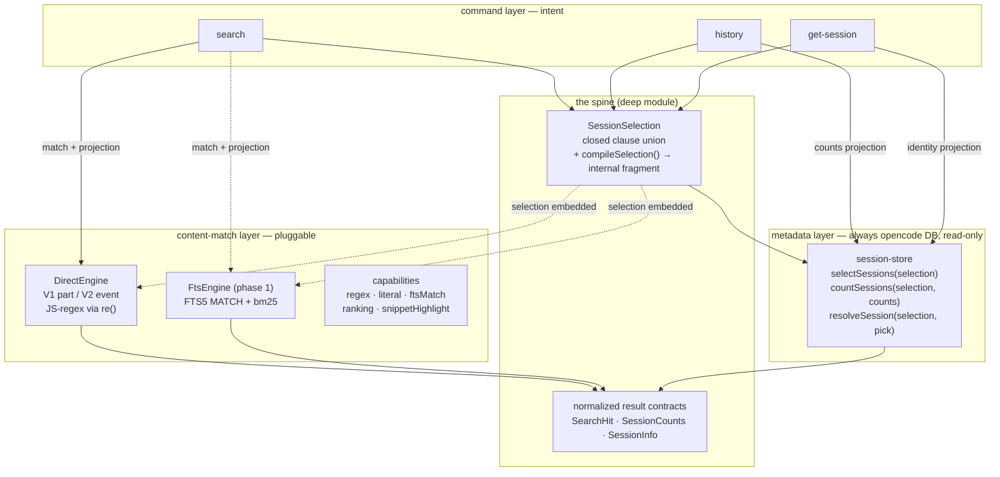

# Cotail Query Architecture — design-alt

> **Wave:** `design-alt` (independent alternative to `draft0`). Authored without reading the sibling draft, per wave independence. Grounded only in the source the prompt cites.
>
> **One-line thesis:** *`SessionSelection` is the spine everything shares. Content matching is a backend-owned plug point, not a shared compiled artifact. Projection (identity / snippet-evidence / counts) is a third axis. Do not build a unified query language.*

## 0. Stage setting — what's actually happening

Cotail answers questions about **opencode sessions** stored in SQLite. Three commands exist (`search`, `history`, `get-session`); an FTS phase is coming. Query behavior has accreted in four hand-written SQL sites:

| site | what it builds | the axes it conflates |
|---|---|---|
| `buildTitleQuery` ([search.ts:30](/src/commands/search.ts)) | title regex + scope + limit | selection ∪ title-match ∪ pagination |
| `buildContentQuery` ([source.ts:21](/src/opencode/source.ts)) | N×EXISTS + scope + snippet-subselect + limit | selection ∪ content-match ∪ projection ∪ pagination |
| `countActiveSessions` ([session.ts:11](/src/opencode/session.ts)) | scope + count aggregates | selection ∪ aggregate-projection |
| `latestSessionByDirectory` / `getSessionById` ([session-info.ts](/src/opencode/session-info.ts)) | one-row lookups | selection (single clause) |

The same `--since` / `--directory` predicates are written **three times** with slightly different shapes (aliased `s.directory` vs bare `directory`; `instr(?) > 0` in each). That triplication *is* `SessionSelection` trying to be born. Meanwhile the headline feature — content matching — is a bespoke string-templating loop parameterized by a `VersionSchema` struct of raw SQL fragments ([source.ts:12](/src/opencode/source.ts)) that leaks V1/V2 storage detail straight into a "shared" compiler.

This document proposes an architecture that **concentrates** the genuinely shareable complexity into one deep module and **quarantines** the rest.

---

## 1. Domain model & vocabulary

### 1.1 The root object is the **session**

Everything cotail does is "answer a question about a set of sessions." The variance is in *what defines a matching session* and *what we project from it*. Naming the root object settles a lot:

- `search` → "which sessions have content matching X?"
- `history` → "which sessions were active in window W, and how many messages?"
- `get-session` → "which *one* session is this PID / directory on?"

The part/event/message tables are **relations of a session**, not things queried in their own right. Snippets and counts are **projections over a session**, not filters. This reframing is load-bearing for the rest of the design.

### 1.2 Four axes, currently entangled

Today's `ContentQuery` ([types.ts:3](/src/opencode/types.ts)) is a flat bag. Tease it into four orthogonal axes:

| axis | ranges over | examples | lifespan |
|---|---|---|---|
| **Selection** | one session **row** | `id`, `project`, `directory contains`, `updatedSince` | reusable across *every* operation |
| **Content match** | the **relation** of parts/events of a session | "some text part matches `/foo/`" | operation-specific (search only) |
| **Projection** | derived values of a matching session | identity, snippet-evidence, message counts | operation-specific |
| **Pagination/order** | the result set | `limit`, `order by updated desc` | trivial, shared |

The architectural claim of this design: **only Selection is worth a rich shared vocabulary.** Content match is structurally different (it quantifies existentially over many rows, and its semantics diverge between regex and FTS), so it must stay owned by the thing that actually executes it. Projection is a separate knob. Pagination is a leaf.

### 1.3 Glossary (terms this design commits to)

- **SessionSelection** — a predicate over the session row; the *only* shared query abstraction. AND of closed-set clauses.
- **ContentMatch** — a predicate over the part/event *relation* of a session; backend-owned. A conjunction of independently-witnessed clauses.
- **Projection** — what to return about a matching session. Variants: `identity`, `evidence` (snippet), `counts`.
- **Engine** — a content-match executor. `DirectEngine` (today's V1/V2 scan) and a future `FtsEngine`.
- **Capabilities** — what an engine can honor. Drives honest rejection, not silent fallback.
- **Selection fragment** — the internal `(sql, params)` a selection compiles to, *never* exposed to callers.

---

## 2. The seam — two layers, one spine



**Two layers, deliberately unequal:**

1. **Metadata layer** — session selection, counts, resolution. *Always* opencode's DB, read-only. This is the source of truth for "which sessions exist and what are their fields." `history` and `get-session` never need anything else.
2. **Content-match layer** — given a selection + a content match, produce `SearchHit`s. *Pluggable*: `DirectEngine` or `FtsEngine`. Only `search` touches this.

**Critical decision: FTS is a content-match accelerator, not a metadata store.** The planned FTS index ([README FTS schema](/README.md)) will denormalize session fields for scope-pushdown, but cotail never treats it as authoritative for identity/counts/resolution — those always read opencode's DB. This keeps one source of truth and prevents an entire class of staleness bugs (index drift on metadata never corrupts `history`).

`SessionSelection` is the single thing spanning both layers: the metadata layer compiles it to filter sessions; a content engine *embeds* the same compiled fragment to pre-prune candidate sessions before its match runs. That embedding is the pushdown seam the prompt asks about (Q12).

---

## 3. Module interface (TypeScript, semantics-first)

### 3.1 Selection — the spine

```ts
// A predicate over ONE session row. Closed union. AND of clauses. Empty = all sessions.
export interface SessionSelection {
  clauses: SessionClause[];
}

export type SessionClause =
  | { kind: "id"; id: string }
  | { kind: "project"; projectId: string }
  | { kind: "parent"; parentId: string | null }
  | { kind: "directoryContains"; path: string }      // instr(s.directory, ?) > 0
  | { kind: "updatedSince"; ms: number }             // absolute epoch-ms (relative→abs is CLI's job)
  | { kind: "updatedBefore"; ms: number }
  | { kind: "createdSince"; ms: number }
  | { kind: "titleMatches"; pattern: string; mode: MatchMode; caseSensitive: boolean };
```

Notes:

- **`titleMatches` lives in selection, not in content match.** Title is a session-row column. This *collapses* the parallel `buildTitleQuery` code path ([search.ts:30](/src/commands/search.ts)): `--title-only foo` becomes `selection{ titleMatches: foo }` with *no* content match. As a free side effect, the model now permits "sessions titled X **that also mention** Y in content" — a composition today's exclusive `--title-only` flag forbids. The CLI can keep the mutual-exclusion behavior; the underlying model is no longer the thing preventing it.
- **Closed union, not a generic predicate AST.** Adding `project`/`parent`/date-range later is one new variant + one compiler case — no parallel edits across three SQL builders (the exact disease the prompt diagnoses). This is the deep-module payoff.
- Cutoffs are **absolute epoch-ms**, matching today's `sinceMs` convention ([types.ts:9](/src/opencode/types.ts)). `parseSince` ([args.ts:16](/src/args.ts)) already does relative→absolute; that stays in the command layer where it belongs.

### 3.2 Content match — backend-owned

```ts
// A predicate over the PART/EVENT RELATION of a session. Search-only.
export interface ContentMatch {
  // Conjunction. Each clause is witnessed by an INDEPENDENT part (today's semantics,
  // made explicit & named — see §4.2).
  clauses: ContentClause[];
  partTypes: PartType[];        // default ["text"]; [] invalid
  mode: MatchMode;              // "regex" | "literal" — intent, interpreted per engine
  caseSensitive: boolean;
}

export interface ContentClause {
  pattern: string;              // raw regex under mode:"regex"; escaped under mode:"literal"
}

export type MatchMode = "regex" | "literal";
```

`mode` and `caseSensitive` are **intent**, not execution. `DirectEngine` honors regex literally (registering `re()` with the right flags, [db.ts:40](/src/opencode/db.ts)); `FtsEngine` cannot do arbitrary regex and will either reject (capability miss) or map `literal`→FTS phrase. Making intent explicit is what lets capability negotiation be honest (§6).

### 3.3 Projection — the third axis

```ts
// What to report about a matching session. Orthogonal to why it matched.
export type SearchProjection =
  | { kind: "identity" }
  | { kind: "evidence"; fromClause: number; length: number };  // snippet from Nth match clause's first hit

export interface CountProjection {
  recentWindowMs: number | null;   // null → total only; set → also compute messages_recent
}
```

The `evidence.fromClause` field **makes the current "snippet from pattern[0]" behavior explicit** ([source.ts:40](/src/opencode/source.ts) pushes `q.patterns[0]` for the snippet subquery). Today that's an implementation detail a reader has to notice. In this model it is a named, adjustable projection parameter. Default `fromClause: 0` preserves behavior exactly.

### 3.4 Operations — selection + operation-specific bits → normalized rows

```ts
export interface ContentSearchSpec {
  selection: SessionSelection;
  match: ContentMatch;
  projection: SearchProjection;
  limit: number;                 // pagination/order stays a leaf on the operation
}

export interface HistorySpec {
  selection: SessionSelection;
  counts: CountProjection;
  limit: number;
}

export interface ResolveSpec {
  selection: SessionSelection;
  pick: "latest" | "only";
}
```

Each operation is `(selection + a little) → normalized result`. The result contracts (`SearchHit`, `SessionCounts`, `SessionInfo`) are already good and stay as the public output shape ([types.ts:12](/src/opencode/types.ts), [session-info.ts:11](/src/opencode/session-info.ts)) — they are the stable contract callers and tests assert on.

### 3.5 The entrypoints

```ts
// Metadata layer — always opencode DB. One module, three functions.
selectSessions(db, selection): SessionRow[];                       // for history/identity
countSessions(db, selection, counts, limit): SessionCounts[];      // history
resolveSession(db, selection, pick): SessionInfo | undefined;      // get-session

// Content-match layer — pluggable engine.
interface ContentSearchEngine {
  readonly id: "direct" | "fts";
  readonly capabilities: EngineCapabilities;
  search(db, spec: ContentSearchSpec): SearchHit[];
}
```

`search` the command becomes: build a selection, build a match, pick an engine (direct today; FTS when present + capable), run it. `history`/`get-session` never acquire a "backend" — they are pure metadata-layer calls.

---

## 4. Compilation & lowering (direct engine)

### 4.1 Selection compiles to an internal fragment

```ts
// INTERNAL ONLY. Never crosses a module boundary shown to callers.
interface SelectionFragment { sql: string; params: unknown[]; }

function compileSelection(sel: SessionSelection, alias = "s"): SelectionFragment {
  if (sel.clauses.length === 0) return { sql: "1=1", params: [] };
  const parts: string[] = [];
  const params: unknown[] = [];
  for (const c of sel.clauses) {
    switch (c.kind) {
      case "id":               parts.push(`${alias}.id = ?`); params.push(c.id); break;
      case "project":          parts.push(`${alias}.project_id = ?`); params.push(c.projectId); break;
      case "parent":           parts.push(c.parentId === null ? `${alias}.parent_id IS NULL`
                                                            : `${alias}.parent_id = ?`); 
                               if (c.parentId !== null) params.push(c.parentId); break;
      case "directoryContains":parts.push(`instr(${alias}.directory, ?) > 0`); params.push(c.path); break;
      case "updatedSince":     parts.push(`${alias}.time_updated >= ?`); params.push(c.ms); break;
      case "updatedBefore":    parts.push(`${alias}.time_updated < ?`); params.push(c.ms); break;
      case "createdSince":     parts.push(`${alias}.time_created >= ?`); params.push(c.ms); break;
      case "titleMatches":     parts.push(`re(?, ${alias}.title)`); params.push(c.pattern); break;
    }
  }
  return { sql: parts.join(" AND "), params };
}
```

This is the *only* place scope predicates are authored. The three duplicated sites collapse into callers that build clauses and hand them here. The `alias` parameter is how a content engine embeds the fragment under its own `session s` correlation (the pushdown seam, Q12).

### 4.2 Content match lowers to N independent EXISTS (current semantics, named)

For a `ContentMatch` with `clauses: [opencode, journal]`, `partTypes: ["text"]`, direct engine V1 produces — character-for-character the shape today's code emits ([source.ts:23-38](/src/opencode/source.ts)):

```sql
SELECT s.id, s.slug, s.title, s.directory AS directory,
       datetime(s.time_created/1000,'unixepoch') AS created,
       datetime(s.time_updated/1000,'unixepoch') AS updated
       -- projection: evidence, fromClause 0
       , substr((SELECT json_extract(p.data,'$.text') FROM part p
                 WHERE p.session_id = s.id
                   AND json_extract(p.data,'$.type')='text'
                   AND re(?, json_extract(p.data,'$.text'))
                 ORDER BY p.time_created LIMIT 1), 1, 200) AS snippet
FROM session s
WHERE EXISTS (SELECT 1 FROM part p WHERE p.session_id = s.id
              AND json_extract(p.data,'$.type')='text'
              AND re(?, json_extract(p.data,'$.text')))   -- clause: opencode
  AND EXISTS (SELECT 1 FROM part p WHERE p.session_id = s.id
              AND json_extract(p.data,'$.type')='text'
              AND re(?, json_extract(p.data,'$.text')))   -- clause: journal
  AND (instr(s.directory, ?) > 0 AND s.time_updated >= ?) -- selection fragment
ORDER BY s.time_updated DESC LIMIT ?;
-- params: [opencode(snippet), opencode, journal, dir, sinceMs, limit]
```

Two things to notice:

1. **The match lowering is identical to today.** This design is a *refactor that attributes complexity to the right axis*, not a rewrite. Behavior is preserved by construction.
2. **The "each clause witnessed independently" semantics is now named**, not implicit. The alternative — "one part must satisfy all clauses" — is a *different* `ContentMatch` shape we can add later (e.g. `conjunctionMode: "same-part" | "any-part"`). Today's behavior is `"any-part"` and that becomes the documented default. See §8.

### 4.3 History lowers counts as projection subqueries over the selection

```sql
SELECT s.id, s.title, s.directory, s.slug, s.time_created, s.time_updated,
       (SELECT count(*) FROM message m WHERE m.session_id = s.id)
         + (SELECT count(*) FROM session_message sm WHERE sm.session_id = s.id) AS messages_total,
       (SELECT count(*) FROM message m WHERE m.session_id = s.id AND m.time_created >= ?)
         + (SELECT count(*) FROM session_message sm WHERE sm.session_id = s.id AND sm.time_created >= ?) AS messages_recent
FROM session s
WHERE (<selection fragment>)            -- e.g. s.time_updated >= ? AND (instr(s.directory, ?) > 0)
ORDER BY s.time_updated DESC LIMIT ?;
```

This is exactly `countActiveSessions` ([session.ts:26-33](/src/opencode/session.ts)) with its hand-written `WHERE` replaced by the shared selection fragment. The count subqueries are **projection**, not filtering — they never appear in `WHERE`. That distinction is what makes "counts are not a filter" legible.

### 4.4 Title-only is just selection + identity projection

`search --title-only compaction` lowers to:

```sql
SELECT ... FROM session s
WHERE re(?, s.title)                    -- titleMatches clause
ORDER BY s.time_updated DESC LIMIT ?;
```

No content engine involved. `buildTitleQuery` ([search.ts:30](/src/commands/search.ts)) is deleted; its scope handling is subsumed by `compileSelection`. The unaliased `session` in today's title query becomes `session s` for uniformity — a behavior-neutral normalization (same rows, same order).

---

## 5. Where V1/V2 lives, and what FTS shares

### 5.1 V1/V2 is an *internal* concern of `DirectEngine`

Today `VersionSchema` ([source.ts:12](/src/opencode/source.ts)) is a public struct of raw SQL fragments consumed by a "shared" `buildContentQuery`. That leaks storage detail across the boundary. In this design:

```ts
// Inside DirectEngine only. Not exported.
interface PartRelation {
  table: string;
  sessionRef: string;
  typeExpr: (t: PartType) => string;
  textExpr: (isTool: boolean) => string;
  snippetExpr: (isTool: boolean) => string;
  orderCol: string;
}

// DirectEngine picks one at construction from existingTables() (db.ts:31):
//   part table present   → V1 PartRelation (part p, $.type/$.text)
//   only event present   → V2 PartRelation (event e, $.part.type/$.part.text)
```

`DirectEngine` owns its schema map exactly as `V1Source`/`V2Source` ([v1/source.ts](/src/opencode/v1/source.ts), [v2/source.ts](/src/opencode/v2/source.ts)) do today — same expressions, same per-`typeFilter` tool-text branching. The difference is *nobody outside the engine sees it*. `detectSources` ([source.ts:48](/src/opencode/source.ts)) returning a list that the command dedupes is simplified away: one DB is one schema, so `DirectEngine` returns one result set with no cross-source dedup needed. (Today's dedup in `contentRows` ([search.ts:59-68](/src/commands/search.ts)) is defensive against a case that cannot occur; removing it is safe.)

### 5.2 What direct and FTS actually share

Three things, and only three:

1. **`SessionSelection`** — same spine, same compiled fragment, same pushdown.
2. **`ContentMatch`** — the *intent* (clauses + partTypes + mode). Each engine compiles it its own way: direct → N×EXISTS with `re()`; FTS → `MATCH` clause + bm25. The clause list is shared; the SQL is not.
3. **`SearchHit`** — the normalized output contract.

Everything else — the `{sql, params}` artifact, ranking, snippet highlighting, tokenization — is engine-internal. This is the honest answer to prompt Q10: *direct and FTS share selection, match-intent, and results. Not SQL, not ranking, not snippet mechanics.*

### 5.3 Snippets across engines

Direct: `substr((SELECT text ... ORDER BY time_created LIMIT 1), 1, 200)` — first match of the chosen clause, truncated. FTS: `snippet(parts_fts, 0, '<<','>>','...',20)` with bm25-highlighted excerpt ([README FTS](/README.md)). Both surface as `SearchHit.snippet` ([types.ts:19](/src/opencode/types.ts)). The *contract* is "a short string evidencing the match"; the *mechanics* belong to the engine. This is the projection axis done right.

---

## 6. Capabilities — honest rejection over silent fallback

```ts
export interface EngineCapabilities {
  regex: boolean;            // arbitrary JS regex over text (direct: yes; fts: no)
  literal: boolean;          // exact substring / phrase (direct: yes via escape; fts: yes as phrase)
  ftsMatch: boolean;         // tokenized MATCH (direct: no; fts: yes)
  ranking: boolean;          // bm25/order-by-relevance (direct: no, recency only; fts: yes)
  snippetHighlight: boolean; // inline match markers (direct: no; fts: yes)
  partTypes: PartType[];     // which part types are indexed/searchable
}
```

When a `ContentSearchSpec` asks for something an engine can't honor, the engine **rejects up front** with a typed error (`UnsupportedMatch`), not a silent degradation. Prompt Q11's options — rejection / negotiation / fallback / separate forms — are answered: **rejection by capability check, with the CLI mapping the rejection to a clear user-facing message.** No fallback that quietly changes semantics between regex and tokenized search, because the prompt is right that those are not equivalent. A future "best-effort" mode could layer on top, but the default must not hide the difference.

---

## 7. Alternatives considered

### A. One unified `Query` AST shared by all commands and backends

A single `Query { predicate, orderBy, limit, projection }` where `predicate` is a recursive AST (`And | Or | Not | FieldEq | ContentContains | ...`).

- **Pro:** maximal composability; one compile path; OR/negation/phrase fall out.
- **Con:** it is a miniature SQL engine exposed to callers — exactly what the prompt warns against. It forces every backend to implement a full predicate evaluator (FTS can't do `Not` cheaply; direct can't do tokenized phrase well). It also erases the structural distinction between *session-row* predicates and *relational/existential* content predicates, which is the distinction that makes the domain legible. **Rejected** as the default, though a thin logical/physical split (alt D) could borrow its composability without its surface area.

### B. Several operation-specific models + a shared *selection vocabulary*

(This is this design.)

- **Pro:** smallest interface that captures the one genuine cross-cutting concern (scope predicates) without forcing content match into a shared mold. Each operation keeps its natural shape. V1/V2 and FTS complexity stays behind the engine wall. **Chosen.**

### C. Typed criterion model grouped by the relation each criterion ranges over

Predicates tagged by the relation they range over (`SessionRow | Parts | Messages`), compiled by a dispatcher.

- **Pro:** directly mirrors the prompt's observation that criteria range over different things. Pedagogically clean.
- **Con:** once you group by relation, "ranges over the session row" *is* `SessionSelection` and "ranges over parts" *is* `ContentMatch` — you arrive at design B with extra taxonomy. The grouping is the insight; it doesn't need to be a separate runtime category. **Absorbed into B** as the conceptual justification.

### D. Logical-query / execution-plan split

A logical spec (backend-neutral) lowered to a physical plan per backend, à la query optimizers.

- **Pro:** cleanest story for pushdown, FTS-vs-direct choice, future cost-based selection.
- **Con:** cotail is <1.0 with two backends and ~4 clause kinds. A planner is more machinery than the problem demands *today*. **Deferred** — but the design leaves room for it: `compileSelection` is already a trivial logical→physical step, and an engine picking itself by capability is a degenerate planner. If a third backend or cross-engine fan-out appears, this becomes the natural upgrade path without a rewrite.

### E. Generic predicate AST prematurely (the anti-goal)

Named only to be explicit: do not introduce `And | Or | Not | Leaf` before there's a concrete second consumer of OR/negation. Add them when `--or` / `--not` are actually designed, against real semantics for *both* engines. YAGNI is the whole point of keeping the clause union closed.

---

## 8. Unresolved decisions & experiments

1. **`same-part` vs `any-part` conjunction.** Today's multi-term AND is `any-part` (each clause witnessed by a possibly-different part). Is that what users want, or do they expect a single message to contain all terms? **Experiment:** ship a hidden `--same-part` flag behind the existing default, gather usage, decide before 1.0. The model accommodates either as a `ContentMatch` field; no structural change either way.
2. **OR / negation entry point.** When `--or` or `--exclude` land, do they become `SessionSelection` compositors (turning the clause *list* into a clause *tree*) or a separate `ContentMatch` combinator? **Lean:** selection stays a flat AND-list (its clauses are all session-row predicates with no need for OR yet); OR/negation enter at the `ContentMatch` level first, since "content mentions X or Y" is the pressing case. Defer until a concrete ticket.
3. **Exact-phrase.** `mode: "literal"` maps to FTS phrase under FtsEngine and to escaped-regex under DirectEngine — *different* matching (FTS tokenize-and-adjacency vs substring). Is that acceptable, or does phrase need to force the direct engine? **Experiment:** a behavior test comparing the two on a fixture corpus; document the divergence rather than hide it.
4. **Should `titleMatches` use the regex `re()` function or switch to `LIKE`?** Today title uses `re()` ([search.ts:31](/src/commands/search.ts)) for consistency with content. `LIKE` would be cheaper and indexable. Minor; keep `re()` for parity unless title search becomes a hotspot.
5. **Ranking parity.** Direct orders by `time_updated DESC` ([source.ts:38](/src/opencode/source.ts)); FTS orders by `bm25`. Same `SearchHit` list, different order — is that surprising? **Lean:** keep per-engine ordering, document it, add an explicit `orderBy` on the spec only if users complain.
6. **Selection under FTS pushdown.** The FTS index denormalizes `directory`/`project_id` ([README](/README.md)). Should `compileSelection` emit FTS-index-side predicates when the FtsEngine is chosen, instead of the opencode-DB-side fragment? **Lean:** yes, but as a *second* compiler method on the FtsEngine (`compileSelectionForIndex`), not by making `compileSelection` backend-aware. Keeps the metadata-layer compiler pure.

---

## 9. Incremental implementation sequence

Each step is independently verifiable against the existing command behavior. No broad rewrite; every diff is small.

1. **Introduce `SessionSelection` types + `compileSelection()`** in a new `src/opencode/selection.ts`. No callers yet. Unit-test the fragment compiler directly (clause → expected `(sql, params)`).
2. **Rewire `history`** to build a `SessionSelection` from `--since`/`--directory` and use `compileSelection` inside `countActiveSessions`. Delete the hand-written scope `WHERE` in [session.ts:30-31](/src/opencode/session.ts). Verify `history` output is byte-identical.
3. **Rewire title search** to `{selection: {titleMatches}, projection: identity}`. Delete `buildTitleQuery` ([search.ts:30](/src/commands/search.ts)). Verify `search --title-only` output unchanged.
4. **Refactor `ContentQuery` → `ContentSearchSpec`** (selection + match + projection). Push `directory`/`sinceMs` out of `ContentQuery` into the selection. Update `buildContentQuery` to embed the selection fragment. Verify content search unchanged.
5. **Introduce `DirectEngine`** wrapping the V1/V2 schema map ([v1/source.ts](/src/opencode/v1/source.ts), [v2/source.ts](/src/opencode/v2/source.ts)). Make `search` the command call `engine.search(spec)`. Delete the `Source` interface + `detectSources` list/dedup in favor of one engine per DB. Verify.
6. **Add `EngineCapabilities` + a capability check** that rejects unsupported specs. Wire the CLI to map `UnsupportedMatch` to a clear message. No new features, just the negotiation surface.
7. **(Phase 1) Add `FtsEngine`** implementing the same `ContentSearchEngine` interface against the FTS5 index. `search` picks FTS when the index is present and the spec is FTS-capable, else falls back to direct *explicitly* (logged, not silent). 

Steps 1–6 are all in the direct-scan world and ship before any FTS work. Each is a clean jj commit.

---

## 10. Testing strategy — behavior, not SQL

- **Never assert on SQL strings or query plans.** The compiled artifact is internal and may change freely.
- **Assert on normalized results** (`SearchHit`/`SessionCounts`/`SessionInfo`) against fixture databases:
  - A **fixture builder** that seeds a temp SQLite DB in either V1 shape (`part` table) or V2 shape (`event` table) with known sessions/parts. Lets both engine paths run against identical content.
  - Golden cases: session-only selection (history), title-only, single-pattern content, multi-pattern content (asserting `any-part` witnessing), `--since`/`--directory` pushdown, snippet-from-clause-0.
- **Capability tests:** construct a spec an engine can't honor, assert it rejects with `UnsupportedMatch` rather than returning wrong rows.
- **Divergence tests (§8.3):** run the same `mode:"literal"` spec through both `DirectEngine` and `FtsEngine` on the fixture corpus and *record* (not assert-equal) the result differences — this is the artifact that documents regex-vs-tokenized inequivalence.

---

## 11. How later features fit (or don't)

| upcoming feature | where it lands | how |
|---|---|---|
| `--project <id>` | `SessionSelection` clause `{kind:"project"}` | one compiler case; history + search + get-session all gain it for free — no per-SQL-builder edits |
| date-range (`--before`) | `SessionSelection` clause `{kind:"updatedBefore"}` | symmetric to `updatedSince`; already enumerated |
| `--role user` | **does not fit selection** (role is a *message*-relation attribute, not session-row) | enters as a `ContentMatch` filter or a join in the count projection; deliberately *not* shoehorned into selection |
| `--or` | `ContentMatch` combinator (not selection) | see §8.2; deferred to a real ticket |
| exact phrase | `ContentMatch.mode:"literal"` per-engine mapping | see §8.3; divergence documented |
| FTS bm25 ranking | `FtsEngine` internal | surfaces only as result ordering; `SearchHit` unchanged |
| `--same-part` | `ContentMatch` field | see §8.1; hidden flag first |
| `get-session` new fields (model/cost/tokens) | `SessionInfo` ([session-info.ts:11](/src/opencode/session-info.ts)) + its SELECT | orthogonal to query architecture; the selection spine is untouched |

The telling row is `--role`: it looks like a filter but ranges over the *message* relation, not the session row. This design says **no** to putting it in `SessionSelection`, because doing so would smuggle a relational predicate into a session-row predicate and re-create the very conflation we're undoing. It belongs in content-match or count-projection. Naming where each criterion lives is more valuable than a flatter model.

---

## 12. Summary — why this shape

- **One deep module (`SessionSelection`)** swallows the only genuinely cross-cutting complexity. Everything else is either operation-local or engine-local.
- **Content matching is backend-owned**, because regex and FTS are not equivalent and pretending otherwise is the trap. The shared part is *intent* + *result contract*, not SQL.
- **Projection is a separate axis**, which makes snippet-from-clause-0 and message-counts into named, adjustable parameters instead of incidental implementation details.
- **V1/V2 storage detail never crosses the engine wall.** The `VersionSchema`-as-public-struct leak is closed.
- **The compiled `{sql, params}` is internal.** Callers see values in, normalized rows out. The deep module stays deep.
- **Capability negotiation is honest rejection**, so users never get silently-degraded semantics between regex and tokenized search.
- **It's a refactor, not a rewrite.** Step 4's lowering is character-for-character today's SQL, just attributed to the right axis. Every migration step is behavior-preserving and independently verifiable.

The design deliberately *does not* introduce a unified query language, a predicate AST, a logical/physical planner, or a multi-backend metadata abstraction — because none of them earn their keep at <1.0 with two backends and a closed clause set. The architecture leaves room for any of them (§7-D is the natural upgrade path) without building them prematurely. Concentrate complexity where it's shared; quarantine it where it isn't.
