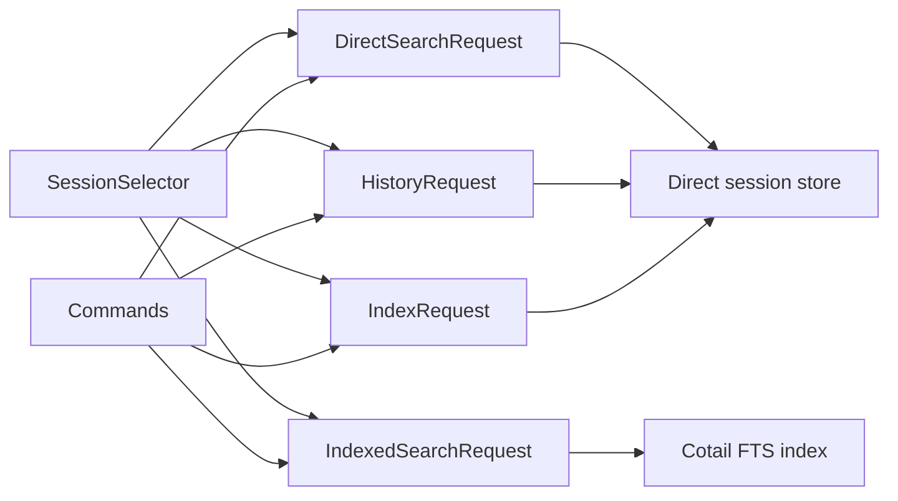

# Operation-Shaped Session Query Architecture

## Direction

Cotail should not have one universal `Query` type. It should have a small,
reusable `SessionSelector` embedded in several operation-specific requests.
Direct search, indexed search, history, indexing, and lookup produce different
answers and should retain distinct contracts.

The shared abstraction is deliberately narrow:

> A session selector is a conjunction of inexpensive predicates over session
> identity and metadata.

Content matching is also part of selecting search results, but it is not part
of `SessionSelector`. It ranges over related rows, has explicit quantification,
and differs materially between regular-expression scans and FTS. Keeping these
concepts adjacent but separate prevents `SessionSelector` from becoming a
generic predicate tree.



This is an intentionally asymmetric design. The asymmetry reflects the domain
rather than accidental command structure.

## Domain Model

### Root object

The root object returned by search and history is a **session**. Content parts,
messages, and FTS rows are evidence used to qualify or describe a session; they
are not top-level search results today.

This choice gives cotail stable identity and deduplication semantics: one result
per session. A future command that returns individual messages or parts should
be a different operation, not a projection switch on session search.

### Vocabulary

| Term | Meaning |
|---|---|
| session | The root entity identified by an opencode session ID. |
| selector | Conjunctive criteria over fields belonging to one session row. |
| requirement | A condition that one related part or message must witness. |
| witness | A related row satisfying one requirement. Different requirements may have different witnesses. |
| match language | The backend-defined interpretation of text, such as JavaScript regex or FTS5 query syntax. |
| evidence | Returned material showing why a session matched. Evidence is not a predicate. |
| projection | The fields requested for an operation's result product. Kept fixed until a real need for caller-selected fields appears. |
| aggregate | A value computed over related rows, such as recent message count. |
| order | Operation-specific result ordering. It is not part of selection. |
| window | Limit and, later, cursor information applied after matching and ordering. |
| source layout | Cotail's internal description of an opencode V1 or V2 storage schema. |

`SessionSelection` is a reasonable phrase, but the value should be named
`SessionSelector`: it describes reusable criteria, while "selection" can also
mean the result set. The distinction is useful in APIs such as
`scanSessions(selector)`.

## Semantic Boundaries

The query concepts fall into five categories and should not be represented by
one field bag.

| Category | Examples | Owner |
|---|---|---|
| Session selector | IDs, directory, project, updated range | Shared domain type |
| Match requirements | Title patterns, related-part patterns, role | Search operation |
| Evidence | Snippet, highlighted passage, matching part ID | Search operation and backend |
| Aggregates | Total messages, messages since cutoff | History operation |
| Delivery | Order, limit, future cursor | Each operation |

The important invariant is that adding evidence or an aggregate cannot alter
whether a session matches. This separates current `showSnippet` behavior from
the content predicate even if one SQL statement computes both.

## Proposed Interfaces

The syntax below emphasizes semantic shape. Names can be adjusted during
implementation.

### Shared session selector

```ts
export interface SessionSelector {
  ids?: readonly string[];
  projectIds?: readonly string[];
  directory?: DirectorySelector;
  updatedAt?: TimeRange;
  createdAt?: TimeRange;
}

export type DirectorySelector =
  | { kind: "contains"; value: string }
  | { kind: "exact"; value: string };

export interface TimeRange {
  from?: number;
  until?: number;
}
```

Fields in `SessionSelector` are ANDed. Values within `ids` and `projectIds` are
ORed. Empty arrays are invalid rather than silently meaning either all or none.
Ranges are half-open: `from <= value < until`.

This is a closed vocabulary, not a field/operator map. A new selector is added
only after its domain meaning and support in relevant stores are established.
It does not expose SQLite names such as `project_id` or `time_updated`.

### Direct regular-expression search

```ts
export interface RegexPattern {
  source: string;
  caseSensitive: boolean;
}

export interface DirectSearchRequest {
  select: SessionSelector;
  match: DirectMatch;
  evidence: DirectEvidenceRequest;
  order: "updated-desc";
  limit: number;
}

export type DirectMatch =
  | { relation: "title"; patterns: PatternSet }
  | { relation: "part"; requirements: PartRequirements };

export interface PatternSet {
  all?: readonly RegexPattern[];
  any?: readonly RegexPattern[];
  none?: readonly RegexPattern[];
}

export interface PartRequirements {
  all: readonly PartRequirement[];
  any?: readonly PartRequirement[];
  none?: readonly PartRequirement[];
}

export interface PartRequirement {
  partTypes: readonly PartType[];
  role?: readonly MessageRole[];
  text: PatternSet;
}

export type DirectEvidenceRequest =
  | { kind: "none" }
  | { kind: "first-witness"; requirement: number; maxChars: number };
```

`PatternSet` is a bounded boolean vocabulary for one value. It is not recursive.
`PartRequirements` adds exactly one relational quantification layer:

| Field | Meaning |
|---|---|
| `all` | Every requirement must have at least one witness part. |
| `any` | At least one requirement must have a witness part. |
| `none` | No listed requirement may have a witness part. |

A `PartRequirement` is satisfied by one part. Therefore patterns within that
requirement apply to the same part. Separate requirements may be witnessed by
different parts.

Current multi-pattern behavior becomes one requirement per pattern:

```ts
const currentSemantics: PartRequirements = {
  all: patterns.map((pattern) => ({
    partTypes: ["text"],
    text: { all: [pattern] },
  })),
};
```

Requiring `opencode` and `journal` in the same part is different and explicit:

```ts
const samePart: PartRequirements = {
  all: [{
    partTypes: ["text"],
    text: { all: [opencodePattern, journalPattern] },
  }],
};
```

This bounded shape supports the likely cases without admitting arbitrary nested
AND/OR trees, field comparisons, joins, or caller-defined SQL.

### Indexed FTS search

Indexed search should not implement `DirectSearchRequest`.

```ts
export interface IndexedSearchRequest {
  select: SessionSelector;
  query: FtsQuery;
  evidence: "none" | "highlight";
  order: "relevance" | "updated-desc";
  limit: number;
}

export type FtsQuery =
  | { kind: "terms"; terms: readonly string[]; combine: "all" | "any" }
  | { kind: "phrase"; value: string }
  | { kind: "advanced"; expression: string };
```

`FtsQuery` is an input language owned by the FTS backend. It does not claim to
be equivalent to JavaScript regex. The `advanced` form can expose documented
FTS syntax without contaminating the direct-search model.

If the CLI later offers `--backend direct|index`, it must either parse flags
into the selected request type or reject unsupported combinations. It must not
silently reinterpret regex as FTS terms or fall back from FTS to a direct scan.

### Results and evidence

```ts
export interface SessionSummary {
  id: string;
  slug: string;
  title: string;
  directory: string;
  projectId: string;
  timeCreated: number;
  timeUpdated: number;
}

export interface SearchHit {
  session: SessionSummary;
  evidence?: SearchEvidence;
  score?: number;
}

export type SearchEvidence =
  | {
      kind: "part-witness";
      text: string;
      partId?: string;
      requirement: number;
    }
  | {
      kind: "fts-highlight";
      text: string;
      partId: string;
    }
  | {
      kind: "title-witness";
      text: string;
    };
```

Evidence has a normalized outer role but retains its provenance. A direct
substring and an FTS highlight are not labeled as the same thing. `score` is
optional because recency-ordered direct scans do not invent relevance scores.

The current direct snippet rule can be retained precisely: request evidence
for requirement zero, choose its earliest witness by source order, extract its
text, and truncate to 200 characters. This is now an explicit policy rather
than a side effect of `patterns[0]` parameter ordering.

### History

```ts
export interface HistoryRequest {
  select: SessionSelector;
  messageCounts: {
    total: true;
    since?: number;
  };
  order: "updated-desc";
  limit?: number;
}

export interface HistoryEntry {
  session: SessionSummary;
  messages: {
    total: number;
    since?: { cutoff: number; count: number };
  };
}
```

The current `history --since 24h` deliberately uses the same cutoff in two
different semantic positions:

```ts
const cutoff = parseSince("24h");
const request: HistoryRequest = {
  select: { updatedAt: { from: cutoff } },
  messageCounts: { total: true, since: cutoff },
  order: "updated-desc",
};
```

The selector answers which sessions are active enough to list. The aggregate
answers how many messages fall in the reporting interval. Conflating them in a
generic date predicate would hide this distinction.

### Deep module seam

Commands should depend on operation interfaces rather than SQL builders:

```ts
export interface DirectSessionStore {
  search(request: DirectSearchRequest): readonly SearchHit[];
  history(request: HistoryRequest): readonly HistoryEntry[];
  scanSessions(selector: SessionSelector): AsyncIterable<SessionSummary>;
  getSession(id: string): SessionSummary | undefined;
}

export interface SessionSearchIndex {
  search(request: IndexedSearchRequest): readonly SearchHit[];
}
```

The direct store owns source detection, V1/V2 layout, SQL generation, binding,
row mapping, and deduplication. The index owns FTS syntax, rank, and highlights.
The command owns argument parsing, backend choice, and presentation.

`scanSessions` supports indexing and other bulk traversal. Transcript reading
should use `getSession(id)` plus a future explicit content reader; forcing an
exact-ID lookup through a general selector gives no leverage.

These interfaces may initially remain plain functions grouped by module. The
architectural boundary matters more than introducing classes or dependency
injection immediately.

## Direct SQLite Lowering

Compiled `{ sql, params }` artifacts should remain internal. They are useful
implementation values but not domain objects or public APIs.

### Session-only selection

```ts
const selector: SessionSelector = {
  projectIds: ["proj_a", "proj_b"],
  directory: { kind: "contains", value: "/src/cotail" },
  updatedAt: { from: 1_786_233_600_000, until: 1_788_912_000_000 },
};
```

Conceptual lowering:

```sql
SELECT s.id, s.slug, s.title, s.directory, s.project_id,
       s.time_created, s.time_updated
FROM session AS s
WHERE s.project_id IN (?, ?)
  AND instr(s.directory, ?) > 0
  AND s.time_updated >= ?
  AND s.time_updated < ?
ORDER BY s.time_updated DESC
```

Parameters remain bound values. The compiler owns the intentional semantics of
directory `contains`; callers do not provide `%` patterns or SQL expressions.

### Title search

```ts
const request: DirectSearchRequest = {
  select: { updatedAt: { from: cutoff } },
  match: {
    relation: "title",
    patterns: { all: [opencodePattern, journalPattern] },
  },
  evidence: { kind: "none" },
  order: "updated-desc",
  limit: 50,
};
```

Conceptual lowering:

```sql
SELECT s.id, s.slug, s.title, s.directory, s.project_id,
       s.time_created, s.time_updated
FROM session AS s
WHERE s.time_updated >= ?
  AND re(?, s.title)
  AND re(?, s.title)
ORDER BY s.time_updated DESC
LIMIT ?
```

Title is a session-field relation, not a synthetic content part. Combining
title and content with cross-relation OR is intentionally not supported by the
first model.

### Multi-pattern content search

For current semantics, `opencode` and `journal` become separate requirements:

```sql
SELECT s.id, s.slug, s.title, s.directory, s.project_id,
       s.time_created, s.time_updated,
       substr((
         SELECT json_extract(p0.data, '$.text')
         FROM part AS p0
         WHERE p0.session_id = s.id
           AND json_extract(p0.data, '$.type') = 'text'
           AND re(?, json_extract(p0.data, '$.text'))
         ORDER BY p0.time_created
         LIMIT 1
       ), 1, ?) AS evidence_text
FROM session AS s
WHERE s.time_updated >= ?
  AND EXISTS (
    SELECT 1 FROM part AS p1
    WHERE p1.session_id = s.id
      AND json_extract(p1.data, '$.type') = 'text'
      AND re(?, json_extract(p1.data, '$.text'))
  )
  AND EXISTS (
    SELECT 1 FROM part AS p2
    WHERE p2.session_id = s.id
      AND json_extract(p2.data, '$.type') = 'text'
      AND re(?, json_extract(p2.data, '$.text'))
  )
ORDER BY s.time_updated DESC
LIMIT ?
```

The evidence pattern is requirement zero's pattern. The two `EXISTS` clauses
may find different parts. A same-part requirement would lower to one `EXISTS`
containing two `re(...)` predicates.

Predicate pushdown occurs naturally because session predicates remain on the
outer query. This reduces correlated scans but does not make unindexed
predicates cheap. The module should promise semantics, not a particular SQLite
query plan.

## V1, V2, and Storage Layout

V1 and V2 are source layouts of the same direct operation, not public search
backends. The current static schema descriptor is a useful starting point, but
it should remain internal and grow around relations rather than command flags.

```ts
interface SourceLayout {
  session: SessionRelation;
  content: ContentRelation;
  messages?: MessageRelation;
}
```

Each relation descriptor contains trusted SQL fragments selected by cotail,
never user data. The direct compiler lowers the same `DirectSearchRequest` or
`HistoryRequest` against the detected layout. Layout-specific code handles:

- V1 `part` rows versus V2 `message.part.updated.1` events.
- Session foreign-key expressions.
- Part type and text extraction.
- Stable witness ordering.
- Part-to-message linkage needed for role constraints.
- Message counting across `message` and `session_message` tables.

Detection should choose and validate one coherent layout for an opened source.
If mixed tables truly represent additive data, that behavior should be proven
with fixtures before retaining multi-source deduplication. It should not be an
accidental loop over adapters.

The FTS index is a separate backend because it owns copied data and a different
match language. It can reuse `SessionSelector` only if its metadata schema can
honor every populated selector field exactly. Unsupported selector fields are
rejected; querying the live database after FTS matching is not an automatic
fallback because it changes freshness and performance behavior.

## Capability and Error Policy

Separate request types provide most capability checking statically. Runtime
errors are still needed when a selected source layout lacks required data.

```ts
export type QuerySupportError =
  | { kind: "unsupported-selector"; field: keyof SessionSelector; backend: string }
  | { kind: "unsupported-requirement"; feature: "role" | "part-type"; layout: string }
  | { kind: "invalid-query"; reason: string };
```

The policy is rejection, not silent fallback. Capability negotiation is not a
public protocol yet; it would add ceremony before cotail has multiple dynamic
providers. An internal `validateRequest(layout, request)` function is enough.

## Future Feature Fit

### Project

`--project` adds `projectIds` to `SessionSelector`. Direct SQL maps it to
`session.project_id`; the index maps it to `indexed_session.project_id`. It is
available to search, history, and indexing without changing match compilers.

### Date range

`--since` populates `updatedAt.from`. A future `--before` populates
`updatedAt.until`. Created-time filters remain distinct through `createdAt`.
History may deliberately reuse a cutoff for a message-count aggregate.

### Role

Role belongs on `PartRequirement`, so it binds to the same witness as part type
and text. Its direct lowering is an `EXISTS` over a part joined to its owning
message. It should not ship until V1 and V2 part-to-message linkage is verified.
The FTS index must persist role if indexed role filtering is desired; otherwise
an indexed request containing role is rejected.

### OR

OR within one title or part value fits `PatternSet.any`. OR among related-part
requirements fits `PartRequirements.any`. OR between a session field and a
content requirement does not fit and should wait for demonstrated CLI use.

This boundary is intentional. Cross-relation OR is the point where a recursive
logical plan may become justified; supporting it speculatively would turn the
model into a query language.

### Negation

`PatternSet.none` expresses a value that must not match patterns.
`PartRequirements.none` expresses `NOT EXISTS` for related parts. These are
different scopes. CLI syntax should make the distinction clear before either
is exposed.

### Phrase

Direct fixed-string phrase search is a regex pattern whose source has been
escaped. Indexed phrase search is `{ kind: "phrase", value }` and follows the
index tokenizer. They are intentionally different semantics despite similar
CLI spelling.

## Testing Strategy

Tests should assert behavior at module boundaries, not exact SQL text.

| Test layer | Assertions |
|---|---|
| Selector normalization | Empty arrays rejected, ranges validated, paths normalized before construction. |
| Direct store contract | Seeded V1/V2 databases return the same session-level results for supported requests. |
| Quantification fixtures | Separate patterns may match separate parts; same-requirement patterns must match one part. |
| Evidence fixtures | Evidence comes from the requested requirement and stable first witness. |
| History fixtures | Session cutoff and message-count cutoff affect their distinct result dimensions. |
| Capability tests | Unsupported role or selector fields fail explicitly. |
| FTS contract | Tokenization, phrase, ranking, and highlights are tested as FTS semantics, not regex equivalence. |
| Command tests | CLI flags construct the intended request and rendering does not affect matching. |

Small compiler unit tests may inspect parameter count and binding order, but
full SQL snapshots should be avoided. Seeded SQLite databases exercise JSON
paths, joins, null behavior, correlation, and ordering that string assertions
cannot verify.

Cross-layout contract fixtures are particularly valuable. A fixture describes
sessions, messages, and parts once, materializes equivalent V1 and V2 databases,
and runs the same operation suite against both stores.

## Incremental Implementation

Each item is intended as one small logical commit with passing behavior tests.

1. **Define session products.** Introduce camelCase `SessionSummary` mapping and preserve current command output through render adapters.
2. **Extract selector compilation.** Add `SessionSelector`, compile directory and updated-time predicates in one internal helper, and test it through seeded session listing.
3. **Move title search behind the store.** Replace command-local title SQL with `searchDirect`, retaining current AND, regex, ordering, and limit behavior.
4. **Name current content quantification.** Introduce `PartRequirement` with one requirement per CLI pattern and lower it to the existing independent `EXISTS` semantics.
5. **Separate evidence policy.** Replace `showSnippet` with `DirectEvidenceRequest`; preserve first-pattern, first-part, 200-character behavior.
6. **Unify layout internals.** Replace public `Source.searchContent` orchestration with one detected `SourceLayout` consumed by the direct store; add equivalent V1/V2 fixtures.
7. **Move history behind the store.** Express session activity cutoff through `SessionSelector` and message counts through `HistoryRequest` aggregates.
8. **Reuse selectors for index traversal.** Add `scanSessions(selector)` and migrate future index selection to it before implementing content copying.
9. **Introduce indexed search independently.** Add `SessionSearchIndex` and `IndexedSearchRequest` with FTS-specific contract tests.
10. **Add one feature at a time.** Project and bounded date ranges are low-risk selector additions; role waits for schema experiments; OR and negation wait for CLI semantics.

The migration should not begin with directory reshuffling, classes, a planner
AST, or FTS abstractions. First concentrate existing semantics behind callable
operations, then let the second backend prove which vocabulary is truly shared.

## Alternatives Considered

### One universal logical query AST

A relation-aware AST could represent session predicates, `EXISTS`, boolean
composition, projections, aggregates, ordering, and limits. It would make
cross-relation OR possible and could lower to SQL or FTS.

It is rejected for now because FTS is not merely another physical plan for
regex semantics. The AST would either lie about equivalence or leak backend
operators. It would also expose a miniature database language to a CLI with a
small current grammar.

### One search request with a backend discriminator

`SearchRequest<{ backend: "direct" | "fts" }>` looks uniform, but conditional
fields quickly make invalid combinations representable: regex plus relevance
ranking, FTS phrase plus first-regex witness, or fallback rules hidden in
execution. Separate request types are simpler and more honest.

### Only share `SessionSelector`; leave content as command control flow

This is close to current code and minimizes types, but it leaves cotail's main
behavior outside the deep module. `PartRequirement` is the minimum additional
concept needed to state current session-level AND semantics and evidence
provenance explicitly.

### Expose SQL fragments or a generic field/operator map

This makes extension superficially easy but couples callers to storage columns,
weakens binding safety, and makes V1/V2/FTS evolution harder. A closed selector
and trusted internal compiler provide more leverage with less surface area.

### Normalize direct and FTS results completely

A single `snippet` and `rank` shape is attractive for rendering, but it erases
whether text is an ordered witness or tokenizer-generated highlight and invites
comparisons between incomparable scores. The proposed result shares session
identity while discriminating evidence provenance.

## Unresolved Decisions and Experiments

1. **Mixed V1/V2 databases:** Determine whether `part` and `event` can both contain unique live content. The result decides whether layout detection chooses one relation or deliberately unions sources.
2. **Stable V2 witness identity:** Verify whether an event exposes a durable part ID and whether `seq` is the correct first-witness order.
3. **Tool content boundary:** Decide whether tool matching covers input, output, both as one value, or separate fields. Current matching against whole JSON and snippet extraction from input are not one coherent semantic field.
4. **Role linkage:** Document and fixture-test the V1 and V2 joins from content part to message role before adding `role` to executable requests.
5. **Directory meaning:** Decide whether current substring behavior remains public or becomes normalized exact/prefix matching. The selector names the choice so a change cannot be accidental.
6. **Invalid regex timing:** Decide whether request construction validates all regexes before opening/querying the database. Early validation gives deterministic errors even when no row invokes `re()`.
7. **Evidence with `any`:** Define which requirement wins when several match. Candidate policy: lowest request index, then earliest source witness.
8. **Limit zero:** Standardize whether zero means no rows or unlimited. Search and history currently differ.
9. **FTS metadata coverage:** Verify which selector fields are copied atomically enough to support exact filtering and define stale-index reporting separately from query semantics.
10. **Advanced FTS syntax:** Decide whether the CLI exposes raw FTS5 expressions or only structured terms and phrases after usability experiments.

## Recommendation

Implement the operation-shaped design through direct search and history before
building FTS. Its critical test is not whether every future query can be typed;
it is whether current behavior can be stated precisely while commands stop
knowing SQL.

If future requirements repeatedly demand boolean composition across session,
title, content, and aggregate relations, introduce an internal logical plan
then. Until that evidence exists, a reusable `SessionSelector`, one bounded
related-part quantifier, and separate direct/FTS requests form the smaller and
deeper interface.
