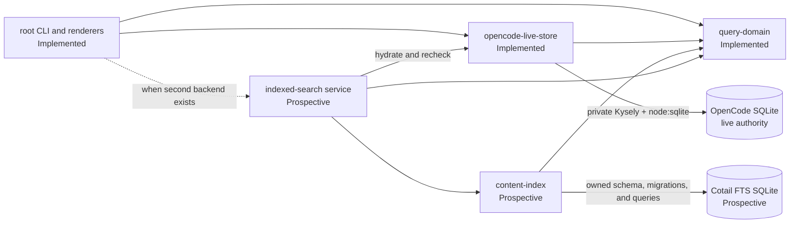

# Cotail Query System

> **This was a failed synthesis.** It was a fuckup because it centered the
> implementation and FTS roadmap instead of adjudicating the selector/scope
> object-model objective. Use [`design2.md`](/query/design2.md) for the recovered
> and sharpened session qualification and witness design.

## What Are We Building?

Cotail query is a command and library system for finding the OpenCode sessions a
person needs: by content, title, recency, identity, and eventually a fast local
full-text index. It returns sessions, not database rows. The live OpenCode
database remains authoritative for session identity and metadata, while each
search backend is explicit about the matching, evidence, ranking, and freshness
it can actually provide.

Today, `cotail search`, `cotail history`, and `cotail get-session` use a hardened
read-only direct backend. The next product step is not to generalize that backend
into a universal query language. It is to add useful capabilities in operation-
shaped increments, then introduce an index as a distinct accelerator with live
metadata reconciliation.

## Build Objective And User Promise

Cotail serves people and scripts that need to recover work from a large OpenCode
history without knowing OpenCode's changing SQLite schema.

The system must let a user:

- find sessions containing direct regex or literal text, with inspectable
  evidence;
- find sessions by title;
- list recent work with canonical message counts;
- resolve a known, directory-associated, or process-associated session;
- scope operations by stable session metadata; and
- eventually search a maintained FTS index at interactive latency without
  presenting stale copied metadata as live truth.

The desired interaction shape is `parse intent -> call one operation -> render`.
History and resolution should remain metadata-fast. Scoped direct search should
be useful on the live database, while unscoped corpus search may take seconds.
Indexed search should target sub-second interactive response, but no latency
number becomes a contract until measured on representative corpora.

The user promise is semantic, not merely syntactic: the same session must not be
duplicated because it has several matching content units or two physical storage
generations; omitted or reverted legacy records must not reappear; and a fast
backend must not silently reinterpret a regex as tokenized FTS.

## Scope And Non-Goals

### Implemented

- `searchDirect`: title or content search using regex/literal patterns, selectors,
  bounded booleans, recency order, limits, and optional evidence.
- `history`: recent canonical sessions with total and cutoff-relative canonical
  message counts.
- `resolve`: exact ID/directory or general selector resolution with `latest` and
  `only` modes.
- Owner-aware V1/V2 metadata, content, and count normalization.
- Existing human, JSONL, and TSV command output compatibility.

### Next

- Decide and expose a useful user-facing subset of the already implemented
  selector and boolean operation vocabulary.
- Decide canonical searchable units for V2 tool and shell data before enabling
  those requests.
- Prototype the cotail-owned FTS boundary, including extraction, checkpointing,
  candidate shape, freshness, and live hydration.

### Prospective

- `cotail index` and `cotail status` operations.
- Indexed terms, phrase, or advanced search with backend-specific ranking and
  highlights.
- Project, ID, created/updated range, role, OR, exclusion, and same-witness CLI
  forms where user research justifies them.
- Reusable normalized inventory for downstream watch/index workflows.

### Non-Goals

- A recursive `And | Or | Not | Leaf` predicate AST or miniature public SQL
  language.
- A public SQL plan, Kysely builder, physical schema, or native database handle.
- Pretending direct regex and FTS token/phrase matching are equivalent.
- Using the index as authority for history, resolution, counts, or live session
  metadata.
- Reading an actively migrating mixed database by guessing partial authority.
- Searching OpenCode's event log as a substitute for canonical projections.
- Transcript rendering, watch/event fidelity, bookmarks, or work-ledger ranking;
  those may consume query operations but have separate product designs.
- Adding indexes, views, or any writes to OpenCode's database.

## Design Principles And Invariants

1. **Sessions are the root.** A session is the identity, result, ordering, limit,
   and deduplication unit. Content units are witnesses, not top-level results.
2. **Live metadata is authoritative.** Only the live-store boundary may construct
   an authoritative `SessionSummary`. An index may return candidates and copied
   fields for pushdown, never final session truth.
3. **Capabilities are honest.** Unsupported selectors, layouts, content kinds,
   or match languages must fail clearly. A backend must not silently weaken or
   translate semantics.
4. **Witness scope is bounded and structural.** Patterns inside one requirement
   share one content witness. Separate requirements may use independent
   witnesses. Two non-recursive `all`/`any`/`none` scopes are sufficient.
5. **Qualification and evidence are separate.** Evidence must be mechanically
   selected from positive predicates that already qualified the session. Turning
   evidence on or off must not change membership.
6. **Evidence is deterministic.** Positive `all` requirements precede matching
   `any` requirements in request order; a requirement's witnesses order by
   canonical major ordinal, minor ordinal, then content identity. Negative
   requirements never produce evidence.
7. **Compatibility is explicit.** Existing CLI parsing, output bytes, ordering,
   limit behavior, exit status, and errors remain characterized until a deliberate
   product change replaces them.
8. **Migration authority fails closed.** A mixed database with legacy sessions
   is readable only after `migration.v1-v2` reports `phase: "completed"`.
   Partial layouts and integrity ambiguity are errors.
9. **Packages are deep, not numerous.** A package must enforce a meaningful
   dependency or authority boundary and hide substantial mechanism. Directories
   suffice until a second backend creates a real seam.

## User-Facing Operations

### Direct content search

**Implemented.** `cotail search alpha beta` performs case-insensitive regex search
by default. Each term is a separate required witness, so different content units
may match `alpha` and `beta`. Existing flags and JSONL retain their behavior.
Results use live `timeUpdated` descending and one global session limit;
`limit: 0` returns none. Unscoped search is a scan.

### Title search

**Implemented.** `--title-only` applies all positional patterns to one title
value, making multi-term title search a same-value conjunction. It shares
canonical session selection, ordering, limits, and rendering.

### History

**Implemented.** `cotail history` answers "what was I working on recently, and
where?" from live metadata and counts. Session and count cutoffs remain separate
request concepts even when the CLI supplies one timestamp. It orders by
`timeUpdated` descending; `limit: 0` means unlimited.

### Session resolution

**Implemented.** `get-session` resolves a specific ID or selects the latest
canonical session matching an exact directory. PID and environment handling
remain command concerns; the live store returns at most one `SessionSummary`.

### Future indexed search

**Prospective.** Indexed search will use an FTS-native request and result type.
It may support terms, phrases, expert expressions, relevance, and highlights.
It must expose freshness/provenance and must not claim regex semantics. Final
syntax does not exist.

### Future boolean/query surface

**Open decision.** The operation API already supports `all`, `any`, and `none` at
both scopes. The CLI should eventually expose OR, exclusion, and same-witness
terms, but flags, grouping, and query grammar await examples and parser tests.

## Domain Model And Semantics

### Session selection

`SessionSelector` is conjunctive across populated fields:

- `ids` and `projectIds`: membership in a non-empty list;
- `directory`: explicit `exact` or substring `contains` mode; and
- `updated`: a half-open range, `from <= timeUpdated < to`.

Empty arrays, empty directory values, non-finite times, and ranges where
`from >= to` are invalid. The current domain does not yet expose `created` even
though earlier drafts proposed it.

### Patterns and requirements

A `TextPattern` has non-empty source text, regex or literal mode, and optional
case sensitivity. Invalid regexes fail during request validation even if no row
would invoke the SQLite `re()` function.

A `PatternSet` applies to one string value. A `ContentRequirement` applies types,
optional roles, and one `PatternSet` to one normalized content unit. A
`ContentRequirements` value quantifies over those requirements.

At either scope, every present group participates conjunctively:

| Group | Pattern-level meaning on one value | Requirement-level meaning in one session |
|---|---|---|
| `all` | every pattern matches the same value | every requirement has some witness |
| `any` | at least one pattern matches the same value | at least one requirement has some witness |
| `none` | no listed pattern matches the value | no listed requirement has any witness |

A present group must be non-empty, and at least one group must be present. At
requirement level, each `all` member uses an independent correlated `EXISTS`, the
`any` group is a disjunction of correlated `EXISTS`, and each `none` member is a
correlated `NOT EXISTS`.

### Same witness and independent witnesses

Current CLI compatibility uses independent witnesses:

```ts
requirements: {
  all: ["alpha", "beta"].map((source) => ({
    types: ["text"],
    text: { all: [{ source }] },
  })),
}
```

To require one unit containing both terms, put both patterns in one requirement:

```ts
requirements: {
  all: [{
    types: ["text"],
    text: { all: [{ source: "alpha" }, { source: "beta" }] },
  }],
}
```

No group ID or recursive expression tree is needed; the request nesting defines
the witness boundary.

### Qualification and evidence

Qualification asks whether a session satisfies selectors and match requirements.
Evidence is a projection from a qualifying positive witness. The implementation
uses the same private witness-predicate construction for both, preventing snippet
logic from becoming an accidental extra filter.

When evidence is requested, search considers positive `all` requirements in
request order, then positive `any` requirements in request order. It selects the
first matching requirement and that requirement's earliest witness by
`(ordinalMajor, ordinalMinor, contentId)`. `none` is ineligible. The implemented
result currently guarantees `evidenceText`; richer optional witness provenance
exists in the domain shape but is not yet populated by the live store.

### Results, order, limits, and errors

`SessionSummary` is the normalized live identity product. `SearchResult` is the
minimal renderer surface:

```ts
interface SearchResult {
  session: SessionSummary;
  evidenceText?: string;
}
```

`DirectSearchHit` adds `backend: "direct"`; a future indexed hit must remain a
distinct type so rank, highlight, freshness, and provenance are not erased.
History returns session fields plus canonical recent and total counts. Resolution
returns one session or `undefined`.

Current search and history order by `timeUpdated` descending. Equal-timestamp tie
behavior is not a stable contract yet and must be decided before cursor-based
pagination. Search limits are non-negative safe integers and zero returns none;
history zero means unlimited. These operation-specific compatibility semantics
must not be hidden behind a falsely uniform window type.

Errors fall into four behavioral classes: invalid request, unsupported backend or
content capability, unsupported/invalid storage layout, and lifecycle failure.
They currently surface as deterministic `Error` messages. Typed error values may
be introduced when a second backend needs programmatic dispatch, without changing
the fail-closed policy.

## Architecture



### Implemented packages

- `@opencoattails/query-domain` owns storage-independent selectors, patterns,
  requests, results, and validation. It has no workspace dependency.
- `@opencoattails/opencode-live-store` owns capability detection, canonical
  session roots, V1/V2 normalization, operation lowering, the select-only
  `node:sqlite` adapter, and connection lifecycle. It depends on `query-domain`
  and Kysely 0.29.5.
- `@opencoattails/test-contracts` owns reusable fixture builders and semantic
  suites. It is development-only and depends on `query-domain`.
- The root package owns commands, database discovery, process resolution,
  compatibility mapping, and human/JSONL/TSV renderers. A renderer package is
  not yet deep enough to justify extraction.

Only `opencode-live-store` may import Kysely for live queries. Commands, domain
types, and renderers must not mention Kysely, physical tables, compiled SQL,
`DatabaseSync`, or layout capability records.

The explicit workspace edges are `opencode-live-store -> query-domain`, root
composition -> `query-domain + opencode-live-store`, and development-only
fixtures/tests -> `test-contracts + query-domain`. The prospective index may
depend on `query-domain`; the prospective indexed-search service may depend on
`content-index + opencode-live-store + query-domain`. Neither prospective edge
is present today.

### Operation-shaped interfaces

The implemented live surface is deliberately small:

```ts
interface OpenedOpencodeLiveStore {
  searchDirect(request: DirectSearchRequest): Promise<readonly DirectSearchHit[]>;
  history(request: HistoryRequest): Promise<readonly HistoryEntry[]>;
  resolve(request: ResolveRequest): Promise<SessionSummary | undefined>;
  close(): Promise<void>;
}
```

**Prospective:** `content-index` should own index schema, migrations,
checkpoints, extraction writes, and candidate queries. It must return candidate
identity/evidence/freshness, not `SessionSummary`. An indexed-search service
should own candidate batching, session deduplication, live hydration, selector
recheck, missing-session removal, and refill. Add `hydrate`/`matches` operations
to the live store only when this real consumer exists.

## Storage Model And Authority

[`authority0.md`](/query/authority0.md) is normative for external storage
interpretation. Its rules are summarized here so this design is buildable alone.

### Canonical session ownership

- If a session ID exists in `session_v2`, that row owns metadata, V2 content, and
  V2 counts.
- A session present only in legacy `session` is V1-owned and uses legacy
  `message`/`part` content and counts.
- The canonical root is all `session_v2` rows plus only legacy `session` rows
  whose ID has no V2 owner.
- A V2 owner with zero `session_message` rows canonically has zero rows. It must
  not fall back to preserved V1 records.

### Completed migration authority

When complete V1 and V2 layouts coexist and legacy sessions are present, the
database must contain `kv['migration.v1-v2']` JSON with `phase: "completed"`.
Absent, malformed, running, or incomplete state is rejected. Complete pure-V1
and pure-V2 databases remain supported. Partial owner layouts are rejected; the
narrow exception is an unused `session_message` adjunct beside a complete V1
layout because `session_v2`, not `session_message`, declares V2 ownership.

### Content and counts

- V1-owned content comes from `part` joined to `message`. Text and reasoning use
  `$.text`; current V1 tool matching uses the part JSON while evidence uses
  `$.state.input`, preserving established behavior.
- V2-owned searchable content currently includes user message text and assistant
  text/reasoning content-array items.
- V2 evidence order is `session_message.seq`, content-array position, content
  identity. Sequence starts may be nonzero and gaps are valid.
- V2 tool and shell content are unsupported pending canonical text decisions.
  Control records are not searchable.
- V2-owned counts include every `session_message` row, including controls. V1-
  owned counts include every `message` row. Zero rows means zero.

V1 and V2 content or counts must never be added, ID-unioned, or compared for
equality to infer authority. Migration can omit subtasks, collapse compactions,
transform records, and leave preserved V1 residue. Reverts delete native rows
without deleting legacy rows. A residue union would resurrect deliberately
omitted or reverted history.

Open-time validation also rejects duplicate native message IDs and matching IDs
assigned to different sessions across layouts.

## Direct And Indexed Backends

### Direct backend

**Implemented.** The direct backend reads canonical live rows, applies JS regex
or escaped-literal matching through a registered SQLite `re()` function, and
orders by live recency. It has precise witnesses and deterministic evidence but
may scan many rows. It has no relevance, tokenization, phrase, or FTS highlight.

### Indexed backend

**Prospective.** The index is a copied-content accelerator owned by cotail. Its
match language, ranking, highlights, and freshness are its own capabilities. It
should perform this pipeline:

1. Search indexed content for a ranked, over-fetched candidate batch.
2. Deduplicate candidates by session while retaining the best concrete indexed
   hit according to the declared result semantics.
3. Hydrate candidate IDs from the live store.
4. Drop deleted/missing sessions and recheck the complete live selector.
5. Refill from the index until the requested post-hydration limit is full or no
   candidates remain.
6. Return indexed hits carrying rank/evidence and explicit index freshness plus
   hydrated live `SessionSummary` values.

Copied metadata may prune candidates, but live hydration owns final identity and
selectors. Relevance should preserve candidate order; live `updated-desc` needs
a separate cursor contract. Extraction must reuse canonical ownership/content
policy, not direct-search SQL or renderer text. Generations/checkpoints must
detect changed, deleted, and incomplete sessions. Schema, tokenizer, ranking,
and stale-index policy await an executable prototype.

Backend selection must be explicit. `auto` is valid only where both semantics are
defined; it must report the backend and never silently turn regex into terms.

## Lifecycle, Runtime, And Safety

- Minimum runtime is Node.js 22.13+; development runs TypeScript directly.
- The live database uses built-in `node:sqlite` `DatabaseSync` with
  `{ readOnly: true }`, not a third-party native binding.
- Kysely is private query construction over a tested adapter. SQLite-specific
  JSON functions, `json_each`, `instr`, and `re()` remain narrow raw expressions.
- Kysely promises do not make `DatabaseSync` asynchronous. Native work blocks;
  do not use `Promise.all` as parallelism on one connection.
- The store owns its native connection. Commands close it in `finally`.
  `close()` is idempotent, operations after close fail, and open-time validation
  failures close the descriptor before rethrowing.
- Read-only file mode is the primary write barrier. The adapter additionally
  classifies statements and rejects writes, including data-changing CTEs, through
  Kysely's actual dispatch paths.
- Capability/domain validation precedes unsafe branches. Malformed layouts and
  incomplete migration fail closed.
- Concurrent independent stores are permissible. Operations sharing one store
  are serialized by JavaScript execution and synchronous SQLite work; no stronger
  concurrency guarantee is promised.
- A future writable index must have a separate connection, adapter/lifecycle,
  and migrations. It must never reuse or weaken the live store's select-only
  boundary.

## Current State

**Implemented and accepted.** Production has the three-package foundation,
Kysely 0.29.5 over `node:sqlite`, operation requests, both bounded boolean scopes,
owner-aware V1/V2 operations, deterministic evidence, lifecycle defenses, and
byte-compatible commands.

Evidence includes 21 live-store and 8 root tests on Node 22/26, strict checking,
live read-only checks, and plan review. See
[`implementation2.md`](/query/implementation2.md) for the final audit,
[`implementation1.md`](/query/implementation1.md) for authority and plan details,
and [`implementation4.md`](/query/implementation4.md) for implementation lineage.

FTS/indexing, hydration, indexed results, CLI booleans, and V2 tool/shell search
are not implemented.

## Build Sequence From Here

Each increment must deliver a user-visible or architecture-validating tracer
bullet and leave the current commands working.

1. **Expose selected direct-query value.** Choose the first missing selector or
   bounded boolean use cases from real examples, then add CLI parsing without
   changing positional compatibility. Acceptance: parser tests, operation
   fixtures, help/output/error characterization, and no SQL or backend concepts
   in command arguments.
2. **Resolve V2 tool/shell units.** Define matching text, evidence text, unit
   identity, type/role mapping, ordering, and redaction for tool input/output and
   shell command/output. Acceptance: source-backed V1/V2 fixtures prove
   qualification/evidence parity and unsupported variants still reject.
3. **Build a canonical extraction tracer.** Add an operation that traverses
   canonical owners and emits normalized indexable units plus session version
   information, without creating an index backend interface prematurely.
   Acceptance: pure/mixed/zero-row/omission/revert fixtures match direct storage
   authority and can resume from a defined checkpoint without residue union.
4. **Create the cotail-owned index and status path.** Implement explicit,
   idempotent SQLite migrations, writes, generation/checkpoint state, deletion
   handling, and `cotail status`. Acceptance: rebuild and incremental runs
   converge to identical contents; interrupted updates are detected; OpenCode's
   database remains read-only.
5. **Ship one indexed-search vertical slice.** Select one FTS query form and
   return ranked candidates with concrete evidence and freshness. Acceptance:
   executable corpus tests establish matching, ordering, limits, tokenizer
   behavior, and measured improvement over unscoped direct search.
6. **Add live hydration and reconciliation.** Introduce only the live-store
   batch operations and service package justified by the slice. Acceptance:
   changed/deleted metadata, stale candidate filters, duplicate session hits,
   and under-filled batches are rechecked/refilled to the declared semantics.
7. **Integrate backend-aware rendering and CLI selection.** Preserve one
   structural renderer surface while retaining direct witness or indexed
   rank/highlight/freshness in machine output. Acceptance: explicit backend
   selection, unsupported-combination errors, direct compatibility fixtures,
   and end-to-end indexed fixtures.
8. **Measure and harden.** Profile representative databases, establish freshness
   and latency budgets, inspect plans, and test Node/runtime/lifecycle failures.
   Acceptance: documented benchmark corpus, deterministic rebuilds, strict
   checking, minimum-Node tests, and no authority bypass.

## Open Decisions And Explicit Incompleteness

| Decision | Options and tradeoff | Needed evidence |
|---|---|---|
| FTS schema | Contentless/external-content FTS is compact but migration-sensitive; ordinary content tables simplify inspection and repair. | Executable migrations, rebuild size/time, query plans, corruption/interruption recovery. |
| Index runtime | Built-in writable `node:sqlite`, Turso/libSQL, or another SQLite-compatible runtime. Reuse simplifies deployment; portability/remote use may justify another engine. Kysely remains live-store-private. | FTS5 availability, install/runtime matrix, migration and concurrency prototype. |
| Freshness | Reject stale results, return with warning, or allow a caller threshold. Strictness improves trust; tolerance improves availability. | Measured index lag, user workflows, explicit generation/checkpoint model. |
| Indexed result semantics | Best content hit per session, aggregated highlights, or one hit per content unit. Session-root invariants favor one result per session, but evidence selection affects explainability and rank. | Ranked multi-hit fixtures and renderer examples. |
| V2 tool canonical text | Input only, output only, separate units, or structured concatenation. Existing V1 raw-match/input-evidence behavior is not a good cross-version definition. | OpenCode source audit, privacy/redaction review, representative tool records. |
| V2 shell canonical text | Command, output, or separate units. Combining is convenient but weakens witness meaning and may expose sensitive output. | Transcript/search examples and redaction policy. |
| CLI boolean syntax | Flags with repeated groups, a small expression grammar, or operation-specific options. Flags are simple but grouping is awkward; a grammar risks becoming a public AST. | Concrete tasks, help mockups, parser/error tests. |
| Ranking | Native BM25, recency blend, field boosts, or user-selectable order. More tuning can hide semantics and destabilize pagination. | Relevance corpus, explainability requirements, latency measurements. |
| Tokenizer/query forms | Unicode terms, stemming, phrase, prefixes, or raw FTS expert mode. Power increases backend coupling and escaping risk. | Search corpus and compatibility/security tests. |
| Tie order and pagination | Add session ID tie-breaks and cursors now or wait for indexed order. Determinism helps automation; changing current tie behavior is a compatibility decision. | Equal-timestamp fixtures and intended scripting use. |
| Package extraction | Keep index/service/rendering in root directories until interfaces stabilize, or enforce packages as soon as writable/index and live authority meet. | A second backend with actual cross-boundary consumers; package must hide enough complexity to be deep. |
| Typed errors | Preserve message-based errors or introduce a closed error union for backend dispatch. Typed errors aid composition but add public compatibility surface. | Indexed backend integration needs and CLI mapping design. |

This design deliberately does not answer these by copying speculative details
from earlier drafts or the root README's illustrative FTS schema.

## Overall Acceptance Criteria

The query system is accepted when:

- all operations return one canonical result per session and use live owner-row
  metadata;
- pure V1, pure V2, completed mixed, zero-row, omission, compaction, revert,
  sequence-gap, malformed-layout, and incomplete-migration fixtures pass;
- pattern and requirement `all`/`any`/`none`, same/independent witnesses,
  positive-only evidence, roles/types, order, limits, and errors are executable;
- qualification is identical with evidence enabled or disabled, and evidence
  ordering is deterministic;
- direct and indexed requests expose only supported semantics, identify their
  backend, and never silently translate match languages;
- indexed results hydrate and recheck live metadata, drop missing sessions,
  refill limits, and report freshness under the selected policy;
- Kysely, live SQL/schema declarations, and native handles remain private to
  `opencode-live-store`, with separate read-only live and writable index
  lifecycles;
- Node 22.13+ tests cover read-only enforcement, write rejection, close/failure
  paths, strict type checking, and representative plans;
- existing direct CLI output and exits remain byte-compatible except where an
  explicitly accepted product change updates characterization; and
- measured direct and indexed performance meets published budgets on a named
  representative corpus.

## References And Lineage

- [`authority0.md`](/query/authority0.md) is the normative, source-backed storage
  authority decision. It establishes owner rows, completed migration state,
  zero-row ownership, omissions/reverts, no residue union, and count policy.
- [`adjudication0.md`](/query/adjudication0.md) supplies the builder decision,
  runtime/safety gates, private Kysely rule, narrowed package graph, and initial
  implementation brief.
- [`implementation2.md`](/query/implementation2.md) is the concise accepted
  production audit; [`implementation1.md`](/query/implementation1.md) carries the
  wider fixture, compatibility, and query-plan evidence.
- [`implementation4.md`](/query/implementation4.md) is an evidentiary comparison
  of implementation lineages. It is not the current build design.
- [`draft1.syn.md`](/query/draft1.syn.md) and
  [`draft1.gpt56sol.md`](/query/draft1.gpt56sol.md) are superseded architecture
  syntheses whose durable contributions are the session root, operation-shaped
  requests, bounded witness model, and honest direct/index distinction.
- [`draft-ksyley1.md`](/query/draft-ksyley1.md) is superseded as a current
  package/storage design, but remains useful for the prospective candidate,
  hydration, lifecycle, and package-depth ideas.
- [`packet-query-builders0.md`](/query/packet-query-builders0.md) is the original
  constraint/evaluation packet and remains useful as a review checklist.
- [`v2.md`](/v2.md) is earlier schema/transcript research. Its `session_message`
  and sequence findings remain useful; its message-presence fallback is
  superseded by `session_v2` ownership in `authority0.md`.

## Cross-References

- [`history-viewer/design.md`](/.design/history-viewer/design.md) defines the
  user promise and rendering shape for recent-session history. Its additive
  V1/V2 count assumption is superseded by owner-selected canonical counts here.
- [`watch/README.md`](/.design/watch/README.md) needs the same canonical session
  inventory for continuous observation. Future watch work should consume the
  owner/migration policy rather than independently preferring rows on collision.
- [`README.md`](/README.md) documents the current command surface and direct
  backend for users. Its planned FTS schema and Turso details are illustrative,
  not accepted query architecture.
- [`query-domain`](/packages/query-domain/src/index.ts),
  [`opencode-live-store`](/packages/opencode-live-store/src/index.ts), and the
  [`authority tests`](/packages/opencode-live-store/test/layout-authority.test.ts)
  are the current executable source of truth for implemented contracts.
