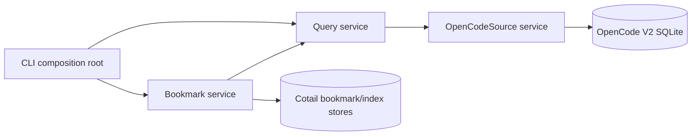

# Addressed Kysely Query World

## Answer

Cotail should expose a **Kysely query world** over stable logical OpenCode V2
relations. Library users should write ordinary Kysely selections, joins,
correlated subqueries, projections, aggregates, orderings, and windows. Cotail
should not interpose another selector or boolean-query language.

Cotail owns the parts that are not relational algebra:

- translating OpenCode V2 projections into stable logical relations;
- addressing every source or derived result at its natural grain;
- recording which observed revision an address referred to;
- identifying qualifying witnesses and returned evidence;
- standard result products and grouped-result assembly;
- source and search capabilities;
- read-only execution, lifecycle, errors, and tracing; and
- composition as a standalone CLI or embedded OpenCode service.

Effect Services and Layers own the running program. Kysely owns query
construction. OpenCode V2 owns source identities and projected state. The CLI is
the first consumer of the same public library that an OpenCode package or
endpoint can later host.

This design intentionally breaks with three earlier conclusions:

1. Kysely is part of the public programmable library, not only private lowering.
2. Session is an important result grain, not the universal result root.
3. V1 compatibility is deleted rather than normalized indefinitely.

## Design Commitments

1. **V2 projections only.** Cotail reads `session_v2`, `session_message`, and
   related current V2 projections. V1-only and incomplete-migration databases
   fail before query construction.
2. **Kysely is the query model.** Public composition uses Kysely expressions and
   select builders. Cotail helpers return those same objects.
3. **Logical relations are public; physical tables are not.** Normal V2 queries
   see a stable logical database type. Raw SQL remains an explicit trusted escape
   hatch capable of bypassing that boundary.
4. **Result grain is explicit.** Session, Message, Content, Tool, Shell,
   Attachment, Event, Aggregate, Group, and Bookmark products retain their
   identities and cardinalities.
5. **Every identifiable thing has an Address.** Address says where a thing is in
   the source model. It does not absorb descriptors, evidence, snapshots, or
   lineage.
6. **Observation is separate from identity.** An Address can survive source
   mutation; an Observation records the source revision or fingerprint actually
   seen.
7. **Evidence is a located projection from qualification.** It points to an
   Address and field and records why a result matched. It is not an optional text
   slot on a universal result.
8. **Searchability is broad by default.** Every V2 Message variant and relevant
   metadata relation receives an explicit document projection or an explicit
   reason it cannot safely have one.
9. **Effect owns effects.** Resource acquisition, execution, streaming,
   capabilities, failures, configuration, and tracing are Effectful. Pure Kysely
   construction remains pure.
10. **Power is not an error.** Arbitrary relational reads are a library feature.
    Convenience operations do not define the ceiling of the query model.

## Vocabulary

| Term | Meaning |
|---|---|
| **query world** | A scoped Kysely `QueryCreator` plus cotail helpers over logical V2 relations. |
| **logical relation** | A stable typed relation exposed to callers, derived from V2 projections rather than named after physical generations. |
| **selection** | Any Kysely boolean expression or query transformation that qualifies rows. “Scope” is reserved for Kysely table visibility and Effect resource lifetime. |
| **grain** | The identity and cardinality of one result row: Session, Message, Content, Tool, and so on. |
| **Address** | A structural, serializable locator for an entity or nested source item. |
| **Observation** | Address plus source/version facts describing the state observed by one read. |
| **document** | One searchable field occurrence derived from an addressed source item. |
| **witness** | A reusable query factory whose rows can qualify another row. |
| **evidence** | A selected witness/document showing why a returned result qualified. |
| **product** | An operation-owned typed result such as `MessageHit`, `GroupedSession`, or `HistoryRow`. |
| **capability** | A fact about available source relations or matching behavior, such as persisted events or FTS. |

`Selection` replaces the overloaded word `scope`. It is ordinary relational
selection, not a cotail object with a fixed field vocabulary.

## Address Model

### Why Address

`Pointer` usefully separated address from descriptor in the bookmark work, but
it was Session-shaped and implied mutable indirection. OpenCode already uses
`Reference` for another concept and `Location` for workspace/project location.
`Address` is the least overloaded term: it answers **where this result can be
resolved**.

An Address is hierarchical because OpenCode's stable identity is hierarchical.
A Message belongs to a Session even when its physical ID is globally unique. A
nested assistant item has no upstream ID and must be addressed by its position
within a Message. A tool has both a content position and a call ID.

### Types

The actual implementation should use Effect Schema and reuse OpenCode's branded
ID schemas where they are public. The semantic shape is:

```ts
type SourceAddress =
  | ProjectAddress
  | WorkspaceAddress
  | LocationAddress
  | SessionAddress
  | MessageAddress
  | ContentAddress
  | ToolAddress
  | ShellAddress
  | AttachmentAddress
  | EventAddress

interface ProjectAddress {
  readonly kind: "project"
  readonly projectId: Project.ID
}

interface WorkspaceAddress {
  readonly kind: "workspace"
  readonly workspaceId: Workspace.ID
}

interface LocationAddress {
  readonly kind: "location"
  readonly projectId: Project.ID
  readonly directory: string
  readonly workspaceId?: Workspace.ID
}

interface SessionAddress {
  readonly kind: "session"
  readonly sessionId: Session.ID
}

interface MessageAddress {
  readonly kind: "message"
  readonly sessionId: Session.ID
  readonly messageId: SessionMessage.ID
}

interface ContentAddress {
  readonly kind: "content"
  readonly sessionId: Session.ID
  readonly messageId: SessionMessage.ID
  readonly contentIndex: number
}

interface ToolAddress {
  readonly kind: "tool"
  readonly sessionId: Session.ID
  readonly messageId: SessionMessage.ID
  readonly contentIndex: number
  readonly toolCallId: string
}

interface ShellAddress {
  readonly kind: "shell"
  readonly sessionId: Session.ID
  readonly messageId: SessionMessage.ID
  readonly shellId: Shell.ID
}

interface AttachmentAddress {
  readonly kind: "attachment"
  readonly sessionId: Session.ID
  readonly messageId: SessionMessage.ID
  readonly owner:
    | { readonly kind: "message" }
    | { readonly kind: "tool"; readonly contentIndex: number; readonly toolCallId: string }
  readonly collection: "file" | "agent" | "skill" | "tool-content"
  readonly attachmentIndex: number
}

interface EventAddress {
  readonly kind: "event"
  readonly aggregateId: string
  readonly sequence: number
  readonly eventId: Event.ID
}
```

`Bookmark.ID` identifies a cotail-owned entity. A Bookmark contains a
`SourceAddress`; it is not another source-address variant. Queries over bookmarks
return a `BookmarkProduct` whose own identity and target are both explicit.

### Address, Observation, And Evidence

Identity, observed state, and query explanation are separate:

```ts
type RevisionFor<A extends SourceAddress> =
  A extends ProjectAddress ? { readonly kind: "project"; readonly fingerprint: string } :
  A extends WorkspaceAddress ? { readonly kind: "workspace"; readonly fingerprint: string } :
  A extends LocationAddress ? { readonly kind: "location"; readonly fingerprint: string } :
  A extends SessionAddress ? { readonly kind: "session"; readonly updatedAt: number } :
  A extends MessageAddress ? {
    readonly kind: "message"
    readonly sessionUpdatedAt: number
    readonly messageSequence: number
    readonly messageUpdatedAt: number
  } :
  A extends ContentAddress | ToolAddress | ShellAddress | AttachmentAddress ? {
    readonly kind: "nested-content"
    readonly sessionUpdatedAt: number
    readonly messageSequence: number
    readonly messageUpdatedAt: number
    readonly contentDigest: string
  } :
  A extends EventAddress ? { readonly kind: "event"; readonly sequence: number } :
  never

interface Observation<A extends SourceAddress> {
  readonly address: A
  readonly source: "opencode-v2"
  readonly observedAt: number
  readonly revision: RevisionFor<A>
}

interface Evidence<A extends SourceAddress = SourceAddress> {
  readonly observation: Observation<A>
  readonly field: SearchField
  readonly text: string
  readonly ranges?: readonly MatchRange[]
  readonly match: MatchProvenance
}
```

The Address remains stable when mutable content changes. An Observation can
detect that a stored bookmark or evidence excerpt came from an older state.
The content revision's digest is an observation guard, not part of Content identity. Reordering
an assistant content array can therefore be reported as changed rather than
silently pretending an old positional address still names the same bytes.

Addresses should have canonical Effect Schema codecs. A human-readable URI codec
may follow, but the structural tagged union is normative; the design does not
prematurely freeze escaping and URI authority rules.

## Logical V2 Query World

### Relations

The public Kysely database type should expose these logical relations:

```ts
interface QueryDatabase {
  session: SessionRow
  project: ProjectRow
  projectDirectory: ProjectDirectoryRow
  workspace: WorkspaceRow
  location: LocationRow
  message: MessageRow
  pendingInput: PendingInputRow
  content: ContentRow
  tool: ToolRow
  shell: ShellRow
  attachment: AttachmentRow
  document: SearchDocumentRow
  lineage: LineageRow
  event: EventRow
}
```

`event` and `pendingInput` are capability-gated. A standalone reader can detect
whether retained Event rows are readable, but an empty event table cannot prove
whether host persistence is enabled. Host configuration may inject the stronger
capability. The other relations derive from authoritative projections.

Project, project-directory, workspace, and location data remain explicit logical
relations because they have searchable fields and useful result grains beyond a
Session join. A logical schema is still a user model, not a one-for-one
transcription of physical tables.

### Core Row Shapes

```ts
interface SessionRow {
  id: Session.ID
  parentId: Session.ID | null
  forkSessionId: Session.ID | null
  forkBoundaryJson: string | null
  projectId: Project.ID
  workspaceId: Workspace.ID | null
  title: string | null
  directory: string
  path: string | null
  agentId: Agent.ID | null
  modelJson: string | null
  metadataJson: string | null
  cost: number
  tokensInput: number
  tokensOutput: number
  tokensReasoning: number
  createdAt: number
  updatedAt: number
  archivedAt: number | null
}

interface MessageRow {
  id: SessionMessage.ID
  sessionId: Session.ID
  sequence: number
  type: SessionMessage.Type
  createdAt: number
  updatedAt: number
  dataJson: string
}

interface ContentRow {
  sessionId: Session.ID
  messageId: SessionMessage.ID
  messageSequence: number
  contentIndex: number
  messageType: SessionMessage.Type
  kind: ContentKind
  role: "user" | "assistant" | "system" | null
  text: string | null
  dataJson: string
  createdAt: number
  completedAt: number | null
}
```

`content` normalizes one addressable nested or scalar content item, not one
arbitrary searchable string. User, synthetic, system, skill, shell, model/agent
switch, and compaction Messages receive a synthetic `contentIndex = 0` when the
Message itself is the addressable content unit. Assistant array entries retain
their actual array index. `role` is populated only when transcript role is a true
source fact; `messageType` and `kind` preserve all non-transcript variants rather
than inventing roles for them.

`tool`, `shell`, and `attachment` are typed relational projections, not aliases
for a flattened text blob. They preserve fields users may later filter or
project. `content` provides common ordering and parentage.

### Search Documents

One source item may expose several searchable fields. A completed Tool can have
input, output content, error, and metadata; a Shell has command and output; a
Session has title, directory, agent, model, and metadata. Therefore search uses a
field-occurrence relation rather than one `searchText` column on every entity:

```ts
interface SearchDocumentRow {
  sessionId: Session.ID
  messageId: SessionMessage.ID | null
  messageSequence: number | null
  contentIndex: number | null
  targetKind: SourceAddress["kind"]
  targetKey: string
  field: SearchField
  text: string
  ordinal: number
  sourceType: string
  provenanceJson: string
}
```

`targetKey` is a canonical encoded Address used for grouping and indexing. Typed
queries should normally select the component columns and use cotail's Address
projection helpers instead of parsing this key.

The document projection includes:

| V2 source | Search fields |
|---|---|
| Session | title, directory, path, agent, model, metadata |
| Project/project directory | name, VCS, canonical roots and directories |
| Workspace/location | provider, workspace metadata, path/subpath fields |
| agent/model switch Message | selected agent/model and previous model |
| user Message | text, file names/metadata, requested agents, requested skills, metadata |
| synthetic Message | text, description, metadata |
| system Message | text, metadata |
| skill Message | skill name, text, metadata |
| shell Message | command, output, status/exit metadata |
| assistant text | text |
| assistant reasoning | text |
| assistant tool | name, input, output content, error, metadata, provider state |
| assistant Message | finish/error/retry/model/agent metadata |
| compaction Message | summary, recent context, reason, error, metadata |
| attachment | name/path/MIME metadata and text when represented in the projection |
| pending input | user/synthetic text when the pending capability is explicitly selected |
| persisted Event | event type and payload fields when event persistence exists |

Structured values receive deterministic canonical JSON for broad initial
searchability. This is not claimed to be the final redacted display text. Field
identity and raw provenance remain available so later filters, privacy policy,
and FTS extraction can specialize without changing Address or result grain.

## Public Kysely API

### QueryCreator, Not A Selector DTO

The library exposes a store-seeded `ReadonlyQueryCreator<QueryDatabase>` from
Kysely's `kysely/readonly` entry point. This gives callers `selectFrom`, CTEs,
expressions, subqueries, functions, and Kysely's full read composition without
mutation builders. The native source is also opened read-only and the adapter
rejects write execution. Raw SQL remains a trusted escape hatch whose misuse is
not prevented by logical-schema typing.

```ts
interface QueryWorld {
  readonly db: ReadonlyQueryCreator<QueryDatabase>
  readonly address: AddressExpressions
  readonly witness: WitnessHelpers
  readonly search: SearchExpressions
  readonly windows: WindowHelpers
  readonly capabilities: QueryCapabilities
}
```

Query-local expression callbacks are preferred because Kysely then knows which
relations are visible.

`world.db` is not a bare creator that assumes logical tables physically exist.
`source-opencode-v2` constructs every canonical logical relation as a CTE on one
immutable creator, then performs one trusted type narrowing from the inferred
physical-plus-CTE database to `ReadonlyQueryCreator<QueryDatabase>`. Every query
built from the world therefore carries the CTE definitions and physical executor.
This is the mechanism proven by the selection spike; the V2-only prototype must
extend it to every declared logical relation.

### Effect Service

```ts
export interface QueryInterface {
  readonly world: QueryWorld
  readonly all: <O>(query: ReadQuery<O>) =>
    Effect.Effect<readonly O[], QueryExecutionFailed>
  readonly stream: <O>(query: ReadQuery<O>) =>
    Stream.Stream<O, QueryExecutionFailed>
  readonly compile: <O>(query: ReadQuery<O>) => CompiledQuery<O>
}

export class Query extends Context.Service<Query, QueryInterface>()(
  "@opencoattails/Query",
) {}

const make = Effect.gen(function* () {
  const source = yield* OpenCodeSource
  const runtime = yield* openLogicalQueryRuntime(source)

  const all = Effect.fn("Query.all")(function* <O>(query: ReadQuery<O>) {
    return yield* runtime.execute(query)
  })

  return {
    world: runtime.world,
    all,
    stream: runtime.stream,
    compile: runtime.compile,
  }
})

export const layer = Layer.effect(Query, make)
```

`ReadQuery<O>` is a public alias around the root-exported Kysely select-query
surface, finalized by executable type tests. It must preserve output `O` without
using `any` as part of the user-facing contract. OpenCode V2 currently uses
Effect 4's `Context.Service` and explicit Layers; matching that style lowers the
eventual embedding impedance.

The Effect service owns acquisition, validation, failure mapping, tracing, and
cleanup. It never calls `Effect.runPromise` internally. Operational failures are
specific `Schema.TaggedErrorClass` values such as `UnsupportedOpenCodeLayout`,
`MigrationIncomplete`, `QueryExecutionFailed`, and `CapabilityUnavailable`.

### Ordinary Use

```ts
const recentMessages = Effect.gen(function* () {
  const query = yield* Query

  const rows = yield* query.all(
    query.world.db
      .selectFrom("message")
      .innerJoin("session", "session.id", "message.sessionId")
      .select([
        "message.id",
        "message.sessionId",
        "message.sequence",
        "message.type",
        "session.title",
        "session.updatedAt",
      ])
      .where("session.projectId", "=", projectId)
      .orderBy("session.updatedAt", "desc")
      .orderBy("message.sequence", "desc")
      .limit(100),
  )

  return rows
})
```

No cotail request DTO mirrors this query. CLI flags are parsed directly into
Kysely transformations and helper calls.

### Reusable Selection

```ts
type Selection<DB, TB extends keyof DB> =
  (eb: ExpressionBuilder<DB, TB>) => Expression<SqlBool>

const inProject = (projectId: Project.ID):
  Selection<QueryDatabase, "session"> =>
    (eb) => eb("session.projectId", "=", projectId)
```

This is a convenience type, not a new algebra. Users may compose it with
`eb.and`, `eb.or`, `eb.not`, and correlated subqueries. Query transforms are
equally valid for reusable joins, projections, ordering, and windows.

## Witness And Evidence

Kysely can express qualification and projection but does not name the semantic
relationship between them. Cotail adds one thin abstraction: a Witness is a
factory for a relation of matching addressed rows.

```ts
type Witness<TB extends keyof QueryDatabase> = (
  eb: ExpressionBuilder<QueryDatabase, TB>,
) => SelectQueryBuilder<QueryDatabase, TB | "document", {}>

declare function witnessExists<TB extends keyof QueryDatabase>(
  witness: Witness<TB>,
): Selection<QueryDatabase, TB>

declare function firstEvidenceJson<TB extends keyof QueryDatabase>(
  witness: Witness<TB>,
  order: readonly EvidenceOrder[],
): (eb: ExpressionBuilder<QueryDatabase, TB>) =>
  AliasedExpression<string | null, "evidenceJson">
```

The exact generics must be narrowed by the receiving query scope. The important
property is behavioral: both qualification and evidence invoke the same factory.

```ts
const mentions = documentWitness((eb) =>
  eb("document.text", "like", "%query model%")
)

const sessions = world.db
  .selectFrom("session")
  .where(witnessExists(mentions))
  .select([
    "session.id",
    firstEvidenceJson(mentions, ["messageSequence", "contentIndex", "ordinal"]),
  ])
```

The Witness factory deliberately starts with no selection. `witnessExists`
selects an identity column under `EXISTS`; `firstEvidenceJson` selects one
`json_object` containing target-address columns, field, text, ordering, and
provenance, then orders and limits that scalar subquery. The Effect execution
boundary decodes it into `Evidence`. This keeps one relational predicate factory
while returning the complete evidence model rather than only snippet text.

Independent witnesses are multiple `exists` expressions. Same-witness
qualification is several predicates in one witness factory. OR and exclusion are
ordinary `or` and `not(exists(...))`. There is no custom two-level
`all`/`any`/`none` tree.

When callers want every matching child instead of one scalar witness, they query
the witness relation directly and return Message/Content/Tool/Shell products.

## Multiple Results And Per-Session Limits

Per-Session top-N is a relational window, not an option on `SessionSearchRequest`.
Documents first collapse to one addressed hit so several matching fields from one
Tool or Message cannot consume several result slots:

```ts
const topHits = world.db
  .with("matchingDocument", (query) => query
    .selectFrom("document")
    .where((eb) => world.search.regex(eb.ref("document.text"), pattern))
    .selectAll("document")
    .select(sql<number>`row_number() over (
      partition by document.targetKey
      order by document.messageSequence, document.contentIndex,
               document.ordinal, document.targetKey
    )`.as("withinTarget")))
  .with("addressedHit", (query) => query
    .selectFrom("matchingDocument")
    .selectAll()
    .where("withinTarget", "=", 1))
  .with("rankedHit", (query) => query
    .selectFrom("addressedHit")
    .selectAll()
    .select(sql<number>`row_number() over (
      partition by sessionId
      order by messageSequence, contentIndex, ordinal, targetKey
    )`.as("withinSession")))
  .selectFrom("rankedHit")
  .innerJoin("session", "session.id", "rankedHit.sessionId")
  .selectAll("rankedHit")
  .where("withinSession", "<=", perSessionLimit)
  .orderBy("session.updatedAt", "desc")
  .orderBy("rankedHit.sessionId")
  .orderBy("withinSession")
  .orderBy("rankedHit.targetKey")
  .limit(globalLimit)
```

Pagination uses that total order. A cursor carries `(session.updatedAt,
sessionId, withinSession, targetKey)` for recency order; ranked FTS defines a
separate score-based cursor. The global limit is applied after addressed-hit
deduplication and per-Session ranking.

The V2-only scratch fixture under `.test-agent/query-design3-self/` proves the
seeded read-only creator, contextual selections, Message/Content addresses,
witness/evidence reuse, target deduplication, and addressed per-Session top-N.
Its compiled SQL contains the logical root CTEs once because derived CTEs are
built from callback-local creators in one immutable chain. The fixture does not
yet prove the complete document inventory, Effect execution generic, or embedded
runtime.

Grouped Session results should be assembled from an ordered flat row stream:

```ts
interface GroupedSession<Hit> {
  readonly session: SessionProduct
  readonly hits: readonly Hit[]
}
```

SQL chooses and limits rows; TypeScript groups them. SQLite JSON aggregation must
not become the public result encoding.

## Result Products

Arbitrary Kysely results remain available. Cotail additionally supplies standard
products for commands, serialization, and interoperability:

```ts
interface Located<A extends SourceAddress, Value> {
  readonly observation: Observation<A>
  readonly value: Value
}

interface Match<A extends SourceAddress, Value> extends Located<A, Value> {
  readonly evidence: readonly Evidence[]
  readonly score?: number
}

type SessionProduct = Located<SessionAddress, SessionSummary>
type MessageProduct = Located<MessageAddress, SessionMessage.Info>
type ContentProduct = Located<ContentAddress, ContentValue>
type ToolProduct = Located<ToolAddress, SessionMessage.AssistantTool>
type ShellProduct = Located<ShellAddress, SessionMessage.Shell>
```

Aggregates are products with declared group keys, not fake entities:

```ts
interface AggregateProduct<Key, Value> {
  readonly group: Key
  readonly value: Value
  readonly observedAt: number
}
```

Renderers may accept a deliberate union of standard products. Internally, a
universal `Composite` with optional descriptor/count/snippet/content fields is
rejected. Kysely output types and operation-specific products preserve more
information with fewer impossible combinations.

## Search Semantics

### Direct Search

Direct search helpers produce ordinary Kysely expressions over `document.text`.
The initial helper set includes literal matching and capability-gated regex.
Callers can combine
them with all Kysely relational operations.

Search membership, score, evidence, projection, aggregate, order, and window are
separate query clauses or products. A convenience search function may compose
them, but it must return its built Kysely query or accept a transform so users do
not hit an artificial ceiling.

### Indexed Search

Future FTS exposes another logical relation, such as `ftsDocument`, and
FTS-specific helpers for `MATCH`, rank, and highlight. It does not implement a
backend-neutral regex DTO. Shared Address, document provenance, result products,
and Session hydration survive; match language and ranking remain backend-owned.

### Broad Content First

Everything in the document inventory is queryable from the beginning. Later
policy may add:

- field filters;
- tool-name and status constraints;
- structured JSON-path constraints;
- reasoning visibility controls;
- shell-output redaction;
- attachment content extraction;
- cost budgets; and
- caller trust levels.

Those additions refine document production or selection. They do not require a
new Address or result model.

## Bookmarks

A Bookmark stores intent around an observed source target:

```ts
interface Bookmark {
  readonly id: Bookmark.ID
  readonly target: Observation<SourceAddress>
  readonly createdAt: number
  readonly note: string
  readonly tags: readonly string[]
  readonly snapshot?: BookmarkSnapshot
}
```

Resolution has three explicit outcomes:

- `current`: the Address resolves and its observation guard still matches;
- `changed`: the Address resolves but the source differs from the observation;
- `missing`: the Address no longer resolves.

A snapshot may still render when the source is missing. Lineage, Session
descriptors, counts, and query evidence are separately resolved products, not
fields embedded into Address.

## Effect Architecture

### Services



- `OpenCodeSource` owns source discovery, migration/capability validation, and a
  scoped read runtime.
- `Query` exposes the logical Kysely world and executes/streams/compiles reads.
- `Bookmark` stores and resolves observed Addresses.
- Future `Index` owns a separate writable cotail database and FTS capability.
- CLI commands are small Effect programs requiring these services.

Infrastructure layers are composed at the application root with `Layer.mergeAll`
and `Layer.provideMerge`; business services declare dependencies. Service methods
use `Effect.fn` for spans. IDs and products use Effect Schema. Errors remain
specific tagged schemas rather than generic query failures.

The implementation should add the Effect language service when Effect enters the
workspace and run its diagnostics in checks.

### Standalone Layer

The first live layer opens a separate read-only `node:sqlite` connection, wraps
it in the proven Kysely adapter, and closes it through Effect scope finalization.
This remains synchronous native work even though Effect exposes cancellation and
structured composition. Query tracing must report blocking duration honestly.

### Embedded OpenCode Layer

The first upstream integration should be an internal OpenCode package plus CLI
command or endpoint, not the current plugin API. Two implementations are valid:

1. a separate read-only connection managed by the cotail Layer; or
2. a Kysely compiled-query executor implemented over OpenCode's approved Effect
   SQL service.

Sharing an unmanaged native handle is rejected because it bypasses OpenCode's
serialization and transaction discipline. Cotail does not ask OpenCode to replace
Drizzle. Regex is a runtime capability: the standalone connection registers
`re`; an embedded executor must add an approved equivalent or reject regex with
`CapabilityUnavailable`.

## Package Architecture

```text
packages/
  model/                 Effect Schemas: Address, Observation, Evidence, products
  query/                 public Kysely logical DB, helpers, Query service contract
  source-opencode-v2/    V2 projection lowering and standalone read-only Layer
  bookmark/              bookmark schemas, store contract, resolution service
src/
  commands/              CLI Effect programs
  render/                human, JSONL, TSV product renderers
  cli.ts                  composition root
```

Dependency direction:

```text
model <- query <- source-opencode-v2
model <- bookmark -> query
commands/render <- model + query + bookmark
```

`query` publicly depends on Kysely and Effect. `model` may depend on public
OpenCode schemas or provide explicit codecs for them. `source-opencode-v2` alone
knows physical tables, migration state, `node:sqlite`, and OpenCode-version
capability details.

An upstream adapter package can later depend on OpenCode's internal Effect SQL
service without changing `query` or `model`.

## What Is Deleted

The V2-only Kysely-forward architecture removes:

- V1 table types and `layout/v1.ts`;
- mixed canonical Session unions and V2-owner anti-joins;
- V1 fallback and residue reconciliation;
- owner-conditioned history counts;
- V1/V2 collision validation and most mixed authority fixtures;
- public `SessionSelector`;
- `PatternSet`, `ContentRequirement`, and `ContentRequirements` as query algebra;
- custom validator/lowerer code for their bounded boolean grammar;
- the rule that Kysely cannot cross the live-store package boundary; and
- the assumption that every result is a Session plus optional evidence text.

It retains:

- migration-completion validation;
- V2 projection and content-array normalization;
- canonical ordering and revert behavior;
- read-only adapter safety;
- exact CLI characterization until commands deliberately adopt new products;
- explicit evidence provenance; and
- separate direct and FTS semantics.

## Worked Queries

### Messages Matching Any Searchable Field

```ts
const messages = world.db
  .selectFrom("message")
  .where((eb) => eb.exists(
    eb.selectFrom("document")
      .select("document.targetKey")
      .whereRef("document.messageId", "=", "message.id")
      .where((inner) => world.search.regex(inner.ref("document.text"), pattern)),
  ))
  .selectAll("message")
  .orderBy("message.sessionId")
  .orderBy("message.sequence")
```

### Same Tool Witness

```ts
const failedWrites = world.db
  .selectFrom("tool")
  .where("tool.name", "=", "write")
  .where("tool.status", "=", "error")
  .where((eb) => world.search.literal(eb.ref("tool.errorText"), "permission"))
  .selectAll("tool")
```

The predicates share a Tool witness because they qualify one `tool` row.

### Independent Witnesses In One Session

```ts
const sessions = world.db
  .selectFrom("session")
  .where((eb) => eb.and([
    eb.exists(documentForSession(eb, "session.id", mentions("Kysely"))),
    eb.exists(documentForSession(eb, "session.id", mentions("Effect"))),
  ]))
  .selectAll("session")
```

Each `exists` may select a different document.

### History Is Just Another Projection

```ts
const history = world.db
  .selectFrom("session")
  .select([
    "session.id",
    "session.title",
    "session.updatedAt",
    (eb) => eb.selectFrom("message")
      .whereRef("message.sessionId", "=", "session.id")
      .select((count) => count.fn.countAll<number>().as("count"))
      .as("messageCount"),
  ])
  .orderBy("session.updatedAt", "desc")
```

No shared selector DTO is needed to reuse Session conditions between history and
search; reuse an expression factory or query transform.

## Acceptance Criteria

The design is ready to implement when executable prototypes prove:

1. A seeded `ReadonlyQueryCreator<QueryDatabase>` or an equally capable Kysely surface can be
   exposed without physical-table names in ordinary typed APIs.
2. Arbitrary selected output types survive the Effect execution service without
   `any` in its public contract.
3. Session, Message, Content, Tool, and Shell Addresses round-trip through Effect
   Schema codecs and resolve against a V2 fixture.
4. One witness factory drives both correlated qualification and evidence
   projection.
5. Message/content queries return multiple rows per Session and a window query
   enforces per-Session top-N independently from the global limit.
6. Every V2 Message variant has tested document extraction and provenance.
7. Raw SQL is documented and tested as a trusted escape hatch, while normal
   typed queries cannot name physical or V1 relations.
8. The standalone Layer acquires and releases the read-only connection, maps
   specific failures, and emits query spans.
9. V1-only and incomplete migration fixtures fail; a completed migrated database
   reads only V2 projections despite preserved legacy rows.
10. Existing CLI commands can be expressed through the public query world without
    privileged internal APIs.
11. Bookmark resolution distinguishes current, changed, and missing targets.
12. An OpenCode embedding spike uses a separate scoped connection or approved
    Effect SQL executor, never an unmanaged shared handle.

## Open Decisions

These are implementation questions, not reasons to retreat to a custom algebra:

1. Whether the public read surface is exactly `ReadonlyQueryCreator<QueryDatabase>` or a
   seeded context that also carries capability-sensitive roots.
2. The precise Kysely generic accepted by `Query.all` while preserving output
   inference and admitting only select queries.
3. Whether OpenCode's public branded ID packages are stable enough for direct
   dependency or should be adapted through cotail-owned schemas.
4. The canonical structural encoding and later URI codec for Address.
5. Which source revision guards are cheap and meaningful for each Address grain.
6. Whether the CTE-backed `document` relation remains purely query-local or gains
   a cotail-owned materialized counterpart in the future index. The live logical
   world remains seeded by CTEs either way.
7. The first privacy defaults for reasoning, shell output, tool metadata, and
   attachment content.
8. Whether pending input belongs in the default world or a separate volatile
   capability.
9. Whether Effect 4 beta alignment with OpenCode is worth the near-term version
   coupling for the standalone package.

## Lineage And Evidence

- [`prompt1.gpt56.md`](/query/prompt1.gpt56.md) establishes the V2-only,
  Kysely-forward, Effect-composed assignment answered here.
- [`opencode-v2-model0.general.md`](/query/opencode-v2-model0.general.md) is the
  source-backed basis for V2 relations, Effect integration, result grains,
  per-Session windows, and upstream extension constraints.
- [`.test-agent/query-kysely-selection/README.md`](/.test-agent/query-kysely-selection/README.md)
  proves contextual expression factories, immutable transforms, logical CTEs,
  correlated witnesses, evidence reuse, and typed output on Kysely 0.29.5.
- [`.test-agent/query-design3-self/README.md`](/.test-agent/query-design3-self/README.md)
  adds the V2-only seeded `ReadonlyQueryCreator`, Message and Content addresses,
  witness/evidence reuse, target-field deduplication, and per-Session top-N
  window proof required by this candidate.
- [`draft-ksyley0.md`](/query/draft-ksyley0.md) remains the executable proof for
  Kysely over `node:sqlite`; this design reverses its custom public-contract
  choice.
- [`draft-ksyley1.md`](/query/draft-ksyley1.md) contributes lifecycle and package
  evidence, while its private-Kysely and V1/V2-normalization conclusions are
  superseded here.
- [`draft1.syn.md`](/query/draft1.syn.md) correctly separated selection,
  witnesses, evidence, aggregates, and backend match languages. Its narrow
  Session-only object model is not retained.
- [`bookmarks/draft2.glm52.md`](/bookmarks/draft2.glm52.md) contributes the durable
  distinction between address and looked-up descriptor. This design generalizes
  that insight beyond Sessions and rejects the optional-slot Composite.
- [`authority0.md`](/query/authority0.md) explains why legacy residue is unsafe.
  Under V2-only reads it becomes migration-safety evidence rather than permanent
  dual-layout query architecture.

## Conclusion

Cotail should not design a safer miniature query language around Kysely. It
should create an excellent V2 relational world and let users query it.

Kysely gives the library its expressive grammar. Effect gives the program its
runtime architecture. Address, Observation, Witness, Evidence, and distinct
result products give cotail the semantic model neither library can infer.

That combination is broad enough for a CLI today, useful as a library without
the CLI, and credible inside OpenCode later. It also removes the largest sources
of accidental complexity: V1 compatibility, one-Session-one-result assumptions,
and a custom boolean DTO algebra that duplicated the relational system already
underneath it.
