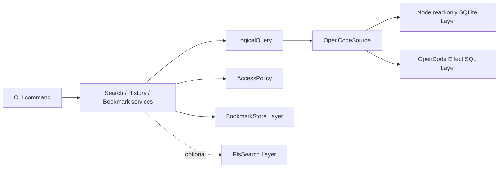

# Cotail V2 Relational Query World

## Thesis

Cotail should expose a **public, read-only Kysely query world over versioned
logical OpenCode V2 relations**. Kysely is the programmable language for rows,
predicates, joins, subqueries, projection, grouping, ordering, windows, CTEs,
compilation, and output inference. Cotail should not translate a parallel
`SessionSelector` or predicate tree into that language.

Cotail still owns what SQL cannot infer:

- which V2 projections are authoritative and complete;
- the stable logical relation contract over changing physical tables;
- source and derived identity for every result grain;
- named witness and evidence semantics;
- direct-regex, FTS, privacy, and capability truthfulness;
- operation-owned grouping, limits, cursors, and result products;
- durable bookmark resolution and snapshot policy; and
- Effect-managed resources, errors, transactions, tracing, and host integration.

The API therefore has two deliberate authority levels:

1. **Logical query API:** trusted TypeScript callers receive a
   `ReadonlyQueryCreator<CotailRelations>`, choose any relational result, and
   retain Kysely's inferred output type.
2. **Domain operation API:** search, grouped hits, history, resolution, and
   bookmarks accept contextual Kysely factories plus small domain policies. The
   operation owns projection, evidence packaging, ordering, windows, and
   pagination.

The first is powerful and does not promise operation-shaped cardinality. The
second is opinionated and does. Trying to make one seeded Session builder serve
both purposes either cripples Kysely or lets callers invalidate the operation's
guarantees accidentally.

## Settled And Proposed Boundary

### Settled

- Read only `session_v2`, `session_message`, and other V2 projections.
- Require completed V1-to-V2 migration when legacy Session state remains.
- Never union or fall back to V1 `session`, `message`, or `part` rows.
- Treat projected Messages as canonical transcript state. Event payload history
  is optional and separate.
- Use Kysely directly in the reusable programmable API.
- Use Effect for service composition and lifecycle, not pure expression building.
- Support Session, Message, content, tool, shell, aggregate, Event, and bookmark
  grains rather than forcing one Session result per operation.
- Use SQLite windows, not `LATERAL`, for per-Session limits.

### Proposed

- Name the common live-source identity value an **Address** and the source-bound
  value a **Target**.
- Expose canonical relations as reserved `cotail_*` CTEs through a read-only
  query creator.
- Expose one normalized `cotail_document` relation for text matching while
  retaining source-specific relations and field provenance.
- Make named contextual witness factories the only additional reusable
  qualification concept.
- Package domain results as distinct products sharing `Target`, observation, and
  evidence values rather than a universal result union.
- Treat Kysely as a tested peer dependency and an intentional semver coupling.
- Embed upstream by compiling Kysely and executing the SQL through OpenCode's
  Effect SQL client, not by attaching an independent driver to its native handle.

## Vocabulary

| Term | Meaning |
|---|---|
| **physical projection** | OpenCode's current SQLite table/JSON representation. It is source evidence, not cotail public schema. |
| **logical relation** | A versioned `cotail_*` row contract implemented from V2 projections, usually as a seeded CTE. |
| **query world** | The read-only Kysely creator containing only logical relations in ordinary TypeScript table scope. |
| **grain** | What one row or product represents: Session, Message, content item, tool call, shell execution, document field, aggregate, Event, or bookmark. |
| **Address** | Hierarchical identity within one OpenCode source, using native IDs where available and cotail-derived positions where necessary. |
| **Target** | An Address qualified by a cotail source key. This is the minimum value meaningful across databases. |
| **document** | One searchable string with an owner Address, exact source field, order, and exposure class. It is not a replacement for the source entity. |
| **witness** | A named contextual query factory whose matching rows can qualify a result and supply evidence. |
| **evidence** | An observed matching document or source value attributed to a witness. It proves a match but does not define source identity. |
| **observation** | A value read from a Target at a source snapshot, with optional revision information. |
| **bookmark** | Cotail-owned durable intent plus Target and optional captured observation/evidence. It is not the live entity. |
| **per-Session limit** | A child-row window inside each Session partition. It is not a Session-page limit or global hit limit. |

Avoid using `Pointer`, `Reference`, or `Composite` as the shared query identity.
OpenCode already uses Reference for reference material, Pointer overemphasizes
indirection, and Composite invites unrelated optional fields. `Address` states
what the value does without claiming persistence. `Target` adds the source
needed to resolve it.

## Identity And Address Model

### Hierarchical addresses

```ts
export interface SessionAddress {
  readonly kind: "session";
  readonly sessionID: Session.ID;
}

export interface MessageAddress {
  readonly kind: "message";
  readonly session: SessionAddress;
  readonly messageID: SessionMessage.ID;
}

export interface ContentAddress {
  readonly kind: "content";
  readonly message: MessageAddress;
  readonly index: number;
}

export interface ToolCallAddress {
  readonly kind: "tool-call";
  readonly content: ContentAddress;
  readonly callID: string;
}

export interface ToolResultAddress {
  readonly kind: "tool-result";
  readonly call: ToolCallAddress;
  readonly index: number;
}

export interface ShellAddress {
  readonly kind: "shell";
  readonly message: MessageAddress;
  readonly shellID: Shell.ID;
}

export interface AttachmentAddress {
  readonly kind: "attachment";
  readonly message: MessageAddress;
  readonly index: number;
}

export interface EventAddress {
  readonly kind: "event";
  readonly aggregateID: string;
  readonly seq: Event.Sequence;
  readonly eventID: Event.ID;
}

export interface ProjectAddress {
  readonly kind: "project";
  readonly projectID: Project.ID;
}

export interface WorkspaceAddress {
  readonly kind: "workspace";
  readonly workspaceID: Workspace.ID;
}

export type EntityAddress =
  | SessionAddress
  | MessageAddress
  | ContentAddress
  | ToolCallAddress
  | ToolResultAddress
  | ShellAddress
  | AttachmentAddress
  | EventAddress
  | ProjectAddress
  | WorkspaceAddress;

export type DocumentField =
  | "user.text" | "synthetic.text" | "system.text" | "skill.text"
  | "assistant.text" | "assistant.reasoning"
  | "tool.name" | "tool.input" | "tool.output" | "tool.error"
  | "shell.command" | "shell.output"
  | "attachment.name" | "attachment.description" | "attachment.uri"
  | "compaction.summary" | "compaction.recent" | "compaction.error"
  | "session.title" | "session.location"
  | "project.name" | "project.root" | "workspace.provider"
  | "event.payload";

export interface DocumentAddress {
  readonly kind: "document";
  readonly owner: EntityAddress;
  readonly field: DocumentField;
  readonly segment: number;
}

export type Address = EntityAddress | DocumentAddress;

export interface SourceKey {
  readonly kind: "opencode-v2";
  readonly sourceID: string; // cotail-assigned installation/database identity
}

export interface Target<A extends Address = Address> {
  readonly source: SourceKey;
  readonly address: A;
}
```

The hierarchy is intentionally repetitive. Message ownership remains visible
even though `session_message.id` is physically globally unique. Tool calls keep
both their call ID and content position. Source-derived content never acquires a
fake native ID. Project and Workspace metadata retain their own ownership rather
than being forced under an arbitrary Session. A Document address adds an exact
field and segment to its source entity; it is cotail-derived and revision-bound.

### Identity classes

| Address | Identity source | Durability |
|---|---|---|
| Session | Native branded `ses_*` ID | Stable while the Session exists in that source. |
| Message | Native branded `msg_*` ID plus owning Session | Stable for the projected Message; fork copies receive new IDs. |
| Content | Cotail-derived Message address plus array index | Stable only for one exact projected Message value. |
| Tool call | Upstream call string plus content address | Stronger than position alone, but still qualified by Message ownership and position. |
| Tool result | Cotail-derived result-content index under a tool call | Stable only for the exact tool state projection. |
| Shell | Native branded shell ID plus projected Message address | Identifies historical projection, not a retained live process. |
| Attachment | Cotail-derived user attachment index | Requires Message revision provenance for durable use. |
| Event | Native Event ID and aggregate sequence | Available only when event payload persistence is known. |
| Project/workspace | Native branded source ID | Stable while that projected entity exists. |
| Document | Cotail-derived owner Address, field, and segment | Stable only for the owner's exact projection revision. |

`messageSeq` and content indexes are order coordinates, not substitutes for
native identity. Forked Messages preserve sequence but receive new IDs, so
cross-fork equivalence is lineage/provenance, not identity.

### Revisions and durable targets

A live Address does not promise that mutable JSON still has the same value. A
bookmark that targets nested content captures a revision:

```ts
export interface ProjectionRevision {
  readonly messageUpdatedAt: number;
  readonly payloadHash: string; // hash of canonical decoded Message projection
}

export interface Observation<A extends Address, V> {
  readonly target: Target<A>;
  readonly value: V;
  readonly observedAt: number;
  readonly sourceSnapshot: string;
  readonly revision?: ProjectionRevision;
}
```

`sourceSnapshot` identifies the read transaction or source watermark used by the
operation; it is not falsely equated with Event sequence when event persistence
is off. Session and Message observations can omit `payloadHash` for ephemeral
listing. Durable nested bookmarks require it.

## Logical V2 Query World

### Relation map

The initial public logical schema is deliberately richer than one flattened
content table:

| Relation | Grain and important fields | V2 source |
|---|---|---|
| `cotail_session` | Session ID, project/workspace/location, parent/fork, title, agent/model, cost/tokens, version, summary, times, revert state | `session_v2` |
| `cotail_lineage_edge` | child Session, ancestor Session, `continuation|fork`, fork boundary | derived from `session_v2` |
| `cotail_message` | owner, Message ID, type, `seq`, row times, decoded common metadata, source JSON | `session_message` |
| `cotail_user_message` | text and prompt-level fields | user Message JSON |
| `cotail_assistant_message` | agent/model, finish, usage/cost, error/retry, snapshots, times | assistant Message JSON |
| `cotail_content` | assistant text/reasoning content index, kind, text, timing/provider state | assistant `content[]` |
| `cotail_tool_call` | content address, call ID/name, state, input, output/error metadata, timing | assistant tool content |
| `cotail_tool_result` | call address, nested result index, text/file kind and fields | completed/error tool content |
| `cotail_shell_execution` | Message owner, shell ID, command, status, exit, output/cursor/size/truncation, times | shell Message JSON |
| `cotail_attachment` | Message owner, attachment index/type, URI/MIME/name/description/mention | user prompt attachments |
| `cotail_compaction` | Message owner, status, reason, summary/recent/error | compaction Message JSON |
| `cotail_pending_input` | current admitted input, delivery state, admitted sequence | `session_pending` |
| `cotail_project` | Project ID, root, VCS/name/icon, times and declared metadata | `project` |
| `cotail_project_directory` | Project, directory, type/strategy, creation | `project_directory` |
| `cotail_workspace` | Workspace ID, provider, binding, usage times | `workspace` |
| `cotail_document` | exact searchable string, owner address columns, field, order, exposure class | union over semantic fields above |
| `cotail_event_watermark` | aggregate, sequence, owner | `event_sequence` |
| `cotail_event` | Event identity, aggregate/sequence, versioned type, encoded data | optional persisted `event` rows |

The row interfaces are flat because they are relational. Domain mappers build
hierarchical Addresses at result boundaries. Nullable address columns in
`cotail_document` do not become the public Address representation; its
`ownerKind` discriminator plus checked mapping must construct exactly one valid
Address.

### Why CTEs

Canonical CTEs are the best initial implementation:

- they work on a truly read-only source without migrations or TEMP writes;
- every compiled statement carries its logical-to-physical definition;
- Kysely can infer and compose their rows normally;
- standalone and embedded executors receive one compiled statement; and
- a future indexed implementation can replace selected logical relations behind
  the same operation service without changing physical OpenCode storage.

Kysely's inferred CTE database type retains the physical database members. The
library performs one audited type narrowing after seeding all CTEs:

```ts
function logicalWorld(
  physical: Kysely<PhysicalOpenCodeV2>,
): ReadonlyQueryCreator<CotailRelations> {
  const seeded = seedCanonicalRelations(physical);
  return seeded as unknown as ReadonlyQueryCreator<CotailRelations>;
}
```

This is a type boundary, not a security boundary. It preserves the operation
tree and executor. Runtime source validation must prove required tables,
columns, JSON discriminators, and migration state before the Layer provides the
world.

Persisted cotail-owned SQL views are not recommended initially: cotail opens the
OpenCode database read-only and should not alter it. Internal TypeScript helper
functions remain free to seed only the relation family an operation needs if
always seeding every CTE makes compiled statements too large.

### Stability policy

Logical schema and physical compatibility have separate versions:

- `CotailRelations` follows cotail semver. Removing/renaming a logical field or
  changing its meaning is a public API change.
- The OpenCode source adapter advertises a schema fingerprint and supported
  upstream revision range. Unknown required shapes fail with `SourceSchemaError`.
- Public-schema-derived fields are the stable lane. Deliberately exposed
  physical-only fields are documented as cotail contracts, not mirrored
  accidentally.
- Opaque JSON remains text/JSON with its source field named. Cotail does not
  pretend to type metadata that OpenCode itself leaves opaque.
- Unknown Message variants remain visible in `cotail_message`. A search claiming
  complete semantic coverage fails with `IncompleteContentModelError` until the
  adapter defines their documents; it does not silently skip them.

## Searchable Content Inventory

OpenCode's complete current Message union is
[`session-message.ts` lines 40-253](https://github.com/anomalyco/opencode/blob/f7545bfab4679747738aac5293faabfe13c3c26c/packages/schema/src/session-message.ts#L40-L253).
The initial inventory is:

| Message/source | Searchable documents | Structured but not canonical text | Rationale |
|---|---|---|---|
| `agent-switched` | Agent identifier/name when a caller asks for identifiers | Message metadata | Useful control-history filtering; no invented prose document. |
| `model-switched` | Current/previous model identifiers | Message metadata | Searchable identity fields, not transcript text. |
| `user` | Prompt text; attachment name, description, URI, MIME, mention; agent/skill names and skill text | Attachment indexes and offsets | Authoritative user input. Base64 file bodies are excluded from text documents. |
| `synthetic` | Text and description | Message metadata | Authoritative projected input with explicit synthetic provenance. |
| `system` | Text | Message metadata | Searchable, but marked system exposure class. |
| `skill` | Skill text, ID, and name | Message metadata | Searchable projected context; potentially large/sensitive. |
| `shell` | Command and output | status, exit, cursor, size, truncation, times | Both strings are semantically distinct documents under one Shell address. |
| `assistant` text | Each text item's text | provider state/timing | One content Address per array position. |
| `assistant` reasoning | Each reasoning text | provider state/timing | Searchable with explicit `reasoning` exposure class; never relabeled as ordinary assistant text. |
| `assistant` tool | Name, structured input scalar/text values, output text/file metadata, error message | full input/metadata/state/timing | Tool call and each result item keep separate Addresses and fields. |
| `compaction` | Summary, recent text, reason, and error message | status and timing | Searchable projection, labeled compaction rather than ordinary transcript. |
| pending input | Same semantic fields as its admitted input | delivery and admitted sequence | Separate relation/capability; current inbox, not transcript history. |
| Session | title, location, subpath, selected agent/model/project identifiers | cost/tokens/times/revert/opaque metadata | Metadata documents retain Session ownership and field. |
| Project/workspace | root/directory/name/provider and selected declared text | binding/commands/sandboxes JSON | Useful context, but opaque bindings are not flattened by default. |
| Event | decoded event-specific strings when payload history is known | complete typed payload | Optional history source, never canonical transcript fallback. |

Tool inputs, provider state, Message metadata, Session metadata, workspace binding,
and other opaque JSON are queryable through source relations. They are not
silently stringified into `cotail_document`: arbitrary JSON serialization creates
unstable text semantics, leaks secrets, and destroys field provenance. The query
API still lets a trusted caller use SQLite JSON functions explicitly.

Every document row includes:

```ts
interface DocumentRelation {
  documentKey: string;       // deterministic from owner Address + field
  ownerKind: EntityAddress["kind"];
  sessionID: string | null;
  projectID: string | null;
  workspaceID: string | null;
  messageID: string | null;
  contentIndex: number | null;
  nestedIndex: number | null;
  nativeID: string | null;
  field: DocumentField;
  text: string;
  messageSeq: number | null;
  fieldOrder: number;
  exposure: "ordinary" | "system" | "reasoning" | "tool" | "shell" | "sensitive-metadata";
}
```

`documentKey` is a query-row key, not a new source-native entity ID. Durable
evidence stores the owner Target, field, revision, and excerpt rather than
assuming the key survives source mutation.

The published map names every relation explicitly; individual row interfaces
contain the fields in the relation table above and are exported for helper
authors:

```ts
export interface CotailRelations {
  cotail_session: SessionRelation;
  cotail_lineage_edge: LineageEdgeRelation;
  cotail_message: MessageRelation;
  cotail_user_message: UserMessageRelation;
  cotail_assistant_message: AssistantMessageRelation;
  cotail_content: ContentRelation;
  cotail_tool_call: ToolCallRelation;
  cotail_tool_result: ToolResultRelation;
  cotail_shell_execution: ShellExecutionRelation;
  cotail_attachment: AttachmentRelation;
  cotail_compaction: CompactionRelation;
  cotail_pending_input: PendingInputRelation;
  cotail_project: ProjectRelation;
  cotail_project_directory: ProjectDirectoryRelation;
  cotail_workspace: WorkspaceRelation;
  cotail_document: DocumentRelation;
  cotail_event_watermark: EventWatermarkRelation;
  cotail_event: EventRelation;
}
```

This map, the Address declarations, and the complete row interfaces are one
versioned `@opencoattails/query-kysely` type surface. The prose table is not a
license for implementations to add undeclared columns opportunistically.

## Public Kysely API

### Core service

```ts
import type {
  InferResult,
  SelectQueryBuilder,
} from "kysely";
import type { ReadonlyQueryCreator } from "kysely/readonly";
import { Effect, Stream } from "effect";

type AnySelect = SelectQueryBuilder<any, any, any>;
type QueryError =
  | SourceSchemaError | MigrationIncompleteError | CapabilityError
  | IncompleteContentModelError | QueryCompileError | QueryExecutionError
  | QueryBudgetExceededError | RowDecodeError;

export interface QueryContext {
  readonly db: ReadonlyQueryCreator<CotailRelations>;
  readonly capabilities: SourceCapabilities;
  readonly source: SourceKey;
}

export interface LogicalQueryService {
  readonly run: <const Q extends AnySelect>(
    build: (context: QueryContext) => Q,
  ) => Effect.Effect<Readonly<InferResult<Q>>, QueryError>;

  readonly stream: <const Q extends AnySelect>(
    build: (context: QueryContext) => Q,
  ) => Stream.Stream<InferResult<Q>[number], QueryError>;

  readonly compile: <const Q extends AnySelect>(
    build: (context: QueryContext) => Q,
  ) => Effect.Effect<CompiledLogicalQuery<InferResult<Q>[number]>, QueryError>;

  readonly explainQueryPlan: <const Q extends AnySelect>(
    build: (context: QueryContext) => Q,
  ) => Effect.Effect<readonly SqliteQueryPlanRow[], QueryError>;
}

export interface CompiledLogicalQuery<Row> {
  readonly sql: string;
  readonly parameters: readonly unknown[];
  readonly _row?: Row; // phantom output type
}
```

The service does not expose Kysely's full `CompiledQuery`, native connection,
`destroy()`, or physical DB type. Kysely's compiled object also contains
operation-node and query-ID details that cotail need not stabilize.

### Arbitrary grains and projections

```ts
const rows = yield* query.run(({ db }) =>
  db.selectFrom("cotail_message as m")
    .innerJoin("cotail_session as s", "s.sessionID", "m.sessionID")
    .where("s.projectID", "=", projectID)
    .where("m.messageType", "in", ["user", "assistant"])
    .select([
      "m.sessionID",
      "m.messageID",
      "m.messageSeq",
      "s.title as sessionTitle",
    ])
    .orderBy("m.sessionID")
    .orderBy("m.messageSeq"),
);
// readonly { sessionID; messageID; messageSeq; sessionTitle }[]
```

Callers can select aggregates without a cotail aggregate DTO:

```ts
const usage = yield* query.run(({ db }) =>
  db.selectFrom("cotail_assistant_message")
    .select(["sessionID", (eb) => eb.fn.sum<number>("cost").as("cost")])
    .groupBy("sessionID")
    .having((eb) => eb.fn.sum("cost"), ">", 0)
    .orderBy("cost", "desc"),
);
```

### Reusable predicates and transforms

Contextual expression factories are the standard reusable predicate value:

```ts
export type Predicate<DB, TB extends keyof DB> = (
  eb: ExpressionBuilder<DB, TB>,
) => Expression<SqlBool>;

export const inProject = (
  projectID: string,
): Predicate<CotailRelations, "cotail_session"> =>
  (eb) => eb("cotail_session.projectID", "=", projectID);
```

`inProject` is intentionally a canonical-root convenience. It is safe only when
the operation supplies the unaliased root named in its type; it is not advertised
as alias-neutral.

Do not make prebuilt expressions the primary value. An expression bound to
`cotail_session` can be passed into a scope where that alias is absent and fail
at runtime. Contextual construction restores current-table checking. Helpers
that must survive aliases accept typed `Expression<T>` dependencies:

```ts
export const directoryContains = (
  directory: Expression<string>,
  value: string,
): Expression<SqlBool> => sql`instr(${directory}, ${value}) > 0`;
```

Shape-preserving transforms are useful but are not a universal abstraction:

```ts
type Transform<Q> = (query: Q) => Q;

const newestFirst = <O>(): Transform<
  SelectQueryBuilder<CotailRelations, "cotail_session", O>
> => (query) => query
  .orderBy("cotail_session.updatedAt", "desc")
  .orderBy("cotail_session.sessionID", "desc");
```

Joins alter Kysely's table scope and projections alter output `O`. Those helpers
should be ordinary typed functions composed with `$call`, not forced into
`Q => Q`.

### Named witnesses

Kysely models correlated subqueries but does not give a predicate semantic
identity. Cotail adds one thin concept:

```ts
export interface DocumentWitness {
  readonly name: WitnessName;
  readonly forSession: <DB extends CotailRelations, TB extends keyof DB>(
    context: {
      readonly eb: ExpressionBuilder<DB, TB>;
      readonly sessionID: Expression<string>;
    },
  ) => {
    readonly exists: Expression<SqlBool>;
    readonly firstEvidenceJson: Expression<string | null>;
  };
}

export type WitnessName = string & { readonly WitnessName: unique symbol };
export type DocumentPredicate = Predicate<CotailRelations, "cotail_document">;

const alpha = documentWitness(witnessName("alpha"), (eb) => eb.and([
  eb("cotail_document.field", "=", "assistant.text"),
  direct.literal(eb.ref("cotail_document.text"), "alpha"),
]));
```

`forSession` receives the outer owner reference explicitly, so it works from
`cotail_session` or `cotail_session as s` without caching an alias-bound
expression. It invokes the same contextual matching-query constructor for
`exists` and `firstEvidenceJson`. SQLite returns `json_object()` as text; the
operation decodes that string into a checked `EvidenceProjection` before it can
become a result. SQL usually repeats the correlated predicate once for
qualification and once for scalar evidence; TypeScript semantics do not. For
many evidence rows, the operation materializes the matching relation as a CTE
and ranks it once.

Witness names are request-level semantic IDs. Array positions remain valid
source addresses but never identify a witness in a request. Evidence contains
the witness name and observed document Target.

### Same and independent witnesses

```ts
// Different documents may satisfy alpha and beta.
const independent = db.selectFrom("cotail_session as s").where((eb) => {
  const owner = eb.ref("s.sessionID");
  return eb.and([
    alpha.forSession({ eb, sessionID: owner }).exists,
    beta.forSession({ eb, sessionID: owner }).exists,
  ]);
});

// One document must satisfy both predicates.
const same = documentWitness(witnessName("alpha-and-beta"), (eb) => eb.and([
  direct.literal(eb.ref("cotail_document.text"), "alpha"),
  direct.literal(eb.ref("cotail_document.text"), "beta"),
]));
const sameDocument = db.selectFrom("cotail_session as s").where((eb) =>
  same.forSession({ eb, sessionID: eb.ref("s.sessionID") }).exists,
);
```

This replaces `PatternSet` and `ContentRequirements` without losing their one
correct insight: same-witness versus independent-witness quantification must be
structural.

### Per-Session top-N

```ts
const hits = db
  .with("matching", (db) => db
    .selectFrom("cotail_document")
    .where((eb) => direct.literal(eb.ref("text"), term))
    .selectAll())
  .with("ranked", (db) => db
    .selectFrom("matching")
    .selectAll()
    .select(sql<number>`row_number() over (
      partition by ${sql.ref("sessionID")}
      order by ${sql.ref("messageSeq")}, ${sql.ref("fieldOrder")},
               ${sql.ref("documentKey")}
    )`.as("sessionRank")))
  .selectFrom("ranked")
  .where("sessionRank", "<=", perSession)
  .selectAll();
```

The spike uses raw SQL for `row_number()`. Production may use Kysely's aggregate
`.over()` builder if its empty-argument `row_number` spelling remains sound in
the supported version. The semantic helper still belongs to cotail because it
defines tie-breakers and what “per Session” means.

### Raw SQL, plugins, compile, and explain

- `sql` remains public and necessary for SQLite JSON table functions, regex,
  FTS, and occasional dialect-specific windows.
- Interpolated values remain bound parameters. `sql.ref`, `sql.table`, `sql.id`,
  and especially `sql.raw` are trusted escapes that can bypass logical relation
  typing or create injection if fed unchecked text.
- `ReadonlyQueryCreator` removes ordinary insert/update/delete construction. A
  read-only native connection plus `PRAGMA query_only` and adapter write
  rejection are the actual write barriers.
- Arbitrary Kysely plugins are trusted and unsupported. They can transform both
  operation trees and rows without changing static output types.
- `compile()` is available for diagnostics and host execution. Parameters are
  redacted from default logs.
- `explainQueryPlan()` runs SQLite `EXPLAIN QUERY PLAN` through the execution
  service. Kysely's generic `.explain()` defaults to `EXPLAIN`, which is not the
  same product.
- Ordinary execution does not accept caller-created `CompiledQuery.raw`.

Kysely appears directly in signatures. Publish it as a peer dependency pinned
to the tested minor line and use the same development dependency. Upgrades are
deliberate cotail API work even if Kysely itself labels the change compatible.
Import only root exports and the documented `kysely/readonly` subpath.

## Result Products

Arbitrary logical queries return inferred rows. Domain operations return stable
products. These are separate promises.

```ts
export interface Located<A extends Address, V> {
  readonly target: Target<A>;
  readonly value: V;
}

export interface DirectEvidence {
  readonly kind: "direct";
  readonly witness: WitnessName;
  readonly document: Observation<DocumentAddress, {
    readonly field: DocumentField;
    readonly excerpt: string;
    readonly ranges?: readonly TextRange[];
  }>;
}

export interface DirectHit<A extends Address, V> extends Located<A, V> {
  readonly backend: "direct";
  readonly evidence: readonly DirectEvidence[];
}

export interface FtsHit<A extends Address, V> extends Located<A, V> {
  readonly backend: "fts";
  readonly rank: number;
  readonly score: number;
  readonly highlights: readonly FtsHighlight[];
  readonly index: IndexObservation;
}
```

SessionHit, MessageHit, ContentHit, ToolHit, ShellHit, EventHit, aggregate rows,
and GroupedSession are distinct aliases/interfaces over the appropriate Address
and value. A renderer may define a discriminated wire union, but the internal API
does not put rank, shell state, aggregate count, and bookmark intent into one bag
of optional fields.

### Grouped Sessions and limits

```ts
export interface GroupedSession<Child> {
  readonly session: Located<SessionAddress, SessionSummary>;
  readonly children: readonly Child[];
  readonly truncated: boolean;
}

export interface SessionCursor {
  readonly updatedAt: number;
  readonly sessionID: Session.ID;
}

export interface GroupWindow {
  readonly sessions: { readonly first: number; readonly after?: SessionCursor };
  readonly childrenPerSession: number;
  readonly globalHitLimit?: number;
}
```

The execution order is normative:

1. Qualify Sessions.
2. Apply deterministic Session order and Session keyset cursor.
3. Limit the Session page.
4. Join matching children for only those Sessions.
5. Rank children within each Session and apply `childrenPerSession`.
6. Flatten by Session-page order, then child `sessionRank`, then child Address;
   apply `globalHitLimit` to that total order only when explicitly requested.
7. Assemble flat ordered rows into grouped products in TypeScript.

This prevents a global hit limit from accidentally starving later Session
groups. A separate child-grain operation provides child pagination beyond the
fixed top-N preview.

Session cursors include the full order tuple, normally `(updatedAt, sessionID)`.
Message/content cursors include `(sessionID, messageSeq, contentIndex,
fieldOrder, documentKey)` as appropriate. Offset pagination is not the default
for mutable live data.

### Match, score, evidence, and projection

Keep these axes distinct:

- **filtering** restricts rows through ordinary Kysely predicates;
- **matching** applies a declared direct or FTS language to one document field;
- **scoring** is backend-specific and may be absent for direct matching;
- **evidence** packages observed positive witness rows;
- **projection** chooses returned columns/products;
- **aggregation** changes grain through `groupBy`/aggregate expressions;
- **ordering** establishes a total order;
- **windowing** selects rows after ordering within global or partition scopes.

Projection or evidence requests must not change qualification. Domain tests run
the same witness with evidence enabled and disabled and assert identical Target
sets.

## Direct And FTS Semantics

Direct helpers are honest SQLite expressions:

```ts
direct.literal(textExpression, value, { case: "sensitive" });
direct.regex(textExpression, source, { flags: "i" });
```

Regex compilation occurs before opening an execution span so invalid patterns
fail even when no rows exist. The registered SQLite function and JavaScript
regex version are reported in capabilities.

FTS gets a different query world or relation family:

```ts
interface FtsRelations extends CotailRelations {
  cotail_fts_document: FtsDocumentRelation;
}

interface FtsQueryContext {
  readonly db: ReadonlyQueryCreator<FtsRelations>;
  readonly capabilities: SourceCapabilities & { readonly fts: FtsCapability };
  readonly source: SourceKey;
  readonly fts: {
    readonly documents: "cotail_fts_document";
    readonly match: FtsMatchHelpers;
    readonly generation: string;
    readonly indexedThrough: SourceCheckpoint;
  };
}
```

FTS phrase/token/prefix syntax, BM25 score, snippets, and freshness are not
translated from direct regex. A domain FTS result carries index generation and
staleness, and authoritative live fields are hydrated/rechecked before return.
The arbitrary Kysely API can query either world when the corresponding
capability exists; it does not imply semantic parity.

## Privacy, Exposure, And Cost

The trusted logical query API is intentionally powerful. It is not an
authorization sandbox: raw SQL can inspect physical tables and opaque JSON. It
must only be given to code already trusted with the OpenCode database.

Domain operations enforce an `AccessPolicy` service:

```ts
interface AccessPolicy {
  readonly documents: ReadonlySet<DocumentExposure>;
  readonly allowOpaqueMetadata: boolean;
  readonly allowPendingInput: boolean;
  readonly allowEventPayloads: boolean;
  readonly maxScannedMessages?: number;
  readonly maxReturnedTextBytes: number;
}
```

The initial model supports every semantic category in the inventory. The CLI's
local default includes projected transcript/control text, reasoning, tool, and
shell documents with their provenance. It does not include Base64 bodies or
blindly stringified opaque JSON. Output excerpts are length-bounded; JSON output
does not dump full source JSON unless explicitly selected. Tracing records query
shape, relation names, row counts, and duration, never raw terms, parameters,
document text, tool inputs, or shell output by default.

Cost controls can be layered without changing identity: scan budgets, timeouts,
required Session predicates for expensive regex, result-byte limits, and
`EXPLAIN` warnings act on execution. They must fail explicitly rather than
silently omit a content class.

## Consistency

One SQLite SELECT observes one snapshot. Domain operations that execute several
statements or hydrate indexed candidates run inside one read transaction on one
connection. The returned observation records the transaction snapshot token or
an adapter-generated opaque ID.

Standalone mode uses a separate read-only SQLite connection under WAL. It may
lag a concurrent writer until its transaction ends, which is desirable snapshot
behavior. It retries only documented busy conditions under configuration; it
does not reopen between operation stages.

Embedded mode executes through OpenCode's current Effect SQL connection and
transaction. It must not construct a Kysely SQLite driver around OpenCode's
native `DatabaseSync`, because that bypasses the connection semaphore,
fiber-local transaction/savepoint selection, tracing, and typed SQL errors.

Nested content Addresses can become stale if a Message is updated after the
transaction. Live result consumers accept that normal observation model.
Bookmark resolution compares revisions and reports change.

## Bookmarks

```ts
export interface Bookmark {
  readonly bookmarkID: BookmarkID;
  readonly target: Target;
  readonly intent?: string;
  readonly tags: readonly string[];
  readonly createdAt: number;
  readonly capture?: BookmarkCapture;
}

export interface BookmarkCapture {
  readonly observation: Observation<Address, unknown>;
  readonly evidence?: readonly DirectEvidence[];
  readonly descriptor?: BookmarkDescriptor;
}

export type BookmarkResolution =
  | { readonly kind: "current"; readonly observation: Observation<Address, unknown> }
  | { readonly kind: "changed"; readonly captured: BookmarkCapture; readonly live: Observation<Address, unknown> }
  | { readonly kind: "missing"; readonly captured?: BookmarkCapture }
  | { readonly kind: "source-unavailable"; readonly source: SourceKey };
```

A live bookmark stores only Target and intent. A snapshot bookmark stores the
captured descriptor/evidence and required revision. Resolution never silently
rewrites a moved content index to a “similar” item. A future recovery operation
may return hash/text candidates, but candidate similarity is not identity.

The bookmark store is cotail authority and has its own writable Layer and
migrations. It never writes the OpenCode database. Bookmark IDs identify
bookmarks, not source entities, and do not appear in `Address`.

[The replacement bookmark design](/.design/bookmarks/draft5.gpt56.md) narrows
this section into delivery scope after the Session operation rewrite. It adds
`found` for uncaptured bookmarks, because `current` requires an actual
comparison; rejects read-scope provenance as a durable revision; assigns Session
capture production to the canonical report operation; and makes a persistent
source catalog the first bookmark-owned prerequisite. Earlier `Pointer`,
`Composite`, descriptor, physical-capability, and multi-store proposals remain
superseded design lineage.

## Effect Architecture

### Services

| Service | Responsibility |
|---|---|
| `CotailConfig` | Source path/host mode, limits, regex behavior, policy profile, diagnostics. |
| `OpenCodeSource` | Scoped source acquisition, source key, schema/migration validation, physical capabilities. |
| `LogicalQuery` | Build logical Kysely world, compile, execute/stream, snapshot, explain, tracing. |
| `DirectSearch` | Named witnesses, direct matcher semantics, evidence, grouped windows, stable result mapping. |
| `FtsSearch` | Optional index capabilities, rank/highlights/freshness, live recheck. |
| `BookmarkStore` | Cotail-owned persistence and capture/resolution. |
| `AccessPolicy` | Document exposure, raw metadata, pending/Event access, scan/output budgets. |

Pure functions remain outside Effect:

- Address constructors and checked row mappers;
- contextual Kysely predicate/witness factories;
- logical CTE builder functions;
- cursor encoders/decoders;
- direct-match expression helpers; and
- grouped-row assembly.

### Layers



`NodeOpenCodeSource.layer(config)` Scope-owns the native handle, applies
`query_only`, validates migration/schema, registers direct regex, and closes once.
`OpenCodeHostedSource.layer` receives the host Database/SqlClient service and
never owns or closes it. Tests provide an in-memory synthetic V2 Layer and fake
compiled executor.

### Error model

Use tagged operational failures rather than one generic query error:

- `SourceOpenError`
- `SourceSchemaError`
- `MigrationIncompleteError`
- `CapabilityError`
- `IncompleteContentModelError`
- `InvalidDirectPatternError`
- `QueryCompileError`
- `QueryExecutionError`
- `QueryBudgetExceededError`
- `RowDecodeError`
- `BookmarkStoreError`

Unexpected programmer defects remain defects. Do not catch an error merely to
print and rethrow it. CLI handlers map expected tagged errors to messages and
exit codes once, at the composition edge.

### Tracing

Each operation has an Effect span containing source ID, logical schema version,
operation/grain, relation set, capability profile, window sizes, statement count,
row count, and duration. SQL text is opt-in diagnostic output. Parameters and
content are redacted. A child span covers schema validation, compilation,
execution, row decoding, grouping, and optional hydration.

## Standalone CLI And OpenCode Integration

The CLI is an ordinary consumer:

```ts
const program = Effect.scoped(Effect.gen(function* () {
  const search = yield* DirectSearch;
  const hits = yield* search.documents(buildWitnesses(args), windowFrom(args));
  yield* render(args.format, hits);
}));

NodeRuntime.runMain(program.pipe(
  Effect.provide(CotailStandalone.layer(parsedConfig)),
));
```

Commands parse flags into expression/witness factories and operation policies.
They do not construct SQL strings or use a special CLI store API. Advanced
library users can use `LogicalQuery` directly; a future `cotail query` command
should not eval arbitrary TypeScript by default.

The strongest upstream route is:

1. publish/stabilize cotail's domain and logical query packages;
2. add an internal OpenCode package providing `LogicalQuery` over its Database
   service by compiling Kysely and executing through Effect SQL;
3. register an OpenCode process CLI command using that service; and
4. add a server endpoint only for specific operation-shaped remote products.

An HTTP endpoint cannot transport arbitrary Kysely builders and should not grow
a serialized SQL/AST protocol merely for parity. The current backend Effect
plugin lacks database, Session listing/message reading, and process CLI command
registration. The TUI plugin can provide a renderer/page over a future endpoint,
but its cache/client access is not a cross-session relational engine. Neither is
the primary seam.

## Capabilities

```ts
interface SourceCapabilities {
  readonly sourceSchema: string;
  readonly logicalSchema: string;
  readonly projectedSessions: true;
  readonly projectedMessages: true;
  readonly pendingInput: boolean;
  readonly eventRows: "unavailable" | "observed" | "host-guaranteed";
  readonly directRegex: DirectRegexCapability;
  readonly fts?: FtsCapability;
  readonly contentModel: ReadonlySet<MessageVariant>;
}
```

Table existence does not prove Event persistence. OpenCode creates event tables
and advances `event_sequence` even when payload persistence is disabled. An
external reader can report only unavailable/observed unless trusted host config
guarantees persistence. An empty Event query under `observed` does not mean no
events occurred.

## Executable Exploration

The fresh V2-only spike is
[`/.test-agent/query-v2-public-api/README.md`](/.test-agent/query-v2-public-api/README.md).
It runs on Kysely 0.29.5 and the workspace `node:sqlite` adapter:

```sh
pnpm exec tsgo -p .test-agent/query-v2-public-api/tsconfig.json
node .test-agent/query-v2-public-api/prototype.ts \
  > .test-agent/query-v2-public-api/output.json
```

Both commands pass. One shared fixture contains only `session_v2` and
`session_message` with nested JSON. The output records compiled SQL and rows for:

- arbitrary Message projections across Sessions;
- tool-call projections and hierarchical Addresses;
- nested content top-1 per Session through `row_number()`;
- independent and same-document witnesses;
- named evidence using the same witness constructor as qualification; and
- exact inferred output through a broad read-only query callback.

Raw SQL was used for `json_each` relation definitions, `row_number`, and
`json_object` evidence projection. The first is an unavoidable SQLite relation
adapter. The latter two can potentially move to ordinary Kysely expression
builders without changing the public model. Raw SQL remains a documented trusted
escape regardless.

The earlier
[`query-kysely-selection` spike](/.test-agent/query-kysely-selection/README.md)
proved contextual predicates and seeded builders but used mixed V1/V2 synthetic
relations and only Session-rooted operations. It is retained as API evidence,
not as the V2 logical schema proof.

## Alternatives

| Shape | Power | Main strength | Main weakness | Decision |
|---|---:|---|---|---|
| Contextual expression factories | Medium | Alias/table scope at construction; excellent reuse and composition | Cannot choose arbitrary grain/projection; no semantic witness name | Adopt as reusable predicate value. |
| Immutable query transforms | Medium-high | Compose operation-specific query changes and preserve immutability | `Q => Q` cannot honestly model joins/projection changes; broader mutation can violate cardinality | Adopt narrowly; use ordinary functions/`$call` for shape changes. |
| Seeded Session builder | Medium | Delightful for one Session operation with store-owned projection/order | Session-root assumption blocks multi-grain power; arbitrary methods undermine operation guarantees | Use inside Session operations, not as universal API. |
| Full logical `ReadonlyQueryCreator` | Highest | Ordinary Kysely across all grains with inferred outputs | Public semver coupling; trusted callers can alter cardinality and bypass policy with raw SQL | Adopt as advanced shared library API. |
| Combined full world + factories + domain operations | Highest coherent | Gives power and stable products without a duplicate relational language | Two authority levels require clear docs and package boundaries | **Recommended.** |
| Custom selector/request DTO algebra | Low-medium | Serializable, bounded CLI requests and easy backend control | Duplicates boolean/relational Kysely model, fixes Session root, grows projection/window AST | Retain only tiny operation policies; remove as programmable model. |

The recommendation does not reward fewer operations. It exposes nearly all
Kysely read power to trusted code while preserving a smaller domain API where
cotail promises stable products and semantics.

## Migration Map

The project is pre-1.0; remove compatibility machinery rather than wrapping it.

| Current area | V2 relational destination | Remove |
|---|---|---|
| `query-domain` selector/pattern/requirements | Address/results/policies plus Kysely-facing query package | `SessionSelector`, `PatternSet`, `ContentRequirements`, their recursive validation/lowering |
| mixed `LayoutCapabilities` | V2 schema/content/event/index capabilities | V1 flags, mixed-owner branches, ID collision logic |
| physical DB tables | V2 physical adapter only | V1 `session`, `message`, `part` types |
| canonical Session union | `cotail_session` from `session_v2` | `UNION ALL`, owner anti-joins, V1 fallback |
| mixed content normalization | V2 source-specific relations plus `cotail_document` | `layout/v1.ts`, V1 part roles/text/ordinals |
| direct search lowering | direct expression helpers + witness factories | closed pattern/requirement compiler |
| history count branches | ordinary `session_message` aggregate | V1 `CASE`, additive/precedence logic |
| evidence layout tags | Target/Address/field/revision provenance | `v1-part` result member and positional requirement IDs |
| Promise store lifecycle | Effect Source/Query Layers | caller-owned native handles and special CLI architecture |

Suggested domain-grouped packages:

```text
packages/
  domain/identity       Address, Target, observations
  domain/results        evidence, hits, grouping, cursors
  domain/bookmarks      bookmark contracts and resolution
  query/kysely          public logical schema, factories, Query service
  source/opencode-v2    physical validation and CTE projection
  runtime/node-sqlite   standalone scoped execution Layer
  integration/opencode hosted compiled executor Layer
  app/cli               commands, config, rendering
```

The exact package count can stay smaller initially, but modules should preserve
these domains rather than flattening everything into one `src/` directory.

## Acceptance Criteria

### Behavioral

- V1-only, incomplete-migration, malformed V2, and unknown required content
  models fail before query execution.
- Completed databases with preserved V1 tables read no V1 rows.
- Every current Message variant appears in the inventory and either emits named
  documents or has an explicit structured-only rationale.
- Message, content, tool, shell, aggregate, grouped Session, Event-capability,
  and bookmark fixtures produce their declared grains.
- Independent witnesses can match different documents; same-witness predicates
  require one document.
- Evidence on/off preserves qualifying Target sets.
- Evidence reports witness name, document Target, field, and source revision.
- Configurable per-Session top-N is independent from Session page and global hit
  limits.
- Keyset pagination has deterministic tie-breakers and no duplicate/omitted rows
  in an unchanged snapshot.
- Multi-statement operations use one read transaction.
- Direct regex and FTS reject each other's syntax and report distinct evidence.
- Event operations never infer complete history from table existence.
- Bookmark resolution distinguishes current, changed, missing, and unavailable
  source states.
- Read-only adapter, `query_only`, and write-attempt tests reject writes even
  through CTE-shaped statements.

### Type-level

- Ordinary query callbacks cannot name physical tables or unknown logical
  columns without raw SQL or an explicit cast.
- Arbitrary projections preserve exact `InferResult<Q>` output.
- Contextual predicates reject out-of-scope table references in negative tests.
- Alias-neutral helpers accept typed expression dependencies instead of fixed
  aliases.
- Shape-preserving transforms retain output `O`; joins/projections use helpers
  with truthful changed return types.
- Address unions reject invalid optional-field combinations.
- Tool and nested content results require owner Message/Session identity.
- Domain operation outputs expose no physical row, native handle, Kysely
  operation node, or untyped compiled-query object.

### Operational

- Strict `tsgo`, Node minimum-version execution, semantic fixture tests, and
  representative `EXPLAIN QUERY PLAN` checks pass.
- Resource finalizers close standalone handles exactly once; hosted Layers never
  close host-owned connections.
- Cancellation and timeout behavior is documented for synchronous `node:sqlite`.
- Traces contain no query parameters or source text by default.
- Benchmarks cover unindexed cross-session text scans, per-Session windows,
  grouped Session pages, and broad JSON extraction.

## Open Decisions

1. **Source identity:** OpenCode has no obvious public database UUID. Decide how
   cotail assigns and relocates `SourceKey.sourceID` without treating an absolute
   path as permanent identity.
2. **Logical field tiering:** decide whether physical-only Session fields ship in
   `cotail_session` immediately or in an explicitly experimental companion
   relation.
3. **JSON runtime values:** choose text JSON columns versus decoded JSON values.
   The chosen Kysely row type must match the actual driver result exactly.
4. **Document granularity for structured tool input:** define which scalar leaves
   become documents and how paths/order are encoded without promising stable
   stringification.
5. **Reasoning default display:** reasoning is searchable and provenance-marked;
   decide whether human renderers show excerpts by default or redact them unless
   requested. This must not affect qualification silently.
6. **Content revision hash:** specify canonical Message encoding and hash
   algorithm for durable nested bookmarks.
7. **Event capability:** determine whether standalone mode can read a trusted
   OpenCode config source or must remain limited to `observed` event persistence.
8. **Kysely support range:** settle the exact peer range after testing the
   published package against the minimum TypeScript/Node versions.
9. **CTE breadth:** measure always-seeded relations versus operation-family
   seeding before stabilizing compiled diagnostics.
10. **Streaming snapshot:** verify Kysely streaming and the custom `node:sqlite`
    iterator keep one scoped connection/transaction and respond acceptably to
    Effect interruption.
11. **Hosted compiler:** prototype compile-only Kysely construction followed by
    `db.$client.unsafe(sql, params)` inside OpenCode's current transaction.
12. **Bookmark store placement:** choose XDG-local SQLite versus a portable file;
    this affects SourceKey relocation but not Address semantics.

## Lineage And Supersession

- [`prompt1.gpt56.md`](/query/prompt1.gpt56.md) is the controlling brief. This
  design accepts its V2-only, Kysely-forward, Effect-composed, multi-grain
  direction.
- [`opencode-v2-model0.general.md`](/query/opencode-v2-model0.general.md) remains
  the primary source audit. This design adopts its projected-message authority,
  result-grain, sequence, fork, event, and embedding findings, and resolves its
  open Kysely/API and identity questions.
- [`authority0.md`](/query/authority0.md) remains normative evidence that V1
  residue cannot be unioned. Its V1 fallback branch is superseded by the active
  V2-only product direction; its migration-completion safety rule remains.
- [`draft1.syn.md`](/query/draft1.syn.md) correctly separated filtering,
  witnesses, evidence, aggregates, and backend match semantics. Its Session-only
  root, private compiled artifact, and “no generic relational API” conclusions
  are superseded.
- [`design2.md`](/query/design2.md) correctly made same-versus-independent witness
  scope structural, named evidence sources, and kept direct/FTS honest. Its
  `SessionSelector`, `PatternSet`, `ContentRequirements`, operation DTO algebra,
  Session root, and V1 layout provenance are not retained.
- [`draft-ksyley0.md`](/query/draft-ksyley0.md) and
  [`draft-ksyley1.md`](/query/draft-ksyley1.md) remain executable ORM/lifecycle
  evidence. Their private-Kysely recommendation is superseded; read-only adapter,
  source ownership, and explicit lifecycle findings remain.
- [`query-kysely-selection` README](/.test-agent/query-kysely-selection/README.md)
  proved expression factories, transforms, CTE narrowing, and named witness
  reuse. Its mixed-layout and Session-seeded scope is superseded by the V2-only
  multi-grain spike.
- [`query-v2-public-api` README](/.test-agent/query-v2-public-api/README.md) is the
  executable evidence for this design's two-level public API, identities, window,
  and witness claims.
- [`bookmarks/draft2.glm52.md`](/bookmarks/draft2.glm52.md) through
  [`draft4.glm52.md`](/bookmarks/draft4.glm52.md) established useful distinctions
  among source identity, descriptor, lineage, snapshot, and bookmark intent.
  This design retains those distinctions but replaces universal Pointer/
  Composite framing with hierarchical Address, source-bound Target, Observation,
  and operation-specific products.

## Recommendation

Adopt the combined model: a public read-only Kysely query world for trusted
relational programs, contextual factories and named witnesses for reusable
qualification, and Effect-owned domain operations for stable products and
execution policy. Stabilize cotail's logical V2 schema and Address/Target model,
not OpenCode's physical rows or a replacement query algebra.

This removes V1 ownership machinery and most custom query DTO code while opening
Message/content/tool/shell/aggregate queries that the Session-only design could
not express. The hard parts left are genuinely cotail's: source evolution,
nested identity, evidence provenance, privacy, bookmark staleness, snapshots,
and OpenCode transaction integration.

## Execution Refinement

[The query execution contract PRD](/.design/query2/design.md) narrows and deepens
this design's remaining execution work. It distinguishes read-scope correlation
from optional source revision, makes transaction and stream ownership explicit,
defines capability-honest interruption and hosted behavior, and proposes the
standalone contract/conformance delivery cuts. It does not replace this
document's logical relation, identity, witness, evidence, or bookmark model.

## Session Reporting Refinement

[The canonical session reporting and operation pass](/.design/session-report/full-query-pass0.gpt56.md)
applies this document's stable-product principle after the query-world rewrite.
It replaces the overlapping `SessionSummary`, `SessionDetails`, and
`HistoryEntry` compatibility products with one source-qualified Session
observation shared by lookup, history, and search. Operation-specific evidence
and aggregates remain wrappers rather than optional fields on that report. It
also deliberately advances Session products from `Located` to `Observation` so
their read provenance is as truthful as document evidence.
