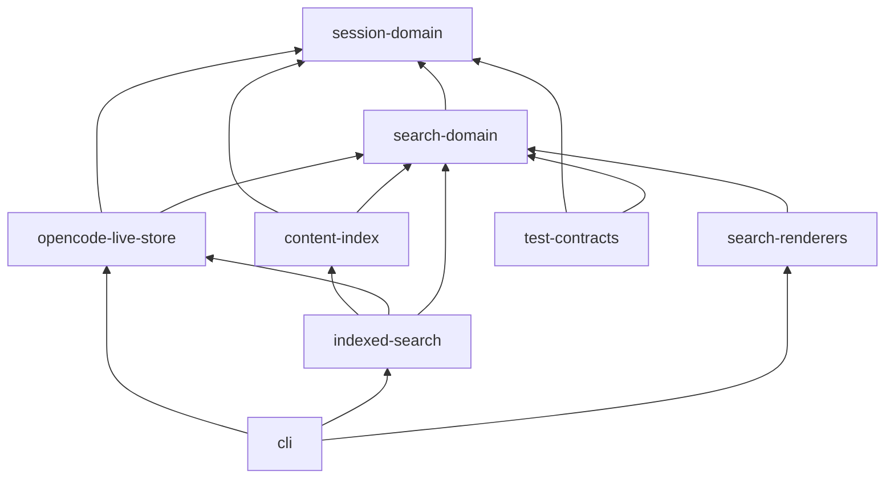

# Executable Drizzle Query Architecture Counterproposal

## Decision

Drizzle is a viable implementation choice only if cotail accepts replacing its
query execution seam with `better-sqlite3`. Adopt Drizzle conditionally for the
live-store and cotail-owned index packages, while keeping every builder and table
declaration private. Do not build a custom `node:sqlite` Drizzle driver against
0.45.x.

That conditional recommendation is stronger than a nominal rejection. Drizzle's
schema objects provide useful leverage for this problem: one declaration binds a
domain-facing property to an externally owned physical column, aliases remain
typed through correlated subqueries, CTE set operations check compatible selected
shapes, and result rows are mapped directly to camelCase. The executable query is
shorter and more domain-readable than its Kysely counterpart around table and
column use. It stays synchronous, matching today's command flow.

The runtime price is real. Drizzle 0.45.3 has no `node:sqlite` driver. Its public
`sqlite-core` surface exposes session base classes, but a correct implementation
needs `mapResultRow` and `joinsNotNullableMap`; those are used by supported drivers
yet stripped from published declarations. Reimplementing them would couple cotail
to Drizzle internals. The maintainable option is the supported
`drizzle-orm/better-sqlite3` integration and its native addon.

This proposal therefore beats Kysely on schema-centered readability, synchronous
execution, and cotail-owned index schema/migrations. Kysely remains decisively
better on current-runtime fit. The adjudicator should choose Drizzle only if those
benefits justify the driver swap and its distribution burden.

## Invariants

- A live `session` row is the result, metadata-predicate, and deduplication root.
- One content requirement is satisfied by one normalized content-unit witness.
- Patterns inside one requirement inspect that same witness.
- Separate requirements may have separate witnesses.
- Evidence is a projection selected after qualification and cannot qualify a row.
- Native V2 content comes from `session_message`, never the `event` fallback.
- A session with any `session_message` row uses V2 content and counts; otherwise it
  uses legacy `part`/`message`.
- FTS accelerates content matching only. Final session metadata always comes from
  live opencode storage.
- Direct and indexed hits remain distinct, but both satisfy the renderer-facing
  `{ session, evidenceText? }` shape.

## Workspace Architecture

### Groupings considered

| Grouping | Advantage | Why not selected |
|---|---|---|
| operations: search/history/lookup/index | Mirrors commands. | Repeats schema capability detection and selector lowering. |
| storage: opencode/index/CLI | Makes authority obvious. | Tends to make request and result contracts storage-owned. |
| domain contracts plus storage capabilities | Enforces stable values, authority, and backend honesty. | More packages, but each hides substantial policy. |

Select domain contracts plus storage capabilities:

```text
packages/
  session-domain/
    src/index.ts                 # summaries, selectors, ranges, validation
  search-domain/
    src/index.ts                 # bounded matching, requests, concrete hits
  opencode-live-store/
    src/index.ts                 # searchDirect/history/resolve/hydrate/matches
    src/runtime/better-sqlite.ts # private supported Drizzle construction
    src/schema/external.ts       # private partial table declarations
    src/layout/content.ts        # private V1/V2 normalized CTE
    src/query/                   # private selector/search/history lowering
  content-index/
    src/index.ts                 # candidate and freshness API only
    src/schema/                  # Drizzle-owned FTS tables and migrations
    src/query/                   # MATCH, bm25, highlight
  indexed-search/
    src/index.ts                 # ranked candidates -> live hydrated hits
  search-renderers/
    src/index.ts                 # human and JSONL structural rendering
  cli/
    src/commands/                # parsing and composition root
  test-contracts/
    src/fixtures/                # layout-neutral fixture descriptions
    src/suites/                  # semantic backend/renderer contracts
```

Each boundary earns package enforcement. `session-domain` prevents physical
columns from becoming public values. `search-domain` owns quantification without
knowing SQL. `opencode-live-store` hides an external schema, capability detection,
mixed-layout precedence, Drizzle, and the native driver behind five operations.
`content-index` owns writable schema and freshness but is prohibited from making
authoritative sessions. `indexed-search` is the only package that can combine
index candidates with live rows. `search-renderers` cannot import either backend.
`cli` alone constructs dependencies. `test-contracts` is dev-only and prevents
semantic parity fixtures from being duplicated.



The graph is acyclic. In particular, `content-index` has no path to
`opencode-live-store` and cannot return `SessionSummary`, so an indexed candidate
is structurally incapable of becoming a renderer result without live hydration.

## Public Contracts

```ts
export interface SessionSummary {
  id: string;
  slug: string;
  title: string;
  directory: string;
  projectId: string;
  timeCreated: number;
  timeUpdated: number;
}

export interface TimeRange {
  fromInclusive?: number;
  beforeExclusive?: number;
}

export interface SessionSelector {
  ids?: readonly string[];
  projectIds?: readonly string[];
  directory?:
    | { kind: "contains"; value: string }
    | { kind: "exact"; value: string };
  createdAt?: TimeRange;
  updatedAt?: TimeRange;
}

export interface TextPattern {
  source: string;
  caseSensitive: boolean;
}

export interface PatternSet {
  all?: readonly TextPattern[];
  any?: readonly TextPattern[];
  none?: readonly TextPattern[];
}

export interface ContentRequirement {
  types: readonly ("text" | "reasoning" | "tool")[];
  roles?: readonly ("user" | "assistant" | "shell")[];
  text: PatternSet;
}

export interface ContentRequirements {
  all?: readonly ContentRequirement[];
  any?: readonly ContentRequirement[];
  none?: readonly ContentRequirement[];
}
```

No recursive predicate AST is admitted. Selector fields are conjunctive; values
inside IDs/projects are disjunctive. Validation rejects present empty arrays,
empty directory values, empty pattern sources, duplicate types/roles, invalid
regexes, non-finite times/limits, zero or negative limits, and ranges whose lower
bound is not below the upper bound. At both boolean scopes at least one group must
be present, and every present group must be non-empty.

### Boolean truth and lowering

| Scope/group | Meaning | Omitted identity | Drizzle/SQL lowering |
|---|---|---|---|
| pattern `all` | every pattern matches one unit | true | `and(...re)` |
| pattern `any` | some pattern matches that unit | true | `or(...re)` |
| pattern `none` | no pattern matches that unit | true | `and(...not(re))` |
| requirement `all` | each requirement has a witness | true | `and(...exists(witness))` |
| requirement `any` | some requirement has a witness | true | `or(...exists(witness))` |
| requirement `none` | no listed requirement has a witness | true | `and(...notExists(witness))` |

Present groups are ANDed. `{ all:[a], any:[b,c], none:[d] }` means
`a AND (b OR c) AND NOT d`. Pattern predicates are built into one correlated
witness query, enforcing same-witness matching. Each requirement creates its own
correlated subquery, permitting independent witnesses. Requirement `none` is
always `NOT EXISTS`; negating a predicate inside `EXISTS` would incorrectly mean
that a nonmatching row exists.

```ts
function patternCondition(unit: ContentCte, set: PatternSet): SQL {
  const match = (p: TextPattern) =>
    sql<boolean>`re(${encodeRegex(p)}, ${unit.contentText})`;
  return and(
    ...set.all?.map(match) ?? [],
    set.any ? or(...set.any.map(match)) : undefined,
    ...set.none?.map((p) => not(match(p))) ?? [],
  )!;
}

function witness(s: SessionAlias, unit: ContentCte, r: ContentRequirement) {
  return db.select({ one: sql`1` }).from(unit).where(and(
    eq(unit.sessionId, s.id),
    inArray(unit.contentType, r.types),
    r.roles ? inArray(unit.role, r.roles) : undefined,
    patternCondition(unit, r.text),
  ));
}
```

Drizzle requires composing the complete condition before one `.where(...)`, or
using `.$dynamic()`. This proposal prefers pure condition builders and one
`.where(and(...))`; it avoids dynamic-builder type widening.

### Requests and honest hits

```ts
export type DirectSearchRequest =
  | { select: SessionSelector; match: { relation: "title"; patterns: PatternSet };
      evidence: { kind: "none" }; order: "updated-desc"; limit: number }
  | { select: SessionSelector;
      match: { relation: "content"; requirements: ContentRequirements };
      evidence: { kind: "none" } |
        { kind: "first-positive-witness"; maxCharacters: number };
      order: "updated-desc"; limit: number };

export interface SearchResult {
  session: SessionSummary;
  evidenceText?: string;
}

export interface DirectSearchHit extends SearchResult {
  backend: "direct";
  evidence?: {
    kind: "content-witness";
    requirement: { scope: "all" | "any"; index: number };
    contentId: string;
    layout: "v1-part" | "v2-session-message";
    ordinal: readonly [number, number];
  };
}

export interface IndexedSearchHit extends SearchResult {
  backend: "index";
  rank: number;
  score: number;
  highlight?: { kind: "fts-highlight"; contentId: string; markedText: string };
  index: { generation: string; indexedThrough: number; stale: boolean };
}
```

The operation surfaces are deliberately small:

```ts
export interface OpencodeLiveStore {
  searchDirect(request: DirectSearchRequest): readonly DirectSearchHit[];
  history(request: HistoryRequest): readonly HistoryEntry[];
  resolve(request: ResolveRequest): SessionSummary | undefined;
  hydrate(ids: readonly string[]): ReadonlyMap<string, SessionSummary>;
  matches(selector: SessionSelector, ids: readonly string[]): ReadonlySet<string>;
}

export interface IndexedSearchRequest {
  select: SessionSelector;
  query:
    | { kind: "terms"; terms: readonly string[]; combine: "all" | "any" }
    | { kind: "phrase"; value: string }
    | { kind: "advanced"; expression: string };
  evidence: "none" | "highlight";
  order: "relevance" | "updated-desc";
  limit: number;
  freshness: "require-current" | "allow-stale";
}
```

Private interfaces include `LayoutCapabilities`, `NormalizedContentSelection`,
Drizzle table/alias types, and inferred query rows. Compiled SQL and builders never
cross the live-store or index package boundaries.

The live store maps one inferred Drizzle row to `DirectSearchHit`. Because table
properties are declared as `projectId: text("project_id")`, ordinary selected
rows already use domain spelling; only nullable evidence and provenance need a
boundary mapper. This is a concrete Drizzle advantage over Kysely's separate
snake-case database interfaces and larger row map.

```ts
function mapDirectRow(row: DirectRow): DirectSearchHit {
  const witness = row.evidenceContentId === null ? undefined : {
    kind: "content-witness" as const,
    requirement: {
      scope: row.evidenceScope as "all" | "any",
      index: row.evidenceRequirement,
    },
    contentId: row.evidenceContentId,
    layout: row.evidenceLayout,
    ordinal: [row.evidenceMajor, row.evidenceMinor] as const,
  };
  return {
    backend: "direct",
    session: {
      id: row.id,
      slug: row.slug,
      title: row.title,
      directory: row.directory,
      projectId: row.projectId,
      timeCreated: row.timeCreated,
      timeUpdated: row.timeUpdated,
    },
    ...(row.evidenceText === null ? {} : { evidenceText: row.evidenceText }),
    ...(witness === undefined ? {} : { evidence: witness }),
  };
}
```

Evidence considers positive requirements in deterministic order: `all` request
order, then `any` request order. The first matching requirement wins; its earliest
`(ordinalMajor, ordinalMinor, contentId)` witness supplies evidence. A failed
`any` alternative and every `none` requirement are ineligible. Qualification and
the scalar evidence projection are separately emitted from the same private
condition factory, so evidence returning `NULL` cannot affect qualification.

Requirement-scope lowering is bounded and direct:

```ts
function requirementsCondition(
  s: SessionAlias,
  unit: ContentCte,
  groups: ContentRequirements,
): SQL {
  const has = (r: ContentRequirement) => exists(witness(s, unit, r));
  return and(
    ...groups.all?.map(has) ?? [],
    groups.any ? or(...groups.any.map(has)) : undefined,
    ...groups.none?.map((r) => notExists(witness(s, unit, r))) ?? [],
  )!;
}
```

## Runtime Strategy

### Why no custom `node:sqlite` session

The 0.45.3 archive exports `SQLiteSession`, `SQLitePreparedQuery`,
`SQLiteSyncDialect`, and `BaseSQLiteDatabase` from `sqlite-core`. That appears to
be a public driver kit, but the supported `better-sqlite3` session also relies on:

- `mapResultRow`, marked `@internal` and omitted from published declarations;
- `joinsNotNullableMap`, present in source but omitted from the prepared-query
  declaration; and
- driver-specific row-array mode and decoder behavior.

A prototype can import runtime-only exports or copy the mapper, but either choice
tracks internal object layout. That is more coupling than Kysely's documented
four-method adapter and fails the packet's maintainability condition.

### Supported driver swap

Production would open opencode through the supported driver:

```ts
import Database from "better-sqlite3";
import { drizzle } from "drizzle-orm/better-sqlite3";

const native = new Database(path, { readonly: true, fileMustExist: true });
native.function("re", { deterministic: true }, re);
const db = drizzle(native);
```

Read-only opening is the runtime write barrier. Drizzle exposes insert/update/
delete methods and has no `ReadonlyDrizzle` facade, so the package interface must
expose operations, never the database. Unlike Kysely's adapter, calls remain
synchronous (`query.all()`, `query.get()`), and commands need not become async.

The measured isolated install uses `better-sqlite3` 13.0.3, whose engine floor is
Node 22. Its package occupies 27 MB apparent size and carries eight platform
prebuilds; the Linux x64 binary is 2,226,168 bytes. Drizzle occupies 10 MB. The
complete spike `node_modules` is 109 MB including TypeScript tooling. This replaces
a built-in runtime API with a native addon and increases install, platform, and
supply-chain surface. pnpm 11 reported ignored build scripts and exited 1 during
installation, although the packaged Linux prebuild executed successfully; CI and
all release targets must prove installation from a clean cache.

## External Schema And Selector

Drizzle declarations describe the columns cotail reads, not migrations cotail
owns:

```ts
const sessions = sqliteTable("session", {
  id: text("id").primaryKey(),
  slug: text("slug").notNull(),
  title: text("title").notNull(),
  directory: text("directory").notNull(),
  projectId: text("project_id").notNull(),
  parentId: text("parent_id"),
  version: text("version").notNull(),
  timeCreated: integer("time_created").notNull(),
  timeUpdated: integer("time_updated").notNull(),
});

const parts = sqliteTable("part", {
  id: text("id").primaryKey(),
  sessionId: text("session_id").notNull(),
  messageId: text("message_id").notNull(),
  timeCreated: integer("time_created").notNull(),
  data: text("data").notNull(),
});

const sessionMessages = sqliteTable("session_message", {
  id: text("id").primaryKey(),
  sessionId: text("session_id").notNull(),
  type: text("type").notNull(),
  seq: integer("seq").notNull(),
  timeCreated: integer("time_created").notNull(),
  data: text("data").notNull(),
});
```

Startup reads `sqlite_master` and `pragma_table_info`, validates required columns,
and freezes `LayoutCapabilities`. Query factories include only detected branches.
Declarations do not prove a table exists in an externally versioned database;
runtime capability checks remain mandatory.

Selector lowering returns one `SQL` condition:

```ts
function selectorCondition(s: typeof sessions, x: SessionSelector): SQL {
  return and(
    x.ids ? inArray(s.id, x.ids) : undefined,
    x.projectIds ? inArray(s.projectId, x.projectIds) : undefined,
    x.directory?.kind === "exact" ? eq(s.directory, x.directory.value) : undefined,
    x.directory?.kind === "contains"
      ? sql<boolean>`instr(${s.directory}, ${x.directory.value}) > 0`
      : undefined,
    x.createdAt?.fromInclusive === undefined ? undefined
      : gte(s.timeCreated, x.createdAt.fromInclusive),
    x.createdAt?.beforeExclusive === undefined ? undefined
      : lt(s.timeCreated, x.createdAt.beforeExclusive),
    x.updatedAt?.fromInclusive === undefined ? undefined
      : gte(s.timeUpdated, x.updatedAt.fromInclusive),
    x.updatedAt?.beforeExclusive === undefined ? undefined
      : lt(s.timeUpdated, x.updatedAt.beforeExclusive),
  )!;
}
```

Every value is bound. Drizzle owns identifier quoting and physical column names;
raw SQL is limited to SQLite functions and JSON table expressions.

## Mixed V1/V2 Normalization

`searchable_content` is a query-local CTE with `sessionId`, `contentId`, `role`,
`contentType`, `contentText`, `ordinalMajor`, `ordinalMinor`, and `layout`.

- V1 joins `part.message_id` to `message.id`, derives role from message JSON,
  type/text from part JSON, and orders by `(part.time_created, 0, part.id)`.
- The V1 branch includes only rows whose session has no `session_message` row.
- V2 uses `session_message.seq` as major order and JSON-array position as minor.
- V2 user maps `$.text` to `text`/`user`.
- V2 assistant `content[].text` maps to `text`/`assistant`.
- V2 assistant `content[].reasoning` maps to `reasoning`/`assistant`.
- V2 assistant `content[].tool` maps to `tool` using one canonical serialization
  of name, input, and output/content; matching and evidence use that same text.
- V2 shell maps command plus output to `tool`/`shell` in one canonical format.
- `system`, `synthetic`, and `skill` are initially excluded because canonical
  transcript rendering excludes them.
- `agent-switched`, `model-switched`, and `compaction` are control records and
  excluded.

Assistant expansion uses a narrowly typed raw table expression for
`json_each(session_message.data, '$.content')`; Drizzle has no schema object for a
table-valued function. If canonical tool/shell serialization is not fixture-
approved, requests for those types reject rather than search partial fields.

The spike's core normalization is actual Drizzle:

```ts
const v1 = db.select({
  sessionId: p.sessionId,
  contentId: p.id,
  contentType: sql<string>`json_extract(${p.data}, '$.type')`.as("content_type"),
  contentText: sql<string>`json_extract(${p.data}, '$.text')`.as("content_text"),
  ordinal: p.timeCreated,
  layout: sql<string>`${"v1-part"}`.as("layout"),
}).from(p).where(notExists(
  db.select({ id: sessionMessages.id }).from(sessionMessages)
    .where(eq(sessionMessages.sessionId, p.sessionId)),
));

const searchable = db.$with("searchable_content").as(v1.unionAll(v2));
```

Drizzle checks set-operation field keys and order. A subtle cost is visible in
generated SQL: the CTE physical fifth-column name comes from V1 `time_created`,
while Drizzle's CTE property remains `ordinal`; V2 `seq` occupies that position.
The type is sound but generated names demand behavioral tests.

## Representative Query And SQL

The executed query uses `and`, `or`, `not`, `exists`, `notExists`, typed aliases,
a CTE/`unionAll`, and a scalar evidence subquery. The complete code is
[`index.ts`](/.test-agent/query-builders/drizzle/index.ts). Its generated SQL,
abridged only for line wrapping, is:

```sql
with "searchable_content" as (
  select "session_id", "id",
    json_extract("data", '$.type') as "content_type",
    json_extract("data", '$.text') as "content_text",
    "time_created", ? as "layout"
  from "part" "p"
  where not exists (
    select "id" from "session_message"
    where "session_message"."session_id" = "p"."session_id"
  )
  union all
  select "session_id", "id", ? as "content_type",
    json_extract("data", '$.text') as "content_text",
    "seq", ? as "layout"
  from "session_message" "sm" where "sm"."type" = ?
)
select "id", "title", "directory", "time_updated",
  ((select "content_text" from "searchable_content"
    where "searchable_content"."session_id" = "s"."id"
      and "content_type" = ?
      and re(?, "content_text") and re(?, "content_text")
      and (re(?, "content_text") or re(?, "content_text"))
      and not re(?, "content_text")
    order by "searchable_content"."time_created" limit ?)) as "evidence_text"
from "session" "s"
where instr("s"."directory", ?) > 0
  and "s"."time_updated" >= ? and "s"."time_updated" < ?
  and exists (select 1 from "searchable_content" where ...same witness...)
  and not exists (select 1 from "searchable_content"
    where "session_id" = "s"."id" and re(?, "content_text"))
order by "s"."time_updated" desc limit ?
```

Exact 22 bindings:

```json
["v1-part","text","v2-session-message","user","text","alpha","beta",
 "gamma","delta","forbidden",1,"/work/cotail",150,180,"text","alpha",
 "beta","gamma","delta","forbidden","blocked",10]
```

This proves pattern `all`/`any`/`none`, positive `EXISTS`, requirement-level
`NOT EXISTS`, evidence, selector bounds, and V2-over-V1 suppression. Production
generalizes the same condition factories to requirement `all`/`any`/`none`.

## History Count Precedence

Counts use the same per-session authority rule, never addition:

```ts
const total = sql<number>`case
  when exists (select 1 from ${sessionMessages} sm0 where sm0.session_id = ${s.id})
  then (select count(*) from ${sessionMessages} sm where sm.session_id = ${s.id})
  else (select count(*) from ${messages} m where m.session_id = ${s.id})
end`.mapWith(Number);
```

Recent count adds `time_created >= cutoff` inside each count branch, but the
branch choice still tests any V2 row, not a V2 row inside the recent interval.
Thus old native rows cannot cause fallback to recent legacy duplicates. Missing
tables are omitted according to capabilities. If real transition databases show
partial rather than duplicate migration, this precedence is rejected until a
reliable discriminator exists.

## Index Authority And Rendering

`content-index` returns only:

```ts
export interface IndexedCandidate {
  sessionId: string;
  contentId: string;
  score: number;
  markedText?: string;
  generation: string;
  indexedThrough: number;
}
```

It may denormalize metadata for pushdown, but cannot construct `SessionSummary`.
`indexed-search` fetches ranked candidates in cursor batches, deduplicates session
IDs by best candidate, hydrates from `OpencodeLiveStore`, drops missing/deleted
sessions, rechecks the complete selector against live rows, and continues until
the post-hydration limit is full or the index is exhausted. Surviving relevance
order is retained. `updated-desc` sorts by hydrated live timestamps and requires
a separately designed cursor before shipping. Freshness is retained on every hit.

Human and JSONL renderers share structure without erasing provenance:

```ts
export function renderHuman(rows: readonly SearchResult[]): void;
export function emitJsonl<T extends SearchResult>(rows: readonly T[]): void;

const rows = input.backend === "direct"
  ? live.searchDirect(input.request)
  : indexed.search(input.request);
if (input.json) emitJsonl(rows);
else renderHuman(rows);
```

Human rendering reads `session` and `evidenceText`; generic JSONL serialization
preserves concrete backend, witness, score, rank, highlight, and freshness fields.
Only the command composition root chooses a backend.

## Migration Sequence

1. Add characterization fixtures for title, content, history, renderer output,
   same-unit and independent witnesses.
2. Add V2-native, mixed duplicate, and count-precedence fixtures exposing current
   misses and double counts.
3. Add `session-domain` and `search-domain`, with temporary adapters preserving
   current CLI output.
4. Add clean-install CI experiments for `better-sqlite3` on every supported
   platform; stop here if the native addon is unacceptable.
5. Add `opencode-live-store`, read-only opening, capability detection, and private
   Drizzle external schema.
6. Move lookup and selector lowering, covering exact/contains and half-open edges.
7. Move title search and delete command-local title SQL.
8. Add V1 normalized content and preserve current independent-witness behavior.
9. Add bounded validators and both-scope lowering with deterministic evidence.
10. Add V2 `session_message` extraction and per-session precedence; delete the
    incorrect event reader.
11. Move history to `CASE` count precedence and remove source iteration/dedup.
12. Extract shared renderers and concrete direct hits.
13. Add cotail-owned Drizzle index schema/migrations and candidate-only API.
14. Add indexed hydration, selector recheck, stale deletion, and over-fetch.
15. Wire explicit backend selection and end-to-end human/JSONL parity tests.

## Test Matrix

| Area | Required behavior |
|---|---|
| install/runtime | clean Node 22 install on Linux/macOS/Windows, read-only opening, regex UDF, missing native binary failure |
| selector | IDs/projects, exact/contains directory, inclusive lower/exclusive upper edges |
| validation | empty groups, bad regex, duplicate/empty types, inverted ranges, invalid limits |
| patterns | all, any, none, combinations, same-unit enforcement |
| requirements | independent all witnesses, any alternatives, none as `NOT EXISTS`, mixed groups |
| evidence | qualification parity when disabled, first matching all/any, no negative evidence, stable V1/V2 order |
| layouts | V1 only, V2 only, coexistence, duplicate suppression, every mapped/excluded V2 type |
| counts | V1 fallback, V2 precedence, recent cutoff, duplicate suppression, zero rows |
| index | stale metadata, deletion, selector mutation, post-hydration limit refill |
| rendering | identical human structure, full concrete JSONL, absent evidence |

Tests execute fixture databases and assert domain results, not complete SQL
snapshots. Focused `.toSQL()` tests may check binding completeness and diagnostics.
Use `EXPLAIN QUERY PLAN` and representative databases for CTE materialization and
correlated-subquery cost; a builder does not make expensive SQL cheap.

## Spike Results

The isolated spike does not modify production manifests. On 2026-08-11:

```sh
cd .test-agent/query-builders/drizzle
CI=true pnpm exec tsgo -p tsconfig.json
node index.ts > /tmp/opencode/drizzle-result.json
cmp result.json /tmp/opencode/drizzle-result.json
```

- Node: `v26.6.0`.
- Audited archive source: Drizzle `0.45.3`; no `node:sqlite` driver.
- Executed published runtime: Drizzle `0.45.2`, because 0.45.3 is not on npm.
- Supported driver: `better-sqlite3` `13.0.3`.
- Strict project check with `skipLibCheck`: exit 0. Without `skipLibCheck`, Drizzle
  declarations fail under `tsgo` on optional peers and unrelated dialect types.
- Fixture execution: exit 0; byte comparison: exit 0.
- Result IDs: `["v2", "v1"]`.
- Evidence: `["alpha beta delta", "alpha beta gamma"]`.
- Mixed session `dupe`: excluded because V2 presence suppresses matching V1 data.
- Generated query: 22 positional placeholders/bindings.

The version mismatch is material evidence, not sleight of hand. The queried 0.45.3
source uses the same relevant sqlite-core and supported-driver architecture, but
production adoption must rerun the spike against the exact published version.

## Risks And Rejection Conditions

- Reject Drizzle if retaining `node:sqlite` is a project requirement.
- Reject Drizzle if clean native-addon installation fails any supported release
  target, pnpm policy cannot be made noninteractive, or package size is excessive.
- Reject a custom driver until Drizzle publishes a supported `node:sqlite` entry or
  a stable public driver kit including row mapping and nullability contracts.
- Reject if exact Drizzle 0.45.3-or-selected-version execution differs from this
  spike; 0.45.2 execution is not sufficient release proof.
- Reject if `skipLibCheck` is forbidden and current Drizzle declarations remain
  incompatible with the project's `tsgo` check.
- Reject if representative `json_each`, evidence unions, or history queries become
  mostly `sql.raw` whole-query strings.
- Reject if query plans materially regress and cannot be fixed privately.
- Reject mixed-layout precedence if transition fixtures prove partial migration.
- Reject package designs that let the index return authoritative/renderable
  sessions or expose Drizzle outside storage packages.

## Comparison

### Against `draft1.syn.md`

This proposal retains the session root, operation-shaped requests, bounded
nonrecursive matching, private compilation, evidence projection, and distinct
direct/index semantics. It resolves the baseline's open `any` evidence policy,
empty-group behavior, V2 mapping, count double-counting, indexed hydration/limits,
concrete hit provenance, package enforcement, and runtime proof. It corrects the
baseline fixture wording that still mentions V2 `event`: all V2 fixtures use
`session_message`.

### Against `draft-ksyley0.md`

| Axis | Drizzle counterproposal | Kysely proposal |
|---|---|---|
| current runtime | Loses: requires `better-sqlite3`. | Wins: tiny proven public adapter over `node:sqlite`. |
| execution model | Wins: remains synchronous. | Async facade around synchronous native calls. |
| external schema | Strong property-to-column declarations and automatic camelCase rows. | Lightweight interfaces but larger snake-case boundary maps. |
| complex composition | Typed aliases, CTE shape checks, condition combinators; one composed `.where`. | More ergonomic repeated `.where`, expression builders, and correlated aliases. |
| raw SQL | Similar JSON/UDF escape hatches; `json_each` remains raw. | Similar; neither abstracts SQLite-specific semantics away. |
| read-only safety | Runtime read-only connection plus deep package boundary; builder still exposes writes privately. | Stronger read-only facade plus throwing adapter `run()`. |
| type checking | Requires `skipLibCheck` with current `tsgo`; external schema remains runtime-checked. | Spike passes strict check without that concession. |
| owned index schema | Drizzle schema/migration ecosystem is a natural fit. | Capable, but less schema-centered. |
| dependency cost | Drizzle plus 27 MB native-addon package and release matrix. | One pure TypeScript runtime dependency. |

Kysely's proposal overstates the architectural significance of its async API: it
adds no concurrency and forces commands to pretend a synchronous database call is
asynchronous. It also duplicates physical and domain naming in table interfaces
and row mappers where Drizzle columns encode both once. Drizzle's CTE schema and
set-operation checks are particularly valuable for mixed V1/V2 normalization and
for the cotail-owned index.

But Kysely's central runtime claim survives direct challenge. Its adapter relies
on an intentionally small public contract; Drizzle's tempting equivalent relies
on internals. A native driver swap is a larger maintenance decision than a dozen
lines of adapter. Drizzle should not win merely because its fluent query code is
slightly more declarative.

The final recommendation is conditional: choose Drizzle if cotail deliberately
standardizes on `better-sqlite3`, values synchronous operation and schema-centered
owned-index work, and passes the clean-install matrix. Otherwise choose Kysely.

## Cross-References

- [`packet-query-builders0.md`](/query/packet-query-builders0.md) defines the
  acceptance and rejection criteria applied here.
- [`draft1.syn.md`](/query/draft1.syn.md) provides the retained session-root and
  operation-shaped architecture.
- [`draft-ksyley0.md`](/query/draft-ksyley0.md) is the executable proposal this
  counterproposal directly challenges.
- [`v2.md`](/v2.md) establishes `session_message`, V2 message variants, and `seq`
  ordering.
- [`/.test-agent/query-builders/README.md`](/.test-agent/query-builders/README.md)
  records exact runtime commands, costs, and limitations.
