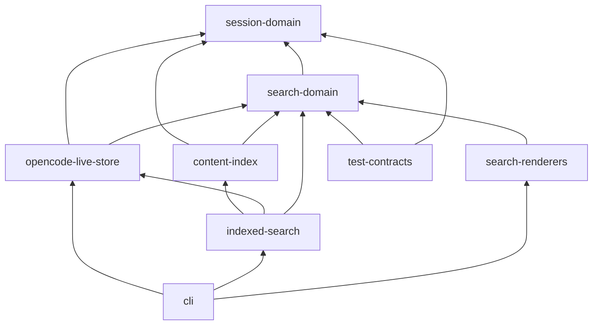

# Executable Kysely Query Architecture

## Decision

Adopt Kysely 0.29.x for cotail's query construction, behind domain operations and
a deliberately select-only `node:sqlite` adapter. Do not expose `Kysely`, query
builders, physical table types, or compiled SQL outside the opencode live-store
package.

Kysely earns its dependency here because it composes the difficult SQL that
cotail actually needs: correlated `EXISTS`, scalar evidence subqueries,
CTE/`UNION ALL` normalization, bound custom functions, and inferred result rows.
It does not eliminate SQL knowledge. SQLite JSON extraction, `json_each`, `re()`,
FTS5, and a few scalar expressions remain typed `sql` fragments. The improvement
over [`draft1.syn.md`](/query/draft1.syn.md) is that composition, aliases,
correlation, selected row shapes, and parameters are checked while physical SQL
remains private and behavior is tested against the actual runtime.

The architecture makes one stronger structural commitment than the baseline:

> The index package can return content candidates, but it cannot construct a
> session result. Only the live opencode metadata package can supply the
> `SessionSummary` required by a renderer-facing hit.

This keeps FTS an acceleration structure even when it contains denormalized
metadata for query pushdown.

## Scope And Invariants

- A `session` row is the result, metadata predicate, and deduplication root.
- One content requirement is witnessed by one normalized content unit.
- Patterns within one requirement inspect the same unit.
- Different requirements may use different units.
- Evidence is selected after qualification and cannot make a session qualify.
- Direct regex and FTS5 remain different request languages and hit products.
- Live opencode `session` metadata is authoritative for direct search, history,
  lookup, indexed-result hydration, and final indexed selector validation.
- Native V2 content comes from `session_message`; the `event` table is not a
  fallback read model.
- If a session has any `session_message` rows, V2 wins for both content and
  message counts; otherwise legacy `part`/`message` wins.

## Workspace Shape

### Groupings considered

Three domain groupings are plausible:

| Grouping | Strength | Failure mode |
|---|---|---|
| operation packages (`search`, `history`, `lookup`) | Commands map directly to packages. | Repeats live schema, selector lowering, and mixed-layout logic. |
| storage packages (`opencode`, `index`) | Makes authority boundaries obvious. | Risks putting requests, results, and rendering into storage-shaped APIs. |
| domain core plus storage capabilities | Keeps values stable while storage packages remain deep. | More packages, so each boundary must justify enforcement. |

Select the third. It best enforces the distinction between session identity,
live metadata, direct witnesses, indexed candidates, and rendering.

### Proposed pnpm workspace

```text
packages/
  session-domain/
    src/index.ts                 # SessionSummary, selector, ranges
  search-domain/
    src/index.ts                 # bounded requests, distinct hits, SearchResult
  opencode-live-store/
    src/index.ts                 # small public live-store operations
    src/runtime/node-sqlite.ts   # private Kysely adapter
    src/schema/tables.ts         # private external table declarations
    src/layout/content.ts        # private V1/V2 normalization
    src/query/selector.ts        # private Kysely lowering
    src/query/direct.ts          # private direct search compilation
    src/query/history.ts         # private count projection
  content-index/
    src/index.ts                 # candidate/freshness API, FTS request language
    src/schema/                  # cotail-owned FTS schema and migrations
    src/query/                   # MATCH, bm25, highlight
  indexed-search/
    src/index.ts                 # candidate hydration and final live filtering
  search-renderers/
    src/index.ts                 # human and JSONL rendering over SearchResult
  cli/
    src/commands/                # parsing and composition root
  test-contracts/
    src/fixtures/                # shared semantic fixture descriptions
    src/suites/                  # backend and renderer contract suites
```

These are packages, not merely directories, for concrete reasons:

| Package | Exported depth | Why package enforcement matters |
|---|---|---|
| `session-domain` | Stable values and validation only. | Prevents storage columns and Kysely types from becoming domain types. |
| `search-domain` | Request semantics and honest result products. | Gives direct, index, and renderers one dependency that owns no storage. |
| `opencode-live-store` | Five live operations; hides adapter, layout, SQL, and row maps. | Keeps external-schema hazards and metadata authority in one deep module. |
| `content-index` | Index/update/search-candidate capabilities. | It cannot import the live store or return authoritative sessions. |
| `indexed-search` | One hydrated indexed-search operation. | This is the only place allowed to combine stale candidates with live metadata. |
| `search-renderers` | Human/JSONL functions over a structural surface. | Prevents renderers from importing either backend. |
| `cli` | Commands and dependency construction. | It is the composition root; no lower package imports it. |
| `test-contracts` | Fixtures and reusable assertions, published only to dev dependencies. | Keeps parity tests shared without runtime packages depending on test code. |

### Acyclic dependency graph



`content-index` has no path to `opencode-live-store`. It returns
`IndexedCandidate`, which has a session ID but no `SessionSummary` and therefore
cannot satisfy `SearchResult`. `indexed-search` must hydrate through the live
store before producing `IndexedSearchHit`. That dependency graph is the metadata
authority rule made executable.

## Public Contracts

### Session domain

```ts
export interface SessionSummary {
  id: string;
  slug: string;
  title: string;
  directory: string;
  projectId: string;
  timeCreated: number;
  timeUpdated: number;
}

export interface SessionSelector {
  ids?: readonly string[];
  projectIds?: readonly string[];
  directory?:
    | { kind: "contains"; value: string }
    | { kind: "exact"; value: string };
  createdAt?: TimeRange;
  updatedAt?: TimeRange;
}

export interface TimeRange {
  fromInclusive?: number;
  beforeExclusive?: number;
}
```

Selector fields are conjunctive. Values within `ids` and `projectIds` are
disjunctive. Present empty ID arrays, empty directory values, non-finite times,
and ranges where `fromInclusive >= beforeExclusive` are rejected before a query
is compiled. Ranges are half-open.

### Bounded matching at both scopes

```ts
export interface TextPattern {
  source: string;
  caseSensitive: boolean;
}

export interface PatternSet {
  all?: readonly TextPattern[];
  any?: readonly TextPattern[];
  none?: readonly TextPattern[];
}

export interface ContentRequirement {
  types: readonly ("text" | "reasoning" | "tool")[];
  roles?: readonly ("user" | "assistant" | "shell")[];
  text: PatternSet;
}

export interface ContentRequirements {
  all?: readonly ContentRequirement[];
  any?: readonly ContentRequirement[];
  none?: readonly ContentRequirement[];
}
```

There is deliberately no recursive predicate node and no cross-relation boolean
composition. Validation is identical at both bounded scopes:

- at least one of `all`, `any`, or `none` must be present;
- every present group must be non-empty;
- a requirement must have at least one type;
- duplicate types/roles and empty pattern sources are rejected; and
- every regex is compiled once in JavaScript during validation, before opening
  or querying SQLite.

The truth table is:

| Group | Present semantics | Omitted identity | SQL shape |
|---|---|---|---|
| pattern `all` | every pattern matches this unit | true | `re(p1,text) AND ...` |
| pattern `any` | at least one pattern matches this unit | true | `(re(p1,text) OR ...)` |
| pattern `none` | no pattern matches this unit | true | `NOT re(p1,text) AND ...` |
| requirement `all` | every requirement has a witness | true | `EXISTS(r1) AND ...` |
| requirement `any` | at least one requirement has a witness | true | `(EXISTS(r1) OR ...)` |
| requirement `none` | no listed requirement has a witness | true | `NOT EXISTS(r1) AND ...` |

If several groups are present, their rows in the table are ANDed. A request such
as `{all:[a], any:[b,c], none:[d]}` means `a AND (b OR c) AND NOT d` at that
scope. Rejecting present empty groups avoids giving `any: []` an accidental
false identity or letting `{}` match every value.

At pattern scope, all predicates are emitted inside one unit subquery, so their
witness is necessarily the same. At requirement scope, every `EXISTS` owns its
unit alias, so separate requirements may use separate witnesses. Requirement
`none` always lowers to correlated `NOT EXISTS`; it is not `EXISTS` with an
internally negated pattern, which would mean that some nonmatching unit exists.

### Operation-shaped requests and hits

```ts
export type DirectSearchRequest =
  | {
      select: SessionSelector;
      match: { relation: "title"; patterns: PatternSet };
      evidence: { kind: "none" };
      order: "updated-desc";
      limit: number;
    }
  | {
      select: SessionSelector;
      match: { relation: "content"; requirements: ContentRequirements };
      evidence:
        | { kind: "none" }
        | { kind: "first-positive-witness"; maxCharacters: number };
      order: "updated-desc";
      limit: number;
    };

export interface IndexedSearchRequest {
  select: SessionSelector;
  query:
    | { kind: "terms"; terms: readonly string[]; combine: "all" | "any" }
    | { kind: "phrase"; value: string }
    | { kind: "advanced"; expression: string };
  evidence: "none" | "highlight";
  order: "relevance" | "updated-desc";
  limit: number;
  freshness: "require-current" | "allow-stale";
}

export interface SearchResult {
  session: SessionSummary;
  evidenceText?: string;
}

export interface DirectSearchHit extends SearchResult {
  backend: "direct";
  evidence?: {
    kind: "content-witness";
    requirement: { scope: "all" | "any"; index: number };
    contentId: string;
    layout: "v1-part" | "v2-session-message";
    ordinal: readonly [major: number, minor: number];
  };
}

export interface IndexedSearchHit extends SearchResult {
  backend: "index";
  rank: number;
  score: number;
  highlight?: { kind: "fts-highlight"; contentId: string; markedText: string };
  index: { generation: string; indexedThrough: number; stale: boolean };
}
```

The concrete hits remain honest and distinct while both structurally satisfy
`SearchResult`. `evidenceText` is the plain renderer excerpt. Direct provenance,
FTS mark-up, score, rank, and freshness remain available and appear in JSONL.

The live store maps Kysely's inferred snake-case row once at its boundary:

```ts
function mapDirectRow(row: DirectSearchRow): DirectSearchHit {
  const evidence = row.evidence_content_id === null ? undefined : {
    kind: "content-witness" as const,
    requirement: {
      scope: row.evidence_scope as "all" | "any",
      index: row.evidence_requirement,
    },
    contentId: row.evidence_content_id,
    layout: row.evidence_layout,
    ordinal: [row.evidence_major, row.evidence_minor] as const,
  };

  return {
    backend: "direct",
    session: {
      id: row.id,
      slug: row.slug,
      title: row.title,
      directory: row.directory,
      projectId: row.project_id,
      timeCreated: row.time_created,
      timeUpdated: row.time_updated,
    },
    ...(row.evidence_text === null ? {} : { evidenceText: row.evidence_text }),
    ...(evidence === undefined ? {} : { evidence }),
  };
}
```

The selected evidence columns are nullable because title/no-evidence requests
and unmatched scalar projections return `NULL`; domain optionals do not leak
SQLite nullability to renderers.

Evidence never comes from `none`. For `first-positive-witness`, positive
requirements are considered in deterministic order: `all` request order first,
then `any` request order. If there is no `all`, the lowest-index matching `any`
requirement wins; within that requirement the earliest `(major, minor,
contentId)` witness wins. Thus an `any` group does not accidentally select
evidence from a failed alternative. Qualification is compiled independently;
the scalar evidence query may return `NULL` without changing the outer `WHERE`.

### Small live-store surface

```ts
export interface OpencodeLiveStore {
  searchDirect(request: DirectSearchRequest): Promise<readonly DirectSearchHit[]>;
  history(request: HistoryRequest): Promise<readonly HistoryEntry[]>;
  resolve(request: ResolveRequest): Promise<SessionSummary | undefined>;
  hydrate(ids: readonly string[]): Promise<ReadonlyMap<string, SessionSummary>>;
  matches(selector: SessionSelector, ids: readonly string[]): Promise<ReadonlySet<string>>;
}
```

The async API is intentional. `DatabaseSync` performs each native call
synchronously, but Kysely's driver API returns promises. Commands become `async`
and await only at operation boundaries. Query construction and `.compile()` are
synchronous. This does not create parallel SQLite execution; callers must not
mistake `Promise.all` for nonblocking database I/O.

## Proven `node:sqlite` Integration

Kysely's SQLite dialect accepts a narrow `better-sqlite3`-shaped contract. Its
driver calls `statement.all(parametersArray)` for readers and
`statement.run(parametersArray)` otherwise. `node:sqlite` expects positional
arguments, so the adapter spreads the array:

```ts
import type { SQLInputValue, StatementSync } from "node:sqlite";
import type { SqliteDatabase, SqliteStatement } from "kysely";

class NodeSqliteStatement implements SqliteStatement {
  public readonly reader = true;

  public constructor(public readonly statement: StatementSync) {}

  public all(parameters: ReadonlyArray<unknown>): unknown[] {
    return this.statement.all(...parameters as SQLInputValue[]);
  }

  public iterate(parameters: ReadonlyArray<unknown>): IterableIterator<unknown> {
    return this.statement.iterate(...parameters as SQLInputValue[]);
  }

  public run(parameters: ReadonlyArray<unknown>): never {
    throw new Error(`read-only adapter cannot run writes (${parameters.length} parameters)`);
  }
}
```

The production wrapper supplies `prepare()` and delegates `close()` to the
existing `DatabaseSync`. Its `reader` is always true by design, not by SQL-string
classification. `StatementSync.columns()`, a tempting generic reader check, was
added in Node 23.11 and is unavailable at the earliest supported `node:sqlite`
versions. Cotail opens the external database with `readOnly: true`, exposes the
instance internally as `ReadonlyKysely<OpencodeDb>`, and permits only select
operations. Runtime `run()` is a second guard if a cast bypasses static typing.

```ts
import { Kysely, SqliteDialect } from "kysely";
import type { ReadonlyKysely } from "kysely/readonly";

export function openQueries(native: DatabaseSync): ReadonlyKysely<OpencodeDb> {
  return new Kysely<OpencodeDb>({
    dialect: new SqliteDialect({ database: new NodeSqliteDatabase(native) }),
  }) as ReadonlyKysely<OpencodeDb>;
}
```

The cast follows Kysely's documented read-only facade: it narrows the public
surface but does not change the runtime driver. No transaction API is exposed by
`OpencodeLiveStore`; closing the Kysely instance closes the native database.

The executable spike at
[`/.test-agent/query-builders/kysely/index.ts`](/.test-agent/query-builders/kysely/index.ts)
proves this against Kysely 0.29.4. It runs a CTE/`UNION ALL`, correlated
`EXISTS`/`NOT EXISTS`, scalar evidence, JSON extraction, custom JavaScript
`re()`, contains-directory selection, a half-open range, ordering, and a limit.

## External Schema And Capability Detection

Kysely table declarations describe columns cotail reads; they do not claim that
variable tables exist in every external database:

```ts
interface SessionTable {
  id: string;
  slug: string;
  title: string;
  directory: string;
  project_id: string;
  parent_id: string | null;
  version: string;
  time_created: number;
  time_updated: number;
}

interface PartTable {
  id: string;
  session_id: string;
  message_id: string;
  time_created: number;
  data: string;
}

interface MessageTable {
  id: string;
  session_id: string;
  time_created: number;
  data: string;
}

interface SessionMessageTable {
  id: string;
  session_id: string;
  type: string;
  seq: number;
  time_created: number;
  time_updated: number;
  data: string;
}

interface OpencodeDb {
  session: SessionTable;
  part: PartTable;
  message: MessageTable;
  session_message: SessionMessageTable;
}
```

At startup the live store reads `sqlite_master` and validates required columns
with `pragma_table_info`. It then creates one immutable `LayoutCapabilities`
value. Query factories only reference branches whose tables and columns were
detected. Static declarations catch misspelled known columns and aliases;
runtime capability checks remain necessary because opencode owns the schema.
Unsupported or ambiguous layouts are rejected, not coerced with `any`.

## Kysely Lowering

### Selector

```ts
function applySelector<O>(
  query: SelectQueryBuilder<OpencodeDb, "s", O>,
  selector: SessionSelector,
) {
  let next = query;
  if (selector.ids) next = next.where("s.id", "in", selector.ids);
  if (selector.projectIds) next = next.where("s.project_id", "in", selector.projectIds);
  if (selector.directory?.kind === "exact") {
    next = next.where("s.directory", "=", selector.directory.value);
  }
  if (selector.directory?.kind === "contains") {
    next = next.where(sql<SqlBool>`instr(s.directory, ${selector.directory.value}) > 0`);
  }
  if (selector.updatedAt?.fromInclusive !== undefined) {
    next = next.where("s.time_updated", ">=", selector.updatedAt.fromInclusive);
  }
  if (selector.updatedAt?.beforeExclusive !== undefined) {
    next = next.where("s.time_updated", "<", selector.updatedAt.beforeExclusive);
  }
  return next;
}
```

`createdAt` is symmetric. Values are interpolated as bindings. Raw SQL is
limited to SQLite's `instr()` call; Kysely still owns the reference and value
composition.

### Pattern and requirement predicates

Private lowering creates an expression, not a SQL string:

```ts
function patternPredicate(
  eb: ExpressionBuilder<ContentCteDb, "unit">,
  patterns: PatternSet,
): Expression<SqlBool> {
  const match = (pattern: TextPattern) =>
    sql<SqlBool>`re(${encodeRegex(pattern)}, unit.text)`;

  return eb.and([
    ...patterns.all?.map(match) ?? [],
    ...(patterns.any ? [eb.or(patterns.any.map(match))] : []),
    ...patterns.none?.map((pattern) => eb.not(match(pattern))) ?? [],
  ]);
}

function witness(requirement: ContentRequirement, alias: string) {
  return db.selectFrom(`searchable_content as ${alias}`)
    .select(sql.lit(1).as("one"))
    .whereRef(`${alias}.session_id`, "=", "s.id")
    .where(`${alias}.content_type`, "in", requirement.types)
    .where((eb) => patternPredicateForAlias(eb, alias, requirement.text));
}
```

The actual implementation uses fixed private aliases rather than accepting an
untrusted string. Requirement lowering applies `eb.exists(witness(r))`, an
`eb.or(...)` around the `any` witnesses, and `eb.not(eb.exists(witness(r)))` for
each `none` requirement. Types and roles are predicates inside the same witness
subquery as text.

### Mixed V1/V2 content normalization

`searchable_content` is a query-local CTE, never a view written into opencode's
database. Its normalized columns are:

```ts
interface SearchableContent {
  session_id: string;
  content_id: string;
  role: "user" | "assistant" | "shell";
  content_type: "text" | "reasoning" | "tool";
  text: string;
  ordinal_major: number;
  ordinal_minor: number;
  layout: "v1-part" | "v2-session-message";
}
```

The V1 branch joins `part.message_id` to `message.id`, derives role from message
JSON, derives type/text from part JSON, and emits
`(part.time_created, 0, part.id)` ordering. It includes only sessions for which
`NOT EXISTS (SELECT 1 FROM session_message WHERE session_id = part.session_id)`.

The V2 branches use `session_message.seq` as `ordinal_major`:

| V2 message/content | Normalized type and text | Minor order |
|---|---|---|
| `user` | `text`, `$.text` | `0` |
| `assistant.content[].text` | `text`, item `$.text` | `json_each.key` |
| `assistant.content[].reasoning` | `reasoning`, item `$.text` | `json_each.key` |
| `assistant.content[].tool` | `tool`, canonical JSON containing name, input, and output/content | `json_each.key` |
| `shell` | `tool`, command plus output in one stable text representation | `0` |
| `system`, `synthetic`, `skill` | excluded initially; not rendered by canonical transcript or current role vocabulary | n/a |
| `agent-switched`, `model-switched`, `compaction` | excluded as metadata/control records | n/a |

Matching and evidence use the same normalized `text`; the current incoherence of
matching an entire tool JSON blob but excerpting only input is not preserved.
The exact canonical tool/shell text format must be fixture-approved before those
types ship. Until then, requests for `tool` on a detected V2 layout return an
`unsupported-requirement` error rather than silently searching a partial field.

Assistant extraction uses `json_each(session_message.data, '$.content')` and
`CAST(json_each.key AS INTEGER)`. Kysely expresses the table-valued JSON function
with a small `sql` table expression; the union, aliases, joins, correlation, and
bindings remain builder-owned.

Per-session V2 precedence is applied before matching, so a legacy duplicate can
neither satisfy an additional `all` requirement nor provide earlier evidence.
The spike proves the suppression case: session `dupe` has matching V1 content
and nonmatching V2 content and is correctly excluded.

### Evidence

The evidence scalar query reads the same `searchable_content` CTE. For a single
positive requirement it is a correlated select ordered by
`ordinal_major`, `ordinal_minor`, and `content_id`, limited to one. For multiple
`any` alternatives, Kysely builds a `UNION ALL` of matching candidate selects,
adds a literal `requirement_index`, and selects the first row ordered by
`requirement_index` then witness order. `all` candidates receive a lower scope
priority than `any` candidates.

The qualification predicates are still emitted separately in the outer
`WHERE`. Reusing a private requirement-lowering function prevents semantic
drift, while fixture tests ensure removing evidence leaves the same session IDs.

### Representative generated SQL

The executed spike compiled to the following shape (formatted for readability):

```sql
WITH "searchable_content" AS (
  SELECT "part"."session_id", "part"."id" AS "content_id",
         json_extract(part.data, '$.type') AS "content_type",
         json_extract(part.data, '$.text') AS "text",
         "part"."time_created" AS "ordinal", 'v1-part' AS "layout"
  FROM "part"
  WHERE NOT EXISTS (
    SELECT "session_message"."id" FROM "session_message"
    WHERE "session_message"."session_id" = "part"."session_id"
  )
  UNION ALL
  SELECT "session_message"."session_id",
         "session_message"."id" AS "content_id", 'text' AS "content_type",
         json_extract(session_message.data, '$.text') AS "text",
         "session_message"."seq" AS "ordinal",
         'v2-session-message' AS "layout"
  FROM "session_message"
  WHERE "session_message"."type" = ?
)
SELECT "s"."id", "s"."title", "s"."directory", "s"."time_updated",
       (SELECT "evidence"."text" FROM "searchable_content" AS "evidence"
        WHERE "evidence"."session_id" = "s"."id"
          AND "evidence"."content_type" = ?
          AND re(?, evidence.text) AND re(?, evidence.text)
          AND (re(?, evidence.text) OR re(?, evidence.text))
          AND NOT re(?, evidence.text)
        ORDER BY "evidence"."ordinal" LIMIT ?) AS "evidence_text"
FROM "session" AS "s"
WHERE instr(s.directory, ?) > 0
  AND "s"."time_updated" >= ? AND "s"."time_updated" < ?
  AND EXISTS (
    SELECT "unit"."content_id" FROM "searchable_content" AS "unit"
    WHERE "unit"."session_id" = "s"."id"
      AND "unit"."content_type" = ?
      AND re(?, unit.text) AND re(?, unit.text)
      AND (re(?, unit.text) OR re(?, unit.text))
      AND NOT re(?, unit.text)
  )
  AND NOT EXISTS (
    SELECT "excluded"."content_id" FROM "searchable_content" AS "excluded"
    WHERE "excluded"."session_id" = "s"."id" AND re(?, excluded.text)
  )
ORDER BY "s"."time_updated" DESC
LIMIT ?
```

The exact 19 bindings are recorded in
[`result.json`](/.test-agent/query-builders/kysely/result.json):

```json
["user","text","alpha","beta","gamma","delta","forbidden",1,
 "/work/cotail",150,180,"text","alpha","beta","gamma","delta",
 "forbidden","blocked",10]
```

This demonstrates pattern `all` (`alpha`, `beta`), pattern `any` (`gamma`,
`delta`), pattern `none` (`forbidden`), a positive requirement `EXISTS`, and a
negative requirement `NOT EXISTS` (`blocked`). Production lowering generalizes
the same expression constructors to requirement-level `all`, `any`, and `none`.
Tests assert behavior rather than freezing this formatting.

## History Count Precedence

The synthesized baseline's addition of V1 and V2 counts can double-count a
transition session. Count per session with the same authority rule as content:

```ts
const total = sql<number>`case
  when exists (
    select 1 from session_message sm0 where sm0.session_id = s.id
  ) then (
    select count(*) from session_message sm where sm.session_id = s.id
  ) else (
    select count(*) from message m where m.session_id = s.id
  ) end`;

const recent = (cutoff: number) => sql<number>`case
  when exists (
    select 1 from session_message sm0 where sm0.session_id = s.id
  ) then (
    select count(*) from session_message sm
    where sm.session_id = s.id and sm.time_created >= ${cutoff}
  ) else (
    select count(*) from message m
    where m.session_id = s.id and m.time_created >= ${cutoff}
  ) end`;
```

The store emits only branches supported by detected tables. Precedence is based
on any native row, not the count inside the requested recent interval. Thus a V2
session with old native messages does not fall back to recent legacy duplicates.
If both layouts represent a partially migrated session rather than duplicate
projections, this policy could hide rows; that is an explicit rejection
condition until real transition fixtures prove another discriminator.

## Index Boundary And Live Hydration

`content-index` owns an FTS database and returns only:

```ts
export interface IndexedCandidate {
  sessionId: string;
  contentId: string;
  score: number;
  markedText?: string;
  indexedSessionVersion: number;
}
```

It may copy project, directory, and timestamp fields for FTS-side pushdown, but
those fields are hints. `indexed-search` processes candidates in stable ranked
batches:

1. Ask the index for the next candidate batch with `(score, contentId)` cursor.
2. Deduplicate session IDs while retaining each session's best candidate.
3. Hydrate those IDs from `OpencodeLiveStore.hydrate()`.
4. Drop candidates whose session is missing or deleted.
5. Re-evaluate the complete `SessionSelector` against live rows.
6. Emit `IndexedSearchHit` in surviving candidate order.
7. Continue fetching until the requested post-hydration limit is full or the
   index is exhausted.

This avoids the common bug of taking `LIMIT 50` stale candidates and returning
only 37 after hydration. Ranking among surviving candidates remains index rank;
the hit records both original `rank` and score. For `updated-desc`, candidates
are hydrated and sorted by live `timeUpdated`, with cursor behavior designed
before that mode ships. `require-current` rejects a generation behind the live
index checkpoint. `allow-stale` retains explicit freshness on every hit.

History, lookup, and direct search have no dependency on `content-index` or
`indexed-search`. Deleting the index packages leaves all live metadata
operations intact.

## Shared Rendering Without Backend Leakage

Both renderers accept the minimal structural contract:

```ts
export function renderHuman(results: readonly SearchResult[]): void;

export function emitJsonl<T extends SearchResult>(results: readonly T[]): void {
  for (const result of results) process.stdout.write(`${JSON.stringify(result)}\n`);
}
```

Human rendering reads `session` and `evidenceText`. Generic JSONL rendering
serializes the concrete value, preserving backend, direct witness provenance,
index score, highlight, and freshness.

The command contains one backend choice and no renderer branch:

```ts
const execution = request.backend === "direct"
  ? await live.searchDirect(request.direct)
  : await indexed.search(request.indexed);

if (request.json) emitJsonl(execution);
else renderHuman(execution);
```

Parsing rejects regex flags for the indexed backend and FTS expression flags for
the direct backend. An eventual `auto` mode may choose only for an input form
whose semantics are explicitly defined for both; it never silently translates a
regex into FTS terms.

## Migration Sequence

Each item is a coherent, reviewable commit; no initial directory-only reshuffle
is required.

1. Add characterization fixtures for current title/content/history output,
   including independent and same-unit witnesses.
2. Add V2-native, mixed-layout duplicate, and count-precedence fixtures that
   expose current misses and double counts.
3. Add `session-domain` and `search-domain`; preserve existing CLI output through
   temporary adapters.
4. Add `opencode-live-store` with the select-only `node:sqlite` adapter,
   capability detection, and `ReadonlyKysely` facade.
5. Move session lookup and selector lowering into the live store; cover exact
   versus contains directory and half-open boundaries.
6. Move title search into Kysely and remove command-local SQL.
7. Implement V1 normalized content and current one-pattern-per-requirement
   behavior; retain result parity.
8. Add all/any/none validators and lowerers at pattern and requirement scopes,
   including deterministic positive evidence.
9. Implement V2 `session_message` normalization and per-session V2 precedence;
   remove the incorrect event reader.
10. Move history to Kysely `CASE` count precedence and preserve independent
    session-selection/count cutoffs.
11. Replace old source iteration and command deduplication with one session-root
    query; remove `VersionSchema` SQL fragments.
12. Extract shared renderers and make direct hits satisfy `SearchResult` without
    changing human output.
13. Add `content-index` schema/migrations and candidate-only API.
14. Add `indexed-search` hydration, live selector recheck, stale deletion,
    over-fetch, and distinct indexed hits.
15. Wire explicit backend selection into the CLI and add end-to-end human/JSONL
    parity tests.

## Test Matrix

Behavior tests execute temporary `DatabaseSync` fixtures; compile-only tests are
supplementary.

| Area | Required cases |
|---|---|
| adapter | positional spread for `all`/`iterate`, async execute, close, write rejection |
| selector | IDs/projects, exact/contains directory, inclusive lower and exclusive upper time edges |
| validation | `{}`, every present empty group, empty type/role, bad regex, inverted range, zero/non-finite limit |
| pattern scope | all, any, none, combinations, and same-unit enforcement |
| requirement scope | all with separate witnesses, any alternatives, none via `NOT EXISTS`, mixed groups |
| evidence | disabled parity, first all witness, lowest matching any index, earliest V1/V2 order, no evidence from none |
| V1 | text/reasoning/tool mapping and message-role join |
| V2 | user, assistant text/reasoning/tool, shell, explicit exclusions, `seq` plus array position |
| mixed layout | legacy only, native only, separate V1/V2 sessions, duplicate session suppression |
| counts | V1 fallback, V2 precedence, recent cutoff, duplicate suppression, zero rows |
| index | stale metadata, deleted session, selector changed after indexing, batch refill to post-hydration limit |
| rendering | same human shape, full direct/indexed JSONL details, absent evidence |

Do not snapshot complete generated SQL. Inspect `.compile()` in focused tests for
binding completeness and diagnostic output, but assert operation results for
correlation, JSON paths, null behavior, precedence, and witness scope.

## Spike Results

The isolated spike does not modify production manifests or lockfiles. On
2026-08-11 these commands succeeded:

```sh
cd .test-agent/query-builders/kysely
CI=true pnpm exec tsgo -p tsconfig.json
node index.ts > /tmp/opencode/kysely-result.json
cmp result.json /tmp/opencode/kysely-result.json
```

Exact observations:

- runtime: Node `v26.6.0` (using APIs available from Node 22.5.0);
- Kysely: `0.29.4`;
- `tsgo`: exit `0` with strict, no-emit, isolated declarations;
- executable fixture: exit `0`;
- output comparison: exit `0`, byte-identical;
- result IDs in order: `['v2', 'v1']`;
- evidence: `['alpha beta delta', 'alpha beta gamma']`;
- mixed-layout session `dupe`: excluded because native V2 presence suppresses
  its matching legacy projection; and
- compiled query: 19 positional placeholders/bindings.

The exact source and output are
[`index.ts`](/.test-agent/query-builders/kysely/index.ts) and
[`result.json`](/.test-agent/query-builders/kysely/result.json).

## Costs, Risks, And Rejection Conditions

### Costs and risks

- Kysely adds a runtime dependency and makes operation APIs asynchronous around
  synchronous native work.
- JSON table functions and custom SQLite functions still require raw `sql`
  expressions; claiming ORM-level portability would be dishonest.
- External schema declarations can become stale. Runtime capability checks and
  real database fixtures remain mandatory.
- A normalized CTE may be expensive over large databases. Use `EXPLAIN QUERY
  PLAN` and representative corpora; Kysely improves construction, not query
  complexity.
- V2-over-V1 precedence assumes duplicate projection rather than partial
  migration. Real transition fixtures must validate it.
- Kysely's read-only type is a facade; runtime read-only opening and the adapter's
  throwing `run()` remain the actual safety barriers.

### Reject Kysely if

- representative direct, history, or V2 `json_each` queries cannot execute
  through the adapter on the project's minimum Node 22.x release;
- required SQL repeatedly collapses into whole-query `sql.raw` strings, leaving
  Kysely responsible only for `.execute()`;
- query plans regress materially versus equivalent focused SQL and cannot be
  corrected without exposing builder machinery across packages;
- cotail needs writes or arbitrary non-row statements through this same adapter;
- Kysely 0.29.x changes the narrow SQLite statement contract before production
  adoption and a small compatibility test cannot contain the change;
- mixed-layout fixtures disprove the per-session V2 precedence policy without a
  reliable replacement discriminator; or
- the proposed package graph is bypassed by allowing `content-index` to return
  authoritative session metadata or renderable hits directly.

## Comparison With The Synthesized Baseline

This proposal retains the baseline's strongest choices: session root,
operation-shaped requests, bounded nonrecursive matching, private compilation,
evidence as projection, and direct/indexed semantic honesty. It improves or
resolves the baseline in these specific ways:

| Baseline issue | Kysely alternative |
|---|---|
| Hand-built fragments and positional ordering remain implementation work. | Kysely composes aliases, correlation, unions, subqueries, result types, and bindings; the adapter path is executed. |
| `all`/`any`/`none` evidence and empty-group semantics were partly unresolved. | Both scopes have validation, identities, truth tables, lowering, and deterministic `any` evidence. |
| One deep store risked becoming a broad architectural center. | Domain and storage packages have small enforced surfaces and an explicit acyclic graph. |
| FTS metadata authority was a rule in prose. | Candidate-only index output cannot satisfy `SearchResult`; live hydration is a required dependency. |
| A single normalized `SearchHit` risked erasing provenance. | Direct and indexed hits are distinct structural subtypes with shared rendering fields. |
| Indexed limits after stale hydration were unspecified. | Ranked batch refill applies limit after missing/deleted/live-selector filtering. |
| Mixed history counts were shown as addition. | `CASE` precedence prevents V1/V2 double counting per session. |
| V2 extraction remained an experiment list. | Every message/content variant has an initial mapping or explicit exclusion and rejection policy. |
| Runtime compatibility was assumed. | A select-only Node adapter, generated SQL, bindings, and returned rows are preserved as an executable spike. |

The recommendation is therefore conditional but positive: Kysely is a viable
and currently strongest typed-builder implementation path for cotail, provided
the production migration preserves the narrow package boundaries and the
remaining V2 tool/transition semantics pass real fixtures.

## Cross-References

- [`packet-query-builders0.md`](/query/packet-query-builders0.md) defines the
  acceptance criteria this proposal executes against.
- [`draft1.syn.md`](/query/draft1.syn.md) supplies the session-root and
  operation-shaped baseline retained here.
- [`draft1.gpt56sol.md`](/query/draft1.gpt56sol.md) identifies the mixed-layout
  count and `session_message` corrections resolved by per-session precedence.
- [`v2.md`](/v2.md) is the source for V2 message variants, content arrays, and
  `session_message.seq` ordering.
- [`/.test-agent/query-builders/README.md`](/.test-agent/query-builders/README.md)
  records the reproducible adapter experiment and its limits.
