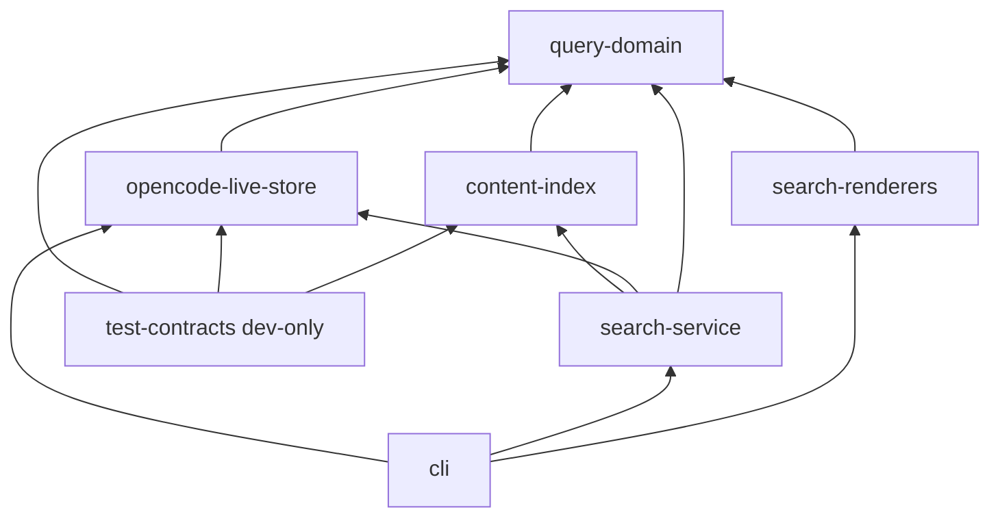

# Refined Kysely Query Architecture

## Decision

Choose Kysely 0.29.x behind a six-package runtime graph and retain `node:sqlite`.
Use Kysely for both live-store query construction and the cotail-owned index's
query construction, but do not use an ORM schema/migration layer for the index.
The index package owns a small explicit SQLite schema and migrations; Kysely
owns typed statements over that schema. Live opencode storage remains select-only.

The first Kysely proposal was correct about the decisive runtime fact: its
SQLite dialect needs a documented, tiny better-sqlite3-shaped interface, while
Drizzle 0.45.x has no supported `node:sqlite` integration. The Drizzle fixture
also demonstrates that schema declarations can encode physical-to-domain
property mapping and that synchronous calls are easier to explain. This
refinement takes those ergonomic lessons, but does not exchange Node's built-in
runtime for a native addon whose clean installation and exact-version proof are
still unresolved.

The resulting rule is:

> Kysely is private query construction. Domain contracts, database ownership,
> metadata authority, and resource lifecycle remain explicit package contracts.

## Cross-Review Of Drizzle

### Strong contributions accepted

Drizzle's strongest contribution is not its driver. The declarations in
[`draft-drizzle0.md`](/query/draft-drizzle0.md#external-schema-and-selector) show
that `projectId: text("project_id")` can make a selected row use domain spelling
without a second physical-name interface. Kysely should use the same technique:
declare the external table with domain-shaped aliases through a private selected
projection, rather than expose snake-case rows throughout the implementation.
The projection is still mapped once at the live-store boundary; it is simply
mapped by the query selection instead of by every result mapper.

Drizzle also correctly argues that the original graph had too many independently
published-looking packages. The package boundary should enforce authority and
dependency direction, not turn every operation into a package. This refinement
merges `session-domain` and `search-domain` into `query-domain`, and merges the
index candidate API and its schema ownership into `content-index`. The hydration
orchestrator remains separate because it is the only component allowed to depend
on both index and live metadata.

The counterproposal's synchronous-facade criticism is valid as a usability
criticism. A synchronous `DatabaseSync` call does not become concurrent merely
because Kysely returns a promise. The answer is not to adopt `better-sqlite3`:
the answer is to make the async boundary singular, documented, and lifecycle
aware. See [Async facade](#async-facade) below.

Finally, Drizzle's index observation is accepted in modified form. Its schema
declaration and migration ecosystem would be useful for a cotail-owned database,
but introducing Drizzle only for migrations would create a second query builder
and a second SQLite runtime story. A small SQL migration set plus Kysely's typed
index statements is less machinery and keeps one builder dependency.

### Valid criticisms not accepted as reasons to switch

The row-mapping comparison is real, but not decisive. Drizzle's camelCase table
properties reduce mapper code; they do not remove the need for a boundary mapper
for nullability, provenance, JSON-derived values, and external capability
checking. Kysely can select a private domain-shaped row:

```ts
const row = db.selectFrom("session as s").select({
  id: "s.id",
  slug: "s.slug",
  title: "s.title",
  directory: "s.directory",
  projectId: "s.project_id",
  timeCreated: "s.time_created",
  timeUpdated: "s.time_updated",
}).as("session_row");
```

The final mapper remains the only place that turns nullable scalar evidence and
validated external values into `SessionSummary` and concrete hits. This is a
small honest mapper, not a claim that Kysely has schema-first domain mapping.

Drizzle's fixture is meaningful but its runtime result is Drizzle 0.45.2 while
the audited source is 0.45.3. It also needs `skipLibCheck`, and its install
reported `ERR_PNPM_IGNORED_BUILDS`; `better-sqlite3` adds a native addon and a
release-platform matrix. Those are not theoretical costs. The shared spike
records the 27 MB apparent addon package, 109 MB complete isolated install, and
2,226,168-byte Linux prebuild. Kysely's 0.29.4 fixture passes strict checking
and runs over the required built-in runtime with no driver swap.

Drizzle's custom-driver rejection is accepted completely. Reusing its internal
`mapResultRow` and `joinsNotNullableMap` would be less maintainable than the
Kysely adapter, whose required methods are documented in the Kysely SQLite
dialect contract.

## Smaller Workspace

### Selected packages

```text
packages/
  query-domain/
    src/index.ts                 # selectors, bounded requests, hits, SearchResult
  opencode-live-store/
    src/index.ts                 # lifecycle plus five live operations
    src/runtime/node-sqlite.ts   # private select-only adapter
    src/schema/external.ts       # private external declarations/capabilities
    src/layout/content.ts        # private V1/V2 normalization
    src/query/                   # private Kysely lowering and row projections
  content-index/
    src/index.ts                 # candidate/freshness API
    src/schema/*.sql             # cotail-owned FTS schema and migrations
    src/query/                   # private Kysely writable index statements
  search-service/
    src/index.ts                 # indexed candidate hydration and refill
  search-renderers/
    src/index.ts                 # human and JSONL rendering
  cli/
    src/commands/                # parsing and composition root
  test-contracts/                # dev-only fixtures and semantic suites
```

`test-contracts` is a workspace package for development reuse, not a runtime
dependency and not published. The five runtime packages above are deep enough
to justify enforcement; `cli` is the composition root and is not imported by
any library.



`content-index` cannot import the live store and returns only `IndexedCandidate`.
`search-service` is therefore the structural metadata-authority seam. The
index may denormalize metadata for pushdown, but no candidate can satisfy
`SearchResult` without live hydration.

### Dependency/install decision

Production adds exactly one runtime dependency: `kysely@latest` constrained to
the selected 0.29.x line after the implementation spike. No Drizzle package and
no `better-sqlite3` package are installed. The production change must use
`pnpm install kysely@latest`, not a hand-edited manifest. The index has no ORM
migration dependency: its migrations are reviewed SQL files executed by a
private write-capable native helper, while Kysely builds and types its index
queries. This keeps the live adapter select-only and avoids pretending that one
adapter should safely serve both external reads and cotail writes.

## Public Contracts

`query-domain` exports the same semantic types as the original proposal:
`SessionSummary`, `SessionSelector`, half-open `TimeRange`, `TextPattern`,
`PatternSet`, `ContentRequirement`, `ContentRequirements`, operation-shaped
`DirectSearchRequest` and `IndexedSearchRequest`, `HistoryRequest`, and
`ResolveRequest`.

```ts
export interface SearchResult {
  session: SessionSummary;
  evidenceText?: string;
}

export interface DirectSearchHit extends SearchResult {
  backend: "direct";
  evidence?: {
    kind: "content-witness";
    requirement: { scope: "all" | "any"; index: number };
    contentId: string;
    layout: "v1-part" | "v2-session-message";
    ordinal: readonly [major: number, minor: number];
  };
}

export interface IndexedSearchHit extends SearchResult {
  backend: "index";
  rank: number;
  score: number;
  highlight?: { kind: "fts-highlight"; contentId: string; markedText: string };
  index: { generation: string; indexedThrough: number; stale: boolean };
}
```

The live store exposes no Kysely types, table types, SQL, or native database:

```ts
export interface OpencodeLiveStore {
  searchDirect(request: DirectSearchRequest): Promise<readonly DirectSearchHit[]>;
  history(request: HistoryRequest): Promise<readonly HistoryEntry[]>;
  resolve(request: ResolveRequest): Promise<SessionSummary | undefined>;
  hydrate(ids: readonly string[]): Promise<ReadonlyMap<string, SessionSummary>>;
  matches(selector: SessionSelector, ids: readonly string[]): Promise<ReadonlySet<string>>;
}

export interface OpenedOpencodeLiveStore extends OpencodeLiveStore {
  close(): Promise<void>;
}
```

`content-index` exports `IndexedCandidate`, `searchCandidates`, update/checkpoint
operations, and its own `close()`. It never exports an authoritative session.
`search-service.search()` returns `readonly IndexedSearchHit[]`. Renderers accept
`readonly SearchResult[]`; JSONL is generic over a concrete subtype so rank,
highlight, witness, and freshness are retained.

## Async Facade And Lifecycle

The async concern is resolved by keeping promises at one boundary, not by
claiming that SQLite is asynchronous. Kysely's `execute()` contract is promise
based even though the adapter calls `DatabaseSync` synchronously. Every live
operation builds and executes one or a bounded number of statements, and the
public commands await those operation calls. No caller is told that this creates
parallel I/O; `Promise.all` is forbidden for operations sharing one connection.

The composition root owns the lifecycle:

```ts
const live = await openOpencodeLiveStore(databasePath, { regex });
try {
  const results = await live.searchDirect(request);
  await emit(results);
} finally {
  await live.close();
}
```

In production `openOpencodeLiveStore` opens `DatabaseSync` with
`readOnly: true`, registers `re`, constructs Kysely with the private adapter,
and validates/freeze `LayoutCapabilities`. The caller does not separately own
or close the native handle. `close()` is idempotent, marks the store closed,
then awaits `db.destroy()`. `NodeSqliteDatabase.close()` is the sole native
close path invoked by Kysely; it is guarded against a second close. Operations
after close fail with a deterministic `store closed` error. The store never
exposes transactions, `destroy`, or the native handle.

The index has an independent connection and lifecycle because it is writable.
Its close is performed by the same composition-root `finally`, but closing one
store cannot close the other. This makes ownership explicit and prevents the
original proposal's ambiguous phrase "closing Kysely closes native database"
from becoming a double-close bug.

The Kysely adapter remains the proven select-only shape:

```ts
class NodeSqliteStatement implements SqliteStatement {
  public readonly reader = true;
  public constructor(public readonly statement: StatementSync) {}
  public all(parameters: readonly unknown[]): unknown[] {
    return this.statement.all(...parameters as SQLInputValue[]);
  }
  public iterate(parameters: readonly unknown[]): IterableIterator<unknown> {
    return this.statement.iterate(...parameters as SQLInputValue[]);
  }
  public run(parameters: readonly unknown[]): never {
    throw new Error(`read-only adapter cannot run writes (${parameters.length} parameters)`);
  }
}
```

`reader` is always true because this adapter has one capability. It does not use
`StatementSync.columns()`, which is unavailable on the earliest supported Node
22 `node:sqlite` path. The existing fixture proves positional spreading,
`iterate`, CTE/`UNION ALL`, correlated predicates, JSON extraction, `re`, and
`db.destroy()` against Kysely 0.29.4.

## Query Semantics Preserved

Validation and lowering retain the original bounded vocabulary exactly. At each
scope, present groups are ANDed; `all` is conjunction, `any` is disjunction,
and `none` is a conjunction of negated matches. Present empty groups, `{}`,
empty pattern sources, duplicate types/roles, invalid regexes, non-finite
limits/times, and inverted half-open ranges are rejected. Pattern predicates are
inside one unit witness; requirement predicates use separate correlated
`EXISTS`/`NOT EXISTS` subqueries. Evidence is a scalar projection and cannot
qualify a session. Positive evidence chooses `all` requirements in request order,
then matching `any` requirements, and within one requirement uses
`(ordinalMajor, ordinalMinor, contentId)` order. `none` never supplies evidence.

The private `searchable_content` CTE remains the common source for qualification
and evidence. V1 joins `part` to `message`, derives role/type/text from JSON,
and emits `(part.time_created, 0, part.id)`. V2 reads `session_message`, uses
`seq` plus content-array position, maps user/assistant text and reasoning, and
uses fixture-approved canonical text for tool and shell. Control types remain
explicitly excluded. A session with any V2 row suppresses all legacy V1 content
for that session. The event table is not a V2 fallback.

History uses the same authority rule, never addition:

```sql
CASE WHEN EXISTS (SELECT 1 FROM session_message WHERE session_id = s.id)
     THEN (SELECT count(*) FROM session_message WHERE session_id = s.id)
     ELSE (SELECT count(*) FROM message WHERE session_id = s.id)
END
```

The branch test is independent of a recent-count cutoff. Missing or ambiguous
external layouts fail capability validation rather than being coerced with
`any`.

## Index, Authority, And Rendering

Kysely also owns the index's private query construction, but not a generic ORM
schema model. `content-index` has explicit migrations for its FTS table,
metadata/checkpoint tables, and indexes. Migration SQL is small, versioned, and
tested against a temporary `DatabaseSync`; writable statements use a separate
private adapter or direct prepared statements. The live-store adapter remains
incapable of writes by construction.

The candidate surface is:

```ts
export interface IndexedCandidate {
  sessionId: string;
  contentId: string;
  score: number;
  markedText?: string;
  indexedSessionVersion: number;
  generation: string;
  indexedThrough: number;
}
```

`search-service` fetches ranked batches, deduplicates by session while retaining
the best concrete hit, hydrates live summaries, drops missing/deleted sessions,
rechecks the complete live selector, and refills until the post-hydration limit
is full. Relevance order remains index order; `updated-desc` sorts by live
timestamps and does not ship until its cursor is specified. Freshness is explicit
on every indexed hit. Thus stale metadata cannot become authoritative through
either a type or a dependency edge.

## Deltas From Both Drafts

| Area | From `draft-ksyley0.md` | From `draft-drizzle0.md` |
|---|---|---|
| package count | 8 runtime-looking packages become 6 runtime packages plus dev-only contracts | Retains its domain/storage grouping, but removes the need for a second ORM schema package |
| domain names | `session-domain` and `search-domain` become `query-domain` | Preserves the useful separation from storage while reducing publication depth |
| row mapping | Adds selected domain-shaped aliases, reducing snake-case mapper noise | Does not claim Drizzle's mapping removes boundary validation/provenance mapping |
| async | Recasts promises as one explicit command/store boundary with no concurrency claim | Accepts the synchronous-facade criticism without a native-driver swap |
| lifecycle | Adds sole ownership, idempotent close, post-close failure, and separate index connection | Avoids coupling lifecycle to `better-sqlite3` |
| index | Kysely owns private index statements; explicit SQL owns migrations | Adopts schema-centered ownership, rejects adding Drizzle for it |
| dependency | One pure TypeScript runtime dependency, no addon | Rejects its 27 MB addon, clean-install, version, and `skipLibCheck` costs |
| semantics | Keeps all/any/none, V2 precedence, evidence, hydration, and distinct hits | Preserves the counterproposal's successful fixture semantics |

## Staged Implementation And Gates

Each item is one reviewable commit; no commits are made by this design pass.

1. Add characterization and contract fixtures for selectors, title/content
   output, history, renderers, same-unit versus independent witnesses, and
   distinct direct/index hits.
2. Add V2-native, mixed-layout duplicate, content-array ordering, and count
   precedence fixtures; reject unsupported layouts explicitly.
3. Add `query-domain` and temporary CLI adapters with no builder dependency.
4. Install Kysely through `pnpm install kysely@latest`; add the private
   select-only adapter, owned `OpenedOpencodeLiveStore`, capability validation,
   close tests, and the exact Node 22 compatibility check.
5. Move lookup, selector, title search, and domain-shaped selected-row mapping
   into the live store.
6. Add V1 normalization, bounded pattern/requirement lowering, deterministic
   evidence, and qualification/evidence parity tests.
7. Add V2 normalization, per-session precedence, and `CASE` history counts;
   remove event fallback and command-local deduplication.
8. Add `content-index` SQL migrations and private Kysely index statements using
   its separate writable connection; test migration idempotence and close.
9. Add `search-service` hydration, selector recheck, deletion handling, best-hit
   deduplication, stale freshness, and post-hydration refill.
10. Add shared renderers, explicit backend selection, JSONL preservation, and
    end-to-end CLI parity.

Required gates are strict `tsgo` without `skipLibCheck` for project code, fixture
execution on the minimum Node 22 release, temporary-database semantic tests,
adapter positional/close/write-rejection tests, migration tests, and
`EXPLAIN QUERY PLAN` checks on representative corpora. Do not snapshot complete
generated SQL; focused compile tests inspect bindings, while behavior tests
assert IDs, evidence, precedence, counts, limits, and rendering.

## Existing Verification

No new spike was needed: the Kysely fixture already supports the new runtime and
semantic claims. On 2026-08-11, in
[`/.test-agent/query-builders/kysely/`](/.test-agent/query-builders/kysely/):

```sh
CI=true pnpm exec tsgo -p tsconfig.json
node index.ts > /tmp/opencode/kysely-result.json
cmp result.json /tmp/opencode/kysely-result.json
```

All three commands succeeded. The fixture ran on Node `v26.6.0` with Kysely
`0.29.4`, returned `v2` then `v1`, returned evidence `alpha beta delta` then
`alpha beta gamma`, excluded mixed-layout `dupe`, and preserved 19 positional
bindings byte-for-byte. The fixture calls `await db.destroy()`, proving the
adapter's close delegation. The Drizzle comparison independently ran its
successful fixture, but only with Drizzle `0.45.2` runtime, `skipLibCheck`, and
`better-sqlite3` `13.0.3`; those limitations are recorded in the shared README.

## Rejection Conditions

Reject this architecture if the adapter fails on the minimum supported Node 22
release, if lifecycle tests show a double close or leaked native handle, if
complex production lowering collapses into whole-query raw SQL, if query plans
regress materially, if external transition fixtures disprove V2-over-V1
precedence without a reliable discriminator, or if the package graph permits an
index candidate to bypass live hydration. Reconsider Kysely only if cotail must
use a supported writable `node:sqlite` ORM driver, or if a future Drizzle release
publishes a stable native driver and its clean-install/typecheck costs disappear.

## Cross-References

- [`packet-query-builders0.md`](/query/packet-query-builders0.md) supplies the
  non-negotiable semantics and evaluation criteria.
- [`draft-ksyley0.md`](/query/draft-ksyley0.md) is the prior executable design;
  this document narrows its graph, lifecycle, row mapping, and index decision.
- [`draft-drizzle0.md`](/query/draft-drizzle0.md) is the counterproposal reviewed
  directly here; its fixture and driver/install measurements inform the deltas.
- [`/.test-agent/query-builders/README.md`](/.test-agent/query-builders/README.md)
  records both reproducible spikes and their limitations.
- [`v2.md`](/v2.md) defines `session_message`, V2 variants, and sequence order.
