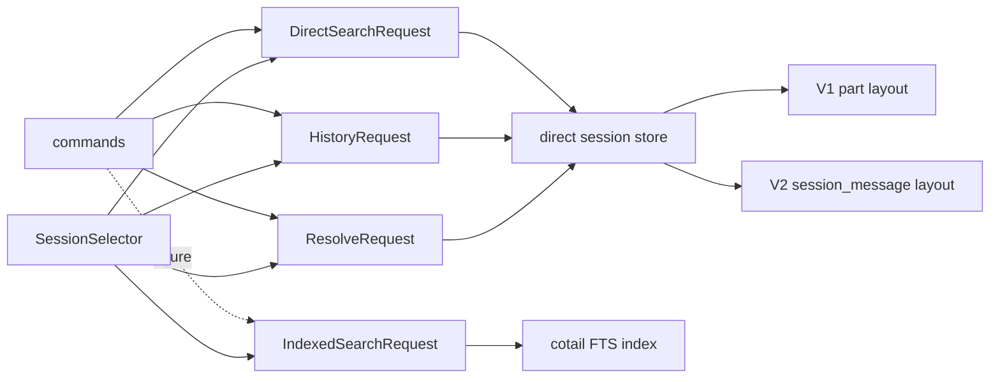

# Operation-Shaped Session Query Architecture

## Status

This `draft1` synthesizes the initial draft, three independent alternatives,
the current implementation, and the existing V2 storage research. It resolves
the main architectural choices but leaves content extraction details and the
eventual FTS product contract to prototypes.

## Decision

Cotail should query **sessions** through several operation-shaped requests. The
requests share a small `SessionSelector`; direct content search additionally
uses bounded, explicitly quantified content requirements and evidence policy.
History keeps its count projection, lookup keeps its resolution policy, and
indexed search gets an FTS-native request rather than pretending that FTS5 and
JavaScript regex implement one match language.

The public design is values in and domain results out. SQL fragments, source
layouts, bindings, and execution plans stay private.



This is intentionally not one universal query model. The reusable part is the
session metadata vocabulary, not every operation's projection and match syntax.

## Why This Direction

The four designs agree on the most important points:

- callers should stop assembling SQL;
- sessions are the stable result and deduplication unit;
- metadata criteria differ from existential content criteria;
- current multi-pattern search means one independently witnessed requirement
  per pattern;
- snippets are evidence, not predicates;
- history counts are aggregates, not ordinary session fields;
- V1/V2 storage details belong behind the direct-query boundary;
- direct regex and FTS matching must not be silently equated; and
- a generic recursive predicate AST is premature.

The synthesis rejects three more ambitious moves:

1. **Do not make content units the public query root.** They are the direct and
   FTS match units, but current operations return one row per session. Treating
   the implementation's most numerous relation as the domain root adds naming
   cost without improving the command contract.
2. **Do not merge metadata and content into one relation-tagged constraint
   list.** It makes all criteria look uniform while hiding their different
   quantification and backend support. Typed nested values express those
   boundaries more clearly than `on: "session" | "content"` tags.
3. **Do not export a plan.** Fixture tests can verify behavior, including
   quantification and pushdown outcomes, without freezing an intermediate
   representation. A second implementation may justify an internal logical
   plan later; it does not justify a public one now.

## Domain Vocabulary

| Term | Meaning |
|---|---|
| **session** | Root identity, result, and deduplication unit. |
| **selector** | Conjunctive criteria over one session's identity and metadata. |
| **content unit** | One searchable unit related to a session: a V1 part, a content item within a V2 message, or an indexed part. |
| **requirement** | Conditions that one content unit must satisfy. |
| **witness** | A content unit satisfying one requirement. Separate requirements may have separate witnesses. |
| **evidence** | Returned material identifying or excerpting a witness. It cannot affect qualification. |
| **projection** | The operation's result product, such as search summary or history counts. |
| **layout** | A private direct-store reader for a physical representation such as V1 `part` or V2 `session_message`. |
| **match language** | Backend-specific text semantics: direct regex/literal or FTS terms/phrase/expression. |
| **window** | Ordering, limit, and eventually cursor behavior applied after qualification. |

`SessionSelector` is preferred over `SessionSelection`: the value is a reusable
predicate, while "selection" can mean the sessions it produces.

## Public Types

The following types describe semantics, not final syntax.

### Shared Selector

```ts
export interface SessionSelector {
  ids?: readonly string[];
  projectIds?: readonly string[];
  directory?: DirectorySelector;
  updatedAt?: TimeRange;
  createdAt?: TimeRange;
}

export type DirectorySelector =
  | { kind: "contains"; value: string }
  | { kind: "exact"; value: string };

export interface TimeRange {
  fromInclusive?: number;
  beforeExclusive?: number;
}
```

Different fields are ANDed. Values in `ids` and `projectIds` are ORed. Empty
arrays and inverted ranges are invalid. Time ranges are half-open. The explicit
directory mode preserves the real distinction between search/history substring
matching and exact active-session resolution.

Title is deliberately absent from the shared selector. It is session metadata,
but it is also a text match with backend-specific semantics and is not useful to
history, lookup, or indexing selection today. It belongs in search's match
union. If a later non-search operation needs title criteria, it can be promoted
without changing its semantics.

### Direct Search

```ts
export interface RegexPattern {
  source: string;
  caseSensitive: boolean;
}

export interface DirectSearchBase {
  select: SessionSelector;
  order: "updated-desc";
  limit: number;
}

export type DirectSearchRequest =
  | (DirectSearchBase & {
      match: { relation: "title"; patterns: PatternSet };
      evidence: { kind: "none" };
    })
  | (DirectSearchBase & {
      match: { relation: "content"; requirements: ContentRequirements };
      evidence: DirectContentEvidenceRequest;
    });

export interface PatternSet {
  all: readonly RegexPattern[];
}

export interface ContentRequirements {
  all: readonly ContentRequirement[];
}

export interface ContentRequirement {
  types: readonly PartType[];
  roles?: readonly MessageRole[];
  text: PatternSet;
}

export type DirectContentEvidenceRequest =
  | { kind: "none" }
  | { kind: "first-witness"; requirement: number; maxCharacters: number };
```

Both `all` arrays are non-empty in the initial model. Bounded `any` and `none`
variants are extension points, not fields in the initial public contract; they
should not be added until CLI semantics exist.

The quantification is load-bearing:

- one `ContentRequirement` must be witnessed by one content unit;
- all text conditions inside that requirement apply to that same unit;
- separate requirements may be witnessed by different units; and
- the outer `all` quantifies over requirements, not arbitrary predicates.

Current `cotail search opencode journal` behavior is represented as two
requirements, each containing one pattern:

```ts
const requirements: ContentRequirements = {
  all: [opencode, journal].map((pattern) => ({
    types: ["text"],
    text: { all: [pattern] },
  })),
};
```

Requiring one part to contain both terms uses one requirement:

```ts
const requirements: ContentRequirements = {
  all: [{
    types: ["text"],
    text: { all: [opencode, journal] },
  }],
};
```

This is clearer than a free-standing `group` identifier: the nested shape makes
the witness boundary structural and does not require caller-managed names.

### Results

```ts
export interface SessionSummary {
  id: string;
  slug: string;
  title: string;
  directory: string;
  projectId: string;
  timeCreated: number;
  timeUpdated: number;
}

export interface SessionInfo extends SessionSummary {
  parentId: string | null;
  version: string;
}

export interface DirectSearchHit {
  session: SessionSummary;
  evidence?: {
    kind: "content-witness";
    text: string;
    requirement: number;
    contentId?: string;
  };
}
```

Results use epoch milliseconds. Human, JSONL, and TSV renderers own formatting.
Evidence retains provenance rather than reducing direct excerpts and future FTS
highlights to an allegedly identical snippet.

### History And Lookup

```ts
export interface HistoryRequest {
  select: SessionSelector;
  messages: {
    total: true;
    since?: number;
  };
  order: "updated-desc";
  limit?: number;
}

export interface HistoryEntry {
  session: SessionSummary;
  messages: {
    total: number;
    since?: { cutoff: number; count: number };
  };
}

export interface ResolveRequest {
  select: SessionSelector;
  pick: "latest" | "only";
}
```

History's session cutoff and message-count cutoff are separate values even when
the CLI currently supplies the same timestamp to both. Message counts remain a
history projection rather than becoming a generic aggregate facility.

### Indexed Search

```ts
export interface IndexedSearchRequest {
  select: SessionSelector;
  query:
    | { kind: "terms"; terms: readonly string[]; combine: "all" | "any" }
    | { kind: "phrase"; value: string }
    | { kind: "advanced"; expression: string };
  evidence: "none" | "highlight";
  order: "relevance" | "updated-desc";
  limit: number;
}

export interface IndexedSearchHit {
  session: SessionSummary;
  evidence?: { kind: "fts-highlight"; text: string; contentId?: string };
  score?: number;
}
```

Separate request types are capability checking by construction. Direct regex,
FTS expressions, first-created witnesses, highlighted passages, recency, and
BM25 rank do not appear as optional fields on one invalid-state-prone envelope.
The CLI may offer one `search` command, but it must choose a match language
deliberately and reject unsupported combinations rather than silently
reinterpret them.

## Deep Module Seam

Commands should parse intent, call one operation, and render results:

```ts
export function searchDirect(
  db: DatabaseSync,
  request: DirectSearchRequest,
): readonly DirectSearchHit[];

export function history(
  db: DatabaseSync,
  request: HistoryRequest,
): readonly HistoryEntry[];

export function resolveSession(
  db: DatabaseSync,
  request: ResolveRequest,
): SessionInfo | undefined;

export function scanSessions(
  db: DatabaseSync,
  selector: SessionSelector,
): Iterable<SessionSummary>;
```

The functions may share private selector compilation and row mapping. They do
not need a public store class, backend interface, or query-plan type yet.
`scanSessions` is the source-side seam for future indexing; indexed search reads
the cotail-owned index through a separate module.

Suggested domain-grouped layout:

```text
src/
  session/
    model.ts                 SessionSummary, SessionSelector
    direct/
      selection.ts          private selector lowering
      layout.ts             V1/V2 content layout detection
      search.ts             searchDirect
      history.ts            history
      resolve.ts            resolveSession
      scan.ts               scanSessions
  search/
    direct-model.ts         requirements, evidence, direct results
    index-model.ts          FTS request and indexed results
    index/                   future cotail-owned FTS implementation
  commands/
    search.ts
    history.ts
    get-session.ts
```

Exact file boundaries should follow implementation size. The important grouping
is session domain, direct storage, and indexed search, not one flat `query/`
directory containing every operation.

## Direct Compilation

Compilation returns private named bindings and SQL. The public tests exercise
results against fixtures rather than asserting SQL strings.

### Session-Only Selection

```ts
const selector: SessionSelector = {
  projectIds: ["project-a", "project-b"],
  directory: { kind: "contains", value: "/src/cotail" },
  updatedAt: { fromInclusive: start, beforeExclusive: end },
};
```

Conceptually lowers to:

```sql
WHERE s.project_id IN ($project0, $project1)
  AND instr(s.directory, $directory) > 0
  AND s.time_updated >= $updatedFrom
  AND s.time_updated < $updatedBefore
```

These outer predicates prune sessions before correlated content requirements.
This is useful pushdown, not a promise that unindexed directory or time filters
are cheap in opencode's database.

### Title Search

```sql
SELECT ...
FROM session AS s
WHERE re($title0, s.title)
  AND re($title1, s.title)
  AND s.time_updated >= $updatedFrom
ORDER BY s.time_updated DESC
LIMIT $limit
```

Title search shares selector lowering and result mapping, but needs no content
layout. The command-local title SQL disappears.

### Multi-Requirement Content Search

Each member of `requirements.all` lowers to a separate correlated `EXISTS`:

```sql
SELECT ...,
       substr((
         SELECT u.text
         FROM searchable_content AS u
         WHERE u.session_id = s.id
           AND u.part_type = $type0
           AND re($pattern0, u.text)
         ORDER BY u.ordinal
         LIMIT 1
       ), 1, $evidenceLength) AS evidence_text
FROM session AS s
WHERE EXISTS (
        SELECT 1 FROM searchable_content AS u
        WHERE u.session_id = s.id
          AND u.part_type = $type0
          AND re($pattern0, u.text)
      )
  AND EXISTS (
        SELECT 1 FROM searchable_content AS u
        WHERE u.session_id = s.id
          AND u.part_type = $type1
          AND re($pattern1, u.text)
      )
  AND s.time_updated >= $updatedFrom
ORDER BY s.time_updated DESC
LIMIT $limit
```

`searchable_content` above is conceptual. The implementation can emit layout
specific subqueries or a private CTE. It must not create a persistent view in
opencode's database.

Named bindings remove the current positional coupling between evidence in
`SELECT`, requirements and selector predicates in `WHERE`, and `LIMIT`.

Evidence names the requirement by index because the request's array order is
already meaningful at the CLI boundary. If requirements later become editable
or externally serialized, stable IDs can be introduced then.

## V1 And V2: The Important Correction

The current implementation and several reviewed designs describe V2 as an
`event`-table fallback chosen when `part` is absent. Existing V2 research shows
that this is not the durable model:

- native V2 content is projected into `session_message`;
- V2-native sessions can coexist with legacy `message`/`part` tables;
- V2 emits only the legacy session-created event, so native content may never
  appear in `part`;
- `session_message.data` contains message-shaped content arrays rather than one
  row per searchable part; and
- `session_message.seq` is the stable per-session ordering key.

Therefore direct source detection must not choose exactly one database-wide
layout based on table presence. It should normalize **content units per
session** from all supported authoritative layouts:

```ts
interface DirectContentUnit {
  sessionId: string;
  contentId?: string;
  messageId?: string;
  role?: MessageRole;
  type: PartType;
  text: string;
  ordinal: number;
  layout: "v1-part" | "v2-session-message";
}
```

For V1, one `part` row usually yields one unit. For V2, one
`session_message.data` value may yield several units through `json_each` over
assistant content. Initial semantic mapping should be explicit: user text and
assistant text map to `text`, assistant reasoning maps to `reasoning`, and
assistant tool content maps to `tool`. Shell and other message-level V2 records
do not fit the current `PartType` vocabulary and remain excluded until the
product defines whether they are text, tool content, or new search types. Tool
input and output also need a product decision before their unit boundary is
stable.

The direct query should keep `session` as its outer relation and let a content
requirement be witnessed by either supported layout. This naturally returns one
row per session and removes command-level deduplication. It also avoids silently
missing V2-native sessions merely because a legacy `part` table exists.

Whether a session containing both legacy and native projections should search
both or prefer one is an experiment, not an assumption. The likely policy is:

1. use V2 `session_message` for sessions with native rows;
2. otherwise use V1 `part`; and
3. prove the policy against transition databases before encoding it.

The V1/V2 boundary is therefore a **normalization boundary**, not two `Source`
objects each owning a complete search query.

History needs the same per-session layout precedence for message counts. The
current implementation sums `message` and `session_message` whenever both
tables exist, which can double-count transition sessions. Characterization must
distinguish deliberate aggregation from duplicate projections before the new
history contract is considered stable.

## FTS Boundary

The FTS index is a separate storage product with copied content, tokenization,
freshness state, ranking, and native highlighting. It shares:

- `SessionSelector` where the index schema can honor each populated field;
- `SessionSummary` identity fields;
- the broad idea of evidence; and
- command rendering conventions.

It does not share:

- regex requirements;
- direct witness ordering;
- SQL compilation;
- ranking semantics;
- snippet generation; or
- an execution-plan representation.

Unsupported selector fields or query forms produce typed errors. No automatic
fallback may change matching semantics. A user-selected `auto` mode can later
choose a backend only when the CLI request has explicitly defined semantics for
both.

The index is authoritative only for its declared indexed snapshot. `history`
and session resolution continue to read opencode's live database. Search against
the index should report freshness separately rather than joining the live DB in
a way that obscures consistency and performance.

## Later Features

| Feature | Fit |
|---|---|
| `--project` | `SessionSelector.projectIds`; direct maps to `session.project_id`, indexing selection and indexed search map independently. |
| date range | `updatedAt` or `createdAt` half-open range; history's message-count cutoff remains separate. |
| role | `ContentRequirement.roles`; valid only when it constrains the same witness as type and text. Requires V1 part-to-message and V2 message-type fixtures. |
| OR | Add bounded `PatternSet` or `ContentRequirements` variants; cross-relation OR waits for a demonstrated need. |
| negation | A future pattern-level exclusion means a witness's text must not match; a requirement-level exclusion means no witness may satisfy a requirement. These are deliberately distinct. |
| phrase | Direct fixed text is escaped-regex substring semantics; indexed phrase is tokenizer adjacency. Keep separate request forms and document the difference. |
| title plus content | Not in the initial `DirectSearchRequest` union. Add a bounded search conjunction only when the CLI needs it; do not generalize preemptively. |
| same-part terms | Put several patterns in one `ContentRequirement.text.all`. |
| tool search | Requires a defined content-unit policy for input, output, and generated content before expanding the type. |

## Testing Strategy

Primary tests call operation functions against seeded SQLite databases and
assert normalized domain results.

Required fixture coverage:

- session selection by ID, project, exact directory, contains directory, and
  exact half-open time boundaries;
- title regex AND behavior;
- one direct content requirement;
- separate requirements witnessed by the same unit;
- separate requirements witnessed by different units;
- several patterns in one requirement requiring one unit;
- missing requirements excluding a session;
- evidence from requirement zero's first ordered witness;
- evidence disabled without changing qualification;
- V1 legacy-only content;
- V2 native `session_message` content while `part` exists but is empty;
- a transition database containing both legacy and native sessions;
- duplicate physical representations of one session under the chosen precedence
  policy;
- history counts in legacy, native, and duplicate transition representations;
- role and tool fixtures before those features ship;
- history's independent session and message cutoffs;
- unsupported direct/indexed request rejection; and
- normalized epoch-millisecond result fields.

Do not snapshot full SQL. Small private compiler tests may verify validation,
binding completeness, or fragment composition, but behavior fixtures catch the
JSON paths, correlation, witness scope, null handling, ordering, and mixed-layout
bugs that SQL-string tests miss.

## Incremental Implementation

Each item is a small logical commit with working CLI behavior.

1. **Characterize current behavior.** Add title, direct-content, snippet,
   selector, and history fixtures before changing interfaces.
2. **Add V2-native characterization fixtures.** Demonstrate the current false
   negative when `session_message` has content and `part` is empty, plus current
   history behavior when legacy and native message rows coexist. This makes the
   storage corrections explicit bug fixes rather than incidental refactors.
3. **Normalize session products.** Introduce `SessionSummary` with camelCase and
   epoch milliseconds; preserve existing output through render adapters.
4. **Introduce `SessionSelector`.** Add private named-binding compilation for
   directory and updated-time criteria without changing command behavior.
5. **Move title search behind `searchDirect`.** Delete command-local title SQL
   while preserving regex, AND, order, and limit behavior.
6. **Introduce explicit content requirements.** Represent each current CLI term
   as one independently witnessed requirement and retain first-requirement
   evidence.
7. **Implement V1 content normalization.** Move `part` expressions behind the
   direct store and remove SQL knowledge from source classes.
8. **Implement V2 `session_message` normalization.** Extract searchable units
   and add mixed-layout policy. Retire the event fallback once parity is proven.
9. **Move history to the selector and layout policy.** Keep count projection
   operation-specific, preserve separate count/session cutoffs, and avoid
   counting duplicate legacy/native projections twice.
10. **Remove command-level source iteration and deduplication.** One outer
    session query now owns result identity while private layouts supply witnesses.
11. **Add indexed traversal.** Implement `scanSessions(selector)` and content
    reading needed by the indexer, reusing normalization rather than search SQL.
12. **Design indexed search against a real index.** Finalize `IndexedSearchRequest`,
    freshness behavior, FTS terms/phrase syntax, ranking, and highlights from
    executable fixtures rather than a speculative backend interface.
13. **Add bounded features individually.** Project and date ranges first; role
    after linkage research; OR/negation after CLI design; tool semantics after
    the content-unit decision.

Do not begin with a directory reshuffle, public planner, generic backend
interface, recursive predicate AST, or universal result union. Let tested
operations establish the module boundaries first.

## Unresolved Decisions And Experiments

1. **Mixed-layout precedence:** Search both V1 and V2 representations, or prefer
   `session_message` per session? Build a transition fixture from a real V2 DB
   and check whether duplicate projections are identical and complete.
2. **V2 unit extraction:** Which V2 message types are searchable by default?
   Start from the canonical transcript's user/shell/assistant policy, then test
   whether system, synthetic, skill, and compaction records need explicit flags.
3. **Tool boundary:** Are input, output, and generated content separate units?
   The current code matches whole JSON but excerpts input, which is incoherent.
4. **Evidence order:** V1 uses `part.time_created`; V2 should use
   `session_message.seq` plus content-array position. Define a stable compound
   ordinal rather than pretending timestamps are unique.
5. **Invalid regex timing:** Prefer validation at request construction so an
   invalid expression fails even when no database row invokes `re()`.
6. **Limit zero:** Normalize whether zero means no rows or unlimited. Do not keep
   operation-specific accidents hidden behind one `number` field.
7. **Title/content composition:** Confirm a real CLI use case before extending
   `DirectSearchRequest` with a bounded conjunction.
8. **Index freshness:** Define whether stale indexed results are allowed,
   warned, or rejected independently of query matching.
9. **Advanced FTS:** Decide whether raw FTS5 syntax is a public expert mode or
   whether cotail exposes only terms and phrases.

## Assessment Of The Reviewed Designs

### `draft0.gpt56sol`

Strongest contributions: session as root, explicit existential content
requirements, evidence as projection, named bindings, private compilation, and
behavioral fixture testing. Its `SessionQuery` envelope is coherent for search.

Weaknesses: it stretches a search-shaped query toward a shared architecture,
places title in the reusable metadata selector despite its matcher semantics,
and treats V2 as a simple event projection. It also leaves same-witness grouping
less naturally expressed than nested requirements.

### `design-alt0.ds4f`

Strongest contributions: it makes quantification impossible to ignore, replaces
positional evidence magic with an explicit reference, and treats capability
rejection seriously. Its same-unit grouping and pushdown discussion sharpen the
problem substantially.

Weaknesses: content as the root conflicts with cotail's session-level products;
relation tags flatten useful type structure; exported planning stages expose too
much mechanism; and one detected direct backend is invalidated by mixed V1/V2
storage. The plan architecture is a plausible future internal design, not the
best first public seam.

### `design-alt0.glm52`

Strongest contributions: the clearest articulation of the selection spine,
operation-specific projection, private compilation, and backend-owned match
semantics. It correctly resists a universal query language and keeps live
metadata operations independent of the future index.

Weaknesses: its `ContentMatch` has one global type/mode policy rather than
conditions grouped by witness; positional evidence remains under-specified; it
asserts that one schema exists per DB; and its V2 model uses the obsolete event
fallback. The engine interface is slightly earlier than needed.

### `design-alt0.gpt56sol`

Strongest contributions: the best overall public shape. It distinguishes
selector, bounded witness requirements, evidence, history aggregates, and
direct/FTS request languages without inventing a generic AST. The nested
`PartRequirement` structure is more legible than free-standing group IDs.

Weaknesses: its direct store still assumes one coherent detected layout, while
the V2 research requires per-session mixed-layout normalization. It also starts
with more boolean vocabulary than the current CLI needs; `any` and `none` should
be extension points rather than initial implementation scope.

## Recommendation

Implement the operation-shaped design, starting with characterization and the
V2-native false-negative fixture. Share `SessionSelector`, session products, and
private lowering utilities. Make current content semantics first-class through
nested witness requirements and explicit evidence. Keep direct and indexed
match languages separate, and defer planners, backend protocols, and recursive
boolean syntax until executable FTS work proves they provide leverage.

The desired module depth is:

> A caller states which sessions are eligible, what one or more content
> witnesses must satisfy, and what evidence to return. The direct store handles
> mixed V1/V2 representations, quantification, bindings, SQL, ordering, and row
> normalization; the index implements its own honest search language over the
> same session identity vocabulary.
