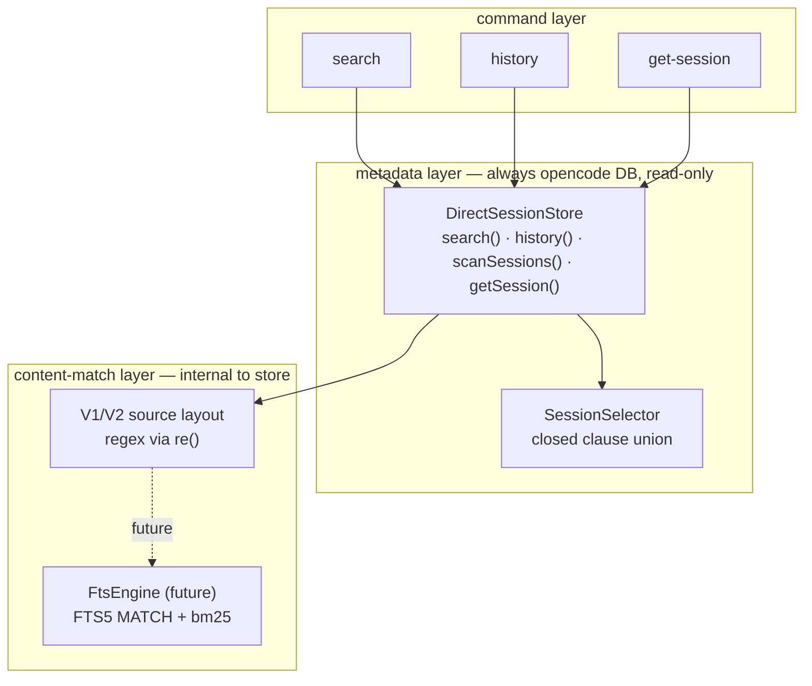

# Cotail Query Architecture — Synthesized Draft

## Stage setting

The `design-alt0` wave produced three independent alternatives and one prior draft.
All four were grounded in the same source and prompt. This document synthesizes
them into a single direction for implementation, resolving the tensions that
emerged.

The wave's central question was never "should query behavior be refactored" —
all four documents agree the scope-predicate triplication and bespoke content
matching must be concentrated. The real question is **how much to unify**: one
query envelope with selection and content as siblings (draft0, ds4f), or
operation-specific requests sharing a smaller selector (glm52, alt0-gpt56sol)?
And alongside that: how much boolean expressiveness belongs in the initial
vocabulary?

### What all four agree on

After writing the initial synthesis, a prior synthesis (`draft1.gpt56sol.md`) was
discovered in the working copy. It independently converged on nearly identical
architectural decisions. Its most important additional contribution is the **V2
storage correction** (see "V1, V2, and the mixed-layout correction" below),
derived from [v2.md](/v2.md) research that the four original designs did not
reference. This synthesis has been updated to incorporate that finding.

- **Session is the root object.** Every command returns sessions; parts/events/
  messages are evidence or relations, not top-level results.
- **SessionSelection is the reusable spine.** Directory, updated-time, project,
  and ID criteria are written three times today ([search.ts:33-34](/src/commands/search.ts),
  [source.ts:30-31](/src/opencode/source.ts), [session.ts:30-31](/src/opencode/session.ts));
  that triplication is the one genuinely cross-cutting complexity.
- **Evidence is projection, not filtering.** Snippets and match witnesses cannot
  alter whether a session qualifies.
- **V1/V2 storage detail must be internal.** The current `VersionSchema` public
  struct ([source.ts:12-19](/src/opencode/source.ts)) leaks raw SQL fragments
  across the boundary.
- **Regex and FTS are not equivalent.** Silent fallback between them is the trap;
  honest rejection is the answer.
- **No generic predicate AST.** Every design explicitly rejects `And | Or | Not |
  Leaf` as premature for a CLI with a closed clause set.
- **Characterize behavior first, then migrate incrementally.** Each step keeps
  the CLI working and is independently verifiable.
- **Title belongs in session selection**, collapsing the parallel
  `buildTitleQuery` path ([search.ts:30-47](/src/commands/search.ts)).

### Where they diverge

| Axis | draft0 (gpt56sol) | alt0-ds4f | alt0-glm52 | alt0-gpt56sol |
|---|---|---|---|---|
| **Root** | session | content unit (session = grouping target) | session | session |
| **Selection shape** | two siblings: `SessionSelection` + `ContentSelection` | one merged `Selection` of relation-tagged `Constraint`s | `SessionSelection` spine + separate `ContentMatch` | `SessionSelector` embedded in operation-specific requests |
| **Query envelope** | one `SessionQuery` | one `SessionQuery` | operation-specific specs | operation-specific requests |
| **Boolean expressiveness** | `requireEvery` (AND only) | `requireEvery` + `group` (same-unit) | flat AND-list of clauses | `PatternSet{all,any,none}` + `PartRequirements{all,any,none}` |
| **Compiled artifact** | private `{sql, bindings}` | **exported** named `Plan` | private `{sql, params}` | private `{sql, params}` |
| **Backend interface** | defer until FTS | passive backend descriptor now | `ContentSearchEngine` interface now | defer until FTS |
| **History in plan** | separate, shares selection | counts projection in plan | separate, shares selection | separate, shares selection |
| **Same-part matching** | unresolved (question 5) | `group` key on constraints | `conjunctionMode` field (deferred) | nested `PatternSet.all` in one requirement |

## Cross-review

### Relative strengths

**draft0 (gpt56sol)** provides the clearest initial vocabulary (selection /
requirements / projection) and the strongest evidence lowering explanation. Its
`requireEvery` is minimal but insufficient for same-part matching, which it
leaves as an unresolved question. The single-envelope approach makes invalid
combinations representable (content requirements without a search context).

**alt0-ds4f** makes the boldest structural bet: centering content units as the
root, merging session and content constraints into one relation-tagged list, and
exporting a named plan. Its strengths are the `group` concept (the only design
that gives same-unit matching a natural home without nested patterns) and the
sharpest catch in the wave: the `--directory` meaning divergence between
`instr(...) > 0` (search/history) and `= ?` ([session-info.ts:56](/src/opencode/session-info.ts)).
Its weaknesses are the abstraction cost (relation-tagged constraint union reads
more abstractly than the domain needs) and the premature plan export — the
biggest interface bet, flagged as unresolved even by its own author.

**alt0-glm52** contributes the two-layer insight that the other three
under-appreciate: **FTS is a content-match accelerator, not a metadata store.**
History and get-session should always read opencode's DB; only search needs a
pluggable engine. This prevents an entire class of staleness bugs. It also has
the clearest architectural diagram, the most explicit capability union, and the
most honest statement of what direct and FTS actually share (selection + match
intent + result contract — not SQL, not ranking, not snippet mechanics). Its
weakness is that its `ContentMatch` is a relatively flat bag (`clauses` + shared
`mode`/`caseSensitive`) that doesn't naturally express same-part matching.

**alt0-gpt56sol** has the richest typed vocabulary: `PatternSet{all,any,none}`
and `PartRequirements{all,any,none}` elegantly handle same-part/any-part/negation
without a recursive AST, making ds4f's `group` and glm52's deferred
`conjunctionMode` unnecessary. Its operation-specific request types prevent
invalid combinations statically — the strongest interface discipline in the wave.
Its `DirectorySelector` union (`contains` vs `exact`) resolves the divergence
ds4f caught. Its weakness is slightly more ceremony in the type definitions, and
it introduces `scanSessions` for bulk traversal which is useful but currently
unneeded.

### Key tensions resolved

1. **One envelope vs operation-specific requests → operation-specific.** Content
   match is structurally different from session selection: it quantifies
   existentially over related rows, and its semantics diverge between regex and
   FTS. History and get-session have no need for it at all. Operation-specific
   requests prevent invalid combinations (regex + bm25 ranking, FTS phrase +
   first-regex witness) from being representable. This is the glm52 + alt0-gpt56sol
   position, adopted over draft0 + ds4f.

2. **Content-unit root vs session root → session.** ds4f's framing earns
   elegance for FTS lowering, but all current operations return sessions, and
   the additional abstraction (relation-tagged constraints, named plan) adds
   surface without current payoff. The design degrades to session-root if the
   FTS prototype doesn't vindicate the unit-centric view — ds4f itself
   acknowledges this graceful fallback. Skip the bet; start session-root.

3. **Exported plan vs private artifact → private.** Three of four designs keep
   `{sql, params}` internal. ds4f's exported plan is the "deliberate over-share"
   that enables structure-testing, but the same testing value is available
   through behavior tests against seeded fixtures. Export only if FTS porting
   proves it necessary.

4. **Backend interface now vs defer → defer.** glm52 introduces
   `ContentSearchEngine` now; alt0-gpt56sol defers. With only one engine, an
   interface is hypothetical. Introduce it when FTS provides the second
   implementation.

5. **Boolean expressiveness → alt0-gpt56sol's bounded vocabulary.** The
   `PatternSet{all,any,none}` / `PartRequirements{all,any,none}` nesting captures
   current semantics (one requirement per pattern = any-part AND), future
   same-part matching (multiple patterns in one requirement), and eventual OR /
   negation — without a recursive AST and without ds4f's separate `group`
   mechanism. This subsumes the expressiveness of every other design's initial
   vocabulary.

## Synthesized architecture

### Direction

Cotail should have **operation-specific request types** that embed a shared
**session selector**. Content matching is a first-class but operation-local
concept with a bounded boolean vocabulary. The compiled SQL artifact stays
private. V1/V2 differences never cross the module wall. FTS will be a separate
backend for the search operation only, introduced when indexing begins.

> Concentrate complexity where it is shared (session selection). Quarantine it
> where it isn't (content matching, V1/V2 storage, FTS tokenization).

### Two layers



**Metadata layer** — session selection, counts, resolution. Always opencode's
DB, read-only. Source of truth for "which sessions exist and what are their
fields." History and get-session never need anything else.

**Content-match layer** — given a selector + a content match, produce search
hits. Internal to `DirectSessionStore` today; becomes a pluggable engine when
FTS arrives. Only search touches this layer.

**Critical: FTS is a content-match accelerator, not a metadata store.** The
planned FTS index will denormalize session fields for scope-pushdown, but cotail
never treats it as authoritative for identity/counts/resolution. This prevents
staleness bugs from corrupting `history` and `get-session`.

## Domain model and vocabulary

| Term | Meaning | Lifespan |
|---|---|---|
| **session** | The root entity identified by an opencode session ID. | permanent |
| **selector** | Conjunctive criteria over one session row. | shared across all operations |
| **requirement** | A condition that one related part must witness. | search operation |
| **witness** | A related row satisfying one requirement. Different requirements may have different witnesses. | search operation |
| **PatternSet** | Bounded boolean group over one value: `all`/`any`/`none`. Non-recursive. | search operation |
| **PartRequirements** | One relational quantification layer: `all`/`any`/`none` over requirements. | search operation |
| **evidence** | Returned material showing why a session matched. Not a predicate. | search operation |
| **aggregate** | A value computed over related rows, such as message count. | history operation |
| **source layout** | Internal description of V1 or V2 storage schema. | internal |
| **SessionSummary** | Normalized session identity product (camelCase, epoch-ms). | all operations |

### Naming: SessionSelector, not SessionSelection

"Selector" describes reusable criteria. "Selection" can also mean the result
set. The distinction matters in APIs: `scanSessions(selector)` reads better than
`scanSessions(selection)`, and avoids the ambiguity draft0's `SessionSelection`
creates when discussed alongside result sets.

## Proposed interfaces

### Shared session selector

```ts
export interface SessionSelector {
  ids?: readonly string[];
  projectIds?: readonly string[];
  directory?: DirectorySelector;
  updatedAt?: TimeRange;
  createdAt?: TimeRange;
}

export type DirectorySelector =
  | { kind: "contains"; value: string }
  | { kind: "exact"; value: string };

export interface TimeRange {
  from?: number;          // inclusive, epoch-ms
  until?: number;         // exclusive, epoch-ms (half-open: from <= value < until)
}
```

Fields are ANDed. Values within `ids` and `projectIds` are ORed. Empty arrays are
invalid. `titleMatches` is **deliberately absent** from the shared selector. Title
is session metadata, but it is also a text match with backend-specific regex/FTS
semantics and is not useful to history, lookup, or indexing selection today. It
belongs in search's match union (see `DirectMatch` below). If a later non-search
operation needs title criteria, it can be promoted without changing its
semantics.

`DirectorySelector` resolves the divergence ds4f caught: search and history use
`instr(...) > 0` (contains), while `get-session` uses `= ?` (exact)
([session-info.ts:56](/src/opencode/session-info.ts)). Making the distinction
typed means a change can never be accidental.

### Bounded boolean vocabulary

```ts
export interface RegexPattern {
  source: string;
  caseSensitive: boolean;
}

export interface PatternSet {
  all?: readonly RegexPattern[];
  any?: readonly RegexPattern[];
  none?: readonly RegexPattern[];
}
```

`PatternSet` applies to one value (title text, or one part's text). Patterns
within `all` must all match the same value. This is how same-part matching is
expressed — no separate `group` mechanism needed.

```ts
export interface PartRequirements {
  all: readonly PartRequirement[];
  any?: readonly PartRequirement[];
  none?: readonly PartRequirement[];
}

export interface PartRequirement {
  partTypes: readonly PartType[];
  role?: readonly MessageRole[];
  text: PatternSet;
}
```

`PartRequirements` adds exactly one relational quantification layer. Each
`PartRequirement` is satisfied by one part. Patterns within that requirement's
`PatternSet` apply to the same part. Separate requirements may be witnessed by
different parts.

**Current multi-pattern behavior** (each pattern witnessed by a possibly-different
part, ANDed at session level):

```ts
const currentSemantics: PartRequirements = {
  all: patterns.map((pattern) => ({
    partTypes: ["text"],
    text: { all: [pattern] },
  })),
};
```

**Same-part matching** (one part must contain both patterns):

```ts
const samePart: PartRequirements = {
  all: [{
    partTypes: ["text"],
    text: { all: [opencodePattern, journalPattern] },
  }],
};
```

`any` and `none` are typed but not CLI-exposed yet. They prevent future API
breakage when `--or` and `--exclude` land.

### Direct search request

```ts
export interface DirectSearchRequest {
  select: SessionSelector;
  match: DirectMatch;
  evidence: DirectEvidenceRequest;
  order: "updated-desc";
  limit: number;
}

export type DirectMatch =
  | { relation: "title"; patterns: PatternSet }
  | { relation: "part"; requirements: PartRequirements };

export type DirectEvidenceRequest =
  | { kind: "none" }
  | { kind: "first-witness"; requirement: number; maxChars: number };
```

`evidence.requirement` is positional: `0` means the first requirement in
`requirements.all`. This preserves current `patterns[0]` behavior
([source.ts:40](/src/opencode/source.ts)) explicitly. The snippet comes from
that requirement's first matching part, ordered by source layout, truncated to
`maxChars`.

### History request

```ts
export interface HistoryRequest {
  select: SessionSelector;
  messageCounts: {
    total: true;
    since?: number;           // epoch-ms cutoff for recent counts
  };
  order: "updated-desc";
  limit?: number;             // undefined or 0 = unlimited
}

export interface HistoryEntry {
  session: SessionSummary;
  messages: {
    total: number;
    since?: { cutoff: number; count: number };
  };
}
```

History deliberately uses the same `--since` cutoff in two different semantic
positions (alt0-gpt56sol's insight): `select.updatedAt.from` answers "which
sessions are active enough to list"; `messageCounts.since` answers "how many
messages fall in the reporting interval." Conflating them in a generic date
predicate would hide this distinction.

### Normalized results

```ts
export interface SessionSummary {
  id: string;
  slug: string;
  title: string;
  directory: string;
  projectId: string;
  timeCreated: number;       // epoch-ms
  timeUpdated: number;       // epoch-ms
}

export interface SearchHit {
  session: SessionSummary;
  evidence?: { text: string; requirement: number };
}

export type PartType = "text" | "reasoning" | "tool";
export type MessageRole = "user" | "assistant";
```

Timestamps are epoch-ms — SQLite should not format them. Human, JSON, and TSV
renderers format at the command edge. This gives direct and FTS implementations
the same temporal representation.

### Deep module seam

```ts
export interface DirectSessionStore {
  search(request: DirectSearchRequest): readonly SearchHit[];
  history(request: HistoryRequest): readonly HistoryEntry[];
  scanSessions(selector: SessionSelector): Iterable<SessionSummary>;
  getSession(id: string): SessionSummary | undefined;
}
```

Commands depend on this interface, not on SQL builders. The store owns source
detection, V1/V2 layout, SQL generation, named binding, row mapping, and
deduplication. `scanSessions` supports future index traversal — its inclusion is
cheap and prevents a later interface break.

## Direct SQLite lowering

Compiled `{ sql, params }` artifacts remain internal. Named bindings (`$name`)
replace positional parameters, removing the current fragility where snippet
placeholders in `SELECT` appear before content and selection placeholders in
`WHERE` ([source.ts:39-44](/src/opencode/source.ts)).

### Session-only selection (history, get-session)

```ts
const selector: SessionSelector = {
  projectIds: ["proj_a", "proj_b"],
  directory: { kind: "contains", value: "/src/cotail" },
  updatedAt: { from: 1_786_233_600_000 },
};
```

lowers approximately to:

```sql
SELECT s.id, s.slug, s.title, s.directory, s.project_id,
       s.time_created, s.time_updated
FROM session AS s
WHERE s.project_id IN ($project_0, $project_1)
  AND instr(s.directory, $directory) > 0
  AND s.time_updated >= $updated_from
ORDER BY s.time_updated DESC
```

`ids` and `projectId` criteria can use existing source indexes. `directory` and
`updatedAt` scan session rows but prune before any content evaluation. Cotail
does not modify opencode's database to add indexes.

### Title search

```ts
const request: DirectSearchRequest = {
  select: { updatedAt: { from: cutoff } },
  match: { relation: "title", patterns: { all: [mergePattern] } },
  evidence: { kind: "none" },
  order: "updated-desc",
  limit: 50,
};
```

lowers to:

```sql
SELECT ... FROM session AS s
WHERE s.time_updated >= $updated_from
  AND re($title_0, s.title)
ORDER BY s.time_updated DESC LIMIT $limit
```

No content engine involved. `buildTitleQuery` is deleted; its scope handling is
subsumed by selector compilation. Today's unaliased `session` becomes `session AS s`
for uniformity — behavior-neutral (same rows, same order).

### Multi-pattern content search

Current semantics — two patterns, each witnessed independently:

```ts
const request: DirectSearchRequest = {
  select: { updatedAt: { from: cutoff } },
  match: {
    relation: "part",
    requirements: {
      all: [
        { partTypes: ["text"], text: { all: [opencodePattern] } },
        { partTypes: ["text"], text: { all: [journalPattern] } },
      ],
    },
  },
  evidence: { kind: "first-witness", requirement: 0, maxChars: 200 },
  order: "updated-desc",
  limit: 50,
};
```

lowers to:

```sql
SELECT s.id, s.slug, s.title, s.directory, s.project_id,
       s.time_created, s.time_updated,
       substr((
         SELECT json_extract(p.data, '$.text')
         FROM part AS p
         WHERE p.session_id = s.id
           AND json_extract(p.data, '$.type') = $req0_type
           AND re($req0_pattern, json_extract(p.data, '$.text'))
         ORDER BY p.time_created LIMIT 1
       ), 1, $evidence_len) AS evidence_text
FROM session AS s
WHERE s.time_updated >= $updated_from
  AND EXISTS (
    SELECT 1 FROM part AS p
    WHERE p.session_id = s.id
      AND json_extract(p.data, '$.type') = $req0_type
      AND re($req0_pattern, json_extract(p.data, '$.text'))
  )
  AND EXISTS (
    SELECT 1 FROM part AS p
    WHERE p.session_id = s.id
      AND json_extract(p.data, '$.type') = $req1_type
      AND re($req1_pattern, json_extract(p.data, '$.text'))
  )
ORDER BY s.time_updated DESC LIMIT $limit
```

The two `EXISTS` clauses may find different parts. The evidence pattern is
requirement zero's pattern. This is character-for-character today's SQL shape
([source.ts:23-38](/src/opencode/source.ts)), attributed to the right axis.

Same-part matching (one `EXISTS` holding both predicates) lowers by putting both
patterns in one requirement's `PatternSet.all` — no compiler flag, no `group`
key, just the structure of the request.

### History lowering

```sql
SELECT s.id, s.title, s.directory, s.slug, s.project_id,
       s.time_created, s.time_updated,
       (SELECT count(*) FROM message m WHERE m.session_id = s.id)
         + (SELECT count(*) FROM session_message sm WHERE sm.session_id = s.id) AS messages_total,
       (SELECT count(*) FROM message m WHERE m.session_id = s.id AND m.time_created >= $count_since)
         + (SELECT count(*) FROM session_message sm WHERE sm.session_id = s.id AND sm.time_created >= $count_since) AS messages_recent
FROM session AS s
WHERE <selector fragment>
ORDER BY s.time_updated DESC
```

This is exactly `countActiveSessions` ([session.ts:26-33](/src/opencode/session.ts))
with its hand-written `WHERE` replaced by the shared selector fragment. Count
subqueries are projection — they never appear in `WHERE`.

## V1, V2, and the mixed-layout correction

### The current V2 reader is wrong

The current `V2Source` ([v2/source.ts](/src/opencode/v2/source.ts)) reads the
`event` table, projecting content from `message.part.updated.1` events. V2
storage research ([v2.md](/v2.md)) shows this is incorrect:

- V2's canonical message store is **`session_message`**, not `event`.
- V2 emits only ONE v1 event (`SessionV1.Event.Created`), so v2-native sessions
  create a `session` row but leave `message`/`part` **empty**.
- V2-native content lives in `session_message.data` as a flat tagged union per
  row — no `part` join needed.
- The `event` table is the durable source-of-truth log with different schema and
  semantics; it should be ignored for cotail's read purposes.
- Legacy `message`/`part` tables are still written for v1-created sessions, so
  **V1 and V2 content coexist in the same database**.

**Consequence:** cotail today silently misses all v2-native session content. This
is a correctness bug, not just a refactor opportunity.

### The design implication: normalization, not source selection

The current `detectSources` ([source.ts:48-54](/src/opencode/source.ts)) chooses
one source per database based on table presence. The research invalidates this: a
single database can contain both legacy sessions (with `part` rows) and
v2-native sessions (with `session_message` rows but empty `part`).

The correct model is **per-session content normalization**. The direct store
normalizes content units from whichever layout a session's data lives in:

```ts
// Internal to DirectSessionStore only. Never exported.
interface DirectContentUnit {
  sessionId: string;
  messageId?: string;
  role?: MessageRole;
  type: PartType;
  text: string;
  ordinal: number;          // stable per-session ordering key
  layout: "v1-part" | "v2-session-message";
}
```

For V1, one `part` row yields one unit. For V2, one `session_message.data` value
may yield several units through `json_each` over assistant content arrays and
explicit extraction for user/shell/other message types. The V1/V2 boundary is a
**normalization boundary**, not two `Source` objects each owning a complete
search query.

The likely per-session policy is:

1. use V2 `session_message` for sessions with native rows;
2. otherwise use V1 `part`;
3. prove the policy against transition databases before encoding it.

This keeps `session` as the outer relation and lets a content requirement be
witnessed by either supported layout. It naturally returns one row per session
and removes command-level deduplication.

### What stays the same

V1/V2 differences still never cross the module wall. The public types and
operation interfaces are unchanged — `DirectSearchRequest`, `PartRequirements`,
evidence, and results are layout-neutral. The correction changes the internal
implementation of the store, not its contract.

The current `Source` interface + `VersionSchema` struct
([source.ts:7-19](/src/opencode/source.ts)) is replaced by private layout
normalization. The expressions match today's V1 source
([v1/source.ts:19-26](/src/opencode/v1/source.ts)) for legacy sessions; the V2
expressions are corrected to read `session_message` rather than `event`.

## FTS — what direct and FTS share

Three things, and only three:

1. **`SessionSelector`** — same spine, same compiled fragment, same pushdown.
2. **`SearchHit`** — the normalized output contract.
3. **The conceptual projection intent** — "evidence from the Nth requirement."

Everything else — the `{sql, params}` artifact, FTS5 `MATCH` syntax, bm25
ranking, `snippet()` highlighting, tokenization — is engine-internal.

### FTS is a separate request type

```ts
// Future — not built yet.
export interface IndexedSearchRequest {
  select: SessionSelector;
  query: FtsQuery;
  evidence: "none" | "highlight";
  order: "relevance" | "updated-desc";
  limit: number;
}

export type FtsQuery =
  | { kind: "terms"; terms: readonly string[]; combine: "all" | "any" }
  | { kind: "phrase"; value: string }
  | { kind: "advanced"; expression: string };
```

`IndexedSearchRequest` deliberately does not implement `DirectSearchRequest`.
`FtsQuery` is an input language owned by the FTS backend. It does not claim to
be equivalent to JavaScript regex. If the CLI later offers `--backend direct|index`,
it must parse flags into the selected request type or reject unsupported
combinations. It must not silently reinterpret regex as FTS terms.

### When to introduce the engine interface

Do not introduce `ContentSearchEngine` until FTS exists. One engine means a
hypothetical seam. The query model is designed now without prematurely fixing
backend selection. When FTS lands, `search` picks FTS when the index is present
and the request is FTS-capable; otherwise it uses direct, explicitly (logged,
not silent).

## Capabilities — honest rejection

```ts
export type QuerySupportError =
  | { kind: "unsupported-selector"; field: keyof SessionSelector; backend: string }
  | { kind: "unsupported-requirement"; feature: "role" | "part-type"; layout: string }
  | { kind: "invalid-query"; reason: string };
```

The policy is **rejection, not silent fallback**. When a request asks for
something the detected layout can't honor (role without message linkage, a part
type that doesn't exist), the store rejects up front with a typed error. The CLI
maps the rejection to a clear user-facing message.

No fallback that quietly changes semantics between regex and tokenized search.
The prompt is right that those are not equivalent. A future "best-effort" mode
could layer on top, but the default must not hide the difference.

## Alternatives considered (synthesis perspective)

### One unified `SessionQuery` envelope (draft0, ds4f)

A single `SessionQuery { selection, content, projection, order, limit }` where
selection and content are siblings.

- **Strength:** simpler interface surface; content criteria participate in
  selection naturally (ds4f's merged `Selection`).
- **Weakness:** makes invalid combinations representable (regex + relevance
  ranking, FTS phrase + first-regex witness, content requirements without a
  search context). Conflates structurally different things — session-row
  predicates and existential content predicates — into one envelope.
- **Verdict:** rejected for the initial implementation. The shared selector
  captures the genuine commonality without forcing content match into the same
  mold.

### Match-first with exported plan (ds4f)

Content units as root, relation-tagged constraint list, named two-stage plan
exported for testing and FTS porting.

- **Strength:** FTS lowering is natural; same-unit `group` is elegant;
  pushdown is a visible, testable plan stage.
- **Weakness:** abstraction cost (relation-tagged union reads more abstractly
  than the domain needs); exported plan is the biggest interface bet, flagged
  as unresolved even by its author. The `group` concept is subsumed by nested
  `PatternSet.all`, making the extra mechanism unnecessary.
- **Verdict:** the strongest ideas (directory divergence catch, same-unit
  matching need) are absorbed. The root choice and plan export are not adopted.

### Content match as backend-owned plug point (glm52)

`SessionSelection` spine + separate operation specs + `ContentSearchEngine`
interface + flat `ContentMatch` bag.

- **Strength:** the two-layer insight (FTS as content-match accelerator, not
  metadata store) is the most important architectural contribution in the wave.
  The capability union is the right shape.
- **Weakness:** flat `ContentMatch` (`clauses` + shared `mode`/`caseSensitive`)
  doesn't naturally express same-part matching; the `ContentSearchEngine`
  interface is premature with one engine.
- **Verdict:** the two-layer model is adopted wholesale. The flat content match
  is replaced by alt0-gpt56sol's bounded boolean vocabulary. The engine
  interface is deferred.

### Generic predicate AST (all four reject)

`And | Or | Not | Leaf` with field references and operators.

- **Verdict:** unanimously rejected. Exposes a miniature SQL engine to callers.
  Forces every backend to implement a full predicate evaluator. Erases the
  structural distinction between session-row and content-relation predicates.

## Unresolved decisions and experiments

1. **Mixed V1/V2 layout precedence.** Search both V1 and V2 representations, or
   prefer `session_message` per session? Build a transition fixture from a real V2
   DB and check whether duplicate projections are identical and complete. The
   research ([v2.md](/v2.md)) recommends preferring `session_message` for sessions
   with native rows, falling back to `part` — but this needs proving.

2. **V2 unit extraction.** Which V2 message types are searchable by default?
   `session_message.type` has 9 variants (`user`, `assistant`, `shell`, `system`,
   `synthetic`, `skill`, `agent-switched`, `model-switched`, `compaction`). V2's
   own transcript renderer skips everything except user/shell/assistant
   ([v2.md](/v2.md)). Decide which to search before expanding the type vocabulary.

3. **Tool content boundary.** `--type tool` searches raw `p.data` but snippets
   `$.state.input` ([v1/source.ts:23-24](/src/opencode/v1/source.ts)). Is tool
   matching over input, output, both, or the whole JSON blob? In V2, tool content
   is an array item in `assistant.content[]` with `name`/`state.input`/`state.content[]`.
   These are not one coherent semantic field. **Experiment:** fixture with known
   tool calls; decide what "matching a tool part" means.

4. **Role linkage.** Where does role live in V1 (`message` row joined by part)
   and V2 (`session_message.type` IS the role)? V2 roles expand to 9 types.
   **Experiment:** fixture-test the V1/V2 joins and decide the role vocabulary.

5. **Evidence ordering under V2.** V1 uses `part.time_created`; V2 should use
   `session_message.seq` plus content-array position. Define a stable compound
   ordinal rather than pretending timestamps are unique. Note: `seq` has gaps
   after revert ([v2.md](/v2.md)) — treat as monotonic rank, not `1..N`.

6. **Directory meaning.** `instr(...) > 0` in search/history vs `= ?` in
   `get-session`. `DirectorySelector` makes the choice typed and explicit, but
   the CLI needs to decide whether `--directory` means contains or exact by
   default. **Lean:** keep contains for search/history, exact for get-session.

7. **Evidence under `any`.** When `PartRequirements.any` is used and multiple
   requirements match, which wins for evidence? **Candidate policy:** lowest
   request index, then earliest source witness.

8. **Limit zero.** Search treats `limit: 0` as "return zero rows"; history
   treats `limit <= 0` as unlimited ([session.ts:37](/src/opencode/session.ts)).
   Standardize: `undefined` means unlimited; a positive number caps; `0` is
   invalid.

9. **Invalid regex timing.** Should request construction validate all regexes
   before opening/querying the database? Early validation gives deterministic
   errors even when no row invokes `re()`.

10. **FTS metadata coverage.** Which selector fields are copied atomically enough
    to the FTS index to support exact filtering? Define stale-index reporting
    separately from query semantics.

11. **Ranking parity.** Direct orders by `time_updated DESC`; FTS will order by
    `bm25`. Same `SearchHit` list, different order. Document it; add explicit
    `order: "relevance"` only if users complain.

## Incremental implementation sequence

Each step compiles, keeps the CLI working, and forms a coherent commit.

1. **Characterize current behavior.** Add title, direct-content, snippet,
   selector, and history fixtures before changing interfaces.

2. **Add V2-native characterization fixtures.** Demonstrate the current false
   negative when `session_message` has content and `part` is empty. This makes
   the storage correction an explicit bug fix rather than an incidental refactor.

3. **Define normalized session products.** Introduce camelCase `SessionSummary`
   with epoch-ms timestamps. Preserve current command output through render
   adapters. No behavior change.

4. **Introduce `SessionSelector` + `compileSelection()`.** New
   `src/opencode/selection.ts`. No callers yet. Unit-test the fragment compiler
   directly (clause → expected `(sql, params)`).

5. **Rewire `history`** to build a `SessionSelector` from `--since`/`--directory`
   and use `compileSelection` inside `countActiveSessions`. Delete the
   hand-written scope `WHERE` ([session.ts:30-31](/src/opencode/session.ts)).
   Verify `history` output is byte-identical.

6. **Rewire title search** to `{match: {relation: "title", patterns: ...}}`.
   Delete `buildTitleQuery` ([search.ts:30](/src/commands/search.ts)). Verify
   `search --title-only` output unchanged.

7. **Name current content quantification.** Introduce `PartRequirement` with one
   requirement per CLI pattern. Replace raw `patterns`/`typeFilter` with explicit
   `PartRequirements`. Lower to existing independent `EXISTS` semantics. Verify
   content search unchanged.

8. **Separate evidence policy.** Replace `showSnippet` boolean with
   `DirectEvidenceRequest`. Preserve first-pattern, first-part, 200-character
   behavior.

9. **Switch to named SQLite bindings.** Planner assigns `$<slot>` names before
   emitting SQL. Removes positional parameter interleaving.

10. **Implement V1 content normalization.** Move `part` expressions behind the
    direct store. Remove SQL knowledge from source classes.

11. **Implement V2 `session_message` normalization.** Extract searchable content
    units from `session_message.data`. Retire the event-table fallback. Add
    mixed-layout policy (prefer `session_message` per session, fall back to
    `part`). This fixes the v2-native false-negative bug.

12. **Extract `DirectSessionStore`.** Collapse the per-source dedup loop
    ([search.ts:58-68](/src/commands/search.ts)). Move title/content/history
    compilation, source detection, execution, and normalization behind one deep
    interface. Commands shrink to parse → build request → call store → render.

13. **Add `sessionId` / `projectId` selection.** Exercise the selector model with
    indexed source predicates. Available to search, history, and get-session.

14. **Add bounded `updatedAt.until`.** Half-open range with boundary tests.

15. **Add `scanSessions(selector)`.** Support future index traversal. Migrate
    `get-session` to use `getSession(id)`.

16. **Design FTS when indexing begins.** Decide user-visible semantics before
    adding `IndexedSearchRequest` and the engine interface.

## Testing strategy — behavior, not SQL

- **Never assert on SQL strings or query plans.** The compiled artifact is
  internal and may change freely.
- **Assert on normalized results** (`SearchHit`/`HistoryEntry`/`SessionSummary`)
  against fixture databases.
- **Fixture builder:** seed a temp SQLite DB in V1 shape (`part` table) or V2
  shape (`event` table) with known sessions/parts. Lets both paths run against
  identical content.
- **Golden cases:** session-only selection (history), title-only, single-pattern
  content, multi-pattern content (asserting any-part witnessing), same-part
  matching, `--since`/`--directory` pushdown, snippet-from-requirement-0,
  evidence disabled, V1/V2 parity.
- **Capability tests:** construct a request a layout can't honor, assert it
  rejects with `QuerySupportError` rather than returning wrong rows.
- **Cross-layout fixtures:** describe sessions/parts once, materialize V1 and V2
  databases, run the same operation suite against both.

## How later features fit

| Feature | Where it lands | How |
|---|---|---|
| `--project <id>` | `SessionSelector.projectIds` | one compiler case; search + history + get-session gain it |
| date range (`--before`) | `SessionSelector.updatedAt.until` | symmetric to `from`; half-open |
| `--role user` | `PartRequirement.role` | binds to the same witness as part type and text; waits on V1/V2 linkage research |
| `--or` | `PartRequirements.any` / `PatternSet.any` | already typed; CLI syntax TBD |
| `--exclude` / negation | `PatternSet.none` / `PartRequirements.none` | already typed; NOT EXISTS lowering; CLI syntax TBD |
| same-part matching | one `PartRequirement` with `PatternSet.all` of multiple patterns | structural; one `EXISTS` with multiple `re(...)` predicates |
| exact phrase | `PatternSet` with escaped regex (direct) / `FtsQuery.phrase` (FTS) | intentionally different semantics per backend |
| FTS bm25 ranking | `IndexedSearchRequest.order: "relevance"` | surfaces as result ordering; `SearchHit` unchanged |
| `get-session` new fields | `SessionSummary` + its SELECT | orthogonal to query architecture |

The telling row is `--role`: it looks like a filter but ranges over the message
relation, not the session row. This design puts it on `PartRequirement`, not in
`SessionSelector`, because doing so would smuggle a relational predicate into a
session-row predicate and re-create the conflation being undone.

## Summary — why this shape

- **One deep module (`SessionSelector`)** swallows the only genuinely
  cross-cutting complexity. Everything else is either operation-local or
  engine-local.
- **Operation-specific request types** prevent invalid combinations statically.
  Search needs content match + evidence; history needs counts; get-session needs
  identity. These are genuinely different operations.
- **Bounded boolean vocabulary** (`PatternSet`/`PartRequirements`) captures
  current semantics and near-term features (same-part, OR, negation) without a
  recursive AST. Same-part matching is structural, not a flag.
- **Two layers** (metadata + content-match) with deliberately unequal depth. FTS
  is a content-match accelerator, not a metadata store.
- **V1/V2 storage detail never crosses the store wall.** The
  `VersionSchema`-as-public-struct leak is closed.
- **The compiled `{sql, params}` is internal.** Callers see values in,
  normalized rows out.
- **Capability negotiation is honest rejection**, so users never get
  silently-degraded semantics between regex and tokenized search.
- **It's a refactor, not a rewrite.** Step 5's lowering is character-for-character
  today's SQL, just attributed to the right axis. Every migration step is
  behavior-preserving and independently verifiable.

The design deliberately does not introduce a unified query language, a predicate
AST, an exported plan, or a multi-backend engine interface — because none of
them earn their keep at <1.0 with one backend and a closed clause set. The
architecture leaves room for any of them without building them prematurely.
