# Cotail Query Implementation Lineage And Production Assessment

## Assessment

The current implementation fulfills the initial-scope adjudication. It retains
the required built-in `node:sqlite` runtime, keeps Kysely private, exposes
operation-shaped domain requests, implements bounded `all`/`any`/`none` witness
semantics, preserves the existing CLI bytes, normalizes canonical V1 and V2
storage by owner, and passes minimum-runtime, lifecycle, authority, and query-plan
gates.

That conclusion applies to the **post-review hardened implementation**, not to
every earlier artifact called an implementation. The first Kysely and Drizzle
executables were isolated proposal spikes. The first production migration was a
deliberately incomplete V1 implementation and correctly stopped. The first
owner-aware completion was substantially correct but still had three safety
defects. Only the subsequent hardening established the production state assessed
here.

The remaining uncertainty is bounded rather than hidden: direct search remains
unindexed; V2 tool and shell text have no approved canonical representation;
FTS, indexed hydration, and user-facing boolean syntax remain deferred; and the
owner policy must be re-audited if opencode changes its migration atomicity,
`session_v2` ownership, or canonical message projection.

## Scope And Method

This comparison covers materially different executable implementations and
production states, using design documents only to explain intent. It evaluates:

1. the original root-package hand-built direct reader;
2. the isolated executable Kysely adapter and query proposal;
3. the isolated Drizzle/`better-sqlite3` counterimplementation;
4. the refined Kysely package and lifecycle architecture;
5. the production V1-only migration and authority stop;
6. the completed owner-aware V1/V2 Kysely implementation; and
7. the post-review hardened implementation now in production.

The method separates four evidence classes:

| Evidence class | What it establishes | What it does not establish |
|---|---|---|
| Design proposal | Intended contracts, boundaries, and rejection conditions. | Executability or production behavior. |
| Isolated spike | One pinned dependency/runtime path and one representative fixture. | Full semantics, minimum-runtime support, production lifecycle, or external-schema authority. |
| Staged production | Code integrated behind the real CLI and manifest. | Completion of gates deliberately left open. |
| Accepted production | Current source, tests, runtime checks, compatibility checks, and reviewed authority. | Deferred FTS/tool-shell features or future opencode schema compatibility. |

Claims were checked against current workspace packages, manifests, commands,
tests, the isolated spikes, repository history, and the authoritative opencode
migration/projector/history sources named in [`authority0.md`](/query/authority0.md).
The prior authority report's database statistics are aggregate-only historical
evidence gathered in read transactions; this document does not reproduce
sensitive values or treat those counts as a permanent schema contract.

## Lineage

```mermaid
flowchart LR
  ROOT["Hand-built root reader\nshipped baseline"]
  K0["Kysely 0.29.4 spike\nproposal evidence"]
  D0["Drizzle 0.45.2 spike\nproposal counterexample"]
  K1["Refined Kysely design\nselected architecture"]
  V1["Partial production migration\nV1 + bounded booleans"]
  STOP["Authority stop\nreal count mismatches"]
  OWN["Owner-aware completion\nsession_v2 authority"]
  HARD["Post-review hardening\ncurrent production"]

  ROOT --> K0
  K0 --> D0
  D0 --> K1
  K1 --> V1
  V1 --> STOP
  STOP --> OWN
  OWN --> HARD
```



The sequence matters. The builder choice was settled before storage authority
was known. The authority stop was not a failure of Kysely; it exposed a domain
assumption shared by both builder proposals. The final architecture is therefore
the product of two independent decisions: Kysely for private query composition,
and `session_v2` owner rows plus completed migration state for storage authority.

Repository history preserves this progression: characterization, domain
contracts, adapter, lookup, title search, V1 content, bounded booleans, authority
stop, authority resolution, owner-aware V2/history, async CLI cleanup, obsolete
reader removal, compatibility fixtures, and final safety hardening were separate
changes rather than one rewrite.

## Comparison Matrix

Abbreviations: **Root** is the original shipped reader; **K0** is the initial
Kysely spike/proposal; **D0** is the Drizzle counterimplementation; **K1** is the
refined Kysely architecture; **Partial** is the stopped V1 production migration;
**Owner** is the completed owner-aware implementation; **Hardened** is current
production.

| Axis | Root | K0 | D0 | K1 | Partial | Owner | Hardened |
|---|---|---|---|---|---|---|---|
| Evidence status | Shipped historical code. | Isolated executable proposal. | Isolated executable counterproposal. | Design refinement, not code. | Shipped, intentionally incomplete. | Shipped completion. | Current accepted production. |
| Runtime | Synchronous `node:sqlite`. | Kysely async contract over synchronous `node:sqlite`. | Synchronous supported Drizzle driver. | Singular async operation boundary over `node:sqlite`. | Same as K1; Node 26 proven. | Node 22 and 26 proven. | Node 22.13+ documented; Node 22/26 proven. |
| Dependencies | No builder. | Pure TypeScript Kysely 0.29.4 in isolation. | Drizzle 0.45.2 plus native `better-sqlite3` 13.0.3. | Proposed one pure TypeScript builder dependency. | Kysely 0.29.5 private to live store. | Same. | Same; no third-party native binding. |
| Type leverage | Cast result rows; SQL and bindings unchecked strings. | Checked tables, aliases, unions, correlation, selected rows, and bindings; JSON remains raw. | Strong schema property mapping and set-shape checks; required `skipLibCheck` in spike. | Adds domain-shaped selections and narrows exported surface. | Strict package checks; external schema still runtime-validated. | Root-wide strict check without `skipLibCheck`. | Same plus tested dispatch safety; no builder leakage. |
| SQL/query semantics | Independent `EXISTS` per CLI term; positional snippet coupling; source-local limit/dedup. | CTE/union, correlated `EXISTS`/`NOT EXISTS`, pattern groups, scalar evidence. | Equivalent representative semantics with condition builders. | Full two-scope bounded booleans and deterministic evidence specified. | V1 full two-scope lowering, one session root, global order/limit. | V1/V2 canonical root and normalization; complete supported semantics. | Same behavior, with safer adapter classification. |
| Package boundaries | Root `src/opencode`; SQL-fragment `VersionSchema` escaped source adapters. | Proposed eight runtime-looking packages. | Similar domain/storage graph. | Reduced to six runtime packages, then adjudication narrowed initial scope to three workspace packages. | `query-domain`, `opencode-live-store`, dev-only `test-contracts`; root remains CLI/rendering. | Same; obsolete readers removed. | Same; Kysely/native/schema imports remain confined to live store. |
| Lifecycle | Commands directly open/register/query/close synchronously. | `db.destroy()` shown; ownership language initially ambiguous. | Supported driver, synchronous close, but new addon lifecycle/install surface. | Explicit sole ownership, idempotent close, post-close failure, separate future index lifecycle. | Store owns close; idempotence and post-close behavior tested. | Commands await one operation and close in `finally`. | Also closes native handle when open-time registration/validation fails. |
| Metadata authority | Legacy `session` only. | Correctly insisted future index cannot author sessions, but proposed message-presence layout precedence. | Same authority boundary and same unproven precedence. | Structural live-store authority retained. | Live metadata package boundary shipped, but V2 authority intentionally not encoded. | `session_v2` owner wins; unowned legacy `session` falls back. | Same, with partial-layout rejection. |
| V1/V2 normalization | Database-wide source choice: `part`, else obsolete `event`; mixed DB misses V2. | Query-local normalized CTE, but V2 presence suppressed V1. | Equivalent synthetic normalization. | Same proposed normalization pending authority proof. | V1 normalization only; V2 stopped. | Owner-guarded V1 and V2 user/assistant text/reasoning; no residue union. | Same with malformed capability checks. |
| Counts | Adds `message` and `session_message`, risking double count. | Proposed message-presence `CASE`. | Same. | Explicitly gated on independent authority proof. | Old additive history retained during stop. | Owner-selected canonical relation; V2 zero rows means zero; all native message types count. | Same. |
| Evidence ordering | First CLI term, earliest V1 `part.time_created`; snippet projection precedes bindings. | Positive `all`, then matching `any`; ordinal/content ID ordering proposed. | Same representative behavior. | Makes order and lifecycle explicit. | Deterministic positive requirement order for V1. | V2 uses `seq`, array position, then content identity; gaps/nonzero starts accepted. | Same. |
| CLI compatibility | Defines historical bytes and quirks. | Proposed adapters only. | Proposed adapters only. | Byte compatibility made a gate. | Search/title/get-session characterization passes. | Search/history/lookup human, JSONL, TSV remain byte-compatible. | Immutable characterization restored and passes 8/8. |
| Testing | Limited pre-migration coverage. | Strict isolated typecheck and one synthetic query result. | One synthetic result; `skipLibCheck`; install/version caveats. | Broad required matrix, mostly prospective. | 8 live-store and 8 root tests; Node 22 still open. | 17 live-store and 8 root tests on Node 22/26. | 21 live-store and 8 root tests on Node 22/26, including hardening regressions. |
| Query plans | Indexed correlated V1 lookups plus temporary order sort; source-local behavior. | Risk identified, not production-measured. | Risk identified, not production-measured. | Representative `EXPLAIN` required. | Deferred because authority stop prevented final normalized query. | Canonical plans preserve content indexes; no whole content-table scan or material regression. | Same accepted plan evidence. |
| Operational risks | Silent V2 misses, obsolete event model, additive counts, positional bindings, incorrect global limit. | Async facade and custom adapter; false authority rule; reader shortcut. | Native addon install/prebuild/platform matrix, exact-version mismatch, broader supply chain. | External schema drift and synchronous blocking remain. | Incomplete V2/history support by design. | Owner-contract drift, unindexed scans, Node 22 warning, unsupported V2 tool/shell. | Same residuals; descriptor, partial-layout, and write-dispatch risks corrected. |

## 1. Original Hand-Built Root Reader

The original implementation was small and direct. `buildContentQuery()` accepted
a `VersionSchema` containing table names and SQL expressions, interpolated those
fragments into one SQL string, and manually assembled positional parameters.
Title search and history separately rebuilt directory and time predicates.
`detectSources()` chose V1 whenever `part` existed and selected the event reader
only when it did not. Commands iterated sources and deduplicated returned session
IDs after each source had independently applied its limit.

### Strengths

- It had no query-builder dependency and matched `DatabaseSync`'s synchronous
  execution model directly.
- Its V1 semantics were understandable: each CLI term became a separate
  correlated `EXISTS`, allowing independent part witnesses; the first term drove
  the snippet.
- It provided the actual compatibility baseline. The final migration preserved
  its user-visible order, formatting, fixed-string/case behavior, limit quirks,
  and independent-witness semantics rather than replacing them accidentally.

### Weaknesses and rejected assumptions

- Physical SQL escaped through `VersionSchema`, so source adapters exposed
  mechanism rather than a deep operation interface.
- Parameter correctness depended on manually remembering that snippet bindings
  in `SELECT` precede requirement and scope bindings in `WHERE`.
- Database-wide source detection assumed one layout. A mixed database with
  `part` present never read native V2 content.
- The V2 event fallback represented an obsolete projection model. Canonical V2
  reads use `session_message`.
- History added both message relations; it did not select one canonical owner.
- Per-source ordering and limiting followed by command-level deduplication could
  violate the requested global order and limit.
- Lookup and metadata came only from legacy `session`, excluding native-only
  owners and retaining stale legacy metadata after migration.

Its lasting contribution was behavioral, not architectural: it established the
compatibility contract and exposed the specific SQL complexity that a builder
had to improve without pretending to erase SQLite knowledge.

## 2. Initial Executable Kysely Adapter And Proposal

The K0 spike demonstrated that Kysely's documented SQLite dialect contract is
small enough to adapt to `node:sqlite`: Kysely passes one parameter array to
`all`, `run`, or `iterate`, while `StatementSync` expects spread positional
arguments. The isolated fixture executed a Kysely-built CTE/`UNION ALL`, JSON
extraction, custom `re()`, correlated positive and negative witnesses, scalar
evidence, ranges, ordering, and limits. It passed strict type checking and
reproduced its recorded output byte-for-byte.

### Strengths

- It proved the decisive runtime path instead of assuming “SQLite support” meant
  `node:sqlite` support.
- Kysely provided useful leverage over identifiers, aliases, selected shapes,
  set operations, correlations, and binding order while allowing narrow `sql`
  expressions for SQLite JSON and the regex UDF.
- It proposed structural metadata authority for future indexing: index packages
  could return candidates, but only the live store could construct a renderable
  `SessionSummary`.
- It fully articulated bounded booleans and positive-only evidence ordering.

### Weaknesses and rejected assumptions

- The fixture proved a representative query, not the proposal's full matrix. It
  did not prove requirement-level combinations, V2 assistant `json_each`,
  history, minimum Node, read-only files, rendering, or live authority.
- It used “any `session_message` row suppresses V1” as a synthetic precedence
  rule. That was later rejected because an owner can canonically have zero rows,
  and V1-only residues may represent omissions or reverted records.
- Its initial package graph was too granular for current production scope.
- It described every prepared statement as `reader = true`. The external file's
  read-only mode prevented production writes, but a Kysely write on a writable
  fixture dispatches through `all()` when `reader` is true. The spike therefore
  did not establish a generally safe select-only adapter.
- Lifecycle ownership was initially under-specified.

K0's durable contribution was the adapter feasibility proof and the conclusion
that Kysely should be private query construction, not a public domain model.

## 3. Drizzle/`better-sqlite3` Counterimplementation

The Drizzle spike was a real executable counterimplementation, not a paper-only
alternative. It reached materially equivalent representative query results and
showed genuine ergonomic advantages: schema properties could map physical
snake-case columns to domain-facing camelCase names, execution remained
synchronous, and Drizzle's schema/migration ecosystem fit a future cotail-owned
index naturally.

It was not production-ready.

### Strengths

- Schema-centered declarations were concise and readable for an externally owned
  relation shape.
- Condition combinators expressed bounded witness logic clearly.
- Supported `better-sqlite3` execution avoided a custom session implementation
  and matched the existing synchronous command flow.
- The counterproposal usefully challenged Kysely's package count, mapper noise,
  async framing, and index-schema story. The refined Kysely design adopted those
  criticisms where they were valid.

### Weaknesses and decisive rejection reasons

- Archived Drizzle 0.45.x had no supported `node:sqlite` driver. A correct custom
  driver depended on internal result mapping and join-nullability state omitted
  from published declarations. Copying those internals was less maintainable
  than Kysely's documented four-method contract.
- The supported route replaced a built-in Node API with `better-sqlite3`, a
  native addon carrying prebuild, clean-install, architecture, libc, and release
  matrix consequences.
- The attempted install reported ignored build-script policy failures even
  though the available Linux prebuild happened to execute.
- The audited source version and executable npm version differed, and strict
  checking required `skipLibCheck` because dependency declarations pulled in
  unrelated optional-peer errors.
- Like K0, its synthetic fixture encoded message-presence precedence and did not
  establish migration authority.

Drizzle lost on runtime and operational fit, not because its query API was
incapable. Under cotail's constraints, slightly better schema ergonomics could
not justify a native driver swap and weaker exact-version/typecheck proof.

## 4. Refined Kysely Package Architecture

K1 incorporated the Drizzle review without changing builders. It merged the
initial domain packages into `query-domain`, reduced the runtime-looking graph,
used domain-shaped Kysely selections to limit row-mapping noise, made one async
operation boundary explicit, and gave the live store sole ownership of its
native connection. It also separated the future writable index connection from
the read-only live-store adapter and preferred narrow reviewed SQL migrations to
introducing a second ORM.

The adjudication narrowed K1 further for initial production: only
`query-domain`, `opencode-live-store`, and dev-only `test-contracts` were created;
the root remained CLI composition and renderer owner. Indexing, hydration,
freshness, ranking, and a separate renderer package were deferred until a second
backend justified them.

### Contribution

- It converted package diagrams into enforceable dependency direction without
  creating a package for every concern.
- It made “Kysely is private” testable: commands and domain packages receive
  values and operations, never builders, physical tables, SQL, or native handles.
- It accurately described the async facade: promise-shaped Kysely execution does
  not make `DatabaseSync` nonblocking, so callers await one operation and avoid
  `Promise.all` on one connection.
- It turned adapter, lifecycle, CLI compatibility, authority, and query plans
  into stop gates rather than optimistic follow-up work.

K1 was still a design, and its message-presence count/content examples remained
conditional. The authority stop later demonstrated why that qualification was
essential.

## 5. Partial V1 Production Implementation And Authority Stop

The first production sequence shipped the three-package workspace, Kysely
0.29.5, read-only file adapter, lifecycle, selector/lookup, title search, V1
normalized content, and complete bounded boolean lowering. The live-store query
had one session root, global ordering/limit, independent requirement witnesses,
same-witness pattern groups, correlated `NOT EXISTS`, and positive-only evidence.
CLI characterization remained compatible.

This state was intentionally partial. It retained old history and did not add V2
normalization or remove obsolete readers. Read-only aggregate analysis found that
legacy and native per-session counts frequently differed, including when native
counts were restricted to user/assistant rows. Those mismatches could represent
transformation, omission, compaction, revert, or incomplete projection; count
equality and message presence could not establish authority.

Stopping was the strongest part of this implementation. It avoided turning a
synthetic spike policy into production data loss. It also separated content
authority from count authority: even if two layouts render equivalent text, it
does not follow that their message-row counts are interchangeable.

## 6. Completed Owner-Aware V1/V2 Implementation

The authority investigation audited opencode's actual migration transaction,
history reader, projector, revert behavior, and migration design in both local
source archives. It established a different discriminator:

> `session_v2` is the owner declaration. For a V2-owned session, metadata,
> content, and counts come only from V2 canonical relations, including an
> authoritative zero-row result. Only a session without a `session_v2` owner may
> fall back to V1.

A mixed database containing legacy sessions is readable only when
`kv['migration.v1-v2']` reports `phase: "completed"`. This matters because the
migration inserts the owner, transforms source rows, replaces the session's
native projection, and advances the cursor atomically per session, then writes
the completed marker after the loop.

### Storage-authority correction

- **No residue union.** V1-only message IDs under a V2 owner are not “missing
  records” to restore. Migration intentionally omits subtasks, collapses
  compaction pairs, transforms synthetic input, and can skip malformed rows.
- **No revert resurrection.** Committed reverts remove native rows at and after
  a sequence boundary while preserved V1 rows remain. ID union would restore
  deleted history.
- **Zero-row authority.** The owner row can represent a successfully migrated
  session with no canonical native messages. Message absence is not permission
  to fall back.
- **Canonical content.** V2 user text comes from the message row; assistant text
  and reasoning come from ordered content-array items. V1 parts are used only by
  V1-owned sessions.
- **Canonical counts.** V2 owners count every `session_message` row, including
  controls; V1 owners count every `message` row. A user/assistant-only count
  would be a different metric, not compatibility behavior.
- **Stable order, not dense ordinals.** Evidence uses `session_message.seq` plus
  array position. Nonzero starts and gaps are valid after imports and reverts.

Production encoded this as a canonical session CTE over `session_v2 UNION ALL`
unowned `session`, owner-guarded content branches, and owner-selected history
counts. It removed the event fallback, `VersionSchema`, source iteration,
additive history, and old lookup path. The authority fixture covers pure layouts,
mixed ownership, native-only and V1-only owners, residue, omissions, compaction,
revert, zero rows, sequence gaps, migration marker failures, and identity
integrity.

### Query-plan result

The accepted plan comparison found no whole content-table scan or material
regression. Canonical content queries use owner primary keys, native
session/type/sequence indexes before `json_each`, and legacy part/message indexes
for the fallback branch. History uses the selected owner's covering message
index. Session metadata still scans and uses a temporary ordering B-tree; this
is a known direct-search cost, not something Kysely can optimize away.

## 7. Post-Review Hardened Production

Independent review found three defects after semantic completion:

1. partially present V1 or V2 owner layouts could be interpreted as absent and
   bypass authority checks;
2. exceptions during function registration or capability validation leaked the
   newly opened native file descriptor; and
3. the adapter marked every statement as a reader, so Kysely's actual write
   dispatch could call `all()` rather than the throwing `run()` path.

Current production corrects all three.

### Partial layouts

Capability detection rejects any partially present V1 owner layout and any V2
owner declaration lacking its complete relation. The narrow compatibility case
is an unused `session_message` adjunct beside a complete V1 layout because that
table predates `session_v2`; only `session_v2` declares V2 ownership. Required
columns, duplicate native message IDs, and cross-session matching-ID collisions
are checked at open time.

### Close on failed open

The native database is opened, regex registration and capability detection run
inside a guarded block, and failures close the handle before rethrowing. A Linux
descriptor regression test repeatedly opens an invalid database and verifies no
descriptor remains.

### Actual Kysely dispatch and data-changing CTEs

The adapter now classifies top-level SQL while ignoring quoted text, comments,
and nested words. Plain `SELECT` and `EXPLAIN` are readers. A `WITH` statement is
readable only when its top-level operation contains `SELECT` and no top-level
`INSERT`, `UPDATE`, `DELETE`, or `REPLACE`. Nonreaders are rejected in `all`,
`iterate`, and `run`.

Tests exercise a write through `sql.execute(database)`, proving Kysely's actual
dispatch rather than manually calling `run()`, and separately prove that a
data-changing CTE cannot bypass the guard. The native file is still opened
read-only in production; classification is defense in depth and adapter
contract integrity, not the sole write barrier.

### Characterization integrity and runtime floor

The hardening pass restored the immutable black-box fixture and represented
history with canonical legacy messages rather than a non-authoritative native
row. Expected output bytes did not change. The documented floor is Node.js
22.13+, matching the package's current `node:sqlite` use; Node 22 may emit an
experimental warning, so compatibility byte checks suppress that runtime warning
without suppressing application errors.

## Kysely Versus Drizzle: Decisive Reasoning

Both builders can express cotail's representative SQL. Neither removes raw
SQLite expressions for JSON paths, `json_each`, `instr`, or `re()`. Neither can
statically prove that an externally owned table exists or that JSON data matches
the expected shape. The decision therefore was not a generic ORM preference.

Kysely won because its public SQLite contract was narrow enough to adapt to the
required built-in runtime and pass strict checking. The production cost is one
pure TypeScript dependency, an explicit async facade around synchronous native
work, and a small adapter whose behavior is directly tested.

Drizzle's supported path required `better-sqlite3`. That would add a native
binary distribution and installation matrix solely to gain schema-centered
ergonomics and synchronous fluent calls. Its apparent custom `node:sqlite`
extension path depended on internal mapping/nullability machinery. The spike
also had an audited/executed version mismatch, pnpm build-policy friction, and a
`skipLibCheck` concession. Those costs occur before solving any cotail domain
problem.

The final implementation also validates the adjudicator's nuanced conclusion:
Kysely itself was not enough. The architecture gained value from private package
boundaries, bounded domain semantics, behavior fixtures, authority research, and
stop gates. A hand-built implementation behind the same operation interface
would have been preferable to either builder if Kysely's runtime or type gates
had failed.

## Proposal Evidence Versus Shipped Evidence

| Claim | Proposal/spike evidence | Shipped production evidence |
|---|---|---|
| Kysely can execute over `node:sqlite`. | K0 fixture on Kysely 0.29.4. | Kysely 0.29.5 package, read-only files, adapter and CLI suites on Node 22/26. |
| Drizzle can express representative semantics. | D0 fixture through supported `better-sqlite3`. | Not shipped; no production manifest dependency. |
| Full bounded booleans work. | Pattern combinations plus representative negative witness in spikes. | Mixed pattern and requirement `all`/`any`/`none`, same/independent witnesses, and evidence parity tests. |
| V2 precedence is safe. | Synthetic message-presence suppression only. | Rejected; replaced by source-backed owner-row policy and authority fixtures. |
| Counts avoid duplication. | Proposed presence-based `CASE`. | Owner-based all-row counts, cutoff, controls, omissions, reverts, and zero-row fixtures. |
| Adapter is select-only. | `run()` threw, but every statement claimed reader status. | Actual Kysely write dispatch and data-changing CTE rejection plus read-only file open. |
| Lifecycle is safe. | `destroy()` exercised in K0. | Idempotent close, post-close failure, and close-on-open-failure descriptor test. |
| CLI remains compatible. | Proposed renderer adapters. | Eight black-box root tests assert exact human, JSONL, TSV, exits, and errors. |
| Plans are acceptable. | Risk and gate only. | Representative old/canonical `EXPLAIN QUERY PLAN` comparison recorded in `implementation1.md`. |

## Verification Repeated For This Comparison

The following checks succeeded on 2026-08-12:

```sh
CI=true pnpm exec tsgo -p tsconfig.json
node --test packages/opencode-live-store/test/*.test.ts
pnpm test
NODE_NO_WARNINGS=1 pnpm dlx node@22 --test packages/opencode-live-store/test/*.test.ts
NODE_NO_WARNINGS=1 pnpm dlx node@22 --test tests/*.test.ts
```

Results were 21/21 live-store tests and 8/8 root tests on both the current
runtime and Node 22, with a successful root-wide strict check. Both isolated
builder spikes were also rerun: their strict/typecheck modes, executables, and
recorded-output comparisons passed under their documented limitations. A
representative Node 22 live history command against the live database exited
successfully without retaining output.

An unscoped live search and a fresh full aggregate authority report each exceeded
a two-minute check budget. No result from either was used here. The source-backed
authority decision and its earlier transactionally captured aggregate report
remain the evidence for transition semantics; the current executable authority
fixtures are the regression gate. Query plans were reviewed from the accepted
implementation report rather than rerun during this documentation pass.

## Source And Reference Catalogue

### Decision and implementation records

- [`packet-query-builders0.md`](/query/packet-query-builders0.md) defines the
  original comparison criteria: runtime fit, witness semantics, metadata
  authority, package direction, compatibility, and executable proof.
- [`draft1.syn.md`](/query/draft1.syn.md) and
  [`draft1.gpt56sol.md`](/query/draft1.gpt56sol.md) establish the session root,
  operation-shaped requests, evidence/qualification separation, and initial
  mixed-layout correction.
- [`draft-ksyley0.md`](/query/draft-ksyley0.md),
  [`draft-drizzle0.md`](/query/draft-drizzle0.md), and
  [`draft-ksyley1.md`](/query/draft-ksyley1.md) are the executable proposal,
  counterimplementation, and refinement. They are design evidence, not shipped
  production descriptions.
- [`adjudication0.md`](/query/adjudication0.md) selects Kysely, narrows the package
  graph, and defines the stop and acceptance gates used by production.
- [`implementation0.md`](/query/implementation0.md) records the V1 implementation
  and justified stop; [`authority0.md`](/query/authority0.md) resolves that stop;
  [`implementation1.md`](/query/implementation1.md) records semantic completion
  and plans; [`implementation2.md`](/query/implementation2.md) records the final
  review fixes.

### Current production

- [`packages/query-domain`](/packages/query-domain/src/index.ts) owns selectors,
  requests, results, and validation without storage dependencies.
- [`opencode-live-store/src/index.ts`](/packages/opencode-live-store/src/index.ts)
  is the small public operation/lifecycle surface and closes failed opens.
- [`runtime/node-sqlite.ts`](/packages/opencode-live-store/src/runtime/node-sqlite.ts)
  is the private adapter and SQL read/write classifier.
- [`schema/capabilities.ts`](/packages/opencode-live-store/src/schema/capabilities.ts)
  validates complete owner layouts, migration state, and identity integrity.
- [`query/session-root.ts`](/packages/opencode-live-store/src/query/session-root.ts),
  [`layout/v1.ts`](/packages/opencode-live-store/src/layout/v1.ts), and
  [`layout/v2.ts`](/packages/opencode-live-store/src/layout/v2.ts) implement
  canonical metadata and content ownership.
- [`query/content.ts`](/packages/opencode-live-store/src/query/content.ts) and
  [`query/history.ts`](/packages/opencode-live-store/src/query/history.ts) hold
  shipped witness/evidence and owner-count lowering.
- [`adapter.test.ts`](/packages/opencode-live-store/test/adapter.test.ts),
  [`layout-authority.test.ts`](/packages/opencode-live-store/test/layout-authority.test.ts),
  and [`cli-characterization.test.ts`](/tests/cli-characterization.test.ts) are
  the executable safety, authority, and compatibility evidence.

### Executable experiments

- [`query-builders/README.md`](/.test-agent/query-builders/README.md) records exact
  Kysely and Drizzle versions, commands, install caveats, and proof limits.
- [`kysely/index.ts`](/.test-agent/query-builders/kysely/index.ts) proves the
  narrow Kysely adapter and representative builder composition.
- [`drizzle/index.ts`](/.test-agent/query-builders/drizzle/index.ts) proves
  representative Drizzle composition only through `better-sqlite3`.
- [`authority/README.md`](/.test-agent/query-builders/authority/README.md)
  documents aggregate-only, read-only transition analysis and its privacy
  boundaries.

### Authoritative external storage behavior

- The local canonical
  [`v1-migration.ts`](file:///home/rektide/archive/anomalyco/opencode/packages/core/src/database/v1-migration.ts)
  proves per-session transactional replacement, owner insertion, transformed
  projection, cursor atomicity, and the final completion marker. The audited copy
  under `/home/rektide/archive/anomalyco/v2` is byte-identical.
- The local canonical
  [`migration design`](file:///home/rektide/archive/anomalyco/opencode/docs/design/v1-v2-database-migration.md)
  explains preserved legacy rows, explicit omissions, compaction collapse,
  transformed user/assistant content, and replacement rather than union.
- The local canonical
  [`history.ts`](file:///home/rektide/archive/anomalyco/opencode/packages/core/src/session/history.ts)
  reads only `session_message` in sequence order; it never falls back to V1 after
  ownership.
- The local canonical
  [`projector.ts`](file:///home/rektide/archive/anomalyco/opencode/packages/core/src/session/projector.ts)
  deletes native rows on committed revert, proving why legacy residue union would
  resurrect history.
- Kysely's public
  [`SQLite dialect contract`](https://github.com/kysely-org/kysely/blob/v0.29.4/src/dialect/sqlite/sqlite-dialect-config.ts)
  and [`driver dispatch`](https://github.com/kysely-org/kysely/blob/v0.29.4/src/dialect/sqlite/sqlite-driver.ts#L111-L127)
  explain both the small adapter opportunity and why accurate `reader` reporting
  is required.

## Remaining Limitations And Preservation Rules

### Deferred work

- Direct regex search still scans candidate session metadata and can be slow
  without selective directory/time predicates.
- FTS schema, indexing, freshness, ranking, highlights, candidate hydration, and
  backend selection remain unimplemented.
- V2 tool and shell content search remains rejected until matching and evidence
  can share one approved canonical text representation.
- API-level bounded booleans have no new CLI syntax; positional CLI terms retain
  compatibility semantics.
- The current classifier is intentionally a narrow read-only adapter policy, not
  a full SQLite parser or a supported writable Kysely driver.

### Future implementations must preserve

- Session is the identity, result, ordering, and deduplication root.
- Metadata authority comes from live canonical owner rows, never an index or
  message-presence heuristic.
- Mixed legacy/native reads require completed migration state; partial layouts
  and ambiguous migration state fail closed.
- A V2 owner selects only V2 metadata/content/counts, including zero rows. No ID,
  content, or count union may restore V1 residue.
- Pattern predicates within one requirement share a witness; requirements may
  use independent witnesses; requirement `none` is correlated `NOT EXISTS`.
- Evidence derives only from positive qualification predicates and cannot alter
  qualification. V2 order is sequence plus array position, not dense sequence
  arithmetic.
- Direct regex and future FTS matching remain distinct capability contracts.
- Kysely, physical schemas, compiled SQL, and native handles remain private to
  storage packages.
- Existing CLI bytes and exit behavior remain characterized unless an explicit
  product change supersedes them.
- Minimum Node, failed-open cleanup, write-dispatch rejection, strict checking,
  authority fixtures, and representative plans remain acceptance gates.

## Final Conclusion

The hand-built reader was an adequate prototype but encoded layout, binding,
count, and limit assumptions that could not survive V2 migration. Both query
builders demonstrated sufficient SQL expressiveness. Kysely was the correct
choice because it preserved `node:sqlite` through a small public adapter and
avoided Drizzle's native-binding and installation costs. The refined package
architecture made that dependency private and replaceable.

The most important implementation decision was not the builder. It was refusing
to infer authority from message rows, stopping production at V1, and deriving
owner semantics from opencode's migration contract. The final hardening pass is
equally material: without complete-layout rejection, failed-open cleanup, and
real Kysely write-dispatch tests, the semantic implementation would still not
have met its safety claims.

Current production therefore satisfies the adjudication's initial scope. Its
uncertainty lies in explicitly deferred search/index features and future upstream
schema evolution, not in an unresolved initial acceptance gate.

## Cross-References

- [`README.md`](/query/README.md) is the concise current-invariants entry point;
  this document supplies the historical and comparative rationale behind it.
- [`adjudication0.md`](/query/adjudication0.md) matters as the normative decision
  and gate set; this comparison distinguishes which gates each implementation
  actually met.
- [`authority0.md`](/query/authority0.md) is the critical correction to both
  builder proposals: ownership, omissions, reverts, zero rows, and counts are
  storage semantics rather than query-builder choices.
- [`implementation2.md`](/query/implementation2.md) is the accepted implementation
  tip; this document broadens it by comparing all materially different ancestors.
- [`v2.md`](/v2.md) is useful earlier schema research, but its final
  message-presence fallback recommendation is superseded by the audited
  `session_v2` owner policy in `authority0.md`.
- [`README.md`](/README.md) exposes the resulting production contract to users:
  Node 22.13+, direct scans, private Kysely, and owner-aware V1/V2 behavior.
- [`packet-query-builders0.md`](/query/packet-query-builders0.md) remains relevant
  for future FTS work because its metadata-authority and honest-backend criteria
  were deliberately deferred, not discarded.
- [`history-viewer/design.md`](/.design/history-viewer/design.md) defines the
  original recent-session/count/output product contract that the migration's
  characterization suite preserves; its physical read strategy is superseded by
  canonical owner-selected counts.
- [`watch/README.md`](/.design/watch/README.md) independently requires normalized
  V1/V2 session inventory for continuous observation. Its metadata-generation
  discussion predates this completed implementation, so future watch work should
  reuse the live store's owner and migration-state policy rather than merely
  preferring native rows on ID collision.
