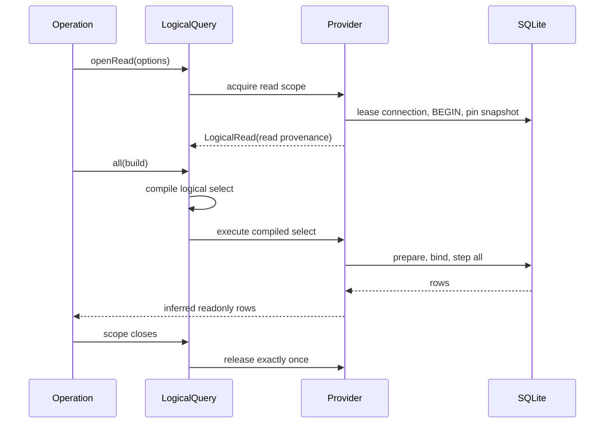

# Cotail Query Execution Contract

## Document Purpose

This document defines the product and system requirements for executing cotail's
logical queries. It focuses on the seam between a logical Kysely query and a
concrete provider such as standalone `node:sqlite` or OpenCode's hosted Effect
SQL runtime.

The relational query world already defines what callers may ask. This document
defines what it means to execute that request truthfully: which connection and
snapshot it uses, how long resources remain alive, how rows stream, which
failures callers can distinguish, and what may be observed safely.

This is a draft PRD and design cut. It is intended to sharpen and supersede the
current acceptance text of `cotail-query-execution-contract` once accepted and
then be decomposed into implementation children. Until that ticket is updated,
the bead remains the tracker state and this document remains a proposal.

It deepens the execution portions of
[`design3.gpt56.md`](/.design/query/design3.gpt56.md), the design implemented by
the current V2 query-world work. It does not replace that document's relation,
identity, witness, evidence, or bookmark model. The older query index still
names `design3-self.md` as a candidate; that navigation is stale relative to the
implemented `design3.gpt56.md` lineage and is corrected by this document's
documentation pass.

The document does not claim that every open decision below has been resolved.

## Executive Summary

Cotail should make a **provider-owned read scope** its unit of execution.

A read scope owns or joins one read transaction on one connection. It exposes a
logical Kysely world, an opaque read-scope ID, an observation time, optional
provider source revision, buffered reads, streaming reads, and query-plan
diagnostics. Its Effect scope owns cleanup.

Simple operations acquire one read scope and run one statement. Multi-stage
operations retain the same read scope across qualification, hydration, and
decoding. Streams retain it until consumption ends.

The execution provider, not a domain operation, creates read provenance. Domain
results and evidence consume that provenance. No random operation token, Event
watermark, path, timestamp, or Message revision is presented as a source
snapshot.

The universal contract promises cooperative interruption boundaries for the
synchronous standalone adapter. It does not promise hard cancellation while
SQLite is executing on the JavaScript thread. A future worker adapter may offer
stronger behavior as an explicit capability.

## Situation

The current `LogicalQueryShape` exposes `run`, `compile`, and
`explainQueryPlan`. `run` compiles a query and forwards its SQL and parameters to
a synchronous executor.

That is sufficient for one buffered statement, but the executor interface does
not represent:

- a connection lease;
- a read transaction;
- one snapshot shared by several statements;
- a stream whose iterator and transaction remain scoped together;
- provider-specific cancellation and busy behavior;
- structured execution failures;
- safe tracing and statement metadata; or
- host-owned versus cotail-owned lifecycle.

Direct search currently creates an opaque-looking UUID before execution and
stores it as `sourceSnapshot`. The value groups evidence from one operation, but
it is not created by the connection or transaction that observed the rows.

The standalone adapter opens one read-only `DatabaseSync`, enables
`query_only`, registers functions, and closes the handle exactly once. It
already has a synchronous iterator, but the public execution contract does not
surface it or define its lifetime.

The hosted design needs a materially different adapter. It must execute compiled
Kysely SQL through OpenCode's current Effect SQL connection and transaction. It
must not attach another driver to OpenCode's native handle or close host-owned
resources.

## Product Thesis

Execution semantics belong behind one deep module.

Callers should choose logical rows and operation policy. They should not manage
connections, begin transactions, manufacture snapshots, normalize SQLite
errors, close iterators, decide when a busy query may retry, or know which
resources belong to the host.

Provider authors should implement one explicit execution seam and run one
conformance suite. They should not reproduce domain search, evidence, bookmark,
or renderer behavior.

## Users And Stakeholders

| User | Need |
|---|---|
| Domain operation author | Run one or several logical statements under one stable observation and receive typed rows. |
| Advanced library caller | Compose arbitrary read-only Kysely queries without learning physical OpenCode tables or native handles. |
| CLI integrator | Acquire resources once, report expected failures consistently, and avoid command-local lifecycle code. |
| Bookmark implementation | Store provenance that corresponds to a real read scope and compare nested revisions honestly. |
| Index implementation | Qualify and hydrate candidates under a known live snapshot without confusing Event watermarks with source state. |
| Standalone provider author | Map synchronous `node:sqlite` behavior into Effect without claiming impossible interruption guarantees. |
| Hosted provider author | Join OpenCode's connection, semaphore, transaction, tracing, and error model without taking ownership. |
| Maintainer | Fix execution, cleanup, tracing, and error behavior once rather than in every operation. |

## Desired Outcomes

1. One statement and many statements use the same execution vocabulary.
2. Every observation can identify the read scope that produced it.
3. Multi-stage operations cannot accidentally reopen between stages.
4. Stream lifetime and transaction lifetime are the same lifetime.
5. Provider differences are explicit capabilities or documented behavior.
6. Expected operational failures retain enough structure for policy and CLI use.
7. Traces explain query shape and cost without exposing query values or content.
8. Standalone and hosted adapters are tested through the same public behavior.
9. Read-only guarantees remain layered even when trusted callers use Kysely
   escape hatches.
10. Simple callers do not pay for the full complexity in their own interfaces.

## Non-Goals

This PRD does not directly design or deliver the following work.

### Logical relations

The execution contract does not decide which `cotail_*` relations or fields
exist. Source compatibility and relation-family seeding belong to
`cotail-query-world-relations-source` and the other relation tickets.

### Access policy semantics

The execution contract supplies cooperative deadline boundaries, execution
metrics, and redacted provider tracing. `cotail-query-access-policy` owns scan
and output budgets and decides which document exposure classes, pending input,
Event payloads, and opaque metadata an operation may read.

### Durable source identity

A read scope uses an assigned `SourceKey`, but this document does not decide how
a source keeps its identity when its database file moves. That belongs to the
bookmark source catalog and relocation design.

### Hosted implementation

This document defines the seam the hosted adapter must satisfy. Implementing the
OpenCode adapter remains `cotail-query-world-host`.

### Hard universal cancellation

The baseline synchronous `node:sqlite` adapter cannot guarantee interruption
inside a currently executing SQLite call. Hard preemption through workers is a
possible future provider, not a promise of the common contract.

### Connection pooling

The first standalone implementation may serialize read scopes over one handle.
Pool size, idle policy, and concurrent snapshot scaling require measurements and
are not decided here.

### Remote arbitrary queries

No HTTP SQL, serialized Kysely AST, or remote arbitrary-query protocol is
proposed. Remote interfaces should remain operation-shaped.

### Writes

This is a read execution contract. Session move/copy and other mutations require
a separate write-side architecture.

### FTS implementation

The index may consume this contract, but ranking, freshness, reconciliation, and
index storage are owned by `cotail-index`.

## Vocabulary

| Term | Meaning |
|---|---|
| **logical query** | A read-only Kysely select built against `CotailRelations`. |
| **query source** | Validated source configuration, capabilities, and logical world from which read scopes can be opened. |
| **read scope** | One provider-controlled connection/transaction observation with scoped execution methods and provenance. |
| **read transaction** | The provider mechanism that keeps all statements in a read scope on one consistent source snapshot. |
| **read-scope ID** | An opaque correlation ID for one cotail read scope. Equality means the same scope; inequality says nothing about source state. |
| **source revision** | Optional provider-supplied opaque source-state identity. Many providers cannot supply one. It is distinct from a read-scope ID and entity revision. |
| **observation time** | The adapter-recorded time at which cotail opened or joined the read scope. It does not claim when an ambient transaction began. |
| **buffered read** | A statement whose complete result is returned before the Effect succeeds. |
| **streamed read** | A statement whose rows are pulled under backpressure while its iterator and read scope remain open. |
| **execution provider** | An adapter that opens read scopes and executes compiled logical selects. |
| **statement fingerprint** | A safe identifier derived from query shape, not SQL parameters or source text. |
| **cooperative interruption** | Interruption observed between statements or iterator pulls, not during a blocking SQLite call. |

## Product Requirements

### EXEC-1: Provider-owned read scope

The execution provider must open, join, and release the connection and read
transaction used by an operation.

The read scope must be represented explicitly in the public Effect interface.
It must not be reconstructed from ambient mutable state inside each statement.

### EXEC-2: One connection and snapshot

Every statement executed through one read scope must use the same connection and
read snapshot.

An operation that qualifies rows and then hydrates them must be able to retain
one read scope across both stages.

No provider may silently reopen a connection between stages while preserving the
same read-scope ID.

### EXEC-3: Truthful provenance

The provider must produce the read-scope ID and observation time attached to
observations. It may also supply a source revision when the provider has a
truthful one.

The read-scope ID must be minted only for an opened read scope. Equal IDs mean
the values came from the same read scope. Unequal IDs make no claim that
database state differed.

Neither read-scope ID nor source revision may be fabricated from an Event
sequence, Message revision, source path, or wall-clock timestamp alone.

The current `Observation.sourceSnapshot: string` conflates scope correlation and
source-state identity. This execution work proposes replacing it with explicit
read provenance rather than preserving the ambiguous name.

### EXEC-4: Buffered execution

A read scope must execute any supported logical select and preserve Kysely's
inferred output row type.

Buffered execution must return only after all rows have been stepped and copied
out of provider-owned statement state.

No native statement, operation node, connection, or mutable result array may
escape.

### EXEC-5: Streaming execution

A read scope must expose a typed Effect Stream for logical select rows.

`LogicalRead.stream` owns its statement and iterator. The surrounding
`openRead` Effect scope owns the transaction, connection lease, and source
scope. Stream completion releases the statement/iterator but leaves the read
scope available for a later sequential statement.

A one-query convenience stream owns both layers: its wrapper opens the read
scope and closes the complete read scope when stream consumption ends.

Backpressure must pull bounded work. The implementation must not call `all()` and
then wrap the complete result as a stream.

### EXEC-6: Compilation

Trusted callers must be able to compile a logical select for diagnostics without
receiving an executable native statement or physical database type.

The public compiled value may expose SQL and parameters as explicit diagnostic
data, but execution internals must not accept an arbitrary public compiled value
as authority to run SQL.

Compile failures must be distinct from execution failures.

### EXEC-7: Explain

Query-plan diagnostics must execute through a read scope and return typed SQLite
plan rows.

Explain must obey read-only enforcement and tracing redaction. An `EXPLAIN`
prefix must not be treated as sufficient evidence that an underlying statement
is safe.

### EXEC-8: Read-only enforcement

Read-only behavior must use several independent layers:

1. A `ReadonlyQueryCreator<CotailRelations>` public query world.
2. An interface intended for logical selects and implemented by trusted code.
3. A native read-only standalone connection.
4. SQLite `query_only` in standalone mode.
5. Hosted statement-kind validation and a host authorizer/read-only facility
   when OpenCode exposes one.
6. Defense-in-depth statement classification or authorization where available.

The callback can ignore `QueryContext` or use TypeScript casts. Builder
provenance is therefore a trusted-code convention, not an authorization
guarantee. The public query world protects ordinary use; native read-only mode
is the standalone runtime barrier.

The hosted adapter must reject any compiled operation that is not a select or
safe explain before passing it to a writable ambient host transaction. If the
host cannot provide a true read-only authorizer, the contract must document
that hostile casts/raw builders are outside its threat model rather than claim a
security boundary it does not possess.

The handwritten SQL classifier is defense in depth. Conformance tests must
include plain writes, CTE writes, `EXPLAIN`-wrapped writes, mutating PRAGMAs,
multiple statements, and trusted raw Kysely escapes.

### EXEC-9: Structured failures

Expected failures must retain safe structured context rather than only a string
message.

At minimum, execution failures must identify:

- provider kind;
- source ID;
- execution phase;
- safe provider code when available;
- retryability classification;
- interruption or deadline classification; and
- optional statement fingerprint.

Raw SQL, bound values, document text, tool input/output, shell output, pending
prompts, workspace bindings, and Event payloads must not appear by default.

Programmer defects remain defects and must not be flattened into expected query
errors merely to print them.

### EXEC-10: Busy behavior

The standalone provider must configure and document its SQLite busy behavior.

The first implementation should prefer SQLite's native busy timeout and typed
`BUSY`/`LOCKED` failures over a JavaScript sleep-and-retry loop.

Any future automatic retry must happen before rows are exposed. A partially
consumed stream must never restart transparently and duplicate rows.

### EXEC-11: Interruption and deadlines

The common contract must state where interruption can be observed for each
provider.

For synchronous standalone execution, interruption is cooperative between
statements and streamed row pulls. A deadline cannot claim to abort a currently
blocking SQLite step unless the provider has an actual preemption mechanism.

Deadline expiration must fail explicitly rather than silently truncate rows.

### EXEC-12: Lifecycle ownership

Standalone read scopes must release cotail-owned iterators, transactions,
statements, leases, and handles exactly once.

Hosted read scopes must never close or destroy host-owned connections. They may
release a host-provided lease or nested transaction only through the host's
interface.

Cleanup must run after success, failure, early stream termination, and
interruption.

Exactly once means every registered cleanup action is attempted once, not that
cleanup cannot fail. Effect scoped finalizers cannot add a checked error to the
enclosing effect's declared error channel, so rollback, iterator-return, lease,
or handle cleanup failure is an operational defect in the Effect Cause rather
than a recoverable `QueryExecutionError`.

If execution and cleanup both fail, the Cause must preserve both; cleanup must
not replace or hide the primary checked failure. Safe tracing records the
release phase without source values. Conformance asserts that cleanup defects
are observable and never swallowed.

### EXEC-13: Safe tracing

Execution must emit Effect spans with safe, bounded attributes.

Required provider attributes are source ID, provider, logical schema version,
statement count, row count, duration, streamed/buffered mode, retry count, and
statement fingerprint.

Operation name, result grain, window sizes, and policy profile belong to the
domain operation's parent span. They may be passed as safe metadata but are not
inferred by the provider. Relation names are optional until the compiler can
collect them without SQL parsing or public operation-node coupling.

Compilation, begin/pin, prepare, step, decode, and release should be visible as
phases or child spans where useful.

SQL text is opt-in diagnostics. Parameters and source content are always
redacted from default traces.

### EXEC-14: Provider conformance

The package must export one behavioral conformance suite for execution
providers.

The execution-contract work must make the suite pass for standalone
`node:sqlite`. The later hosted ticket must run the same suite for OpenCode.

The predecessor ticket must not require a blocked hosted implementation before
it can close.

### EXEC-15: Simple caller path

A one-statement caller must not need to understand transaction cleanup or Stream
internals.

Small helpers may open a read scope, run one buffered statement, and close it.
The helpers must delegate to the same read-scope implementation rather than
forming a second execution path.

### EXEC-16: Operation-owned decoding

The execution contract returns inferred logical rows and provenance. Domain
operations continue to own checked Address mapping, evidence construction,
grouping, pagination, and product-specific decoding.

Execution must not grow a universal row DTO or domain-result union.

### EXEC-17: Sequential use within one read scope

Statements within one `LogicalRead` are sequential. A second buffered read,
explain, or stream may begin after the prior statement or stream releases its
statement resources.

Concurrent statement execution inside one read scope is not part of the common
contract. The first implementation should fail explicitly with a typed
read-scope-busy error rather than queue indefinitely or allow provider-specific
interleaving.

An operation that needs parallel reads must open independent read scopes and
accept that they do not share one read-scope ID or guaranteed source state.

## Quality Requirements

### Correctness

- One read scope observes one stable SQLite snapshot.
- Rows retain exact inferred output types.
- Snapshot provenance comes from execution.
- No write succeeds through the logical query interface.
- Cleanup is exact once across every exit path.

### Performance

- Opening a simple read scope must not scan Message payloads.
- Streaming must be bounded by consumer demand.
- Tracing must avoid materializing complete rows or SQL parameters.
- Relation seeding costs must remain measurable and separable from execution.
- Connection serialization or pooling must be explicit and benchmarkable.

### Security and privacy

- Default errors and traces contain no SQL values or source content.
- The public execution interface exposes no native connection or statement.
- Read-only enforcement does not depend solely on TypeScript types.
- Diagnostic SQL requires an explicit trusted caller path.

### Compatibility

- The public row type remains coupled to Kysely inference.
- Provider-specific capabilities may strengthen behavior but may not weaken
  common guarantees silently.
- Source schema compatibility remains independent from logical execution
  interface versioning.

## End-To-End Flows

### Flow 1: One buffered query



The caller receives rows only. If it creates observations, it uses the read
provenance from the same `LogicalRead`.

### Flow 2: Multi-stage operation

An index-backed or bookmark-resolution operation may first select candidates,
then hydrate live fields, then compare revisions.


All statements use the same `LogicalRead`. The operation must not invoke a
single-query convenience helper for each stage.

### Flow 3: Stream rows

1. The caller already owns a `LogicalRead`, or uses the one-query convenience
   stream that opens one.
2. Kysely compiles one logical select.
3. The provider reserves the read scope's sequential statement slot.
4. The provider prepares and binds one statement.
5. Each downstream demand pulls a bounded row or chunk.
6. Interruption is checked between pulls.
7. Completion, failure, or early termination closes the iterator and releases
   the statement slot.
8. The surrounding `openRead` scope remains usable for a later sequential
   statement.
9. If the convenience stream opened the read scope, stream termination also
   releases the transaction and connection lease exactly once.

The stream must not escape the source scope. If a caller needs rows later, it
must materialize them or convert them into durable domain values before closure.

### Flow 4: Explain a query

1. A trusted caller builds a logical select.
2. Cotail compiles it without exposing the native connection.
3. A read scope executes a provider-safe query-plan operation.
4. The caller receives plan rows and safe trace metadata.
5. Parameters remain absent from traces.

### Flow 5: Busy database

1. The provider applies its configured native busy timeout.
2. SQLite either obtains the read lock or returns a provider code.
3. Cotail maps the code to a structured busy execution failure.
4. No rows have been exposed.
5. Policy may choose a bounded retry in a later design.

The initial implementation does not need automatic retry to satisfy this flow.

### Flow 6: Stream interruption

1. SQLite completes the current synchronous iterator step.
2. Effect observes interruption before the next pull.
3. The stream finalizer invokes iterator cleanup where supported.
4. The provider releases the read scope's statement slot.
5. The surrounding `openRead` scope releases the transaction and connection
   lease when that scope exits; the convenience stream exits it immediately.
6. No claim is made that interruption stopped the SQLite step mid-call.

### Flow 7: Hosted read

1. The hosted adapter obtains OpenCode's current SQL connection and transaction
   through host interfaces.
2. It records whether cotail opened a nested scope or joined an already-pinned
   ambient transaction. The read-scope ID identifies cotail's scope, not the
   ambient transaction's creation time.
3. Kysely builds and compiles against cotail logical relations.
4. The adapter validates select/explain statement kind before using a writable
   ambient host transaction.
5. The adapter executes through the host client and preserves host semaphore,
   savepoint, tracing, and typed failure behavior.
6. Cotail releases only the lease or nested read scope granted by the host.
7. Cotail never closes the host's connection.

The exact OpenCode implementation is outside this PRD's direct delivery, but the
contract must leave room for this flow without a second native driver.

## System Responsibilities

| Module | Responsibility | Explicitly does not own |
|---|---|---|
| `OpenCodeSource` | Source configuration, key, schema validation, capabilities, provider construction | Domain grouping, result rendering |
| `LogicalQuery` | Logical compilation, read-scope acquisition, typed buffered/streamed execution, explain | Physical table access for callers, domain result DTOs |
| Execution provider | Connection/transaction ownership, read provenance, stepping, busy behavior, cleanup | Kysely relation design, witness semantics |
| Domain operation | Qualification, policy request, decoding, Address/Target mapping, evidence, windows | Native connection and transaction management |
| `AccessPolicy` | Exposure and budget decisions | SQLite stepping and provider lifecycle |
| CLI runtime | Config, Layer composition, expected error mapping, rendering | Query SQL and statement cleanup |
| Query registry | Optional discovery/replacement when multiple real providers exist | Read transaction semantics |

## Consistency Model

### Read-scope identity

`ReadScopeID` identifies one cotail read scope. It is opaque and branded. Callers
may compare it for equality but may not parse ordering, database revision, or
Event sequence from it.

An optional `SourceRevision` is a separate provider value. It exists only when a
provider can identify observed source state truthfully. The baseline standalone
adapter is not required to provide one.

### Snapshot pinning

The standalone adapter should begin a read transaction and perform a harmless
read before exposing the read scope. This pins SQLite's snapshot before rows or
observations are produced.

The exact pin statement is implementation detail and must not leak physical
schema into public diagnostics.

### Observation time

`observedAt` records successful read-scope publication: after snapshot pinning
when cotail owns the transaction, or after joining an ambient host transaction.
It is not each row's source timestamp or the start of an ambient transaction. It
does not establish causal ordering between two databases.

Read provenance records whether cotail owns a newly opened transaction or joined
an ambient host transaction. For a joined transaction, the host may supply an
earlier transaction time or source revision, but cotail must not invent either.

### Revisions

Message payload hashes and row update times remain entity revisions. They may be
attached to observations, but they do not replace read provenance.

### Concurrent writer behavior

After snapshot pinning, a writer may attempt to commit newer state. Every
subsequent statement in the same read scope must continue observing the pinned
state.

A new read scope receives a different read-scope ID and may observe newer state.

OpenCode normally uses WAL, where the concurrent writer can commit while the
reader remains open. The adapter must detect journal mode. Conformance requires
a concurrent successful commit only when the source supports it; rollback-mode
tests instead prove stable repeated reads while documenting that the writer may
remain blocked until release.

## Interruption And Timeout Contract

| Behavior | Common guarantee | Standalone synchronous adapter | Hosted adapter |
|---|---|---|---|
| Interrupt before execution | Must stop before preparing the statement | Supported | Must be supported through Effect |
| Interrupt between statements | Must stop before the next statement | Supported | Must be supported |
| Interrupt between streamed rows | Must stop before the next pull and finalize | Cooperative | Provider-specific but at least cooperative |
| Interrupt inside one blocking step | Not universally guaranteed | Not guaranteed | Depends on host client |
| Deadline before execution | Must fail explicitly | Supported | Must be supported |
| Deadline during blocking step | Capability-specific | Observed after the step unless a stronger adapter exists | Depends on host client |
| Partial result on timeout | Forbidden for buffered reads | No partial success | No partial success |
| Transparent restart after emitted rows | Forbidden | Forbidden | Forbidden |

We should not name a generic timeout option until the interface communicates
these limits. A future provider may advertise hard interruption separately.

## Error Model

The exact Effect Schema declarations remain implementation work. The conceptual
model is:

```ts
type QueryExecutionPhase =
  | "acquire"
  | "begin"
  | "pin"
  | "prepare"
  | "step"
  | "explain";

type QueryExecutionReason =
  | "provider"
  | "busy"
  | "locked"
  | "read-scope-busy"
  | "interrupted"
  | "deadline";

interface QueryExecutionFailure {
  readonly provider: "node-sqlite" | "opencode-host";
  readonly sourceID: string;
  readonly phase: QueryExecutionPhase;
  readonly reason: QueryExecutionReason;
  readonly code?: string;
  readonly retryable: boolean;
  readonly statementFingerprint?: string;
  readonly safeMessage: string;
}
```

Busy, interruption, and deadline failures may be separate tagged classes or a
discriminated reason inside execution failure. Callers must be able to match
them without parsing messages.

The raw cause may remain attached for local diagnostics, but default rendering
and tracing must use allowlisted fields only.

## Tracing Model

### Safe by default

Every read scope should have one parent span. Every statement should have a
child span or event with compile, prepare, step, row count, and duration data.

Required provider attributes include:

- provider;
- source ID;
- logical schema version;
- buffered or streamed mode;
- statement count;
- row count;
- duration;
- retry count; and
- statement fingerprint.

Optional safe metadata supplied by the caller includes operation name, result
grain, window sizes, and policy profile. Relation names remain optional until
the compiler can collect them without SQL parsing or public operation-node
coupling.

Unsafe default attributes include:

- SQL text;
- parameters;
- regex patterns and literal terms;
- document excerpts;
- Message JSON;
- tool inputs and outputs;
- shell commands and output;
- pending prompts;
- workspace bindings; and
- Event payloads.

### Diagnostic SQL

SQL text may be returned by the explicit `compile` diagnostic interface. It is
not automatically attached to traces or expected error messages.

## Proposed Public Interface

The following is a design target, not a finalized TypeScript signature.

```ts
import type { InferResult, SelectQueryBuilder } from "kysely";
import type { ReadonlyQueryCreator } from "kysely/readonly";
import { Effect, Stream } from "effect";

type AnyLogicalSelect = SelectQueryBuilder<any, any, any>;
type QueryError = QueryCompileError | QueryExecutionError;

declare const readScopeIDBrand: unique symbol;
declare const sourceRevisionBrand: unique symbol;

type ReadScopeID = string & { readonly [readScopeIDBrand]: true };
type SourceRevision = string & { readonly [sourceRevisionBrand]: true };

interface ReadDeadline {
  readonly epochMilliseconds: number;
}

interface ReadProvenance {
  readonly readScopeID: ReadScopeID;
  readonly observedAt: number;
  readonly transaction: "owned" | "joined";
  readonly sourceRevision?: SourceRevision;
}

interface ReadOptions {
  readonly operation?: string;
  readonly deadline?: ReadDeadline;
}

interface QueryContext {
  readonly db: ReadonlyQueryCreator<CotailRelations>;
  readonly capabilities: SourceCapabilities;
  readonly source: SourceKey;
}

interface LogicalRead {
  readonly source: SourceKey;
  readonly capabilities: SourceCapabilities;
  readonly provenance: ReadProvenance;

  readonly all: <const Q extends AnyLogicalSelect>(
    build: (context: QueryContext) => Q,
  ) => Effect.Effect<Readonly<InferResult<Q>>, QueryError>;

  readonly stream: <const Q extends AnyLogicalSelect>(
    build: (context: QueryContext) => Q,
  ) => Stream.Stream<InferResult<Q>[number], QueryError>;

  readonly explain: <const Q extends AnyLogicalSelect>(
    build: (context: QueryContext) => Q,
  ) => Effect.Effect<readonly SqliteQueryPlanRow[], QueryError>;
}

interface LogicalQuery {
  readonly openRead: (
    options?: ReadOptions,
  ) => Effect.Effect<LogicalRead, QueryExecutionError, import("effect").Scope.Scope>;

  readonly compile: <const Q extends AnyLogicalSelect>(
    build: (context: QueryContext) => Q,
  ) => Effect.Effect<CompiledLogicalQuery<InferResult<Q>[number]>, QueryCompileError>;
}
```

### Simple buffered helper

The package may export a convenience function rather than adding another method
to the core interface:

```ts
const all = <Q extends AnyLogicalSelect>(
  query: LogicalQuery,
  build: (context: QueryContext) => Q,
  options?: ReadOptions,
) => Effect.scoped(
  query.openRead(options).pipe(
    Effect.flatMap((read) => read.all(build)),
  ),
);
```

This keeps one implementation path. Domain operations that need provenance or
several statements use `openRead` directly.

### Simple streaming helper

```ts
const stream = <Q extends AnyLogicalSelect>(
  query: LogicalQuery,
  build: (context: QueryContext) => Q,
  options?: ReadOptions,
) => Stream.unwrapScoped(
  query.openRead(options).pipe(
    Effect.map((read) => read.stream(build)),
  ),
);
```

The stream helper must not open a scope, return an iterator, and close the scope
before downstream consumption.

## Proposed Internal Provider Seam

The provider seam should remain internal to the query implementation.

```ts
interface ReadExecutionProvider {
  readonly open: (
    options: ReadOptions,
  ) => Effect.Effect<ReadExecutor, QueryExecutionError, Scope.Scope>;
}

interface ReadExecutor {
  readonly provenance: ReadProvenance;

  readonly all: <Row>(
    query: ExecutableLogicalSelect<Row>,
  ) => Effect.Effect<readonly Row[], QueryExecutionError>;

  readonly stream: <Row>(
    query: ExecutableLogicalSelect<Row>,
  ) => Stream.Stream<Row, QueryExecutionError>;

  readonly explain: <Row>(
    query: ExecutableLogicalSelect<Row>,
  ) => Effect.Effect<readonly SqliteQueryPlanRow[], QueryExecutionError>;
}
```

`ExecutableLogicalSelect<Row>` should be privately branded or otherwise created
only by cotail's logical compiler. The public diagnostic
`CompiledLogicalQuery<Row>` should not become a raw execution input.

The private brand separates internal execution from the public diagnostic
envelope. It does not prove that a trusted callback used the supplied logical
query world; TypeScript casts and forged builders remain outside the threat
model and still meet native/provider read-only checks.

## Standalone Node Adapter Cut

### First implementation

The smallest correct standalone cut should preserve the current single native
handle and serialize read scopes.

1. Acquire and validate the source under its outer Effect scope.
2. Acquire an exclusive read-scope lease.
3. Begin a SQLite read transaction.
4. Pin the snapshot with a harmless read.
5. Mint the opaque read-scope ID and observation time; include source revision
   only if one is truthfully available.
6. Execute buffered or streamed statements on that same handle.
7. Roll back or otherwise end the read transaction on scope release.
8. Release the lease exactly once.
9. Close the native handle only when the outer source scope closes.

Serializing read scopes is acceptable initially because `DatabaseSync` already
blocks the JavaScript thread during each call. It also prevents overlapping
transactions and streams on one connection.

### Why not pool immediately

A read pool adds connection identity, validation caching, snapshot concurrency,
idle cleanup, and busy coordination. None is necessary to prove the contract.

Add a pool only after benchmarks show serialization is a bottleneck for a real
multi-operation process.

### Native busy timeout

Configure a bounded native SQLite busy timeout through the provider. Do not
block the event loop with a JavaScript sleep loop.

The actual default value is an open configuration decision.

### Iterator cleanup

The streaming adapter must determine and test whether the Node iterator exposes
`return()`, how statement resources are released after early termination, and
whether a statement object needs explicit disposal in supported Node versions.

No cleanup behavior should be inferred only from garbage collection.

## Hosted Adapter Contract

The hosted adapter must satisfy the same observable read-scope behavior while
using OpenCode's own execution mechanisms.

It may open a host-supported nested read scope or join an ambient transaction.
Joined mode records `transaction: "joined"`; cotail's `observedAt` is join time,
not ambient transaction start. A host-supplied revision/time may be retained as
additional provenance, but absence must remain absence.

If OpenCode exposes no read-only transaction or authorizer, the hosted adapter
must validate compiled statement kind and document that adversarial raw/cast
builders are outside the trusted-library threat model. A savepoint alone is not
a read-only boundary and does not establish a new snapshot.

It must preserve:

- host connection and semaphore ownership;
- fiber-local transaction or savepoint selection;
- host tracing context;
- typed host SQL failures;
- host cancellation behavior; and
- host lifecycle ownership.

It must not:

- create a Kysely SQLite driver over the host's native handle;
- close or destroy the host connection;
- bypass host transaction selection;
- promise standalone-specific SQLite behavior; or
- expose arbitrary Kysely execution over HTTP.

The hosted implementation ticket should run the exported conformance suite and
document any stronger capabilities.

## Conformance Suite

The suite should be exported as provider-author tooling. It should test behavior
through the public `LogicalQuery`/`LogicalRead` seam rather than native handles.

### Core cases

| Area | Required case |
|---|---|
| Type inference | A compile-time companion suite proves arbitrary projection and join output types. |
| Buffered read | Complete rows are returned and provider state does not escape. |
| Shared snapshot | Two statements in one read scope see one pinned state; WAL providers also prove it across a concurrent successful writer commit. |
| New scope | After a writer succeeds, a later read scope can see it and has a different read-scope ID. |
| Provenance | Read-scope ID and observation time originate from the provider; source revision remains optional. |
| Compile | Diagnostic compile exposes only the stable compiled envelope. |
| Explain | Plan execution returns typed rows through read-only execution. |
| Read-only | Plain, CTE, `EXPLAIN`, PRAGMA, multi-statement, and raw-escape writes fail. |
| Cleanup | Success, failure, interruption, and early stream termination release exactly once. |
| Streaming | Demand is incremental and does not materialize all rows. |
| Stream failure | Mid-stream provider failure closes the iterator/statement; the surrounding read scope follows its owner's exit. |
| Busy | Provider codes map to a structured safe failure. |
| Deadline | Expiration before the next cooperative boundary fails explicitly. |
| Tracing | Safe shape/count/duration attributes exist; SQL values and content do not. |
| Ownership | Standalone closes owned handles; hosted adapters do not close host handles. |

Additional lifecycle cases cover interruption while waiting for a lease; pin
failure after begin; interruption between begin and scope publication;
never-consumed and empty streams; a second sequential statement after stream
completion; rejection of concurrent statements; consumer versus provider stream
failure; combined iterator/release failure; and source-scope closure ordering
with an active read scope.

Hosted conformance additionally covers joining an ambient transaction that was
pinned before cotail opened its read scope. Exact inference remains a separate
compile-time test suite rather than a runtime provider assertion.

### Test instrumentation

Provider tests may use internal hooks to count begins, pins, steps, iterator
returns, releases, and closes. Those hooks are not part of the public execution
interface.

## Delivery Plan

The current execution ticket is large enough to deserve an epic and tracer
children.

Accepting this PRD requires updating the tracker before implementation:

- convert `cotail-query-execution-contract` from feature to epic;
- replace its current hosted-suite acceptance with the standalone contract and
  exported-suite acceptance below;
- add the three child tickets; and
- move `cotail-query-world-host`'s hard dependency from the parent to the final
  conformance child.

Without that update, the current bead remains circular: it blocks the hosted
implementation while requiring that blocked implementation to pass its suite.

### Cut 1: Read scope

Suggested ticket: `cotail-query-execution-contract-read-scope`.

Deliver:

- `ReadScopeID`, optional `SourceRevision`, and read provenance;
- `openRead` and buffered `all`;
- standalone transaction/lease ownership;
- structured phase-aware execution errors;
- provider-owned observation provenance;
- simple one-query helper; and
- tests proving stable repeated reads and, under WAL, stability across a
  concurrent successful writer.

Migrate direct search away from its operation-generated UUID in this cut.

### Cut 2: Streaming

Suggested ticket: `cotail-query-execution-contract-streaming`.

Deliver:

- scoped iterator Stream;
- bounded demand;
- early termination;
- cooperative interruption boundaries;
- exact iterator cleanup plus read-scope cleanup by the surrounding owner; and
- explicit synchronous timeout limitations.

### Cut 3: Conformance and observability

Suggested ticket: `cotail-query-execution-contract-conformance`.

Deliver:

- native busy timeout and structured busy mapping;
- safe execution spans and fingerprints;
- expanded read-only matrix;
- provider conformance export;
- standalone suite completion; and
- hosted-provider author guidance.

`cotail-query-world-host` should depend on this final child and must run the
suite as part of its own acceptance. The execution epic should not require the
blocked hosted implementation in order to close.

## Adjacent Development Normalization

These are follow-up implications, not deliverables or accepted dependency
changes of this PRD. They require their own bead updates or decisions.

### Relation source normalization can proceed in parallel

`cotail-query-world-relations-source` should continue defining physical
compatibility, validation, capabilities, and relation-family seeding. Execution
consumes its logical world but need not wait for every new relation.

### Application runtime follows the execution seam

CLI commands currently repeat source discovery, source acquisition,
`Effect.scoped`, broad error printing, and process exit handling.

After read scopes stabilize, add an application-runtime ticket that owns config,
query provider composition, AccessPolicy, tracing, and typed error-to-exit-code
mapping. Commands should become Effect programs that return values.

This runtime should use ordinary Effect Layer composition first. The query
registry should become mandatory only when multiple real providers or sources
justify discovery.

### Source catalog precedes durable bookmarks

The bookmark epic should gain a source-catalog child for stable source IDs,
relocation, duplicate-path handling, multiple configured databases, and
source-unavailable resolution.

Execution supplies read-scope provenance. The source catalog supplies durable
source identity. Neither should impersonate the other.

### Access policy consumes execution metrics and document semantics

`cotail-query-access-policy` needs document ownership/exposure semantics from
the relation-document ticket. It can also consume execution's cooperative
deadline boundaries, safe counters, and provider tracing, while retaining
ownership of scan and returned-byte budgets. Whether that relationship requires
a hard dependency should be decided when the policy implementation is planned.

## Success Criteria

The execution epic is successful when:

1. Domain operations no longer create read-scope or source-revision tokens.
2. A multi-statement operation proves stable repeated reads; under WAL it also
   proves stability across a concurrent successful writer commit.
3. One public stream retains and releases its complete read scope correctly.
4. The standalone adapter's interruption limits are tested and documented.
5. Busy and execution failures are typed without leaking SQL or values.
6. Safe spans report operation shape, counts, and duration.
7. The provider conformance suite is reusable by the hosted ticket.
8. Existing one-statement operations remain straightforward.
9. No native connection, statement, or physical database type escapes.
10. Existing CLI behavior remains characterized through migration.

## Risks And Mitigations

| Risk | Consequence | Mitigation |
|---|---|---|
| Read scope adds ceremony | Simple query callers become harder to use | Export one-query buffered and streaming helpers over the same implementation. |
| Synchronous SQLite blocks interruption | Timeout claims become false | Promise cooperative boundaries only; model stronger adapters as capabilities. |
| One serialized connection limits concurrency | Long streams delay other operations | Measure first; add a provider-internal read pool without changing the public seam if needed. |
| Public compiled SQL becomes an execution escape | Read-only and policy guarantees weaken | Keep executable compiled values privately branded; public compile is diagnostic only. |
| Trace metadata leaks content | Sensitive prompts or tool output escape | Allowlist attributes and test absence of SQL, parameters, and source values. |
| Error normalization destroys provider detail | Operators cannot diagnose failures | Preserve safe codes, phase, provider, retryability, fingerprint, and an internal cause. |
| Automatic stream retry duplicates rows | Consumers receive corrupt ordering/counts | Forbid transparent retry after first row. |
| Hosted semantics differ from standalone | Contract becomes lowest-common-denominator fiction | Keep a small common guarantee and expose stronger behavior as explicit capability. |
| Relation construction and execution stay coupled | Every new relation destabilizes runners | Keep pure CTE construction outside provider execution; benchmark relation seeding separately. |

## Alternatives Considered

### Keep `run`, `stream`, and `transaction` as flat methods

Rejected as the primary shape. Callers would need to understand which methods
share a connection and snapshot, and multi-stage operations could accidentally
mix scopes.

### Return `{ rows, snapshot }` from every `run`

Useful as a convenience result, but insufficient as the core abstraction. It
does not let several statements or a stream share one transaction.

### Implicit transaction per statement

Rejected for multi-stage operations. It provides no truthful shared snapshot for
qualification plus hydration.

### Expose a native connection callback

Rejected. It leaks provider implementation, physical SQL access, lifecycle, and
host ownership into operation code.

### Execute public compiled SQL directly

Rejected. It turns a diagnostic envelope into a raw execution protocol and
makes hosted/read-only enforcement harder.

### Worker threads as the baseline

Deferred. Workers can improve standalone cancellation, but they add message
transport, row serialization, worker lifecycle, and a second implementation
that does not map cleanly to OpenCode's host transaction.

### Use Event watermarks as source snapshots

Rejected. Event payload persistence may be disabled or incomplete, sequences
are aggregate-local, and reserved prefixes/gaps are legitimate.

### Make the query registry own transactions

Rejected. Registry responsibility is provider discovery and scoped acquisition.
Read transaction semantics belong to each provider behind `LogicalQuery`.

## Open Decisions

The following decisions must remain visible rather than being implied by the
first implementation.

1. What branded representations should `ReadScopeID` and optional
   `SourceRevision` use?
2. Which harmless standalone read should pin the SQLite snapshot?
3. Which Node versions expose reliable iterator cleanup or explicit statement
   disposal?
4. What native busy timeout should standalone mode use by default?
5. Should deadlines be absolute instants, Effect durations, or a richer budget
   value?
6. Which SQLite codes are safe and stable enough to expose?
7. How should statement fingerprints be computed and versioned?
8. Can relation names be collected from Kysely operation nodes without
   stabilizing those nodes publicly?
9. When does serialized standalone execution require a connection pool?
10. Does the hosted adapter join an ambient transaction, open a nested
    transaction, or support both based on context?
11. Which host mechanism, if any, can enforce read-only execution beyond
    statement-kind validation inside a writable ambient transaction?
12. Which stronger cancellation capabilities can hosted execution advertise?
13. Should explicit diagnostic SQL require a configuration capability in
    addition to trusted code access?
14. How should read-scope metrics integrate with future scan and result-byte
    budgets?
15. Should journal mode be a source capability or provider diagnostic, and how
    should non-WAL conformance fixtures coordinate blocked writers?

## Explicitly Deferred Work

The following work is relevant but should not delay the first read-scope tracer:

- standalone worker-thread execution;
- parallel read connection pools;
- dynamic provider registration and hot-plugging;
- remote arbitrary-query transport;
- write transactions;
- durable source relocation;
- complete AccessPolicy enforcement;
- FTS index generation and hydration;
- hosted provider implementation;
- hard query cancellation inside synchronous `node:sqlite`; and
- cross-process source-revision identity.

## Cross-References

- [Cotail V2 relational query world](/.design/query/design3.gpt56.md) defines the
  logical relations, identity, evidence, Effect modules, and original execution
  direction that this PRD narrows and deepens.
- [Current LogicalQuery implementation](/packages/query-kysely/src/query/logical-query.ts)
  is the shallow buffered-execution baseline to replace.
- [Current standalone adapter](/packages/query-kysely/src/runtime/node-sqlite.ts)
  supplies the read-only handle, functions, iterator, and lifecycle behavior the
  first provider cut should preserve.
- [Query registry applications](/.design/query-runtime/applications0.gpt56.md)
  explains why provider discovery should remain optional until multiple real
  providers or sources exist.
- [Query runtime registry](/packages/query-runtime/src/registry.ts) already owns
  immutable factory acquisition and cleanup; it should not absorb read
  transaction semantics.
- [Observation model](/packages/query-kysely/src/domain/observation.ts) is the
  current consumer of `sourceSnapshot` and `observedAt` and must migrate to
  provider-owned provenance.
- [Direct search operation](/packages/query-kysely/src/operations/direct-search.ts)
  is the first end-to-end tracer because it currently manufactures a snapshot
  token and already returns observed evidence.
