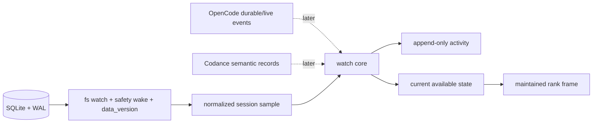

# Cotail Watch Research

This directory explores a `cotail watch` command with two views over changing
OpenCode work:

- an append-only, history-like **activity** view; and
- a maintained, on-screen **rank** of the selected session universe.

The recommended initial plan is
[`draft0.gpt56t.md`](/.design/watch/draft0.gpt56t.md). It builds a truthful
snapshot watcher first and leaves explicit seams for exact OpenCode events and
Codance's future work ledger.

## Situation

`history` already answers “what was I working on recently?” once. Watch should
answer “what changed?” continuously and “what should remain visible?” as a
ranked screen. Those are separate projections, but they should not have separate
database loops or incompatible definitions of a session.

The research found four constraints that shape the plan:

1. The live database has both 5,254 legacy `session` rows and 5,562 native
   `session_v2` rows. Current `history` sees only the former, so storage
   normalization is a prerequisite for “everything available.”
2. The local `event` table is empty. Durable event tailing is a valuable later
   source but cannot be the portable baseline.
3. SQLite/WAL change detection is already proven nearby: watch the parent
   directory, debounce sidecar churn, retain a safety wake, and gate reads with
   a persistent connection's `PRAGMA data_version`.
4. Codance currently orchestrates forks and prompts but does not yet persist or
   expose its proposed work ledger. It is a future semantic source, not today's
   session-inventory authority.

## Research Leads

- [`database-observability0.gpt56t.md`](/.design/watch/database-observability0.gpt56t.md)
  measures the live database/query shape, distinguishes universe/ranking/
  viewport, and defines honest snapshot transitions.
- [`source-and-lifecycle0.explore.md`](/.design/watch/source-and-lifecycle0.explore.md)
  maps the watcher lifecycle, DB+WAL discovery, current `session_v2` migration,
  hybrid change monitor, and exact-event alternatives.
- [`terminal-and-ranking0.ds4f.md`](/.design/watch/terminal-and-ranking0.ds4f.md)
  explores terminal frames, stable ties, stream/batch behavior, JSON, signals,
  resize, EPIPE, rank keys, and test seams.
- [`codance-crossover0.general.md`](/.design/watch/codance-crossover0.general.md)
  separates Codance's implemented command workflows from its proposed durable
  interactions and derives an eventual actionable ranking policy.
- [`draft0.gpt56t.md`](/.design/watch/draft0.gpt56t.md) turns the common ground
  into an initial implementation plan and verification matrix.

## Synthesis

### One core, two projections

The shared core maintains a normalized session inventory and derives observed
transitions. Activity appends transitions; rank reduces them into current state
and redraws. Neither renderer reads SQLite directly.



The important long-term distinction is **inventory versus activity**:

- Inventory answers which sessions/items currently exist and supplies restart
  truth.
- Activity records what occurred, with source fidelity and cursors where
  available.

Snapshot comparison supplies observed activity now. Exact durable logs can be
added later without replacing inventory or rewriting the terminal layer.

### Normalize before watching

The current OpenCode source names `session_v2` as the native projection, while
cotail still queries legacy `session`. The first implementation task is not a
timer or ANSI renderer; it is one operation that combines both metadata
generations, deduplicates by ID, prefers native metadata on collision, and
selects the correct message-count relation.

Finite `history` should eventually consume the same operation. Otherwise watch
and history will disagree about which sessions exist, defeating the intended
correspondence.

This also corrects older assumptions in [`v2.md`](/.design/v2.md): that document
accurately identifies the event-sourced/message transition but predates the
current `session_v2` table migration.

### Wake promptly, poll safely

Use one long-lived read-only connection. A parent-directory `fs.watch` notices
main/WAL/SHM changes quickly; a short debounce coalesces one commit's burst;
periodic safety wake catches dropped notifications; `PRAGMA data_version`
prevents unchanged wakes from scanning tables.

Relative selection adds one exception: a trailing `--since 24h` window changes
even if the database does not. Its cutoff must be recomputed and the safety wake
must allow sessions to age out. An absolute date remains fixed.

The initial engine should take a complete normalized metadata snapshot after a
gated change. A 5.5k-row metadata scan is small and avoids the correctness state
of a timestamp cursor. Cursor/overlap/deduplication belongs in an exact or
incremental source once measurement justifies it.

### Be precise about fidelity

Snapshot-derived words are `initial`, `appeared`, `updated`, and
`left-selection`. They do not imply an exact causal event. Polling can coalesce
several commits and miss intermediate states.

OpenCode's durable per-session log can later supply exact execution/input/tool
events with aggregate sequence cursors. Its global live stream and exact
`busy|retry|idle` status are volatile and require reconnect reconciliation.
Codance can eventually supply human meaning such as “fork requested,” “intent
parked,” “check-in waiting,” or “workflow needs repair.”

Every future activity envelope should carry source, occurrence and observation
times, stable identity, subject, severity, optional cursor, and bounded/redacted
data. Exact history is appended; rank reduces it.

### Rank state, not event volume

The baseline rank is:

```text
timeUpdated descending, session ID ascending
```

The ID tie-breaker is required: the live data contains timestamp ties involving
dozens of sessions. Recent/changed markers should not themselves perturb the
order.

Once live and Codance state is durable enough, a separate attention rank can be
evaluated:

1. waiting human question, permission, form, or check-in;
2. failed or ambiguous workflow needing repair;
3. failed or retrying session;
4. running session/fork;
5. pending, parked, or lifted runnable intent;
6. completed unread work;
7. idle work by recency.

Tool deltas, token churn, and cadence counters are details, not reasons to boost
a row continually. Within each tier, use meaningful-event recency then stable
ID. This attention policy is a later product decision, not a hidden replacement
for the explainable baseline.

### Universe is not viewport

The engine ranks every matching item. Terminal height only limits what is drawn;
the footer reports `shown / matching`. The first plan inherits `history`'s
trailing 24-hour default, but whether “everything available” should instead mean
all non-archived sessions remains the most important scope question to validate.

The current plan keeps a shared selection for both modes. If activity needs a
small backfill while rank needs all non-archived sessions, model those as
separate initial-presentation policies over one inventory rather than creating
two source loops.

### Terminal contracts

Recommended initial CLI:

```text
cotail watch --mode activity [--since 24h] [--no-initial] [--json]
cotail watch --mode rank     [--since 24h]
```

- Require an explicit mode first. Do not silently switch output contracts when
  stdout is redirected.
- Activity works on TTYs and pipes and never emits cursor movement.
- Activity JSON is JSONL, one complete envelope per line.
- Rank initially requires a TTY, uses an alternate screen, renders full frames,
  reflows on resize, and restores screen/cursor on normal and error exits.
- Handle downstream `EPIPE` quietly so activity can be piped through `head` or a
  pager.
- Keep the terminal renderer behind a tiny injected surface so frame and escape
  sequence behavior can be tested without a pseudo-terminal.

The terminal lead proposes `top -b`-style repeated rank frames and frame JSON
for non-TTY output. That is coherent, but it expands the first contract without
serving the requested maintained on-screen use case. Defer it until a concrete
automation consumer appears; `history` already supplies finite ranked data.

## Current Decisions

| Question | Initial direction |
| --- | --- |
| Command | `cotail watch --mode activity|rank` |
| Default mode | None; explicit mode required |
| Inventory | Shared normalized legacy/native session selection |
| Initial horizon | Trailing 24 hours, inherited from `history` |
| Activity startup | Emit `initial` rows; `--no-initial` for changes only |
| Baseline rank | `timeUpdated DESC, id ASC` |
| Rank output | TTY alternate-screen frame only |
| Activity automation | Human lines or JSONL, no ANSI when piped/JSON |
| Wake strategy | DB-directory watch + debounce + safety wake + `data_version` |
| Exact events | Deferred source adapter, not inferred from timestamps |
| Codance | Future semantic adapter; no runtime dependency now |
| Tests | Vitest with fake source/clock/wake and pure frame goldens |

## Tensions

The leads agree on the architecture but preserve useful disagreements:

- **Default mode:** terminal research favors TTY-sensitive defaults; the draft
  favors explicit contracts until usage settles the primary view.
- **Rank in pipes:** terminal research favors repeated batch frames; the draft
  favors a smaller TTY-only first release.
- **Universe:** rank research favors all non-archived sessions; history parity
  favors a trailing 24-hour selection. The current draft chooses parity but
  keeps this open.
- **Observation algorithm:** terminal research proposes a timestamp cursor with
  overlap; lifecycle/database research favors complete metadata snapshots after
  a cheap change gate. The current draft chooses snapshots for simpler
  correctness at the measured scale.
- **What gets ranked:** the SQLite baseline ranks sessions; Codance's eventual
  work ledger needs heterogeneous session/workflow/check-in/intent items. Do not
  prematurely force those into a session row.

## Next Decisions

1. Confirm whether default rank membership is trailing recent work or every
   non-archived session.
2. Confirm whether startup activity should replay current history by default or
   begin silently from now.
3. Decide whether the first rank is purely recency or also needs a coarse
   “recently changing” class before exact live status exists.
4. Characterize metadata/count normalization across overlapping `session` and
   `session_v2` IDs with fixtures and the live database.
5. Decide whether exact activity should reuse `opencode-session-fab`, consume
   OpenCode's durable SSE log, or remain outside the first release.

## Cross-References

- [`history-viewer/design.md`](/.design/history-viewer/design.md) is the finite
  selection/count/output contract watch extends.
- [`query/README.md`](/.design/query/README.md) establishes sessions as stable
  results and live OpenCode metadata as authoritative.
- [`bookmarks/applications.glm52.md`](/.design/bookmarks/applications.glm52.md)
  proposes watch-driven fork and compaction save-point producers; these need an
  exact activity source rather than snapshot guesses.
- [`v2.md`](/.design/v2.md) describes durable session logs and V2 message/event
  semantics, while the current source-lifecycle lead records the newer
  `session_v2` migration.
- [`Codance README`](file:///home/rektide/src/codance/README.md) defines the
  work-ledger and fork/check-in concepts that motivate eventual actionable
  ranking.
