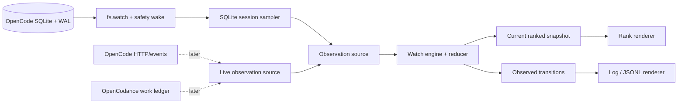

# Cotail Watch Initial Plan

## Status

This is an initial plan, not an implementation contract. It chooses a small
polling baseline that works with cotail's current direct SQLite architecture and
defines where richer OpenCode/OpenCodance observations can enter later.

The largest product decision still open is whether “rank” means pure recency or
an attention-oriented ordering once running, pending, blocked, and failed states
are observable. The initial plan uses deterministic recency because that is the
only ranking already established by `history` and available in every supported
database.

## Goal

Add one command with two deliberately different terminal contracts:

```text
cotail watch --mode activity # append observed activity; preserve scrollback
cotail watch --mode rank    # maintain a ranked, full-screen session view
```

Both modes observe the same selected session universe and use one observation
core. The baseline SQLite source derives normalized transitions from snapshots;
later event sources may contribute exact activity while updating the same
current-state projection. The modes differ in projection:

- **activity** turns each initial row, observed transition, or exact activity into an
  appended record;
- **rank** reduces transitions into current state and redraws a terminal
  viewport.

The result should answer both “what just happened?” and “what is most relevant
right now?” without claiming that a SQLite poll recovered exact execution
events.

## Product Decisions For The First Slice

### Command and mode names

Use `watch --mode activity|rank` rather than overloading `history --follow`.
`history` remains a finite query; `watch` owns lifecycle, intervals, signals,
and terminal state. `activity` names the observed domain without confusing it
with the existing finite `history` command. `rank` names both ordering and the
maintained display. Independent leads use “stream” and “log” for the same first
projection; this draft resolves the CLI vocabulary to `activity`.

Require the mode initially rather than guessing from TTY state. An implicit
default can be added after use demonstrates which mode is primary. Output mode
must never silently change because stdout was redirected.

### Selected universe

Inherit `history` filters:

```text
--since <duration-or-date>   default 24h
--directory <path>
--db <path>
```

Treat `--since` as a moving horizon for relative durations and a fixed horizon
for absolute dates. This distinction matters during a long watch: `--since 24h`
should keep meaning “the trailing 24 hours,” while an ISO timestamp remains a
fixed lower bound.

Do not call the terminal viewport “everything.” The engine ranks every matching
session; `rank` renders as many as terminal height permits and reports
`shown / matching`. A future explicit `--all-time` can remove the default
horizon without assigning a second meaning to `--since`.

### Ranking

Start with:

```text
timeUpdated descending, session ID ascending
```

The ID is a deterministic tie-breaker. Rank movement is dashboard state, not an
activity event by itself. A future `--rank attention` may place needs-input,
failed, busy, pending, then idle sessions into classes before applying recency,
but it requires a live source and separate product validation.

### Poll fidelity

Use the vocabulary `appeared`, `updated`, `left-window`, and `removed`. Do not
emit synthetic claims such as `step-finished` or `session-idle` from a changed
timestamp. Every transition carries source time and observation time so users
and later code can see polling delay.

### Cold start

- `activity` emits the current matching rows as `initial` records, newest first,
  then appends changes.
- `activity --no-initial` establishes a baseline silently and emits only later
  transitions.
- `rank` always renders the current snapshot.

This makes interactive startup useful while preserving a clean automation
option.

### Formats and terminal constraints

- Human `activity` works on TTY and non-TTY stdout.
- `activity --json` emits one stable JSON object per line.
- `rank` requires an interactive TTY and rejects `--json`/`--tsv` rather than
  producing escape sequences in a pipe.
- `--interval <duration>` controls the safety wake for both modes and must be
  greater than zero. Filesystem notifications may trigger lower-latency samples.
- Avoid reusing `--limit`: history uses it as result cardinality, while a watch
  could interpret it as event count, matching sessions, or visible rows. Add
  narrowly named controls only when needed.

## Architecture



### Observation source

Expose an operation-shaped interface that returns a complete sample. Keep SQL,
table capability checks, and row mapping inside the SQLite implementation.

Illustrative shape:

```ts
interface SessionObservation {
  id: string;
  title: string;
  directory: string;
  slug: string;
  timeCreated: number;
  timeUpdated: number;
  messagesRecent?: number;
  messagesTotal?: number;
  fidelity: "projection" | "live";
}

interface ObservationSource {
  sample(request: WatchSelection, signal: AbortSignal): Promise<SessionObservation[]>;
  close(): Promise<void>;
}
```

The public contract should not expose `DatabaseSync`. The first adapter may use
synchronous `node:sqlite` calls internally, but the watch loop remains abortable
and leaves room for asynchronous HTTP sources.

### Watch engine

The engine owns:

- the previous sample keyed by session ID;
- deterministic sorting;
- field-level comparison and transition derivation;
- relative-horizon recomputation;
- non-overlapping sampling and wake coalescing;
- observation timestamps;
- cancellation and source closure.

It does not own ANSI output, terminal dimensions, table formatting, SQL, or
Codance policy. Tests can drive it with a fake source and fake clock.

Use parent-directory filesystem notifications for prompt wakeup, debounce the
burst from one WAL commit, and retain a periodic safety wake. On each wake,
`PRAGMA data_version` gates the metadata query unless a moving horizon may have
expired rows. Schedule the next sample after the prior sample finishes; do not
use an interval that can overlap a slow database read. Let source failures
terminate with the normal stack/error path rather than converting a broken
watcher into stale success.

### SQLite sampler

Split sampling into:

1. metadata membership/order normalized across legacy `session` and native
   `session_v2` rows; and
2. message-count enrichment for changed and visible rows.

The current live database has 5,254 legacy rows and 5,562 native rows. The
initial implementation cannot begin by reusing the existing history query
unchanged because that would omit current native sessions. Normalize and
deduplicate metadata first, preferring native rows on ID collision, then preserve
history's filter/count behavior over that complete inventory. Optimize count
enrichment behind the same source contract.

Hold one read-only connection for the watch lifetime and close it in `finally`.
Re-run capability detection only if schema changes during a live process become
a demonstrated need.

Database auto-discovery should rank candidates by the newest mtime among the
main database and its WAL, not the main file alone. Once selected, the watcher
stays on that database rather than silently switching channels.

### Transition model

Use one event envelope for human activity and JSONL:

```ts
interface SessionTransition {
  kind: "initial" | "appeared" | "updated" | "left-window" | "removed";
  observedAt: number;
  session: SessionObservation;
  changed?: readonly SessionField[];
  previous?: Pick<SessionObservation, "timeUpdated" | "messagesTotal">;
}
```

Keep `changed` structural so human output can say `+2 messages`, `retitled`, or
`moved directory` without reparsing before/after objects. Avoid embedding rank in
the event: rank is a property of a complete snapshot and can change when another
session moves.

When exact sources arrive, wrap both snapshot transitions and durable server or
Codance events in a source-tagged activity envelope with stable identity,
occurrence/observation times, subject, severity, optional aggregate cursor, and
bounded data. Log appends envelopes; rank reduces them into current
`AvailableItem` state. This preserves exact history rather than coalescing it
into snapshots while keeping one ranking projection.

Distinguishing `removed` from `left-window` may require a cheap existence check
for IDs that disappear from a bounded sample. If that check proves costly, ship
one honest `left-selection` kind first rather than guessing.

### Activity renderer

Human output should be one physical or wrapped logical record per transition,
with stable leading fields:

```text
19:04:12  updated   ses_00cf...  +2 msg  Cotail watch design  ~/src/opencoattails
19:05:01  appeared  ses_02ab...          Retry policy          ~/src/codance
```

JSONL uses full IDs, ISO timestamps, complete current observation fields, and
transition metadata. It never emits headers or terminal control sequences.

The renderer receives already-normalized transitions and writes them. It should
not query the database or keep a second copy of watch state.

### Rank renderer

Use a small terminal surface abstraction around:

- dimensions;
- enter/leave alternate screen;
- hide/show cursor;
- clear and write frame;
- resize notification.

Render a complete frame in memory, then write it once to reduce flicker. Enter
the alternate screen so redraws do not destroy shell scrollback. On SIGINT,
SIGTERM, normal completion, or renderer failure, restore cursor and screen in a
`finally` path. SIGWINCH/stream resize triggers a redraw of existing state; it
does not force a database sample.

Suggested first frame:

```text
cotail watch  rank=recent  interval=2s  matching=37  observed=19:05:01

 #  SESSION         TITLE                         DIRECTORY                    MSG  UPDATED
 1  ses_00cf41470f  Cotail watch design           ~/src/opencoattails          42  now
 2  ses_00cf3a43ef  Codance crossover research    ~/src/codance                18  8s
 3  ses_02ab...     Retry policy                  ~/src/codance                63  2m

 3 shown / 37 matching · Ctrl-C exit
```

Terminal width determines column truncation; height determines row count. Text
labels, not color alone, identify new or changed rows. Color and transient
highlighting are optional after the stable text layout works.

## Codance And Live-State Direction

OpenCodance is building a **work ledger** that distinguishes running, pending,
lifted, forked, waiting, and recovery states. Those concepts are more useful for
an attention rank than message counts alone. Its current workflow metadata also
records source session/message and fork session IDs, which could let watch group
related sessions instead of presenting every fork as unrelated work.

The integration should not make cotail import a TUI plugin. Prefer a normalized
live observation adapter supplied by one of:

- OpenCode HTTP status and event endpoints;
- an OpenCodance-owned durable sidecar/export;
- a shared package containing event/work-state contracts, with transports in
  each application.

The existing `cotail-http-discovery` issue already establishes HTTP/mDNS as the
path to exact busy status. Watch should reuse that capability when it lands,
then merge live annotations onto SQLite-authoritative session metadata by
session ID.

Potential later rank classes:

1. requires human attention: question, permission, failure, ambiguous recovery;
2. currently running;
3. pending or queued work;
4. recently changed idle work;
5. older matching work.

Do not implement this ordering until missing-event recovery and the meaning of
“attention” across background forks are decided.

## Implementation Plan

Each numbered item should be a small, independently verified commit.

1. **Lock the command contract.** Add parser tests for mode, moving/fixed
   horizons, interval, `--no-initial`, format conflicts, and rank's TTY
   requirement. Update top-level help, but leave execution behind a stub.
2. **Normalize history inventory.** Introduce camel-cased session observations
   and an SQLite source that combines legacy `session` and native `session_v2`,
   prefers native metadata on collision, and selects the right count relation.
   Add mixed-generation fixtures rather than testing SQL strings. Move finite
   `history` onto this operation when parity is demonstrated.
3. **Build the change monitor.** Add DB+WAL-aware discovery, one persistent
   read-only connection, parent-directory `fs.watch`, debounce, periodic safety
   wake, and `PRAGMA data_version` gating. Test watcher failure fallback and
   moving-horizon expiry without commits.
4. **Build the snapshot differ.** Add fake-source/fake-clock tests for initial,
   appeared, changed fields, disappearance, stable ties, moving horizons,
   cancellation, source failure, and non-overlapping samples.
5. **Ship activity mode.** Add human append-only rendering and JSONL contract tests.
   Verify piped output contains no ANSI and `--no-initial` is silent until a
   real transition.
6. **Ship rank mode.** Add the terminal abstraction and golden frame tests at
   narrow/wide and short/tall dimensions. Verify resize redraw, single-write
   frames, alternate-screen cleanup, and cursor restoration on signals/errors.
7. **Measure and split enrichment if needed.** Benchmark the history-parity
   sampler on the current multi-thousand-session database. If count work is
   material, enrich only changed/visible rows without changing renderer or
   engine contracts.
8. **Document fidelity.** Add usage examples, transition vocabulary, TTY rules,
   trailing-window semantics, and the difference between projection activity
   and exact live execution events.
9. **Prototype live annotations separately.** Reuse HTTP discovery to add busy
   status behind a composite observation source. Keep this out of the initial
   SQLite watcher if it would delay truthful activity/rank behavior.
10. **Evaluate Codance work-state ranking.** Once Codance has a durable/readable
   ledger, test an attention rank against recency rather than silently replacing
   the baseline order.

## Verification Matrix

| Concern | Verification |
| --- | --- |
| History parity | Same filters and rows as `history` at a fixed cutoff. |
| Mixed V1/V2 | Fixtures with `message`, `session_message`, and both table capabilities. |
| Metadata generations | Legacy-only, native-only, overlap, and native-preferred collision fixtures. |
| Change detection | DB/WAL filesystem wakes are debounced; missed wakes are caught by safety polling. |
| Idle cost | Unchanged `data_version` avoids metadata/count queries except horizon expiry checks. |
| Stable rank | Equal timestamps always order by session ID. |
| No duplicate noise | Unchanged consecutive samples emit no activity transitions. |
| Moving horizon | Relative cutoff advances; absolute cutoff does not. |
| Slow source | At most one sample is in flight. |
| Pipe safety | Log/JSONL contain no ANSI; rank refuses non-TTY. |
| Resize | Existing state reflows without waiting for or causing a sample. |
| Cleanup | Cursor/screen restored on Ctrl-C, TERM, and thrown renderer/source errors. |
| Large universe | Footer distinguishes visible rows from matching rows. |
| Fidelity | Poll-derived output uses observed-transition vocabulary only. |

## Deferred Capabilities

- Exact step/tool/execution events and reconnect cursors.
- Interactive row selection, session opening, filtering, and keybindings.
- Attention/urgency scoring.
- Fork-family grouping and Codance provenance.
- Auto-producing save-points for forks or compaction boundaries.
- Combining indexed content relevance with live activity rank.
- A persistent watch daemon or cotail-owned event database.

These all fit the observation/engine/projection split, but none is necessary to
validate the two requested display modes.

## Open Decisions

1. Should `--mode activity` be the eventual default, or should an interactive TTY
   default to `rank` after the explicit-mode release proves both?
2. Is the desired baseline rank newest activity, recent message volume, or
   urgency/attention? This draft recommends newest activity first.
3. Should relative `--since` be a moving trailing window, as proposed, or a
   cutoff fixed at process startup like one invocation of `history`?
4. Should initial activity rows use a distinct `initial` kind or reuse `appeared`?
   Distinct is clearer for restart-safe consumers.
5. Is all-time membership important enough for the first release, or is the
   inherited 24-hour universe the right meaning of “available”?
6. Should rank initially enter the alternate screen, or redraw in-place to keep
   its final frame in shell scrollback? Alternate screen is recommended.

## Cross-References

- [`database-observability0.gpt56t.md`](/.design/watch/database-observability0.gpt56t.md)
  supplies the empirical polling baseline and the universe/ranking/viewport
  distinction.
- [`source-and-lifecycle0.explore.md`](/.design/watch/source-and-lifecycle0.explore.md)
  supplies the proven hybrid change monitor, WAL-aware discovery, current
  `session_v2` compatibility gate, and exact-activity source options.
- [`codance-crossover0.general.md`](/.design/watch/codance-crossover0.general.md)
  separates Codance's current command-only prototype from its future semantic
  events and proposes actionable ranking tiers.
- [`history-viewer/design.md`](/.design/history-viewer/design.md) defines the
  finite query whose selection, counts, and recency ordering watch extends.
- [`query/README.md`](/.design/query/README.md) requires sessions to remain the
  stable result unit and live OpenCode metadata to remain authoritative.
- [`bookmarks/applications.glm52.md`](/.design/bookmarks/applications.glm52.md)
  proposes watch as an eventual producer of fork-point and compaction-boundary
  save-points. That is a downstream consumer of observation, not part of the
  first display implementation.
- [`v2.md`](/.design/v2.md) documents `session.log({after, follow})`, durable V2
  event ordering, canonical `session_message` projections, and the warning that
  V1/V2 event semantics differ.
- [`OpenCodance README`](file:///home/rektide/src/codance/README.md) supplies the
  work-ledger vocabulary and the multi-session/fork use case that motivates a
  later attention-oriented rank.
