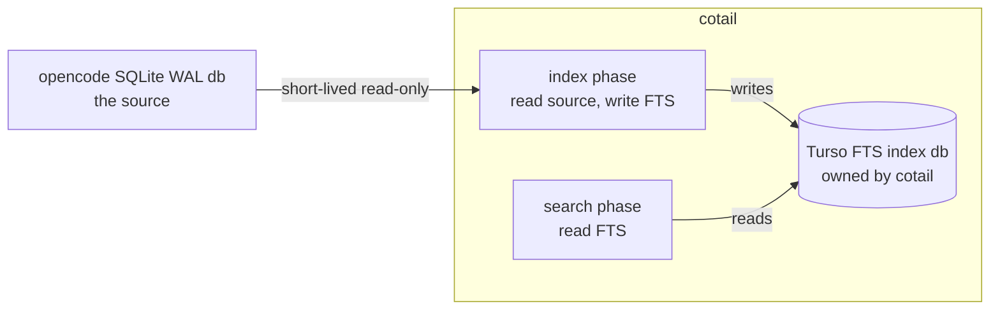

# opencoattailss

`cotail` (a play on "tail" + cute name) is like [`rg`](https://github.com/BurntTushi/ripgrep) but for opencode sessions — search and browse the session history opencode stores in its SQLite database.

opencode writes its full session history (messages, reasoning, tool calls, patches) into a single WAL-mode SQLite database with **no FTS index and no built-in search**. `cotail` reads that DB and gives you fast, scopable queries: search session content, list recent sessions, or resolve the active session for a running opencode process.

> **Status:** prototype (phase 0). Commands run **direct scans** against the live opencode DB today — no index, no build step, milliseconds to a few seconds per query. An FTS-indexed phase (`index`/`status`, sub-50ms search) is planned (see [Planned: FTS phase](#planned-fts-phase)).

The direct-query implementation is now a pnpm workspace: domain contracts live
in [`packages/query-domain`](/packages/query-domain/src/index.ts), while the
private Kysely/`node:sqlite` integration lives in
[`packages/opencode-live-store`](/packages/opencode-live-store/src/index.ts).
Title and V1/V2 content search support executable API-level `all`/`any`/`none`;
existing positional CLI syntax remains AND-compatible and has no new boolean
flags. V2-owned sessions use `session_v2` metadata and `session_message`
content/counts; only sessions without a V2 owner use legacy `session`, `message`,
and `part` rows. See the [implementation report](/.design/query/implementation1.md).

## Quickstart

Requires **Node.js 22+**. The live store uses the built-in
[`node:sqlite`](https://nodejs.org/api/sqlite.html) module with Kysely; there are
no third-party native bindings.

```sh
node src/cli.ts search opencode journal     # run from a checkout
npm link                                     # put `cotail` on your PATH
cotail history --since 7d
```

The database is auto-discovered: `$OPENCODE_DB` if set, else the newest
`~/.local/share/opencode/opencode*.db` by mtime.

## Commands

| command | status | what it does |
|---|---|---|
| [`cotail search`](#cotail-search) | current | search session content (regex, AND'd terms) |
| [`cotail history`](#cotail-history) | current | list sessions active within a time window |
| [`cotail get-session`](#cotail-get-session) | current | resolve the active session id for an opencode PID |
| `cotail index` | planned | build/update the FTS index |
| `cotail status` | planned | show index coverage and freshness |

## `cotail search`

Search session content. Terms are matched as **case-insensitive regular
expressions**, AND'd together (a session must match every term). Today this is
a `LIKE`-style scan over the live opencode DB via a JS-regex function registered
with `node:sqlite`.

```sh
cotail search <pattern> [pattern...] [options]
```

```
Options:
  --db <path>      Database path (default: auto-discover)
  --limit <n>      Max results (default: 50)
  --json           Output JSONL instead of human-readable
  --title-only     Search session titles only
  --no-snippet     Don't show text snippet
  --type <type>    Part type to search: text, reasoning, tool (default: text)
  --since <dur>    Only sessions updated after cutoff (24h, 7d, 30m, or ISO date)
  --directory <p>  Only sessions whose directory contains <p>
  -F, --fixed-strings   Treat patterns as literal strings, not regex
  -s, --case-sensitive  Match case sensitively (default: case-insensitive)
```

```sh
cotail search opencode journal          # sessions matching "opencode" and "journal"
cotail search opencode 'event.*v2'      # "opencode" AND regex "event...v2"
cotail search turso wal --json          # JSONL output
cotail search --title-only compaction   # search titles only
cotail search --type reasoning memory   # search model reasoning text
cotail search 'foo.bar' -F              # literal "foo.bar" (no regex)
cotail search OpEnCoDe                  # case-insensitive by default
cotail search helpers --since 7d        # only sessions updated in the last week
cotail search helpers --directory ~/src/compfuzor   # scope by directory
```

`--since` and `--directory` are **scoping predicates**: they append to the outer `WHERE`
clause and prune candidate sessions *before* the per-session EXISTS regex subquery runs.
On a 3.5k-session DB they cut the scan to a small subset, so scoped queries return in
milliseconds-to-seconds rather than the multi-second cost of an unscoped scan. Same
grammar and semantics as `cotail history`'s `--since` / `--directory`.

## `cotail history`

List sessions active within a time window — the "what was I working on recently,
and where?" view. Reads only session/message metadata (no body scans), so it
needs no FTS index and runs in milliseconds regardless of database size.

```sh
cotail history                      # last 24h (default)
cotail history --since 7d           # last week (--since accepts Nh, Nd, Nm, or an ISO date)
cotail history --directory ~/src/foo
cotail history --json               # JSONL (one object per line)
cotail history --tsv                # tab-separated with a header line
```

Columns: session id, title, directory, messages in the window (`RECENT`), messages all-time (`TOTAL`), last-updated. `--json` emits ISO-8601 timestamps; `--tsv` emits epoch-ms. `--json` wins if both are given.

## `cotail get-session`

Resolve the **current active session id** for a running opencode process — answers "which session is *that* opencode instance on right now?". The foundation for a consolidated **session-information report** (the `SessionInfo` type it returns will grow as later tickets add model/cost/tokens/fork fields).

```sh
cotail get-session                   # via $OPENCODE_PID (or $OPENCODE_SESSION_ID)
cotail get-session 992039            # explicit opencode PID
cotail get-session --id-only         # bare id, for shell capture: sid=$(cotail get-session --id-only)
cotail get-session --json            # full session object as JSONL
cotail get-session -s ses_04602d85affe...   # look up a known id directly
cotail get-session -C ~/src/foo      # match by directory instead of a PID
```

Resolution order (first that applies): positional `<pid>` → `$OPENCODE_PID` →
`$OPENCODE_SESSION_ID`. For a PID, its working directory (`/proc/<pid>/cwd`) is
matched against the `session` table's `directory`, picking the most recently
`time_updated` session; `$OPENCODE_DB` is read from the process env to choose
the database. opencode never writes its active session per-process and a
TUI-mode process runs no HTTP listener, so the cwd+directory match is the
reliable signal. The `session` table is shared across opencode v1 and v2, so
this works against both. `$OPENCODE_SESSION_ID` (set by the
[`opencode-session-id-plugin`](https://github.com/rektide/opencode-session-id-plugin)
`shell.env` hook) short-circuits the lookup when present.

```
Options:
  -s, --session <id>    Use this session id directly (skip PID resolution)
  -C, --directory <dir> Override the directory to match (skip /proc lookup)
  --db <path>           Database path (default: auto-discover)
  --json                Output the full session object as JSONL
  --id-only             Print only the session id (scripting-friendly)
```

## How the prototype works (direct search)

The current prototype resolves the opencode database by:

1. `$OPENCODE_DB` env var if set
2. Otherwise globs `~/.local/share/opencode/opencode*.db` and picks the **newest by mtime**
3. Falls back to `~/.local/share/opencode/opencode-.db` (locally compiled build)

It opens the DB **read-only** via Node's built-in `node:sqlite` (`DatabaseSync`),
then uses private Kysely queries with one correlated `EXISTS` semi-join per term.
Each requirement can be witnessed independently and short-circuits on its first
match. The conceptual V1 branch is:

```sql
SELECT s.id, s.slug, s.title,
       datetime(s.time_updated/1000,'unixepoch') AS updated,
       substr((SELECT json_extract(p.data, '$.text') ... ), 1, 200) AS snippet
FROM session s
WHERE EXISTS (SELECT 1 FROM part p
              WHERE p.session_id = s.id
                AND json_extract(p.data, '$.type') = 'text'
                AND re(?, json_extract(p.data, '$.text')))
  AND EXISTS (...)   -- one per term
ORDER BY s.time_updated DESC LIMIT 50
```

Each term is bound as a JS regex pattern and matched by a custom `re(pattern, string)` function registered with `DatabaseSync#function()`. The function compiles with the `i` flag by default (case-insensitive), or no flags under `-s`/`--case-sensitive`; compiled regexes are cached by pattern. Under `-F`/`--fixed-strings`, regex metacharacters in the term are escaped so it matches literally. The first matching part per session is surfaced as a preview snippet.

### Canonical content

For a legacy-owned session, readable text is in the `part` table's JSON `data`
column rather than `message.data`:

| `type` | field | what it is |
|---|---|---|
| `text` | `$.text` | user prompts and assistant prose replies |
| `reasoning` | `$.text` | model chain-of-thought |
| `tool` | `$.state.input`, `$.state.output` | tool call args and results |

For a V2-owned session, `cotail` reads user text and assistant text/reasoning
from `session_message`, ordered by message `seq` and assistant content-array
position. V2 tool and shell search are rejected until a canonical searchable
representation is selected. Legacy residue is never unioned into a V2-owned
session, including when the native projection has zero rows. Mixed databases
must have a completed `migration.v1-v2` marker; active or incomplete migration
state is rejected rather than read partially.

## Planned: FTS phase

> **Not built yet.** Everything below is the target architecture for phase 1.
> Today `search` is a direct scan (see above); `index` and `status` do not exist.

The goal: a two-phase architecture — **index** opencode's content into a
Turso FTS5 database, then **search** that index in milliseconds.



Two databases, two roles:

| database | owner | engine | pattern |
|---|---|---|---|
| opencode's DB (`opencode-.db`) | opencode | SQLite WAL (C library) | short-lived read-only connections |
| cotail index DB (`~/.local/share/cotail/index.db`) | cotail | Turso (SQLite-compatible) | long-lived, read/write |

### Planned commands

```
cotail index                           # index everything (incremental: only new/changed)
cotail index --session <id>            # index one session
cotail index --directory ~/src/foo     # index sessions under a directory
cotail index --project <id>            # index sessions for a project
cotail index --since 7d                # index sessions updated in the last 7 days
cotail index --rebuild                 # drop and rebuild the entire index

cotail search "turso WAL" --json              # phrase query, JSONL output
cotail search compaction --directory ~/src/bar  # scope to one directory's sessions
cotail search "event sourcing" --session <id>   # scope to one session
cotail search "tool call" --type tool           # search tool inputs/outputs only

cotail status
# sessions indexed:  2,687 / 2,687
# parts indexed:     575,034
# index size:        340 MB
# last index run:    2 hours ago
# stale sessions:    12 (updated since last index)
```

Incremental indexing tracks which sessions have been indexed and their `time_updated`, so only new or changed content is re-indexed on subsequent runs.

### FTS index schema

```sql
CREATE TABLE indexed_session (
    session_id   TEXT PRIMARY KEY,
    directory    TEXT,
    project_id   TEXT,
    title        TEXT,
    slug         TEXT,
    time_updated INTEGER,          -- from opencode, for incremental indexing
    indexed_at   INTEGER           -- when cotail last indexed this session
);

CREATE VIRTUAL TABLE parts_fts USING fts5(
    text,
    session_id   UNINDEXED,
    part_id      UNINDEXED,
    part_type    UNINDEXED,        -- text, reasoning, tool
    time_created UNINDEXED,
    content='parts_content',       -- external content table for space efficiency
    tokenize = 'porter unicode61'
);
```

Search uses FTS5 `MATCH` with bm25 ranking:

```sql
SELECT s.title, s.slug, snippet(parts_fts, 0, '<<', '>>', '...', 20) AS excerpt,
       bm25(parts_fts) AS rank
FROM parts_fts
JOIN indexed_session s ON s.session_id = parts_fts.session_id
WHERE parts_fts MATCH 'opencode AND journal'
  AND s.directory LIKE '~/src/opencode%'   -- scope
ORDER BY rank
LIMIT 20;
```

### Why a separate index database?

- **Speed.** FTS5 `MATCH` is O(matches) not O(all rows). A 575k-part database goes from ~5s (LIKE scan) to <50ms (FTS lookup).
- **No perturbation.** The index DB is owned by cotail. Reads and writes don't touch opencode's database at all.
- **Scoping.** Metadata columns (`directory`, `project_id`, `session_id`) enable filtered searches without re-reading opencode's schema.
- **Portability.** The index DB is a single file — copy it, move it, ship it.
- **Turso compatibility.** Built with SQLite FTS5, readable by the `turso` Rust crate or any SQLite tool.

## Roadmap

- **Phase 0 (done):** direct scan against the live opencode DB, matching terms as case-insensitive JS regex. Works, ~5s per query on a 4.8 GB database. Includes `history` (metadata-only recent activity) and `get-session` (active-session resolution).
- **Phase 1 (next):** `cotail index` builds a Turso FTS5 index. `cotail search` queries it in milliseconds. Scopable by session, directory, project.
- **Phase 2:** transform into an [`effect.ts`](https://effect.website) project.

## Reference

- [`/home/rektide/archive/doc/opencode-history.md`](file:///home/rektide/archive/doc/opencode-history.md) — the canonical search SQL doc with tested queries, schema details, and the schema of `session` / `message` / `part` / `event` tables.
