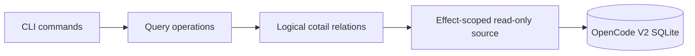

# opencoattails

`cotail` searches and browses the session history stored by [OpenCode](https://opencode.ai/) in SQLite.

Use it to find sessions by content, inspect recent work, or resolve the session associated with a running OpenCode process.

```sh
cotail search "migration" "sqlite" --profile ~/.config/cotail/profiles/opencode-local.json
cotail history --since 7d --profile ~/.config/cotail/profiles/opencode-local.json
cotail tail --since 30m --json --profile ~/.config/cotail/profiles/opencode-local.json
cotail watch --no-initial --json --profile ~/.config/cotail/profiles/opencode-local.json
cotail get-session --id-only --profile ~/.config/cotail/profiles/opencode-local.json
```

## Status

The current CLI is an early `0.1.0` release with five working commands:

| Command | Purpose |
|---|---|
| `cotail search` | Find sessions whose content matches every requested term |
| `cotail history` | List sessions active within a time window |
| `cotail tail` | List finite recent Message activity |
| `cotail watch` | Observe newly visible Message activity |
| `cotail get-session` | Resolve a Session from an ID, directory, or OpenCode process |

Queries read OpenCode's live database directly using a trusted generated source profile. There is no Cotail data index or build step, and no `index` or `status` command yet.

Cotail supports OpenCode's authoritative V2 projections: `session_v2` and `session_message`. Profiles generated from V2 sources record that contract. If a trusted profile is later pointed at a V1-only or otherwise stale database, the requested query fails naturally. Completed migrations may retain V1 tables, but those rows never affect results.

## Requirements

- Linux for PID-based `get-session` resolution through `/proc`
- Node.js 24 or newer for native SQLite busy timeouts and direct TypeScript execution
- pnpm for installing this workspace
- An OpenCode database using the V2 session schema
- A generated Cotail source profile for that database

Cotail uses Node's built-in `node:sqlite`; it does not install a native SQLite binding.

## Install

The project is currently run from a checkout:

```sh
pnpm install
pnpm exec cotail profile generate \
  --db ~/.local/share/opencode/opencode.db \
  --opencode opencode \
  --output ~/.config/cotail/profiles/opencode-local.json \
  --name opencode-local
pnpm exec cotail history --since 24h
```

You can also run the TypeScript entry point directly:

```sh
node src/cli.ts history --since 24h
```

## Source Profiles

`search`, `history`, `tail`, `watch`, and `get-session` require a strictly decoded source profile. They select one in this order:

1. The command's `--profile <path>` option.
2. `$XDG_CONFIG_HOME/cotail/profiles/opencode-local.json`, or `~/.config/cotail/profiles/opencode-local.json` when `XDG_CONFIG_HOME` is unset.

The selected profile supplies the database path, supported Message variants, and query capabilities. `--db <path>` is an explicit locator override only; Cotail does not compare it with the path or facts in the profile.

Normal commands trust every decoded profile fact unchanged. They do not invoke `opencode`, compare profile metadata with the current Cotail build, inspect SQLite schema, indexes, migrations, Message variants, or query plans, refresh implicitly, or fall back to runtime discovery. A missing profile reports the exact `cotail profile generate ...` command needed to create it. Stale profiles fail naturally through ordinary SQLite or lazy payload-decoding errors.

Every database connection is opened read-only and placed in SQLite `query_only` mode. Deep per-payload validation remains lazy and runs only when content is queried.

### Profile Lifecycle

Profile inspection is always explicit:

```sh
cotail profile generate --db ~/.local/share/opencode/opencode.db \
  --opencode opencode \
  --output ~/.config/cotail/profiles/opencode-local.json \
  --name opencode-local
cotail profile show --profile ~/.config/cotail/profiles/opencode-local.json
cotail profile validate --profile ~/.config/cotail/profiles/opencode-local.json --all
cotail profile refresh --profile ~/.config/cotail/profiles/opencode-local.json
```

`generate` and `refresh` inspect the selected executable and database. `validate` performs only its explicit selectors (`--version`, `--schema`, `--indexes`, `--content`, `--plans`, or `--all`) and never runs as part of an ordinary query.

## Search

```sh
cotail search <pattern> [pattern...] [options]
```

Every pattern is required, but different patterns may match different documents in the same Session. This makes `cotail search alpha beta` a Session-level `alpha AND beta` query.

Patterns are case-insensitive JavaScript regular expressions by default. Invalid expressions fail before query execution.

```sh
cotail search opencode journal
cotail search 'event.*v2'
cotail search 'foo.bar' --fixed-strings
cotail search ERROR --case-sensitive
cotail search compaction --title-only
cotail search memory --type reasoning
cotail search read_file --type tool
cotail search helper --since 7d --directory ~/src/project
cotail search helper --since-updated 7d
cotail search helper --since-updated 7d --since-updated-backfill=off
cotail search sqlite --json
cotail search sqlite --arrow > hits.arrow
```

### Search Options

| Option | Meaning |
|---|---|
| `--profile <path>` | Use an explicit trusted source profile |
| `--db <path>` | Override the database locator recorded in the profile |
| `--limit <n>` | Return at most `n` Sessions; default `50` |
| `--json` | Emit JSON Lines |
| `--arrow` | Emit an Apache Arrow IPC stream |
| `--title-only` | Search Session titles instead of content |
| `--no-snippet` | Omit evidence snippets |
| `--type <type>` | Search `text`, `reasoning`, or `tool`; default `text` |
| `--since <cutoff>` | Only match Messages created at or after a duration or ISO date |
| `--since-updated <cutoff>` | Require Sessions updated at or after a duration or ISO date |
| `--since-updated-backfill <dur>` | Content Message-history lookback behind a `--since-updated` cutoff; default `21d` |
| `--directory <path>` | Require the Session directory to contain `path` |
| `-F`, `--fixed-strings` | Match literal substrings instead of regular expressions |
| `-s`, `--case-sensitive` | Preserve case while matching |

`--since` and `--since-updated` accept values such as `30m`, `24h`, `7d`, and ISO dates (both also accept `--flag=value`). `--since` is an exact Message-created cutoff: only Messages created at or after the cutoff can match, and title-only search requires Message activity in that range. `--since-updated` is an exact Session-updated cutoff. Content search reads Message history only from the cutoff minus the backfill window (default `21d`), which can miss older matching content - a documented false-negative tradeoff for speed. Pass `--since-updated-backfill off` (or `false`, `none`, `-1`) to search all Message history of the updated Sessions instead. Title-only search needs no Message-history scan, so it applies the exact Session cutoff directly and ignores this heuristic backfill. When both `--since` and `--since-updated` are supplied, both exact cutoffs hold; content history uses the stricter lower bound, while title search uses explicit `--since` only for activity. Session and directory predicates are applied before matching.

### Searchable Content

The default `text` search covers user, synthetic, system, skill, and assistant text. Other modes cover assistant reasoning and tool names, inputs, outputs, and errors.

The logical document model also represents shell output, attachment metadata, compaction text, and Session location. The current CLI does not expose a dedicated mode for every document field.

Cotail does not flatten Base64 attachment bodies or opaque provider metadata into searchable text.

## History

```sh
cotail history [options]
```

`history` lists Sessions updated at or after a cutoff. It reads Session and Message metadata without parsing Message bodies, so it remains inexpensive on large databases.

```sh
cotail history
cotail history --since 7d
cotail history --directory ~/src/project
cotail history --limit 20
cotail history --json
cotail history --tsv
cotail history --arrow > history.arrow
```

### History Options

| Option | Meaning |
|---|---|
| `--since <cutoff>` | Activity cutoff; default `24h` |
| `--limit <n>` | Maximum Sessions; default is unlimited |
| `--directory <path>` | Require the Session directory to contain `path` |
| `--json` | Emit JSON Lines |
| `--tsv` | Emit tab-separated rows with a header |
| `--arrow` | Emit an Apache Arrow IPC stream |
| `--profile <path>` | Use an explicit trusted source profile |
| `--db <path>` | Override the database locator recorded in the profile |

The output distinguishes Messages created at or after the cutoff (`RECENT`) from all Messages in the Session (`TOTAL`). Both counts use only V2 `session_message` rows.

## Tail And Watch

```sh
cotail tail --since 30m --limit 20
cotail tail --since 2026-09-01T12:00:00Z --format jsonl
cotail watch --since 30m --interval 2s --format human
cotail watch --no-initial --interval 1s --json
cotail watch --once --since 7d --limit 100 --json
```

`tail` lists finite Message metadata ordered by creation time and Message ID,
newest first. `watch` repeatedly samples the same bounded view and emits Message
identities not previously seen by that process. Initial and later rows are
explicitly labeled `initial` and `subsequent`; they are observations, not claims
about exact causal events.

Both commands are metadata-only. They return source, Session, and Message
identity; Message type, sequence, and row timestamps; and Session title and
directory. They do not read or validate Message payload JSON.

### Tail And Watch Options

| Option | Tail | Watch | Meaning |
|---|---:|---:|---|
| `--since <duration-or-ISO>` | Yes | Yes | Message-created cutoff; default `24h`. Watch durations move while ISO cutoffs stay fixed. |
| `--limit <n>` | Yes | Yes | Positive finite result/sample size; default `50` |
| `--interval <duration>` | No | Yes | Delay between non-overlapping samples; default `2s` |
| `--format human\|jsonl` | Yes | Yes | Explicit output format; default `human` |
| `--json` | Yes | Yes | Alias for `--format jsonl` |
| `--no-initial` | No | Yes | Establish the first sample silently |
| `--once` | No | Yes | Emit one bounded sample and exit |
| `--profile <path>` | Yes | Yes | Use an explicit trusted source profile |
| `--db <path>` | Yes | Yes | Override the database locator recorded in the profile |

Human activity is one tab-delimited physical line per Message with no header,
footer, color, or cursor movement. JSON output is one complete object per line.
Watch handles SIGINT, SIGTERM, and downstream EPIPE cleanly. Because each sample
is a finite top-N view, activity that enters and leaves between samples can be
missed; the command deliberately says "newly visible" rather than promising an
exact durable event tail.

## Get Session

```sh
cotail get-session [pid] [options]
```

`get-session` resolves one Session and prints its metadata or ID. Directory and PID lookup choose the most recently updated Session with an exact directory match.

```sh
cotail get-session -s ses_04602d85affe...
cotail get-session -C ~/src/project
cotail get-session 992039
cotail get-session --id-only
cotail get-session --json
cotail get-session --arrow > session.arrow
```

### Resolution

Resolution uses the first applicable source:

1. `--session <id>` performs an exact lookup.
2. `--directory <dir>` performs an exact directory lookup.
3. `OPENCODE_SESSION_ID` performs an exact lookup when no positional PID was supplied.
4. A positional PID or `OPENCODE_PID` supplies `/proc/<pid>/cwd` for directory lookup.

When PID metadata provides `OPENCODE_DB`, that path is used for the process lookup. PID resolution is a directory-and-recency heuristic because OpenCode does not persist a process-to-Session association.

### Get Session Options

| Option | Meaning |
|---|---|
| `-s`, `--session <id>` | Resolve an exact Session ID |
| `-C`, `--directory <dir>` | Resolve the latest Session for an exact directory |
| `--profile <path>` | Use an explicit trusted source profile |
| `--db <path>` | Override the database locator recorded in the profile |
| `--json` | Emit the Session as JSON Lines |
| `--id-only` | Print only the Session ID |
| `--arrow` | Emit an Apache Arrow IPC stream |

## Output Formats

Human-readable output is the default. Machine-readable formats are written to stdout; diagnostics are written to stderr.

| Format | Search | History | Tail | Watch | Get Session |
|---|---:|---:|---:|---:|---:|
| Human | Yes | Yes | Yes | Yes | Yes |
| JSON Lines | `--json` | `--json` | `--json` | `--json` | `--json` |
| TSV | No | `--tsv` | Human contract | Human contract | No |
| Arrow IPC stream | `--arrow` | `--arrow` | No | No | `--arrow` |
| Bare ID | No | No | No | No | `--id-only` |

Arrow output uses a command-specific schema rather than one sparse shared record. Strings are `Utf8`, counts are signed `Int64`, and times are millisecond timestamps.

`--arrow` cannot be combined with another output format. See the [Arrow output design](/.design/output/arrow0.gpt56.md) for schema details.

When both text formats are requested, `history --json --tsv` emits JSON Lines. For `get-session`, `--id-only` takes precedence over `--json`.

## Query Architecture

Production commands consume a shared V2 logical query world rather than querying OpenCode's physical tables directly.



[`@opencoattails/query-kysely`](/packages/query-kysely/src/index.ts) provides:

- Source-qualified hierarchical `Address`, `Target`, and `Observation` types.
- Logical Session, Message, content, tool, shell, attachment, compaction, and document relations.
- Scoped buffered, streaming, compile, and SQLite query-plan operations over one pinned read snapshot.
- Contextual Session predicates and alias-safe named document witnesses.
- Checked evidence mapping, payload revisions, grouping, and deterministic limits.
- Effect-scoped `node:sqlite` source, trusted profile facts, transaction, and iterator acquisition with exact-once cleanup.

[`@opencoattails/query-runtime`](/packages/query-runtime/src/index.ts) provides the typed registry used to compose scoped query implementations and capabilities.

Searchable source payloads are projected into `cotail_document`. Each document retains its owner identity, source field, Message sequence, nested position, exposure, and revision information.

For the complete design, see [the V2 relational query architecture](/.design/query/design3.gpt56.md).

## Development

Install workspace dependencies:

```sh
pnpm install
```

Run the CLI directly from TypeScript during development:

```sh
pnpm exec cotail search sqlite --profile ~/.config/cotail/profiles/opencode-local.json
pnpm exec cotail history --since 24h --profile ~/.config/cotail/profiles/opencode-local.json
pnpm exec cotail tail --since 30m --profile ~/.config/cotail/profiles/opencode-local.json
pnpm exec cotail watch --once --profile ~/.config/cotail/profiles/opencode-local.json
```

Run the quality gates:

```sh
pnpm test
pnpm exec tsgo --noEmit
pnpm --dir packages/query-kysely check
pnpm --dir packages/query-runtime test
```

The root tests characterize CLI text, JSONL, TSV, Arrow output, and trusted-profile selection. Query package tests cover explicit source validation, trusted runtime acquisition, inference, relations, witnesses, evidence, limits, lifecycle, and read-only enforcement.

Temporary experiments belong under `.test-agent/`. Design work and accepted architectural records live under `.design/`.

## Roadmap

The next query-oriented work is tracked in beads rather than specified as shipped behavior in this README:

- Complete the V2 relation map for lineage, projects, workspaces, pending input, and persisted Events.
- Add durable bookmarks over query Targets and Observations.
- Support hosted execution through OpenCode's Effect SQL service.
- Build transcript, reporting, and indexed-search consumers over the shared query world.

Inspect current work with:

```sh
bd list --status open --sort priority
```

## License

MIT
